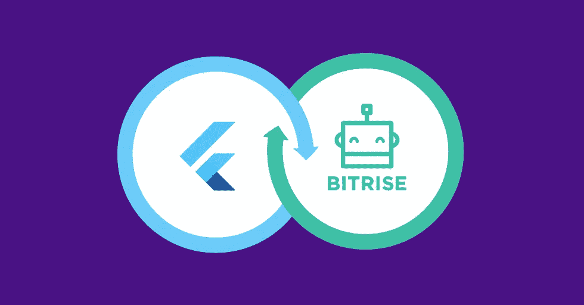
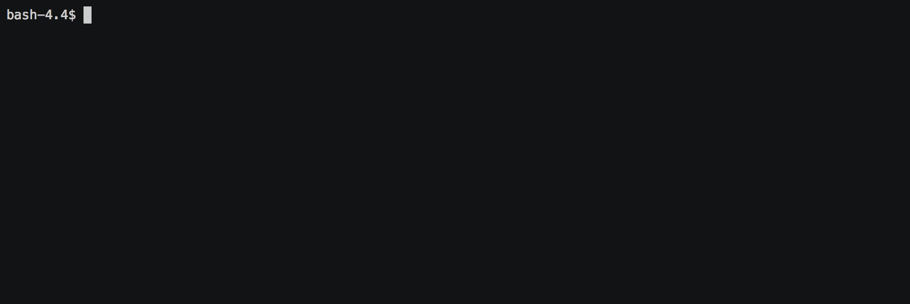
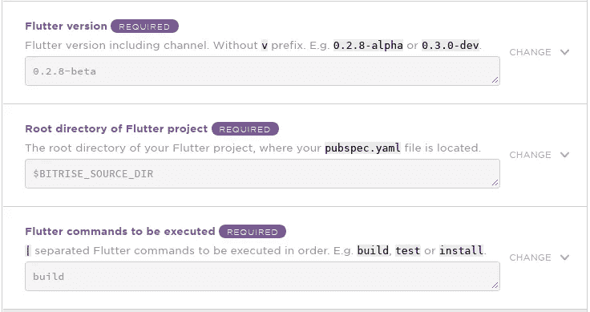
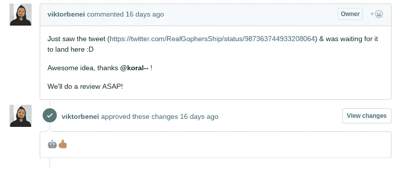

# 如何在 Go-Flutter 示例中创建 Bitrise 步骤

> 原文：<https://medium.com/hackernoon/how-to-create-bitrise-step-in-go-flutter-example-668cf4db1fd2>

## 背景

[Bitrise.io](https://www.bitrise.io) 是一个持续集成和交付(CI/CD)平台即服务(PaaS)，主要专注于移动应用程序开发。 **Bitrise 提供了与流行的、广泛使用的工具的集成，如**[**grad le**](https://gradle.org/)**[**Xamarin**](https://www.xamarin.com/)**或** [**Xcode**](https://developer.apple.com/xcode/) 。然而，针对利基和/或全新工具的集成可能不会立即可用。通常，最快的解决方案是编写一个专门的 shell 脚本。尽管如此，脚本也是最难在多个项目中重用的。**

**此外，shell 脚本通常不适合复杂的操作。有没有更好的办法？当然啦！在这篇文章中，我们将向你展示如何创建你自己的 Bitrise 步骤，以及如何发布它，这样每个人都可以使用它。**

## **为什么是另一篇文章？**

**Bitrise [DevCenter](https://devcenter.bitrise.io/bitrise-cli/create-your-own-step/) 以及专用(访客) [blogpost](https://blog.bitrise.io/how-to-create-and-share-your-own-bitrise-step) 上提供了涉及创建步骤的说明。尽管如此，在本文中，**我们将重点介绍 Bitrise 使用的主要语言** [**Go**](https://golang.org/) **中的编程。对于非平凡步骤**也是优选的。**

## **问题是**

****At**[**DroidsOnRoids**](https://www.thedroidsonroids.com/)**我们最近开始使用 Flutter 进行手机 app 开发。** Flutter 是跨平台移动应用开发 SDK 之一。你可以在文章中读到更多信息:[在移动应用程序开发中摇摆——对应用程序所有者的好处&风险](https://www.thedroidsonroids.com/blog/flutter-in-mobile-app-development-pros-and-risks-for-app-owners)。**

****我们开始使用 Flutter，但是没有可用的 Bitrise 步骤。所以我们决定自己造一个！****

****

## **1.准备**

**在我们开始编码之前，我们需要准备好我们的环境。您可以使用您最喜欢的编辑器/IDE 来处理源文件。如果你熟悉 Android Studio 或 JetBrains 的其他 ide，你可能会对 [GoLand](https://www.jetbrains.com/go/) 感兴趣。**

**除此之外，**我们还需要一个**[**bit rise CLI**](https://www.bitrise.io/cli)。只需[安装](https://devcenter.bitrise.io/bitrise-cli/installation/)并通过调用`bitrise setup`进行设置。注意你需要一台 Linux 或者 Mac 的机器。用于 Windows 的 CLI 不可用。**

**最后，**我们将需要 Go 工具**。你可以使用你的软件包管理器(apt-get，Homebrew 等)来安装它。)或从[项目网站](https://golang.org/dl/)下载。**

**接下来，我们实际上可以使用`bitrise :step create`创建一个步骤。注意冒号，这是需要的，因为**:步骤**在这里表示一个插件，而不是一个命令。请记住，我们必须选择`go`作为工具包。创建过程是交互式的，您将被要求一步一步地输入细节。就像这样:**

****

## **2.步骤属性**

**现在我们有了一个工作步骤框架，大多数属性都被设置为合理的默认值。然而，我们需要对其中的一些进行调整。首先，我们可以将`is_requires_admin_user`设置为`false`，因为执行 Flutter 命令不需要管理员/超级用户权限。接下来，我们可以添加依赖项。这里的每个依赖项都是一个 [apt-get](https://help.ubuntu.com/community/AptGet/Howto) (在 Linux 上)或 [Homebrew](https://brew.sh/) (在 MacOS 上)包。**

**如何找出需要哪些依赖关系？一个好的起点是给定工具的文档。例如，Flutter 在其文档中有一个[入门:安装](https://flutter.io/setup-macos/)章节，其中包含所需系统组件的列表。 [Linux 版本](https://flutter.io/setup-linux/)也有。然而，事实证明，还有一个未列出的需求— [libglu1-mesa](https://github.com/flutter/flutter/issues/17297) 。**

**最后，`step.yml`文件中的`deps`部分应该是这样的:**

## **3.输入**

**实际上，所有的 Bitrise 步骤都需要用户以某种方式进行配置。在颤振的情况下，他们可能想要**选择他们想要运行的颤振命令**，例如`test`和/或`build`。**

**此外，能够**指定精确的颤振版本**将是有用的。可选地，它可以默认为当前值。**

**最后，我们还可以**支持 Flutter 项目位于除了存储库根目录**之外的其他地方的情况。最简单的方法是建立合理的默认值，但允许用户在需要时更改它。颤振步骤的完整输入部分如下所示:**

**所有输入分别有名称:`version`、`working_dir`和`commands`。在名称之后，每个输入都包含一个默认值，如果用户没有在配置中明确设置它，就会使用这个默认值。**注意其中一个不是硬编码文本而是环境变量** - `$BITRISE_SOURCE_DIR`。它是由 Bitrise CLI 公开的。运行时，它将由实际值替换[。为了使这种替换生效，需要启用`is_expand`标志。图形工作流编辑器中的输入部分应如下所示:](https://devcenter.bitrise.io/getting-started/manage-your-bitrise-workflow/#environment-variable-replace-mode)**

****

## **4.履行**

**我们的步骤将用 [Go](https://golang.org/) 语言编写。它被用在几乎所有非琐碎的官方步骤中。此外，Bitrise 提供了[go-utils](https://github.com/bitrise-io/go-utils)——一组在持续集成中有用的功能，因此**没有必要从头开始实现一切，我们可以专注于业务逻辑**。**

## **✔️戈朗基础**

**这篇文章并不是关于 Go 编程的教程。它将只解释在 step 开发过程中最重要的有用的东西。我还假设你有基本的编程知识，这里就不解释什么是 string 或者 nil 了。可以通过官方[巡讲](https://tour.golang.org)快速探索 Go 语言基础。**

## **错误处理**

**在 Golang 中，没有可以被抛出以中断电流的异常。如果给定的函数调用可能失败，它将`error`作为最后一个返回值(函数可以返回多个值)。我们需要检查错误是否不是`nil`，以确定操作是否成功。如果错误是致命的，它通常会传播到`main`函数，我们可以将它打印到日志中，并以非零代码退出。**

**请记住**错误不应该被接受，而应该被记录或返回给调用者**。Go lint 会抱怨被忽略的错误。**

## **属国**

**在撰写本文时，Go 中还没有标准的内置依赖管理系统。Bitrise 使用 [dep](https://golang.github.io/dep/docs/daily-dep.html) — *一个准备生产使用的官方实验*。Go 没有附带 Dep。必须单独安装[和](https://golang.github.io/dep/docs/installation.html)。**

**请注意，dep 生成的文件需要签入版本控制系统。除了配置文件，还有所有依赖项的源代码。**

## **✔️构型**

**步骤配置来自环境。所有前述的[输入](#inputs)成为环境变量。注意名称中的 snake_case，这是 Bitrise 上的[约定](https://github.com/bitrise-io/bitrise/blob/master/_docs/step-development-guideline.md#input-naming-convention)。用作多个输入值分隔符的管道字符(`|`)也遵循[约定](https://github.com/bitrise-io/bitrise/blob/master/_docs/step-development-guideline.md#list-of-values-in-outputs)。**

**使用 [go-steputils](https://github.com/bitrise-tools/go-steputils) 可以将环境变量解析成可从 Go 代码中使用的对象。我们可以声明包含配置参数的结构，并让`stepconf`解析它:**

**请注意，结构名称以大写字母开头。如果从另一个 go 文件访问该结构，则需要它。带省略号的注释只是为了让 lint 开心。每个结构字段都有一个带有相应环境变量名的标签。**

**标签还可以包含属性，例如，给定字段是否是必需的，或者它是否应该表示目录的路径。如果不满足条件，解析将会失败。如果配置无效，我们需要用非零代码退出。**

## **✔️颤动逻辑**

**源代码的其余部分表示特定于 Flutter 调用的操作:**

1.  **确保 Android SDK 是最新的(仅当它存在时)— Flutter 至少需要 26.0.0**
2.  **下载并解压缩 Flutter SDK(目标路径特定于操作系统)**
3.  **执行提供的颤振命令**

**完整的源代码可以在 [GitHub](https://github.com/DroidsOnRoids/bitrise-step-flutter) 上获得。**

## **✔️暗示**

**在从零开始实现之前，首先检查类似的东西在 Go 标准库中或外部库中是否不存在。对文件、目录、路径、命令调用、打印日志等的操作。通常在 CI 中使用，因此它们可能存在于 Bitrise 开源回购协议中的某个地方，如 [bitrise-tools](https://github.com/bitrise-tools/) 或 [go-utils](https://github.com/bitrise-io/go-utils) 。**

**从终端添加对外部库 invoke: `dep ensure -add <import path>`的依赖。其中`<import path>`是进口申报单中的数值，例如`github.com/bitrise-io/go-utils/pathutil`。**

**如果您需要在某个操作成功或失败后执行清理，请使用 [defer 语句](https://tour.golang.org/flowcontrol/12)。类似于 Java/Kotlin 中的`finally`块。**请注意，您不能传播来自延迟函数的错误。**但是，您也不应该忽略错误，而是应该记录错误:**

## **✔️测试和静态代码分析**

**根据 [StepLib pull 请求模板](https://github.com/bitrise-io/bitrise-steplib/blob/master/PULL_REQUEST_TEMPLATE.md)每个步骤都应该有`test`工作流。通常它由几个步骤组成:**

*   **单元测试**
*   **去[棉绒](https://github.com/golang/lint)**
*   **[errcheck](https://github.com/kisielk/errcheck) —附加的静态代码分析工具**
*   **集成测试**

**在 StepLib 中，有针对所有上述类型测试的步骤。下面是测试工作流的样子:**

***切换工作方向*和*步骤测试*步骤在步骤创建过程中自动生成。集成测试通常需要一些合理的输入。如果某些输入是非公开的，例如 API 密钥/令牌等。你可以把它定义为[秘密](https://devcenter.bitrise.io/bitrise-cli/secrets/)。单元测试文件名应该带有`_test`后缀，以便正确识别。Bitrise 上的单元测试通常使用[verify](https://github.com/stretchr/testify)框架进行断言。下面是简单的单元测试示例:**

****请记住，如果一个步骤适用于像 Flutter 这样的所有平台(Android 和 iOS)，您应该在多个 Bitrise** [**堆栈**](https://devcenter.bitrise.io/infrastructure/available-stacks/) **上测试它。像[触发 Bitrise 工作流](https://github.com/DroidsOnRoids/bitrise-step-trigger-bitrise-workflow)或 [Bitrise 开始构建](https://github.com/bitrise-steplib/bitrise-step-build-router-start)这样的步骤在这种情况下会很有用。****

## **5.最后的润色**

**如果您的步骤准备好了，您可以请求将其发布到 StepLib。为此，您必须首先派生出 [StepLib](https://github.com/bitrise-io/bitrise-steplib) repo，并将`bitrise.yml`中的`MY_STEPLIB_REPO_FORK_GIT_URL`环境变量设置为该派生的 URL。您还需要在您的步骤的 repo 上有一个 [semver](http://semver.org) 标记(例如`0.0.1`)。如果所有这些要求都得到满足，你就可以调用`bitrise run share-this-step`。请注意，它还将运行 StepLib 清单所需的审计，因此您不需要执行任何其他命令。**

**现在，您可以创建一个从 StepLib fork 到上游的 pull 请求，并等待 Bitrise 团队的审查。甚至可以在几分钟内回顾步骤😊：**

****

**如果你发布一个已经存在的步骤的更新，你也应该在该步骤的 GitHub repo 上创建[发布说明](https://help.github.com/articles/creating-releases/)。它是 [StepLib changelog](https://discuss.bitrise.io/t/monthly-release-of-bitrise-cli-tools-and-summary-of-updates-april-2018-cli-v1-15-0/4767) 的来源。**

## **包裹**

**我希望我的文章能帮助你创建和发布你自己的 Bitrise 步骤。正如你在上面看到的，这不是很难。你需要记住，Bitrise 为 step 贡献者提供 25 美元[的折扣](https://github.com/bitrise-io/bitrise-contrib/blob/master/README.md)。**

## **资源**

*   **[步骤开发指南](https://github.com/bitrise-io/bitrise/blob/master/_docs/step-development-guideline.md)**
*   **[比特莱斯发展中心](https://devcenter.bitrise.io/bitrise-cli/create-your-own-step/)**
*   **[围棋语言游乐场](https://play.golang.org/)**

***最初发布于* [*iOS & Android 手机应用开发公司— Droids On Roids —波兰*](https://www.thedroidsonroids.com/blog/how-to-create-bitrise-step-in-go-flutter-example) *。***