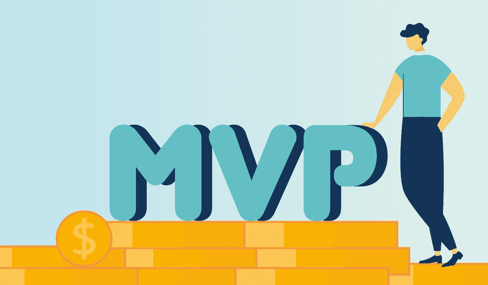
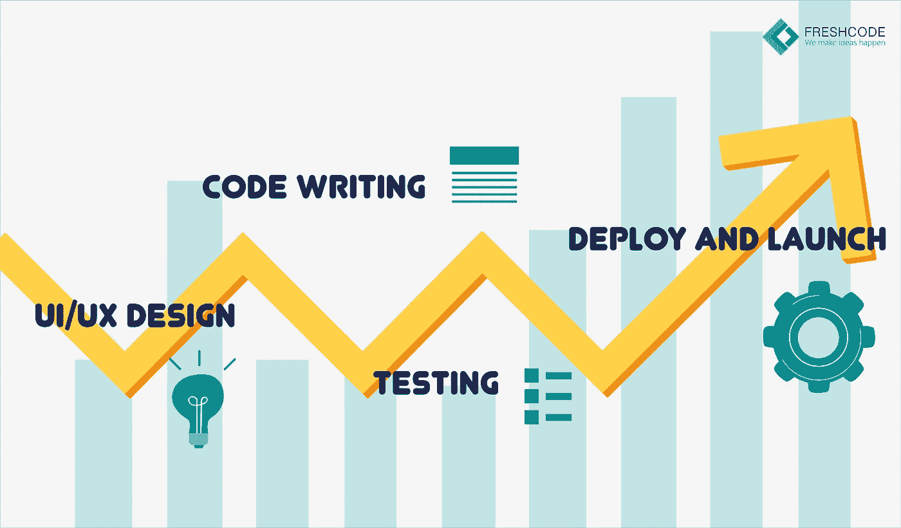
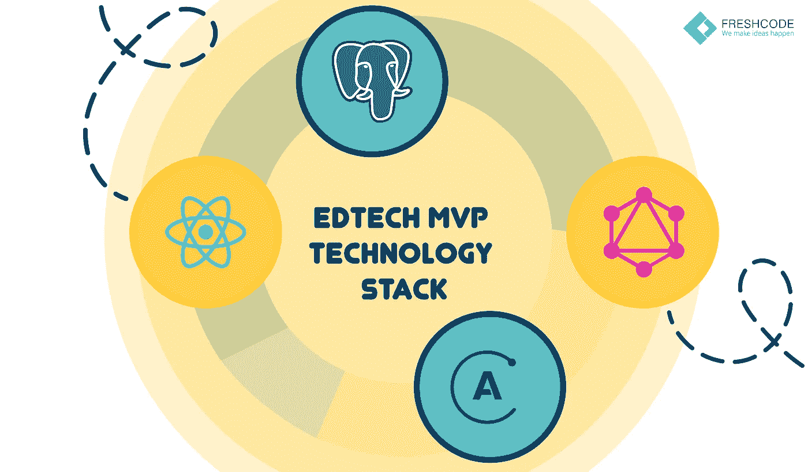
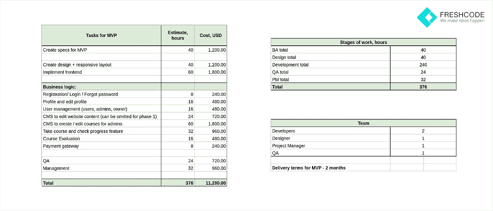

# 如何创建 MVP，非技术专家指南。

> 原文：<https://medium.com/hackernoon/how-to-create-mvp-guide-for-non-technical-specialists-53b3cb1a07d0>

大多数 EdTech 初创公司的首席执行官通过多年的专业经验，对教育技术的趋势有着深入的了解，但他们缺乏 IT 发展所需的技术知识。大多数非技术型创始人没有资金聘请专业的 CTO，少数人可能足够幸运，有朋友对创业感兴趣，并提供技术建议和支持。

尽管如此，外包定制电子学习开发的首席执行官们应该熟悉流程，以防止过多的费用和时间损失。愿意在投资前更好地了解 EdTech 初创企业商业计划的投资者也应该看到大的画面。

考虑到这些问题的相关性，我们为非技术创始人和所有对创建教育产品感兴趣的人开发了这个全面的 EdTech MVP 开发指南。

# 什么是最低可行的产品，你的创业公司需要它吗？

最小可行产品(MVP)是具有有限数量功能的产品版本，可以在最短的时间内以最小的应用程序开发成本实现和发布。MVP 是所有行业的关键创意验证工具，包括定制的电子学习解决方案。如果你想知道如何创建一个创业公司，MVP 的实施应该在你的日程上。

许多创业公司犯的主要错误是假设 MVP 是一个原型或模型。事实上，一个 MVP 是一个成品，项目，或业务准备推出和营销。由于功能减少，MVP 不需要大量投资。

MVP 给予的重要机会是收集可操作的反馈的可能性。目标受众可以帮助验证项目的相关性和需求。首次采用者帮助识别需要升级或替换的关键缺点和功能。

关于开发 MVP 产品及其在每个创业生命周期中的作用的更多有用见解，请参见我们之前的文章[什么是 MVP 以及为什么每个创业公司都需要它](https://freshcodeit.com/freshcode-post/what-is-mvp-and-why-every-startup-needs-it)。

# 如何开发一个 App？MVP 开发清单

电子学习应用程序开发的细节可能因项目而异，但是主要阶段是相同的。为了实现最小可行的产品，敏捷方法最适合:

1.  生成详细的思维导图，包含定义产品市场价值和体现企业创始人愿景的关键特征。
2.  制定系统需求规范(SRS)来描述产品的主要特性。了解有关编写 EdTech SRS 的更多信息，并在我们的文章[如何为 EdTech 应用程序创建 SRS](https://freshcodeit.com/freshcode-post/how-to-create-srs-for-edtech-application)中获取我们的示例。
3.  如果已经为最终产品开发了 SRS 和思维导图，确定主要的产品特性并制定 MVP 需求列表。
4.  雇佣一个 MVP 开发团队。
5.  与雇佣的团队一起决定 MVP 开发的技术栈。
6.  与开发团队合作创建一个循序渐进的 MVP 开发计划。

该计划应包括主要时期的最后期限，包括:

*   用户界面/UX 设计
*   代码编写
*   测试
*   部署和启动

7.在台式电脑和移动设备上测试产品的功能。

在 MVP 准备好之后，在邀请目标受众进行测试之前，检查它是否符合 SRS 是至关重要的。如果受众得到不符合 SRS 的产品，创始人就不能评估项目的可行性。

# 如何创建类似 Udemy 或 Coursera 的电子学习网站 MVP

有了上面提到的最小可行产品的例子，你可以为任何项目开发一个 MVP，包括一个 EdTech 产品。现在，让我们深入研究一个类似于 Udemy 或 Coursera 的项目的最小可行产品模板的细节。

## 思维导图与 SRS 开发

在项目开始时，创建一个包含所有关键特征的思维导图。对于 Coursera 或 Udemy 克隆版，一系列典型的电子学习平台功能包括:

*   首页列出了最受欢迎的课程，注册和登录表单。
*   主页过滤器根据不同的参数(即科目)选择课程。
*   注册和登录窗口。
*   课程生成功能，包括内容上传、反馈和价格设置系统。
*   将课程保存到收藏夹。
*   支付系统。
*   让用户联系管理员的通信渠道。
*   适用于移动设备的适应性设计。
*   项目创始人管理用户和课程数据的管理面板。

这个列表包括了一个类似 Coursera 的 MVP 所必需的最基本的特征。以此为参考，根据类别(即主要和实用功能、客户管理)对元素进行分组。

接下来，你需要根据思维导图中包含的教育技术的功能，开发一个 SRS。您添加的每个特性的细节越多，开发团队就越能理解它们的目的。在这里，我们不会对每个特性进行详细的描述。但是，如果您有兴趣了解更多关于将思维导图转化为 SRS 的信息，请在下面的评论中告诉我们，我们将在以后的文章中分享我们对如何为电子学习开发团队描述项目功能的见解。

## 组建软件开发团队

如果你不具备专业技能，在 IT 圈子里也没有朋友，你就需要从头开始组建团队。我们建议选择[教育软件开发公司](https://freshcodeit.com/)而不是自由开发人员，因为他们雇佣了各种具有广泛专业知识的专家，可以执行从电子学习设计到测试和启动的所有必要的开发步骤。与一个成熟的团队合作，你将节省时间和金钱，因为自由职业教育应用程序开发者的费率通常更高。

对于教育技术项目，寻找有成功教育产品经验的公司。浏览客户评价和[案例研究组合](https://freshcodeit.com/portfolio)，评估团队在 EdTech 方面的专业知识。在研究可能的供应商和面试少数在你的短名单上的供应商之前，列出其他的需求并排列它们的优先次序。[了解更多关于选择完美外包](https://freshcodeit.com/freshcode-post/choose-a-perfect-outsourcing-software-development-company-in-six-steps)[电子学习开发公司](https://freshcodeit.com/)的。

## 技术堆栈选择

您选择的团队将帮助您选择项目的最佳技术组合。大多数教育应用程序开发公司都提供技术领导来指导项目。技术主管是一名经验丰富的开发人员，对当前的 IT 趋势和未来的教育技术有着深入的了解，因此他或她将帮助您确定最适合您项目的工具包。

如果你想创建一个类似 Udemy 或 Coursera 的产品，FreshCode 技术主管会建议使用这些技术:

*   前端:react . js/Apollo/mobile—react native/connection—graph QL
*   后端:postgres

这些技术是优选的，因为它们:

*   拥有伟大的观点；
*   是开源的，因此很便宜；
*   确保高性能；
*   可靠且适应性强。

## 逐步创建 MVP 发展计划

为 EdTech 项目选择技术堆栈后，与 IT 团队合作制定教育移动应用程序开发时间表。FreshCode 专家提供了粗略的 EdTech MVP 估算和成本:

为了避免项目评估阶段的重大错误，请使用我们的指南— [项目评估:您如何知道它是正确的](https://freshcodeit.com/freshcode-post/project-estimation-how-do-you-know-that-its-correct)。

## 发布前的 MVP 测试

开发完成后，亲自测试产品，以确保其功能集正常工作。使用像 Udemy 或 Coursera 这样的项目，在桌面和移动设备上跟踪从注册到购买和创建课程的用户流程。要定位任何问题，请使用所有流行的浏览器，包括 Chrome、Opera、Safari 和 Firefox。

# 创业者的项目管理

非技术型创始人需要基本的项目管理技能来监督 MVP 开发过程。任何 IT 项目管理工作的主要步骤包括:

1.  需求引出。采访利益相关者，以确定使产品可行的关键特性和需求。
2.  SRS 开发。记录利益相关者的需求和可量化的可交付成果，提供每个用户需求的特性和所有功能的测试用例。
3.  项目估算。评估每个开发阶段的乐观和悲观时间表，并计算预算。
4.  范围缩小。如果项目不符合您的时间表或预算限制，则删除非关键功能，并重新评估它们。
5.  发展规划。将主要阶段划分为单独的任务，并指定专家来执行它们。
6.  风险管理。使用死亡前分析的结果开发风险矩阵，并解决最有可能导致严重问题的问题。
7.  项目执行。每天评估教育应用程序的开发进度，并在必要时引入修正，将条目添加到风险注册表中。

如果你想了解更多，看看我们关于如何逐步管理你的项目的文章。

# 准备好开发你的 EdTech MVP 了吗？

如果你有一个伟大的想法，并希望看到它的实施，联系我们制定一个可行的 MVP。此外，如果您仍在评估您的选择，请查看我们的[最近的博客文章](https://freshcodeit.com/blog)，并注册更新，成为第一批获得最新 IT 见解的人。在社交媒体上分享这份指南，并在评论中让我们知道你是否有兴趣了解更多关于通过免费和优质工具推广 EdTech 项目的信息。

【freshcodeit.com】原创文章 [*如何打造 MVP，非技术专家指南*](https://freshcodeit.com/freshcode-post/how-to-create-mvp-guide-for-non-technical-specialists-how-to-create-mvp-for-e-learning-startup-similar-to-udemy-or-coursera) *发表于***。**