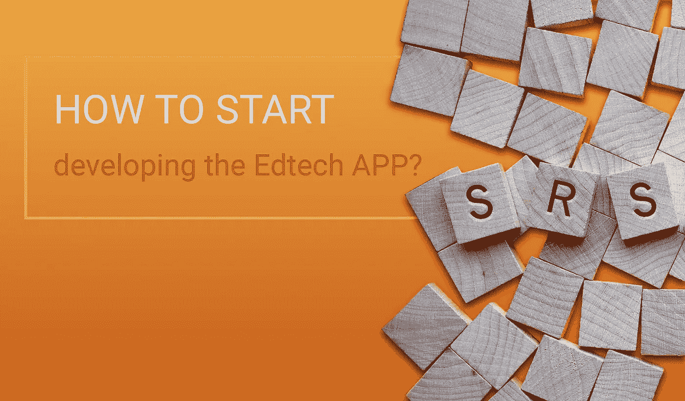

# 如何为 EdTech 应用创建 SRS？

> 原文：<https://medium.com/hackernoon/how-to-create-srs-for-edtech-application-f8b39521f1ff>

大多数 EdTech 初创公司之所以失败，是因为他们在项目开始时过于匆忙，没有投入足够的时间去了解他们的利益相关者。今天，我们将解释创建系统需求规范的基础知识，并分享一个 SRS 模板示例。当您为您的项目寻找 [web 开发服务](https://freshcodeit.com/services)提供商时，您会感谢我们的！

# 什么是 SRS，为什么每个 EdTech 初创公司都需要它

SRS 是一个解释你希望你的软件产品是什么的文档。从应用程序开发人员和设计人员到测试人员和 UX 专家，它都是参与该项目的每个人的参考点。创建 SRS 是软件开发的关键步骤，因为它节省时间和金钱，并确保您和 web 开发公司之间的完美理解。

SRS 是您希望项目满足的条件列表。要编写规范，您应该:

1.  确定项目每个主要方面和特性的关键需求。
2.  决定将显示要求被满足的可测量的。
3.  对开发过程进行约束，以确保它符合预算、时间表和范围。

我们已经介绍了[创建 SRS 的关键步骤](https://freshcodeit.com/freshcode-post/how-to-create-srs-system-requirements-specification-for-web-application-advice-from-experienced-developers)，并提供了可供下载的 SRS 文档模板 PDF，您可以将其用于任何项目。它几乎和商业计划模板一样好！

今天，我们将重点讨论 EdTech 的 SRS 细节，因为这个市场最近出现了爆炸式增长。如今，教育科技初创公司每天都在涌现，使用我们的指南，你可以[击败竞争对手，快速高效地从一个想法变成赚钱的教育科技网络应用](https://freshcodeit.com/freshcode-post/from-an-idea-to-a-money-making-edtech-web-app)。

# 如何为 EdTech 项目制定可操作的 SRS？

完成这一步最简单快捷的方法是使用软件需求规格模板。它是一个包含基本结构的文件，您可以根据项目的具体需要对其进行修改。

SRS 包括三个主要部分:引言、总体描述和一组系统功能和要求。您可以添加执行摘要和附录。让我们逐一检查 SRS 的每个主要部分，并指出如果您希望项目成功，文档应该包括的关键信息。

# 介绍

引言是一个简短的部分，旨在为读者提供文档的概述。它应该包括 SRS 的目的和受众、项目的范围和业务环境。你也可以在这一部分添加文档约定，比如缩写列表或术语表，尽管它们也可以放在后面。参考资料和文件的清单也是有用的。

有时，用户特征也包含在介绍中。在这种情况下，密切关注你的 EdTech 项目的所有利益相关者。记住要考虑最终用户和决策者的特征。即使你为学生开发了自己的应用程序，他们也不会成为你的客户。家长或学校将为产品买单。教师也不能单方面决定采用新软件；他们的选择将受到学校和地区管理的影响。在撰写 SRS 简介时，请记住教育技术市场的复杂情况。

# 系统概述

概述应包括项目的主要运行模式和能力，并介绍系统主要特征的条件和限制。

这一部分应该让软件开发服务提供商清楚地了解您的教育技术理念。解释你想解决哪个与教育相关的问题，以及你想如何解决。在写这部分之前，先研究一下老师和学生面临的需求和困难。不要以为你在学校呆了十年就知道教育专家需要什么。在你浪费时间和金钱去解决不存在的问题之前，采访潜在的用户，包括老师和学生。

一旦你理解了用户的需求，你就可以勾勒出产品需要的用户类别。EdTech 软件通常需要数量庞大、层次复杂的用户类，因为学生、教师、家长和学校管理员都需要访问权限和不同的特权。

在对 EdTech 项目进行约束时，请密切关注细节。它们应包括涉及国家和区域一级教育法规的法律问题。你还应该考虑硬件的限制，因为技术差距可能会使你的产品过于先进而不适合课堂使用，因此是多余的。

假设和依赖构成了一般系统描述的另一个重要部分。包括所有可能影响项目的假设和对外部因素的依赖，比如第三方软件集成，甚至是不稳定的互联网连接。

# 系统需求

从您的 EdTech 项目的业务需求开始这一部分。概述目标受众和你希望实现的货币化可能性。然后，你可以转移到功能需求，详细说明你的产品应该满足用户需求的特性。对于每个函数，描述它的输入和输出细节，以及你所看到的操作。每个特性都应该有一个或几个用户角色的用例，这些用户角色是你在一般系统描述中确定的。包括前置条件和后置条件、场景和备选场景，使您的用例具有可操作性。

完整列表可以包括以下方面的系统要求:

*   耐用性和适应性
*   表演
*   质量
*   安全性
*   接口
*   信息管理
*   政策和法规
*   生命周期管理

尽可能详细地介绍 SRS 的各个方面。您在文档中提供的信息越多，开发团队就越能理解您的愿景。因此，他们会很快实施你的想法。

用需求跟踪矩阵(RTM)完成您的系统需求列表。它确保在产品准备好之前，每个需求都被测试用例覆盖。RTM 采用电子表格的形式，带有链接到相应文档的需求标识符和测试用例场景。矩阵允许您快速评估需求实现，并且很容易创建，因此没有理由在您的 SRS 中忽略它。

如有必要，用附录概括系统需求规格，并添加修订历史表以跟踪 SRS 文档的更改。

现在你知道如何为一个 EdTech 项目创建一个好的 SRS 或者改进你已经准备好的 SRS。如果你已经完成了创业旅程的这一步，是时候将你的 SRS 发送到 Freshcode，开始开发阶段了。但是，如果您对 SRS 有任何疑问，请联系我们，我们将立即帮助您完成。

如果你想了解更多关于为你的初创公司选择定制软件开发公司、管理项目或其他 IT 相关问题的信息，请查看 [Freshcode 博客](https://freshcodeit.com/blog)并注册订阅我们的时事通讯！

你喜欢这篇文章吗？请为我们鼓掌！在媒体上与其他人分享文章。

请随时联系我们的[*fresh code . website*](https://freshcodeit.com/)

原文 [*此处*](https://freshcodeit.com/freshcode-post/how-to-create-srs-for-edtech-application)