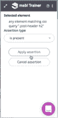

# 如何使用 mabl 创建没有编码的测试脚本

> 原文：<https://medium.com/hackernoon/how-to-create-test-scripts-without-coding-using-mabl-9ee74fce3c1d>

> 这个故事是由 Hacker Noon 的每周赞助商 [mabl](https://goo.gl/cH7C8G) 带给你的。ML 驱动的测试自动化。 [mabl](https://goo.gl/cH7C8G) ，使用机器智能使测试变得容易

对于一些人来说，最后通牒在他们的屁股下点燃了火焰，并在那一刻激励他们，但这是一种可持续的、健康的方式来推动人们改变吗？

“嫁给我，否则我要离开你。”

还是真的只是绝望时刻的最后一招？

“不成功便成仁。”

当谈到自动化手动测试时，我们经常在软件测试领域听到这个最后通牒:

**“要么开始编码，要么被落下。”**

尽管我们理解其背后的意图，[强迫整个行业快速发展](https://techbeacon.com/why-converting-test-teams-automation-challenge#.WmjR0OZv6JA.twitter)并不是我们唯一能做的来改进自动化测试的事情——至少现在，当我们等待技术有机地赶上需求的时候。

现在是 2018 年，我们现在可以利用机器学习来创建日常问题的实用解决方案，例如克服自动化测试脚本的高学习曲线。mabl 使用机器智能来允许每个人，包括开发人员和测试人员，在几秒钟内创建自动化的、可靠的、可重复的测试。

在之前的一篇文章中，我们向您展示了如何使用 mabl[创建自动化的冒烟测试，而不需要一行代码](https://www.mabl.com/blog/automated-codeless-smoke-testing-with-mabl)。现在我们将向您展示下一步——为关键的用户旅程创建定制的测试流程。

在 [mabl 仪表板](https://goo.gl/cH7C8G)中，我们可以选择创建一个新的[旅程](https://help.mabl.com/docs/glossary#section-journey)，创建一个新的应用程序，或者邀请队友来我们的工作区。我们将开创一个新的旅程:

在这种情况下，我们将使用 mabl 营销网站作为我们的应用程序:

马上，mabl 将我们带到我们的应用程序 URL。mabl 为我们提供了一些如何获得尽可能干净的录音的技巧，比如注销你的应用程序并清除你的 cookies。在右边，你可以看到 [**mabl 训练器，**](https://help.mabl.com/docs/defining-a-journey-with-the-mabl-trainer) 这是一个 Chrome 扩展，几秒钟就能安装完毕。目前，我们支持 Chrome，更多的浏览器支持即将到来。

让我们创建第一个自定义旅程，测试网站上的早期访问电子邮件表单:

[**mabl**](https://app.mabl.com) 会开始记录你与 app 的每一次互动。默认情况下会记录点击，如果启用，悬停和 JavaScript 动画也会被记录。如果您有长时间运行的流程，mabl trainer 还允许我们添加等待，添加断言，创建随机生成的变量以插入到表单中，以及通过 CSS 或 XPath 选择器查找元素。

我想确保电子邮件地址表单的有效性，所以我将创建一个名为 **Email** 的随机生成的变量，并将其插入到电子邮件地址表单中。在下面的最后一张图中，您可以看到所有通向电子邮件表单的步骤，以及我们新创建的电子邮件变量被插入到表单中。

我们的 Email 变量现在在表单中，使用一个随机生成的字符串作为我的电子邮件地址，我希望在提交表单时收到一个通知标签，让我知道我的电子邮件地址无效:

让我们使用 mabl trainer 中的 **Add Assertion** 特性为这个通知标签添加一个检查。训练器支持多种类型的断言。在这种情况下，我将应用一个**等于**断言来检查通知标签是否等于“请更改您的电子邮件地址以继续”：

我们将保存这个旅程，mabl 将自动为这个旅程创建一个[计划](https://help.mabl.com/docs/glossary#section-plan)，它规定了这个旅程将被执行的时间表。默认计划每 30 分钟运行一次行程:

# 就这样，我们有了第一个无代码的自动化测试脚本！

让我们创建另一个简单的旅程，检查以确保 mabl 博客正确加载。这是我们使用 mabl 训练器中的 **Find Elements** 特性的好机会，因为新的博客一直在发布；我们不想要古怪的测试，所以按 CSS 属性搜索比按动态博客标题搜索更有效:

这一次，我们将导航到博客并找到一个名为**的 CSS 元素。后标题 h2。**一旦找到 CSS 元素，我将声明它存在:

我将保存这个旅程，同样，创建一个默认计划，每 30 分钟运行一次旅程。让我们进入**测试执行历史**仪表板，进行我们的电子邮件地址表单验证测试。我们看到，在我写完这篇博客的时候，它已经完成了两次:

创建这些测试只花了我几分钟时间，现在它们将在后台定期运行。我可以配置 mabl 通过 Slack 通知我问题，这样如果我不想的话，我就不必在 [mabl 应用](https://goo.gl/cH7C8G)中闲逛了。

这就是 mabl 如何自动为您编写自动化测试，运行它们，并在出现问题时为您推断可操作的见解，例如性能的[倒退，新断开的链接或断开的 JavaScript](https://www.mabl.com/blog/machine-intelligence-for-clearer-regression-testing-insights) 等等。现在任何人都有能力和时间为他们的应用程序维护自动化测试。你也可以试试——只需注册一个 [**免费 mabl 账户**。](https://goo.gl/cH7C8G)

> 这是黑客正午的每周赞助商 mabl 为您带来的故事。ML 驱动的测试自动化。mabl ，使用机器智能简化测试
> 
> 最初发表于[www.mabl.com](https://www.mabl.com/blog/how-to-create-test-scripts-without-code-using-mabl)。