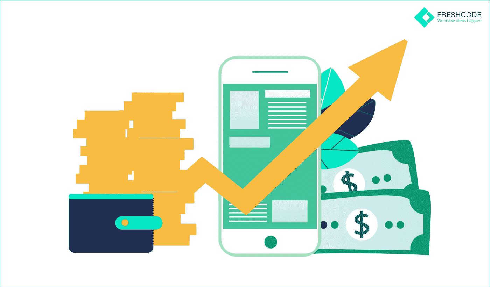
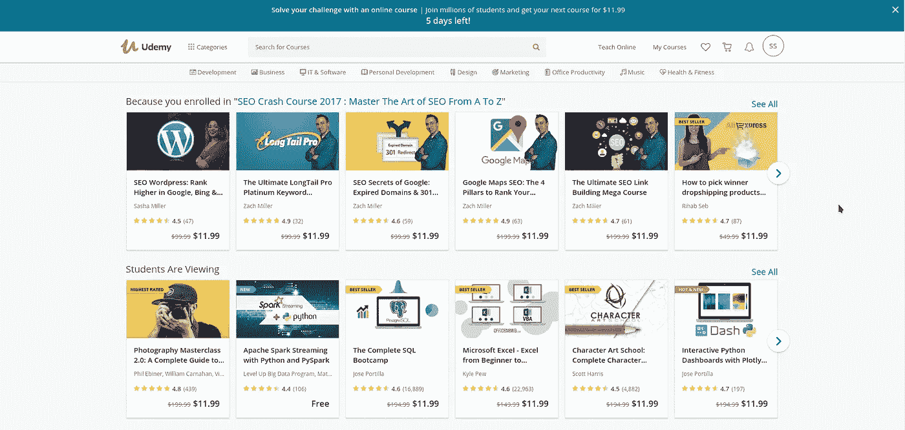
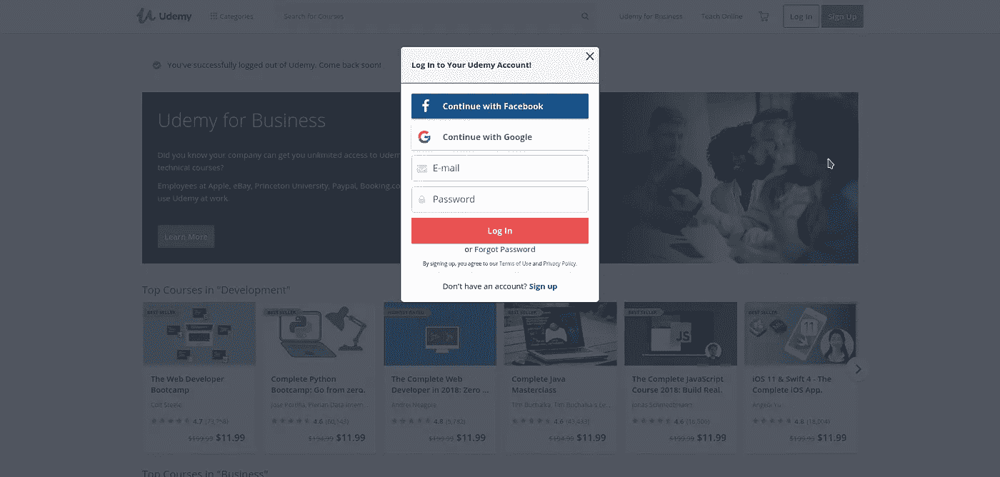
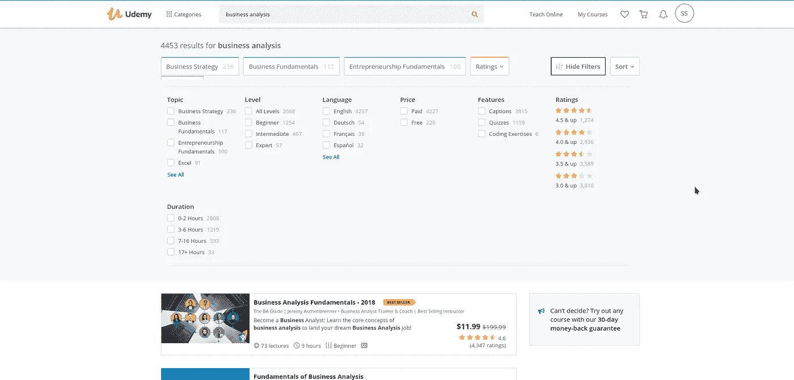
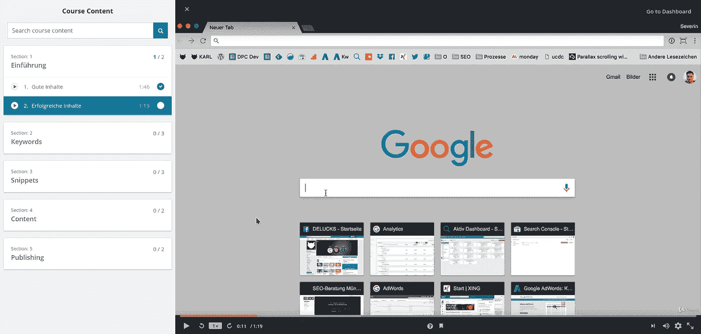
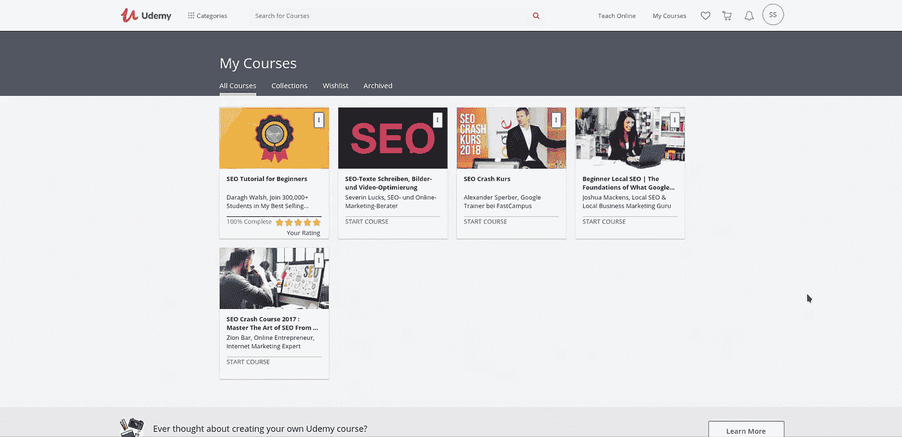
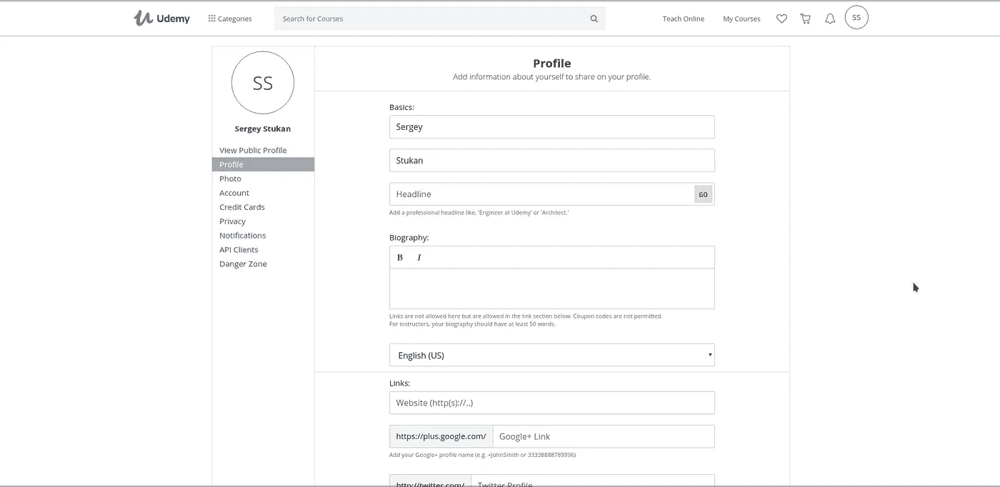
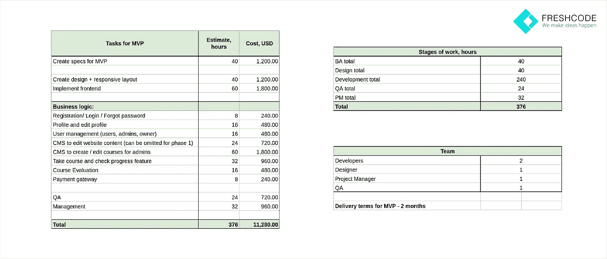
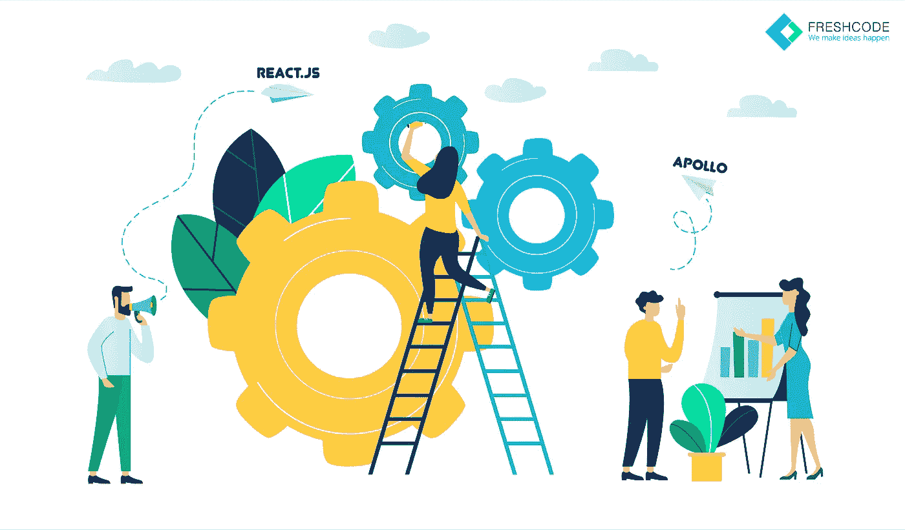

# 如何轻松创建 Udemy 或 Coursera 克隆:成本、功能、MVP、发布

> 原文：<https://medium.com/hackernoon/how-to-create-udemy-or-coursera-clone-easily-cost-features-mvp-launch-8169e7f5dd30>

经过多年的不被重视，EdTech 终于吸引了 IT 巨头和初创公司的兴趣。未来的教育技术是一个万亿美元的产业，有可能在学生和教师中创造一个终身的粉丝群。如果你想知道什么是教育中使用的最新技术，我们已经报道了教育技术的主要趋势。今天我们将讨论为什么像 Udemy 和 Coursera 这样的平台背后的商业模式如此成功。

最成功的项目运用了教育技术的共同功能。他们

*   迎合收入范围广泛的国际目标市场；
*   支持个人和企业级客户；
*   提供免费和优质的教育产品；
*   为优质课程作者提供创收工具包。

在 Freshcode，我们在利用教育技术创新和从头开始构建成功的教育技术项目方面拥有多年的经验。每个项目都是独一无二的，教育应用开发公司知道，一些初创公司在脱颖而出之前会经历破产。详细了解[因 FreshCode 的专业知识和专业精神而成功的开发故事或失败案例](https://freshcodeit.com/freshcode-post/failure-that-turned-into-success-the-development-story)。

您可以了解由 FreshCode 教育应用程序开发人员实施的其他 EdTech 项目的更多信息:

*   [Educadio](https://freshcodeit.com/portfolio-cases/educadio)
*   [玩注意](https://freshcodeit.com/portfolio-cases/play-attention)
*   [螺旋形](https://freshcodeit.com/portfolio-cases/spiral)

# Udemy 和 Coursera 的成功因素

MOOCs 已经准备好接受传统教育，在线提供课程、专业和大学学位，价格只是传统教育的一小部分。数百万用户经常使用 Coursera 和 Udemy，因为这些项目通过以下方式提供价值:

*   创新教育技术，提供高质量、负担得起的学习机会；
*   基于竞争的免费课程定价政策；
*   各种不同语言的教育材料，便于随时随地向一流专家学习；
*   课程创建工具包，用于开发免费和优质课程，促进用户的被动创收手段，并增加优质内容的数量；
*   反馈和评级系统，以评估班级和教师，并支持最好的学习材料。

这只是 Coursera 和 Udemy 向用户提供的全部好处的一小部分。这些平台受欢迎的原因还有很多。然而，这足以评估 MOOC 平台为 EdTech 初创公司提供的商业潜力。

# 典型的电子学习平台特征:Udemy 和 Coursera

考虑到它们的好处，让我们更仔细地看看 Coursera 和 Udemy 如何通过简化的定制电子学习设计和多种用户友好的功能来吸引客户并保持他们的忠诚度:

*   主页上最受欢迎的课程列表。高收视率和上千条评论促使新用户走上一个高峰并注册。

*   用户可以通过电子邮件、谷歌或脸书账户轻松快捷地注册。让注册过程变得轻松，可以确保有更多的新学员。

*   易于使用的目录和过滤器。用户友好的搜索工具允许在线学习者快速找到他们可能感兴趣的课程。

*   免费和优质课程过滤器。通过高质量的免费材料建立信任让追加销售变得更加容易。
*   课程和专业创建工具包。专家可以在没有帮助的情况下开发新的课程，并产生被动收入。
*   各种内容、任务和认证选项。用户可以观看、聆听或阅读课程材料，并通过测试和测验来检查所学知识。

*   社交媒体的课程分享链接生成。用户可以分享他们的进步和成功，同时吸引新的学习者加入平台。
*   个人课程图书馆。简化的仪表板导航确保用户可以随时返回到任何课程来复习资料。

*   反馈和评级系统。评论让学习者分享他们的经验，促进高质量的课程，淘汰无用的材料。
*   灵活的个人账户设置。用户可以更改他们的语言、通知设置和支付选项。

*   各种支付系统集成。安全的信用卡或贝宝支付可用。
*   多语言课程。最受欢迎的课程被翻译成多种语言，包括德语、西班牙语、俄语和中文。
*   企业员工教育选项。企业为其员工创建企业账户，以加深专业知识并获取新知识。
*   跨设备适应性。网络应用与桌面和移动设备兼容，移动应用最适合智能手机。
*   Android 和 iOS 的移动应用程序。应用程序共享 web 应用程序的功能，并促进任何地方的学习，即使是离线学习。
*   博客。MOOC 平台与潜在用户分享他们的最新消息和见解，介绍新课程和成功的毕业生。

# 如何管理教育技术项目:预算和期限

每个初创公司都面临两个主要的限制因素:应用开发成本和时间框架。你越早将产品投放市场，你的机会就越大。然而，快速的教育移动应用程序开发需要更大的费用，并且往往忽略了可能导致错误和最终失败的问题。

你一定在想“做一个 app 要多少钱？”为了让你清楚地了解启动一个 EdTech 项目需要多少时间和资金，我们做了一个粗略的估计。根据项目的范围和特性，这些数字可以更大或更小，但是您可以评估平均值。

请注意，给出的时间和成本估算是针对 MVP 的，而不是针对全功能应用程序的。最终产品的开发成本将取决于您可能希望在未来的应用程序中实现的确切功能。但是，如果您有一份描述所有功能的现成 SRS，Freshcode 团队将很乐意帮助您评估您的产品。

EdTech 项目的成功项目管理方法与任何其他行业并无不同。一个成功的项目经理应该采取七个步骤:

1.  需求引出。确定利益相关者和最终用户，与他们面谈，开发用例及场景，以创建他们需求的可操作列表。
2.  SRS 开发。组织和提炼需求，为每个用户需求设计几个特性，为每个元素开发几个测试用例，以组成高质量的 SRS。
3.  项目估算。为每项任务估计乐观和悲观的时间表，使用蒙特卡罗分析来评估最后期限的可行性，并使用甘特图来可视化开发过程。
4.  范围缩小。重新评估项目的需求和优先级如果评估不符合您的预算或时间表，减少功能以开发最小可行产品(MVP)。
5.  发展规划。将开发过程分解成小任务，并将它们分配给各个专家，将新的细节添加到您的甘特图中。
6.  风险管理。使用死亡前方法评估潜在风险，并创建风险矩阵，以解决最有可能产生最严重影响的风险。
7.  项目执行。根据甘特图进行的每日进度评估和每周风险评估会议将使项目保持正轨。

从我们的文章中了解更多关于如何更详细地管理您的项目的信息。

# 如何创建一个电子学习网站或应用程序？

每个项目都是独特的，没有通用的解决方案。然而，每一个成功的 EdTech 初创公司都会经历相同的电子学习开发阶段:

## 定义目标受众并创建测试人员列表

首先，你需要定义潜在用户的关键特征。其中包括:

*   性别
*   年龄
*   位置
*   社会背景
*   兴趣

你可以瞄准对 DIY 感兴趣的 30 岁以上的美国小学教师，或者 50 岁以上的欧洲跨国公司高管。

一旦你对受众有了一个大致的概念，在脸书或 LinkedIn 上寻找 3 到 5 个可以作为你的客户画像基础的个人资料。分析来自社交媒体的数据，以扩展和细化典型目标受众代表的用户画像。

记住这些肖像，使用过滤器创建一个 1000 名 LinkedIn 或脸书用户的名单，他们可能是你的测试者。通过发送好友请求或信息来建立联系。不要停留在 100 或 300 个配置文件上。你吸引的潜在测试用户越多，你就会收到越多的反馈来改进你的产品，让它更有利可图。

## 制定业务模型图和 SRS

你可以依靠 Udemy 和 Coursera 现有的商业模式或者想出一个新的模式，从解决用户的问题开始。一旦你意识到项目的盈利方式，列出它在竞争中脱颖而出的特点。为了更好地理解项目及其所有细微差别，制定一个路线图、思维导图和 SRS。你可以在我们之前的文章[“如何为 EdTech 应用程序创建 SRS？”中学习如何正确地做这件事](https://freshcodeit.com/freshcode-post/how-to-create-srs-for-edtech-application)

## 选择技术堆栈

在选择技术组合时，您应该依靠所选择的[电子学习开发公司](https://freshcodeit.com/)。它将影响开发速度、维护成本，以及您将面临的未来问题的数量。FreshCode 软件工程师推荐这些技术用于定制电子学习解决方案:

*   前端:React.js，Apollo，React Native，Graphql
*   后端:Postgres

由于这些技术的适应性、可靠性和高性能，我们的开发人员依赖于它们。这些先进技术大部分都是开源的，因此它们减少了电子学习应用程序的开发费用。

## 创建一个 MVP

有了初步的项目文档，您可以安全地实现您的想法并开发 MVP。如果你想知道如何开发一个应用程序，它将通过:

1.  UI/UX 设计开发。简化和直观的电子学习设计确保了令人满意的用户体验并提高了忠诚度。
2.  技术图表准备。将项目分解成可管理的部分，并设计开发计划，确保项目的快速实施。
3.  代码编写。软件工程师利用库并从头开始开发代码来实现关键特性。
4.  测试。自动和手动测试确保应用程序没有错误，并且能够支持所需的负载而不会失败。
5.  托管和启动。项目安全转移到服务器并启动后，用户终于第一次尝到了你的创意。

## 宣传 MVP 并收集反馈

通过电子邮件、社交媒体和其他沟通渠道通知您的目标受众该项目的启动。在 ProductHunt 和类似的创业平台上发布更新，以吸引更多用户。

发布后的第一个月应专门用于收集和分析反馈。测试版用户的评论将帮助你理解哪些功能需要额外的工作，哪些需要从头开始修改。这个阶段应该让你了解你的产品是否解决了用户的问题，以及你如何改进它的下一次迭代。

我们的目标是创造出让目标受众 100%满意的产品，并激励用户与他人分享知识，并向线上和线下的新客户推荐该项目。

## 最终产品开发和上市

当你从目标受众那里收集到反馈，并从用户的评论中获得新的灵感后，就该更新路线图和 SRS 了。扩大范围，纳入客户的要求和建议。之后，您就可以开发基于 MVP 的最终产品了，它增加了来自更新的路线图和 SRS 的特性。

开发过程包括几个关键步骤:

1.  新功能的用户界面/UX 设计
2.  代码编写
3.  测试
4.  实时项目更新

为了确保项目的快速开发和启动，将流程分为两个阶段。首先，开发定义产品对目标受众的价值的关键特性。这样，您可以更快地启动项目，同时仍然满足客户的需求。一旦平台启动并运行，您可以继续开发具有不太重要功能的教育应用程序，如本地化或各种文件类型的导入和导出支持。

在准备最终产品发布时，确保你的目标受众了解这个项目。使用社交媒体、独立博客、专业论坛和其他潜在客户经常光顾的平台。社交媒体账户是项目推广最有价值的工具。你可以通过分析他们的订阅和转发来收集关于未来客户兴趣的信息。接触目标受众中最直言不讳的代表，了解他们经常光顾的论坛、网站和博客。使用这些信息来调整您的营销活动，并提高其效率。

像 Udemy 和 Coursera 这样的教育技术项目，除了其他好处之外，还为用户提供了用户友好的功能和被动收入选项。如果你想开发一个类似的平台并取得成功，首先要清楚地了解你的用户需求和一个可行的 MVP。使用我们经过许多教育软件开发公司检验的项目管理方法，确保您的项目长期成功。

# 你准备好利用教育科技了吗？

如果您准备开始一个[定制电子学习开发](https://freshcodeit.com/services)项目，请发送 Freshcode 您的 SRS 或让我们为您编写一个。但是如果你仍然在等待一个百万美元的想法，注册我们的[博客更新](https://freshcodeit.com/blog)，你将是第一个获得最新 IT 灵感和见解的人。如果这篇文章有帮助，在社交媒体上发表吧！

如果你有类似“如何为一个新网站或教育技术应用做广告？”或者“我怎样才能免费推广我的网站？”，敬请关注。我们考虑很快使用免费和高级工具分享我们的营销经验。你对此感兴趣吗？

*原创* [*如何轻松创建 Udemy 或 Coursera 克隆:成本、特性、MVP、发布*](https://freshcodeit.com/freshcode-post/how-to-create-udemy-or-coursera-clone-easily-cost-features-mvp-launch) *发布于*[*freshcodeit.com*](https://freshcodeit.com/)*。*