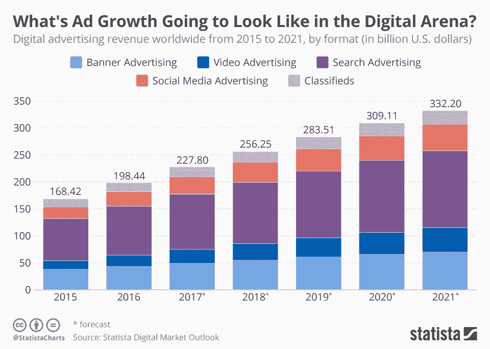
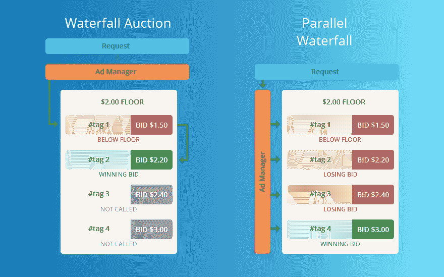
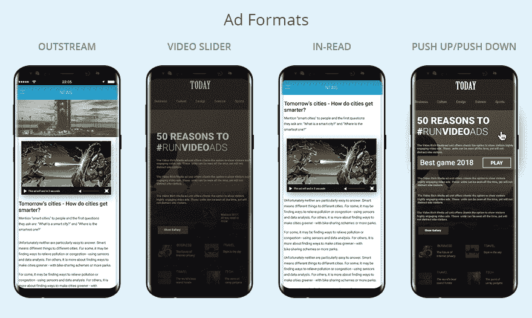

# 如何创建视频广告网络？

> 原文：<https://medium.com/hackernoon/how-to-create-video-ad-network-d535e7dabc44>

拥有自己的广告网络是一个相当大的竞争优势。

广告网络使广告商有可能在一系列出版商网站和应用程序上购买数字广告，在越来越多的网站上扩大数字广告购买，而不必直接与每个出版商打交道。对出版商来说，一切都很简单:他们想增加库存需求和广告收入。

*有两种类型的广告网络:一种是专门从事一种广告形式的，另一种是出售任何东西的。除了标准 IAB 广告单元之外，一些非常流行的广告格式的例子是本地显示和* [*视频*](https://hackernoon.com/tagged/video) *广告、图像内广告、推荐窗口小部件和文本内广告。*

根据普华永道的报告[**“2014 年至 2018 年全球娱乐和媒体展望**](http://www.wnmn.org/) **”，视频是增长最快的数字广告部门，预计 2014 年至 2018 年复合年增长率约为 24%(CAGR)。**

***如果你想跳上收入增长的列车，视频广告网络可能是一个很好的切入点。***

## **准备**

1.  **选择视频广告服务器**

合适的广告服务器使您能够在一个广告服务平台内启动和管理移动和桌面上复杂且有针对性的视频广告活动。考虑使用 Epom 提供的具有可定制功能的白标广告服务器。广告服务器应该在你找到广告商之前就搞定，这样你才能快速给他们提供流量。

**2。寻找广告商和出版商**

做个调查:通过 [Alexa 全球 500 强网站](http://www.alexa.com/topsites)找到相关网站。如果你正在寻找某个特定领域的出版商，你可以找到热门网站的替代品。用 SimilarWeb 查看流量，但是注意一些网站从流量上看起来很小，但实际上是一个大型媒体集团的一部分。

与出版商合作的一种常见方式是建立关系网或打电话推销。这里有一个选择出版商的简单清单

*   独特和频繁更新的内容，没有弹出窗口和侵扰性广告。
*   用英语或主要欧洲语言(德语、法语、西班牙语等)编写的内容。).
*   至少 25%的网站流量来自美国、加拿大和欧盟国家。
*   避免成人内容。

**3。评估来自出版商的流量**

仔细看看你的总流量:2000-1000 万的月浏览量足以启动一个广告网络。

不要忽视广告网络推广，以确保持续的流量增长。一个好的选择是使用自助式媒体购买平台，在那里你可以选择相关的流量来源和网站类别。

## **视频广告投放中需要考虑的指标**

*当你为视频做好一切准备后，是时候发现最重要的指标了。*

1.  **广阔/ VPAID 标签**

位于媒体购买过程中间的广告服务器与不同的发行商共享广告标签，以实现对所有发行商的交付和性能跟踪。

***视频广告中常用的标签有两种:VAST 和 VPAID。***

VAST 是一组标准化的代码，放在出版商的网站上或应用程序中。它根据目标标准向广告服务器传达要显示什么类型的广告。

VPAID 标签可以具有更复杂的元素，如交互功能，以及更高级的测量功能，以评估可视性和参与度。大多数出版商接受巨大的标签，但只有一些接受 VPAID。

**2。瀑布算法**

该算法确定广告投放的最佳顺序。在 [Epom](https://epom.com/platform-for-ad-networks) 中，我们有一个名为“同步瀑布”的定制解决方案，它允许同时请求需求侧标签，因此节省了大量时间来填充单元并显示给特定用户。

**3。广告格式**

视频格式的演变受到用户观看行为及其与广告互动意愿的影响。最受欢迎的广告形式如下:

**外流**

这是一种自动播放或用户发起的视频，它被插入到传统的显示广告空间中，通常在文本或图像的段落之间。它们被设计成仅在可视时播放，这确保了极高的可视性。

**视频滑块**

这种 [100%可视广告格式](https://market.epom.com/l/ad-units/video-rich-media/)包含高度可定制的内容视频广告和高级功能。最好的部分——不需要视频播放器。该单位可以为特定的品牌或活动需求贴上白色标签，这为广告商提供了额外的价值。

**读入**

视频单元被放置在社论文章的中间，以获得最佳的用户体验。视频在用户屏幕上可见时播放。

**上推/下推视频横幅**

一旦用户悬停在横幅上，视频就会扩展到几乎全屏视图，并保持打开状态，直到用户移开鼠标。

**4。反欺诈保护**

如果您的广告服务器与这些数字广告欺诈检查器之一集成，您还有一个额外的优势:

1.  WhiteOps
2.  DoubleVerify
3.  护城河；
4.  Forensiq
5.  中介信任。

**5。可定制的视频播放器**

最好的选择是寻找一个广告服务器，它允许销售不同类型的库存:显示广告、移动广告和视频广告(例如 [Epom 广告服务器](https://epom.com/platform-for-ad-networks))。这种服务器可以为您提供自己的视频播放器，以更加复杂和可定制的方式提供广告。

如果你花些时间研究规则手册，视频广告会给你带来稳定的收入。希望这些建议能帮助你成功拥抱视频广告！