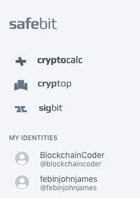
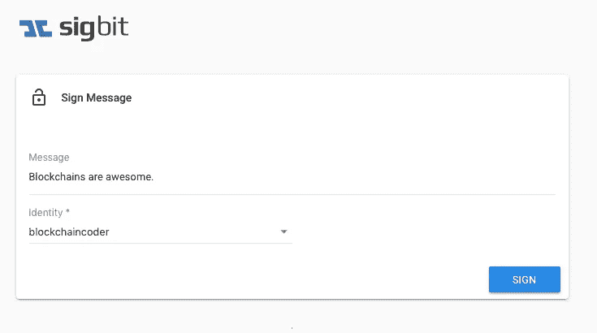
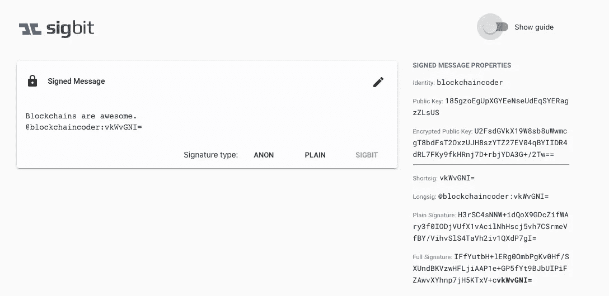

# 如何在区块链上毫不费力地创建自己的身份

> 原文：<https://medium.com/hackernoon/how-to-create-your-identity-effortlessly-on-a-blockchain-9e42a998ccee>


This paid story is brought to you by Safebit

你可以通过在脸书这样的社交网站上创建个人资料来为自己创建一个社交身份。您可以使用该身份在 Medium 上无缝注册。您不必重新输入名字、姓氏等。Medium 集成了脸书 API，并在您同意的情况下传输您的信息。

但是，如何在区块链上创造你的身份呢？

在区块链上创造一个身份并不容易。考虑一个比特币钱包，你需要生成一个私钥和一个公钥。*但是，看看这个公钥，它能说明问题吗？*

```
897c59e1c04dab8748f7f9a2e2c7fd96d16bf700d389ba4153dba3d1bebdccf9
```

你需要一个能传达你个性或个性的身份。

```
***@****BlockchainCoder*
```

现在将这个身份与公钥进行比较。 **BlockchainCoder** 是一个代表我的个性化身份。轻松创建这样的身份是 [Safebit](http://safebit.io) 为您提供的功能之一。


Creating an Identity on [Safebit](http://safebit.io)

下一个麻烦是管理多重身份。在比特币中，你必须为一个新钱包生成单独的密钥。管理它们是一件痛苦的事情，你需要记住很多密钥。



My Identities on [Safebit](http://safebit.io)

然而，我们的用户不必经历这样的麻烦。您可以在一个地方管理您的所有身份。

但是，典型的区块链身份的问题并没有就此结束。在区块链上创建的身份不能转移到不同的区块链。因为区块链还不能互相交流。

[Safebit](http://safebit.io) 不仅仅是一个存放身份的地方。它也是一个平台，为开发者提供了使用 SDK 部署区块链应用的便利。我们的平台能够与多个区块链人对话，因此无论你去哪里，你都可以带着你的身份。

让我们看看你如何无缝地使用你的身份。



Sigbit 允许您在区块链上永久签署消息。现在让我们使用 **BlockchainCoder** 身份签署一条消息(*区块链太棒了*)。



只需点击一下，西格比特就在我们的信息上签了名。

***我们帮助用户轻松安全地创建、管理和使用跨应用和区块链的身份。我们目前在一个私人阿尔法。如果您需要邀请，您可以通过加入我们的*** [***电报***](https://t.me/safebitio) ***群来请求邀请。***

***鼓掌请*** *👏。* ***谢谢，跟随***[***safe bit***](http://medium.com/safebit/)***和***[***Hackernoon***](http://hackernoon.com)***这样你就不会错过我们即将到来的故事。***

