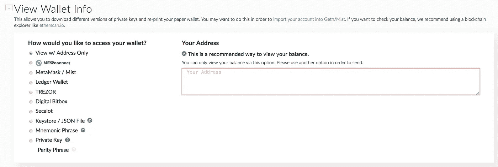

# 如何创建自己的加密货币令牌

> 原文：<https://medium.com/hackernoon/how-to-create-your-own-cryptocurrency-token-b4e3eeac34aa>


欢迎来到我们关于如何创建自己的加密货币令牌的简短教程！我们将使用流行的以太坊“ERC-20”令牌作为本教程的基础。ERC-20 代币可以在分散的智能合约中使用，以表示任何形式的折扣、货币或任何你希望公开交易并有固定供应的东西。我们将假设我们的读者通过包括示例函数、变量和标准至少对编码有基本的理解。以太坊智能合约使用语言 Solidity，你可以从 [Solidity 文档](https://solidity.readthedocs.io/en/v0.4.24/)中学习。如果本教程有所帮助，请在 [Twitter](https://twitter.com/ELIXToken) 、[脸书](https://www.facebook.com/elixirtoken)、 [Instagram](https://www.instagram.com/elixtoken/) 或 [Medium](/@elixirtoken) 上关注我们。本文是 ELIX 博客的一部分，这是一个关于众筹、技术和区块链趋势的系列。

## 背景

以下是 ERC-20 智能合约所需的独立功能。值得注意的是，这些函数不是程序编译所必需的，而是符合 ERC-20 令牌标准所必需的。关于 ERC 的一些背景知识，请看最近的博客文章[如何用众筹智能合同为你的下一个生意融资](https://blog.elixirtoken.io/how-to-fund-your-next-business-with-a-crowdlending-smart-contract/)。

以下是 ERC 20 智能合约中包含的标准功能列表:

1.  `totalSupply() public view returns (uint256 totalSupply)`
2.  `balanceOf(address _owner) public view returns (uint256 balance)`
3.  `transfer(address _to, uint256 _value) public returns (bool success)`
4.  `transferFrom(address _from, address _to, uint256 _value) public returns (bool success)`
5.  `approve(address _spender, uint256 _value) public returns (bool success)`
6.  `allowance(address _owner, address _spender) public view returns (uint256 remaining)`

***事件:***

事件是记录函数何时执行的方法，通过提供易于访问的日志进行离线分析。例如，它们提供了检查令牌何时被转移的简单方法。以下是 ERC 20 合约一直记录的两个事件:

1.  `Transfer(address indexed _from, address indexed _to, uint256 _value)`。[令牌转移时触发。]
2.  `Approval(address indexed _owner, address indexed _spender, uint256 _value)`【每当调用 *approve(address _spender，uint256 _value)* 时触发。]

如果令牌至少实现了这些必需的功能和事件，那么它就符合像 *ERC-20* 这样的标准。

## 正在设置

导航到在线 [Solidity IDE Remix](https://remix.ethereum.org/) 。

对于本教程，我们将使用一个名为 Remix 的 Solidity 浏览器 IDE。这是一个很好的入门方式，无需将编译器下载到您的计算机上。尽管它不适合复杂的单元测试或调试，但它包含一些语法调试工具和从最新编译器列表中选择的选项。这是您第一次打开 Remix 时的样子:


继续删除 *ballot.sol* 中的文本，这只是一个假设投票场景的智能合约示例。


我们将制作一个以太坊令牌，并将使用 ERC-20 标准代码作为基础。将以下代码添加到 Remix 中以开始使用:

```
pragma solidity ^0.4.10;contract tokenName { // set contract name to token name

string public name; 
string public symbol; 
uint8 public decimals;
uint256 public totalSupply;

// Balances for each account
mapping(address => uint256) balances;address devAddress;// Events
event Approval(address indexed _owner, address indexed _spender, uint256 _value);
event Transfer(address indexed from, address indexed to, uint256 value);

// Owner of account approves the transfer of an amount to another account
mapping(address => mapping (address => uint256)) allowed;// This is the constructor and automatically runs when the smart contract is uploaded
function tokenName() { // Set the constructor to the same name as the contract name
    name = "add your token name here"; // set the token name here
    symbol = "SYMB"; // set the Symbol here
    decimals = 18; // set the number of decimals
    devAddress=0x0000000000000000000000000000000000000000; // Add the address that you will distribute tokens from here
    uint initialBalance=1000000000000000000*1000000; // 1M tokens
    balances[devAddress]=initialBalance;
    totalSupply+=initialBalance; // Set the total suppy
}function balanceOf(address _owner) constant returns (uint256 balance) {
    return balances[_owner];
}// Transfer the balance from owner's account to another account
function transfer(address _to, uint256 _amount) returns (bool success) {
    if (balances[msg.sender] >= _amount 
        && _amount > 0
        && balances[_to] + _amount > balances[_to]) {
        balances[msg.sender] -= _amount;
        balances[_to] += _amount;
        Transfer(msg.sender, _to, _amount); 
        return true;
    } else {
        return false;
    }
}function transferFrom(
    address _from,
    address _to,
    uint256 _amount
) returns (bool success) {
    if (balances[_from] >= _amount
        && allowed[_from][msg.sender] >= _amount
        && _amount > 0
        && balances[_to] + _amount > balances[_to]) {
        balances[_from] -= _amount;
        allowed[_from][msg.sender] -= _amount;
        balances[_to] += _amount;
        return true;
    } else {
        return false;
    }
}// Allow _spender to withdraw from your account, multiple times, up to the _value amount.
// If this function is called again it overwrites the current allowance with _value.
function approve(address _spender, uint256 _amount) returns (bool success) {
    allowed[msg.sender][_spender] = _amount;
    Approval(msg.sender, _spender, _amount);
    return true;
}
}
```

将令牌合同名称更改为所需的令牌名称:

```
contract tokenName { // set contract name to token name
```

接下来，更改构造函数名称以匹配协定名称:

```
function tokenName() { // Set the constructor to the same name as the contract name
```

接下来，在构造函数中设置令牌符号、名称、小数和总供应量:

```
name = "add your token name here"; // set the token name here
symbol = "SYMB"; // set the Symbol here
decimals = 18; // set the number of decimals
...
uint initialBalance=1000000000000000000*1000000; // 1M tokens
```

把这个符号想象成一个代表你的货币的股票代号。试着想一个容易说和记住的符号。

小数描述了 10^-{decimals}货币的最小单位。

总供应量以令牌的最小单位表示。考虑到这一点，上述场景中的总供应量相当于一百万个代币，因为该代币的最小单位是 *10^-18* 单位。

*注:*固定代币供应合同可以增加更多功能。更多信息见以太坊维基的 [ERC-20 页](https://theethereum.wiki/w/index.php/ERC20_Token_Standard)。

## 编译您的代码

在 Remix 中设置好智能合约后，就该编译它了。编译以太坊智能代码时，编译器会生成几条有用的信息:

1.  字节码*是用于执行的特定程序指令。下一步，我们将把字节码添加到以太坊区块链中。*
2.  *应用二进制接口* (ABI)定义智能合约中的函数和变量，以及输入和输出的类型。你可以把它想成把契约的功能定义成黑盒，另外定义所有的变量。如果在未来的教程中我们描述如何与智能合约交互，我们将使用 ABI。

导航到屏幕的右上方，选择最新的编译器:


*一个简短的提示:*如果你的编译器要求让你的字节码更有效率，就启用优化。记住，你为每一个操作(“opcode”)…所以编译器编译程序逻辑的效率越低，你在与契约交互时花费的就越多。在 Remix 中启用优化很简单:只需选中编译器选项下的这个框:


编译完成后，右侧窗格将显示有关编译后的合同的有用信息。点击字节码来查看和复制它。您还可以检查字节码左边的 ABI。


现在，我们准备将代码添加到以太坊区块链。

## 部署您的代码

要部署您的字节码，您需要将它添加到以太坊区块链中的一个事务中。虽然你可以通过像 [Web3.js](https://github.com/ethereum/web3.js/) 这样的库来做到这一点，但在本教程中，我们将通过展示如何使用 my ether wallet(“MEW”)来简化这一点。MEW 使用所有相同的工具，但提供了一个简单的 web 客户端来执行交易。

首先，使用[MyEtherWallet.com](https://www.myetherwallet.com/#generate-wallet)创建一个新的以太坊钱包，并发送一些以太到你的地址。如果你需要买乙醚，你可以从比特币基地等交易所购买。每当您在以太坊区块链上传智能合约或与智能合约互动时，您都需要支付交易费，以将您的操作纳入区块链。有很多人试图使用以太坊区块链，所以它可能有点贵。随着软件工程师致力于扩展以太坊，预计这些费用会下降。

一旦你设置好你的钱包并发送一些乙醚到你的地址，是时候导航到[合同](https://www.myetherwallet.com/#contracts)并点击“部署合同”


添加字节码，解锁钱包后，生成交易并确认您希望发送它。通过在右上角搜索您的地址，您将能够在 [Etherscan](http://etherscan.io) 上看到交易从挂起到成功的过程。MEW 将估计气体的数量，或者您也可以手动更改数量。

合同挖掘成功后，复制合同地址。例如，对于 Elixir 智能合约，下面是如何通过查看成功的[部署事务](https://etherscan.io/tx/0x53d1cc23c119aea27b504d5399173f0ab6aa5805b3e91ee51cf9299295129bc3)来查看智能合约地址:


** *关于浏览器的重要提示* **

不建议给浏览器页面中的任何字段提供私有以太坊钱包密钥。元掩码是用于签名事务的浏览器扩展的一种替代方案。一般来说，最好使用 Web3.js 这样的库来执行事务，因为你不信任网站的创建者(MEW 使用了“不推荐”的警告)。出于本教程的考虑，我们使用 MyEtherWallet，因为它最容易上手。

上传智能合约后，无需解锁即可查看您的钱包，方法是点击“查看钱包信息”选项卡下的“仅查看地址”:



使用右侧菜单面板，将您从以太网扫描复制的自定义令牌合同地址、名称、符号和小数添加到“添加自定义令牌”选项:


然后你会看到你钱包里的代币。最后，您可以使用交易工具将新代币发送到任何其他地址:


就是这样！

## 什么是经过验证的智能合约？

在像 [Etherscan](https://etherscan.io/) 这样的智能合同检查网站和工具上，像 [Elixir 智能合同](https://etherscan.io/address/0xc8c6a31a4a806d3710a7b38b7b296d2fabccdba8#code)这样经过验证的智能合同是开发者提供代码使智能合同更加透明的合同。然后，任何其他开发人员都可以使用特定的编译器来编译智能合约，以证明代码是可信的。

如果您的智能合同可能会被许多人使用或查看，验证它是一个好主意。这会让人们知道他们不需要相信你所说的合同。这对于智能合约尤其重要，在智能合约中，即使是最轻微的错误或变化也可能导致数百万美元价值的变动或损失，就像 [DAO](https://en.wikipedia.org/wiki/The_DAO_(organization)) 的情况一样。

## 结论

现在，您应该可以轻松创建自己的以太坊令牌并将其添加到以太坊区块链中。您可以使用您最喜爱的代币钱包向世界上的任何人发送代币。我们希望本教程对您有所帮助，如果您有任何问题，请在 [ELIX Twitter](https://twitter.com/elixtoken) 或 [ELIX 脸书](https://www.facebook.com/elixirtoken)页面上告诉我们。