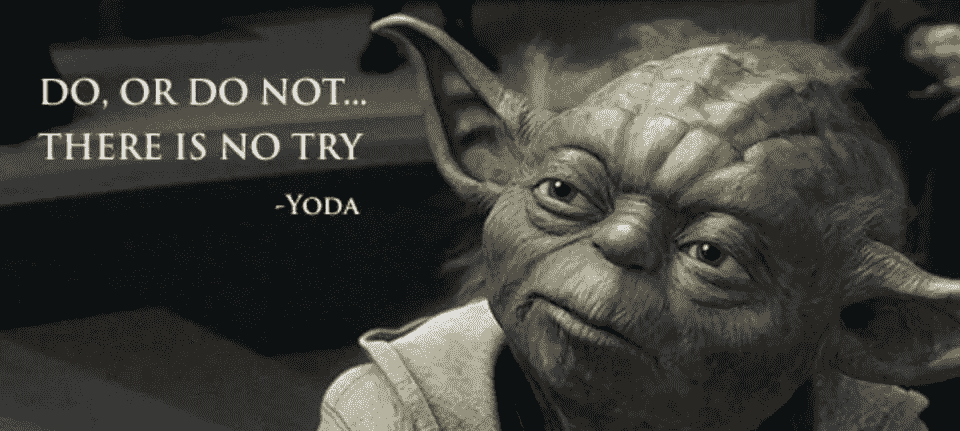

# 如何粉碎加密市场，辞掉工作，搬到天堂，在余生做任何你想做的事

> 原文：<https://medium.com/hackernoon/how-to-crush-the-crypto-market-quit-your-job-move-to-paradise-and-do-whatever-you-want-the-rest-27a4a3cc2bb1>

你喜欢按下按钮就能赚钱吗？

穿着内衣在家工作怎么样？你讨厌公司会议比讨厌瘟疫还严重吗？你是愿意环游世界，去冒险，睡在泰国的海滩上，还是愿意在办公室里消磨 50 年的时光？

那你可能只是个交易者，我的朋友。

但是你是哪种交易者呢？

你是否希望年复一年地获得稳定、缓慢、保守的利润，并保护自己免受重大风险？或者，你正在寻找击中全垒打贸易，敲它出公园，提前退休，周游世界吃美食，在热带雨林徒步旅行？

当然，保守并不可耻。简单多了。只是购买并持有一些资产。如果这是你的游戏，坚持我的简单按钮策略， [**掌握 Shitcoins，穷人致富指南**](https://hackernoon.com/mastering-shitcoins-the-poor-mans-guide-to-getting-crypto-rich-2e469b762ba9) 。在我看来，对于那些有生活、有责任、有家庭、不能整天呆在电脑屏幕前的人来说，这是最好的方式。这是一个简单的计划，也是我投资组合中的一部分。

但是还有另一种交易策略。它有可能带来大多数人只能在最疯狂的幻想中梦想的那种巨额回报。

**动量交易。**

这就是你想搭上火箭、摧毁市场的地方。你不只是想要缓慢而稳定的结果，你想要一个大满贯，你想要快。我不是说 20%的回报率。我说的是 1000%或 2000%或 20000%的回报。

不可能？愚蠢到去尝试？疯狂？

也许吧。

真正的问题是，这真的能做到吗？

事实证明可以。

我哪里知道？因为我已经出去找了做过这种事的交易者。

我曾坐在他们的脚下，汲取他们的智慧。我听过也学过。我赚了钱也亏了钱，所以你不必犯所有的错误。我的学徒训练完成了。

现在我准备向你们展示我从这些传奇大师身上学到的东西。在这个全新的系列文章中，**粉碎加密市场的终极指南**，我将分享他们所有的最佳策略和秘密。

其中一些人支付了交易道场、私人团体和培训材料的费用。

我免费给你我学到的一切。

为什么会有人这么做？

因为这是我注定要做的。我是一名作家，一名教师和一个开源创意工厂。

知识想要自由。

寻找时代智慧的最好方法之一就是向精英中的精英学习。

学习世界上最好的是一个历史悠久的策略，可以追溯到戴尔·卡耐基和 T2 以及其他自助大师。但老实说，我从来都不是自助大师的粉丝。他们似乎总是热衷于激励性的鼓舞士气的谈话，而缺乏实际的技术。

我想要实用的交易技术，而不是一大堆废话。

这就是我得到的。

所以，让我们直接跳进来，学习如何围攻市场，冲击 1%的堡垒。

*(嘶。如果你真的不耐烦，你可以跳到文章的结尾，看看实际的密码图表。实际上，如果你没有耐心，现在就停止阅读，因为市场是用来从没有耐心的人身上偷钱的。)*

我们走吧！

# **隐藏的主人**

首先，你可能想知道这些人是谁？

我的标准很简单。我想认识那些从 1000 美元到 45000 美元开始，在两年内变成几百万美元的交易者。

第二个标准是他们真的做了。就像蒂姆·费里斯在 [**4 小时工作周**](http://amzn.to/2C68v4r) 中说的，不允许伪装者。

我不想让那些在历史上最大的抛物线热潮中买入并持有的人。我想要交易者，赚的比买的多的人和持有人。

是的，这是可能的。

你可能仍然不相信这些人的存在或者这是可能的。

很可笑吧？没有人能打败市场。

然而，信不信由你，我和五个不同的交易者研究过，他们都是这样做的。

事实上，我不要求你相信任何事情，因为信念是智慧的死亡。你所需要做的就是看，虚心倾听，学习，然后为自己做出决定。这些人中的每一个人，四个男人和一个女人，都强调需要超越你有限的信仰体系，并且在你做任何事情之前相信这是可以做到的。

华尔街之狼乔丹·贝尔福特说:“你和你的目标之间唯一的障碍就是你不断告诉自己为什么不能实现它的狗屁故事。”

这正是问题所在。大多数人不相信这是可能的，或者他们认为做这件事的人很幸运。

如果你相信你能或者你不能，你是对的。我曾经认为这是一些嬉皮士的废话，但事实证明这是真的。如果你认为这是不可能的，你甚至不能站起来开始行动。

但这不会是什么积极思考新时代力量的废话连篇。积极的思考只会让你站在起跑线上。你可以想象一百万美元和一辆兰博基尼，但这不会让你如愿以偿。只有努力、纪律和学习才会。犯错误并从中吸取教训。

但是首先你必须认为这是可能的。

然而，即使在读到我已经见过并和五个这样做的人一起工作过，大多数人还是会认为这是不可能的。要做到这一点，他们不得不*主动否认证据*来符合他们已经相信的东西。这就是信仰系统的工作方式。即使我们错了，我们也会本能地认为自己是对的。这很疯狂，但却是事实。

如果我走进一屋子人，问他们谁的驾驶技术比一般人好，90%的人都会举手。另外 10%的人不会举手，因为他们知道我在问一个恶作剧的问题，但暗地里他们也相信。每个人都这样。

因为不可能每个人都比平均水平优秀，所以我们只能得出一个结论。

大多数人都在骗自己，也在骗这个世界。

有现实，也有你对世界的看法。通常它们不是一回事。当你的信念和现实相遇时，如果它们不同步，现实每次都会赢。

你可能认为你可以想吃什么就吃什么，永远不会健身，但是在吃了 40 年的汉堡和薯条之后，你会学到最后也是最难的一课。

这是这些传奇交易者的第一步。

摆正心态。

**学会*真实地看待自己*。**

如果你做不到这一点，你将一事无成。这就像你在学校讨厌的那些古老的长除法问题，你做错了第一步，其他 15 步就自动错了*。*

*你不能从错误的前提出发，希望得出正确的结论。*

*你是如何学会更清楚地看自己的？*

*提问。*

*你擅长什么？你最擅长什么？当你失败时，你为什么失败？回答这些问题时要坚持不懈。你过度交易了吗？你当时精神状态不好吗？你喝醉了吗？你是否使用了过多的杠杆？你看到了不存在的幻象模式吗？这些模式真的有用吗？如果是，哪些是，哪些不是？*

*为什么你只是因为在推特上或技术分析的[圣经](http://amzn.to/2CAfUNH)中看到牛市标志就自动假设这是真的？也许公牛旗是垃圾？想过吗？谁告诉你它们是真的？在你亲自测试之前，不要轻信任何东西。如果一个模式一直让你失望，那就假设它是错的，继续前进，直到被证明不是这样。要灵活。适应性强。*

*如果你想做好任何事情，你必须学会准确地看到你的优势和劣势。*

*如果你不从事实出发，你不可能做对任何事情。*

*首先是真相，然后是其他一切。*

# *教人钓鱼*

*每一个交易者都强调的第二步是，你必须自己学习。*

*如果你在寻找一个信号群，这样你就可以像机器人一样购买，你已经失败了。如果你喜欢，你可以加入一个团体，但*前提是这个团体是教你钓鱼的*而不是让你依赖这个团体。*

*我这么说是什么意思？*

**

*给一个人一条鱼，他可以吃一天。然后他马上饿死，等待下一条免费的鱼。教一个人钓鱼，他可以吃一辈子。*

***你想自己成为大师，而不是一辈子坐在大师的脚下收拾他们的残局。***

*这是一个积极的过程。你必须进去，边做边学。*

*你得赔钱，赚钱，再赔。当你大获全胜，然后又全盘皆输时，你必须驾驭疯狂的情绪波动。有一天你不得不认为自己是上帝，而市场是你的个人提款机，结果却被带到柴房，被人用橡胶软管抽打。事情就是这样的。没有人能教会你你需要知道的一切。你必须这么做！*

*但这并不意味着我们不能在此时此地学习基础知识。即使我们还不能完全理解、欣赏或相信它们，我们也可以让它们进入我们的头脑，在那里它们可以生根发芽、茁壮成长。*

*有时候我们还没有准备好去理解一些事情。人们说，傻瓜听到真理一百万次，但从来没有得到它，但聪明人只需要听到它十万次，才得到它。没有人在第一次、第二次或第五十次得到它。*

*但是关键原则潜伏在我们的潜意识中，当我们准备好接受它们的时候，它们会突然回到我们身边。*

**

*当我们自己完成这项工作时，我们就为他们做好了准备。 [**做工作**](http://amzn.to/2lQZk0M) **！***

*然后有一天你会说啊！他就是这个意思！我现在明白了。*

*最后，值得注意的是，并非所有这些人都是专门的密码交易员。其实大部分都是交易各种市场的。*

*但是他们每个人都会告诉你，最好的交易系统是跨市场的。*

*在纳斯达克交易小盘股或黄金和石油等商品与交易比特币和莱特币是一样的。他们只是移动的速度不同，有不同的流动性和效率，以及一些非常宽泛的评估基本面的方法。*

*市场会改变它们的外在表现，但人类的心理永远不会改变，市场是由人类的希望、梦想和恐惧驱动的。*

*既然我们已经开始理清思路，那就让我们来看看好东西，你们从第一行开始就一直在等待的东西:杀手交易策略。*

# ***粉碎抛物线摇摆交易***

*这一课是我最喜欢的课之一，它极大地改变了我的交易。*

*在所有的市场，在所有的时代，有一种交易可以统治所有的市场。*

***抛物线摇摆交易。***

**

*这时，一只几乎不为人知的小股票或加密硬币开始了疯狂的荣耀之旅。它上升了 10 倍或 20 倍或更多。它从 20 美分或 5 美元开始，攀升至 30 美元、40 美元或 50 美元。在加密领域，情况变得更加疯狂。几年前交易价格为 1 美元的硬币现在可能会以 100 美元或 1000 美元的价格交易。就移动的距离和速度而言，加密市场不同于任何其他市场。但是，原则还是一样的。*

*我不想撒谎。这种策略会导致大多数交易者破产。高风险。高额奖励。*

*当政府官员咬牙切齿地说比特币“高度投机”时，他们并不是在恭维。他们的目的是让各地的交易者感到恐惧。离远点。不要碰。危险！*

*但毫无疑问，高投机性是赚大钱的地方。*

*每个在市场上大赚一笔的交易者都是投机者。虽然部落中的羊认为这是一件坏事，但正是早期的冒险者在没有人愿意碰市场的时候发展了市场。投机者使市场繁荣，因此它达到一个均衡，并在以后为大众服务。这就是它的工作方式，也是它一直以来的工作方式。*

*每有一万人在黑暗森林的入口处看到警告标志时回头，就有一个印第安纳·琼斯绑上他的鞭子和皮夹克，向未知进军。他在寻找大买卖，终极交易。他在寻找埋藏的宝藏！*

*但是荣耀的承诺也带来了一败涂地的承诺。*

*这是一种视死如归的交易。它创造和破坏巨大的财富。这是一座高耸入云的大山，上面散落着破产交易者的尸骨。*

*那么，你如何抓住这种疯狂、疯狂的交易呢？*

*首先你必须知道一个小秘密。*

***每个市场和资产在某个时候都是泡沫。***

*每只股票、债券、硬币、商品或市场都会经历繁荣和萧条，一遍又一遍。*

*只是发生的速度有多快的问题。*

*大多数人看不到这一点，因为在成熟市场，这种情况每隔十年或十五年就会发生一次。在流动性较差的早期市场，如加密货币，这种情况发生得更快。*

*但是它发生了。*

*每一个。单身。时间。*

*你不知道它将如何或何时发生，但无论市场或年份如何，它都会发生。19 世纪的市场和现在的市场没有什么不同。黄金市场和股票市场、债券市场是一样的。网络泡沫之前、期间和之后的市场是完全一样的。他们只是移动得更快或更慢。*

*在你的交易中突破的关键是理解市场周期。*

*你还必须明白，市场周期是每项资产的一个大的分形，它在不同的时间经历完全相同的周期。当然，有大的市场波动，从繁荣到萧条，但没人能真正掌握时间。试图打败市场，用一个大写的 M，是一个傻瓜的游戏。该来的总会来。*

*但是你可以持续捕捉单个资产的周期。这些交易高手就是这么干的。*

*现在你可能已经看过这个循环了，通常是作为一个远离的警告或者是被嘲笑泡沫的人贴出来的。就像所有简单的事实一样，你忽略了它，直接跨过它，认为它必须更复杂，或者你已经想通了。*

*但是你一次又一次地发现，如果你花时间去理解和掌握任何技能，简单是更好的。你也意识到你认为太简单而不真实的东西实际上就是它的全部。*

***事实再简单不过了。***

*在生活中取得巨大成功的人比任何人都更好地掌握了一些基本的普遍真理。*

*那么市场周期是什么样子的呢？*

*给你。*

**

*Courtesy of the [Wall Street Cheat Sheet](https://www.cheatsheet.com/)*

*我知道。我知道。你已经看过无数次了。你猜对了。*

*但是请跟我在一起呆一会儿。你已经看过无数次了，但是你真的*看过*它吗？*

*要诚实。大概不会。*

*现在停止阅读一分钟。看这张图片。真的看看。把它烧进你的大脑。然后回来。文章可以等。你需要多少时间就花多少时间。*

*回来了？*

*酷毙了。现在你的第一个想法是，这个图形只适用于泡沫和郁金香疯狂的资产，如黄金和比特币，对不对？*

*不对。*

*这个循环适用于所有市场、所有时间的所有资产。循环是永恒的。*

*这是普遍的市场周期。*

**没有资产是免税的*。*

*每种资产在某个时候都会遵循这种模式。这座山可能会延伸很多很多年，这就是大多数人错过它的原因。他们放大得太远了。*

***缩小！***

*随着时间的推移观察市场，你会一次又一次地看到这种模式。*

*我知道你被教导说市场是随机混乱的。有效市场假说认为，所有的市场信息都被完美地分配并定价到资产中，最终市场打败了所有人。这完全是胡说八道。唯一相信它的人是学者和一生中从未冒过一分钱风险的人。*

*信息绝对不是均匀分布的。它是不对称的。仅仅因为每个人最终都得到相同的信息，并不意味着他们知道如何处理这些信息。大多数人根本无法正确处理这些信息并做出正确的决定。他们不能从噪音中分离出信号。*

*换句话说，普通人并没有变得更聪明。*

*这就是为什么我可以把这些信息给任何想看的人。我不需要对策略保密，因为大多数人不会相信，也不知道该怎么做。*

**

*还记得传说中的 [**海龟交易者**实验](http://amzn.to/2CjgISX)吗？这时，一些伟大的市场大师想知道交易是天生的还是后天培养的。换句话说，他们能教会人们规则，并把他们变成赚了数百万的超级交易明星吗？*

*[**这里是他们用过的完整规则，免费**](http://www.metastocktools.com/downloads/turtlerules.pdf) **，由其中一个原海龟写的。(** *快速注意:我之前在那里有错误的链接。修正了现在的* **。)***

*他把它们送人了。*

*为什么？*

*因为大多数人不会使用它们，不知道如何应用它们，或者认为这些规则太旧了，市场已经超越了它们。*

*即使他们明白这些规则，他们也不会在压力大的时候遵守。市场喜欢玩弄你的情绪，就像猫在玩线一样。海龟交易者历史上最伟大的时刻之一是一个人在咖啡上连续输了 32 次，然后放弃了，发誓这个系统永远不会成功。他走开了，再也没有回来。*

*接下来的咖啡贸易飞速发展。*

**

*市场是“全球心理战”**，《传奇交易员杰西·c·斯汀》写道，这是有史以来最伟大的一本关于坏蛋动量交易的书， [***内幕人士买入超级股票:我如何在 28 个月内将 4.6 万美元变成 680 万美元(14，972%***](http://amzn.to/2zRzNJR)。别看了，马上去买。它会在一夜之间改变你的交易游戏。去拿回来。我会等的。***

*我知道。我知道。标题只是尖叫骗局。废话。废话。废话。*

*但事实并非如此。尽管它的超级点击诱饵标题，它充满了巨大的智慧和实际操作步骤的人谁实际做到了这一点。这不是伪装者。这是一个传递并决定与世界分享他的知识的人。*

*这是非常罕见的。*

*大多数人都有一个突破性的认识，他们只是在得到它后退出了社会。一旦你发现了一个伟大的真理，除了执行它，别无他法。为什么还要在任何论坛发帖呢？何必去问别人的意见呢？那些地方没什么好学的了。所以大师就这样消失了，现在除了他自己内心的罗盘之外，不再相信任何东西。*

*此外，如果你写下一个伟大的真理，这并不重要，因为真理必须由每个人去赢得。没有个人的奉献和努力，是买不来的，骗不来的，甚至学不来的。*

*所以何必呢？不仅大多数人会忽视你，更糟糕的是有些人会变得对你充满敌意。他们会因为你的知识而恨你。那些遭受最大痛苦的人，那些一生都生活在恐惧中的人，那些生活在持续不断的自我厌恶的暗流中的人，会猛烈抨击你，骂你是骗子、傻瓜和骗子。*

*这也是为什么大多数人都懒得去教。他们只是掌握了功夫，然后消失在寺庙里，在简单的快乐中度过余生。*

*但是有些人甚至超越了这一点，成为了伟大的老师，因为在分享知识的过程中有一种特殊的快乐，这种快乐是生活中其他任何事情都无法比拟的，让所有的痛苦都是值得的。*

*这就是为什么 Stine 分享他的知识，我也将分享。*

# *你一直在等待的图表*

*因此，让我们来看看一些真正的加密图表，看看市场周期在起作用。*

*这是**比特币**，它从 2017 年 1 月开始以巨大的抛物线上山，并在夏天大放异彩，然后在 12 月开始崩溃*

*你看见那座山了吗？*

*你看到我们下山了吗？*

**

*继续把比特币缩小到 2 小时或 4 小时图，把市场周期图放在上面。你看到了什么？忽略我所有的老台词。那些是给我的，对你毫无意义。单看比特币价格走势就知道了。*

*看起来一样对吗？*

*当然，并不是每一项资产都完全遵循这张图表。不要搞原教旨主义。比特币可能会下跌，并在中途决定再次飙升，但如果不这样做，请做好准备。*

*你怎么知道一个趋势什么时候改变了？当趋势改变时。*

**

*也许有史以来最伟大的交易者，[埃德·塞科塔，你可以在伟大的著作中读到他，市场奇才](http://amzn.to/2CyksmP) ，是一个自 20 世纪 80 年代以来用他自己的系统每年回报 40%到 60%的人。然而，当人们去听他讲话时，他们会认为他是个白痴。那是因为佛陀像古鲁一样说话非常直接简单。简单的背后是强大的力量。只是人们听不到，因为他们在寻找更复杂的东西。*

*有人问他“我怎么知道趋势是上涨的？”*

*他说“当趋势上升时。”*

*大多数人听到这些，认为他在戏弄他们，或者他是一个讽刺的混蛋。*

*他不是。他刚刚给了你真正的答案。*

*你错过了吗？*

*只有当趋势持续上升时，你才知道趋势是上升的。*

*图上的两点不是趋势。三点只是一个趋势的开始。*

*生活中最基本的道理听起来都很荒谬或可笑。但它们仍然是事实。*

*人们花费大量时间试图猜测趋势何时会改变。他们对下跌趋势中的第一根绿色蜡烛线或上涨趋势中的第一根红色蜡烛线做出反应。他们一直在猜测。艾德不猜测。他跟踪趋势，直到它走到尽头，然后他等待趋势已经改变的确认。*

*确认需要时间。这意味着你不会抓住确切的底部，也不会在确切的顶部卖出。*

*那么，你怎么知道确切的顶部在什么时候，或者确切的底部在什么时候呢？*

*你不知道。直到它发生。在这一点上，你调整。*

*这听起来很简单，但在实践中却非常困难，因为你在与自己的情绪和最基本的自我保护本能做交易，这些本能在尖叫着“滚出去！”！一切都会崩溃的！末日即将来临！*

*人类是恐惧驱动的动物。我们不断想象可怕的悲剧，以试图提前做出反应。但问题是，你一生都在对想象的事件做出反应，而不是对真实的事件做出反应。那是通往苦难和痛苦的道路。*

*悲剧终会降临。到时候再处理他们，不要早一秒钟。*

**

*这是一个谜语。比特币的底部是 14000 美元吗？一万一千美元怎么样？8000 美元怎么样？$4,000?$400?*

*回答:没人知道。*

*任何说他们知道的人都是在欺骗自己和你。*

*我们可以画支撑线，这非常有用。当价格从该支撑反弹时，我们感觉到方向正在改变或继续。一个好的支撑趋势指标是 2 小时图上的指数移动平均线 200，50 和 10 或均线 200，50，10。在更成熟的市场，周线图*上的均线 10*就是你需要的全部。*

*但是请记住，仅仅因为一些东西从我们预测的支撑反弹并不意味着趋势真的逆转了。价格经常会反弹，一次又一次地测试这个支撑。趋势可以横向运行，直到它决定再次下跌或上涨。*

*看看伟大的游戏给了你什么。打板子。*

*趋势是下降，直到它不是。它一直横着走，直到它不再横着走。它会一直涨，直到涨不动为止。*

*永远跟风下注。当你的交易开始变坏时，暂停并离场。等待下一个趋势的确认，然后跟着这个趋势走。*

*如果价格在一个横盘通道中反弹，那么当它从顶线反弹后开始下跌时，在该通道的顶部卖出。如果触底，就买入。让它接近通道顶部，看它是否爆发，爆裂到天空。如果是的话，保持住。如果没有，再次卖出，并假设横盘趋势将继续。*

*看看这张资产交易的终极模式图。*

**

*每次我给人们看这个图表，他们就开始问我底部通道的突破何时到来。我不知道。明天。下周。下个月。明年。*

*但他们会问，你是怎么知道的？你不知道。*

*你只要在它真正爆发的时候买入。*

*现在从那里价格可以做几件事。它可能会坠落到海峡里。那就是你带着止损卖出的地方。这是一次失败的越狱。或者它可以继续下去，所以你要和它呆在一起。在某个时候，它会开始回调，但一定要缩小，看看它是否仍在上升趋势中，即使它在回调。不要再看五分钟图和三十分钟图了。浪费时间。*

*现在我们来看看 **Zcash** 。*

**

*请注意它是如何经历了大幅上涨，然后暴跌，最后以一个较长的基数稳定下来的。*

*现在，它的[线性回归](https://onlinecourses.science.psu.edu/stat501/node/251)通道，你可以看到红色和蓝色，指向上方。您可以在 [**交易视图**](https://www.tradingview.com/) 上找到线性回归指标。它根据收盘蜡烛价格的散点图自动绘制。线性回归通过趋势找到最好的线，不管是上涨、下跌还是横向。*

*在某一点上，硬币将开始从其坚固的底部反弹出来，并开始另一次上山的旅程。*

*现在让我们来看看 **Ripple** 开始它的大运行。*

**

*它以前的移动山是图表，但它做了同样的事情，因为其他两个。想看就缩小。它一路上涨，然后暴跌，然后慢慢下滑，形成一个强大的基础，然后在 2 小时图上突破 200 bar 指数移动平均线以上的高成交量。*

*我发现 cryptos 比纳斯达克或纽约证券交易所等流动性更强、效率更高的市场运行更快。虽然日线图或周线图能更好地帮助你交易这些市场，但是两到四个小时的短时间框架能更好地捕捉加密运行。*

*不过，不要把这当成真理。你自己去看看吧。如果你找到一个更好的时间线，就用那个。一条好的时间线有较少的移动，而不是更多的移动。更少。交易越少越好。停止过度交易。*

*注意 XRP 在它的抛物线上已经上升了三段。我在第二次上涨和回调后买入，因为这是一个高成交量的双重确认上涨趋势。它突破了均线 200，开始运行。然后它往回拉，在再次起飞前停留在那条线以上。我第一次注意到它以 Stine 所说的高“攻击角度”冲出了它的基地。那是我的红线，沿着趋势的顶部以 45 度角上升。*

*通常有五波这样的运行。当其他交易者喊反弹结束时，我决定买入，因为我可以看到抛物线运行模式正在形成，在清晰的阶梯上只有两步。*

*其他交易者认为是顶部，因为他们在交易他们的信仰系统和心理，拒绝看图表，因为它实际上在运行。这是因为 crypto 中的大多数人不喜欢 Ripple 的集中特性。*

*我也不知道。我希望 Ripple 长期失败，转而投资更分散的资产。也就是说，当谈到交易时，我没有奢侈的道德信仰体系来浪费时间。*

*我很乐意从 Ripple 那里拿钱，然后把它转移到我长期关心的资产中。无论我做什么，Ripple 都会失败或成功。市场将最终决定它是否值得继续存在。*

*但是如果你让你的信念蒙蔽了你的双眼，让你看不到眼前的事物，你就会失败。*

*市场不在乎你的看法，也不在乎你喜欢什么，不喜欢什么。它做它想做的事情，当它想做的时候，这张图表表明了一件事:XRP 已经准备好真正爆发了。因此，当别人做空时，我做多，抓住了新一轮大行情中的第三波。*

*然后我卖出获利，因为它开始回撤，并做空到最大利润。当它稳定下来的时候，我在下一波时买入。*

# ***真相***

*了解真相会让你自由。*

**

*你的信仰是你为自己创造的监狱系统。*

*但问题是。门没有锁。从来都不是，你可以在任何你想打开那扇门的时候逃离你对现实的限制。*

*去做吧。打开那扇门。*

*观察。不要幻想。看清图表的实际情况，然后你就可以开始做出好的决定了。*

*用试错法来检验你的观察。如果你的观察是错误的，就无情地抛弃它们，继续下一个观察。*

*市场周期是普遍的。捕捉抛物线是任何市场交易的圣杯。这是赚大钱的地方，也是人们玩市场致富的地方。*

*往前走，看看几乎所有的图表，你会发现这个模式在一个足够长的时间线上。当谈到新股票，也就是新公司，或者新密码时，没有足够的时间让它正确形成。所以基本上你只会看到一个平坦的交易基线。*

*从那里你只能去看看项目的基本面。阅读白皮书。跟着队伍走。接通他们的空闲频道。了解随着时间的推移他们是会成功还是会失败。然后，你可以决定是否要抓住机会，投资它们，最终走向辉煌。*

*但去看看任何已经存在了一段时间的资产或硬币，你就会发现其中的模式。不管是现金、亚马逊、脸书、网飞、黄金、石油还是糖。*

*不要每次都沉迷于寻找完美的模式。这不是某种总是精确发生的僵化模式。有时一只股票或一枚硬币变得非常起伏不定，上下颠簸或像一条野蛇一样移动，但最终，缓慢但肯定会形成山崩。*

*关键是要知道如何在底部买入，在顶部出局。*

*这是买家和持有者经常错过的部分。他们在上涨时嘲笑交易者，因为交易者没有抓住整个运动。他们退出得有点早，错过了最后的疯狂爆发，但当市场或资产开始下滑时，交易者笑到了最后，因为他们卖出了，而持有人继续持有，因为他们的收益蒸发了 40%或 85%。*

*掌握销售艺术！*

*如果你不知道什么时候卖出你买的和持有的，那还有什么意义呢？*

*一旦你明白了这一点，并承认这是真的，只有这样，你才能开始持续地主导市场。*

*然后也许，只是也许，你也许可以辞掉工作，搬到天堂，在你的余生里做任何你想做的事情。*

*愉快的交易。*

*############################################*

*免责声明:做一个大男孩或大女孩，自己决定把辛苦赚来的钱花在哪里。我不是财务顾问，这也不是财务建议，如果我真的需要告诉你这些，那么无论如何最好把你的钱藏在床垫下，因为当你失去它时，你只会因为你的错误而责怪别人，而不是你自己。*

*############################################*

## *如果你喜欢我的作品，请[访问我的 Patreon 页面](https://www.patreon.com/danjeffries)，因为那是我与所有粉丝分享特别见解的地方。顶级顾客可以独家进入**传说中的硬币单不和谐**，在这里你可以找到:*

*   ***市场来电**来自我和其他专业技术分析大师。*
*   *进入**投币人**专用**私聊**。*
*   ***幕后**看看我和其他专业人士是如何解读市场的。*
*   ***你还可以独家参加每月一次的虚拟聚会**，在那里我会分享我正在做的一切，让你看看我的幕后过程。*
*   *每次谈话后，我都会有一个问答环节。问我任何问题，我都会回答。*

*############################################*

*如果你和我一样热爱加密空间，那就来吧，加入 [**DecStack，这是一个虚拟的加密货币和分散式应用项目**](http://decstack.com/) 的合作场所，在这里你可以接触多个项目。永远完全免费。只是进来和社交，一起工作，分享代码和想法。通过反馈让你的想法更好。寻找新朋友。见见你的新家人。*

*############################################*

## *对于我的一些最独家的故事和这个星球上最好的实用硬币研究，请查看[**战略硬币**](http://strategiccoin.com/category/news/) **！***

*############################################*

**

*关于我:我是一名作家、工程师和连续创业者。在过去的二十年中，我涉及了从 Linux 到虚拟化和容器的广泛技术。*

## *读者们称我的突破性纳米块小说[、蝎子游戏](http://amzn.to/2gNn04x)、“神经漫游者的第一次严肃竞争”和“黑色侦探遇上约翰尼记忆术”*

*你也可以查看一下基于书中想法的 [**蝉开源项目**](http://iamcicada.com/) ，该书概述了如何立即将该技术变为现实，你可以参与其中。*

*############################################*

## *最后，你可以[加入我的私人脸书小组，纳米朋克后人类刺客](https://www.facebook.com/groups/1736763229929363/)，在这里我们讨论一切科技、科幻、幻想等等。*

*############################################*

## *你没有一件[金钱獾 t 恤是有原因的吗？你可能想要一个，因为它们比比特币便宜多了。](https://teespring.com/money-badger)*

**

*The [ultimate Bitcoin t-shirt](https://teespring.com/money-badger)! Grab one for your crypto loving friends for Christmas.*