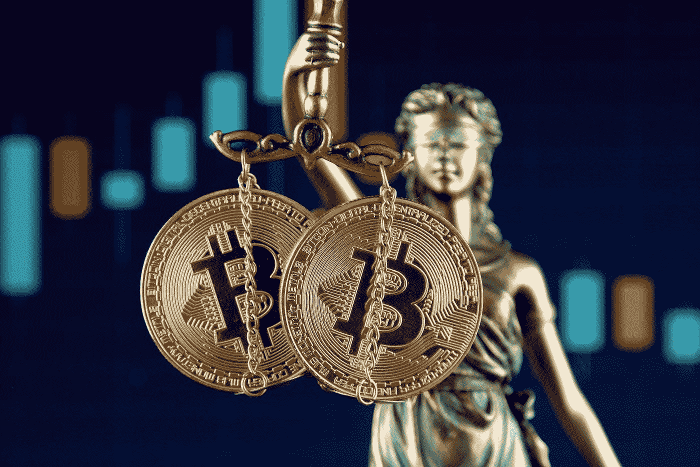
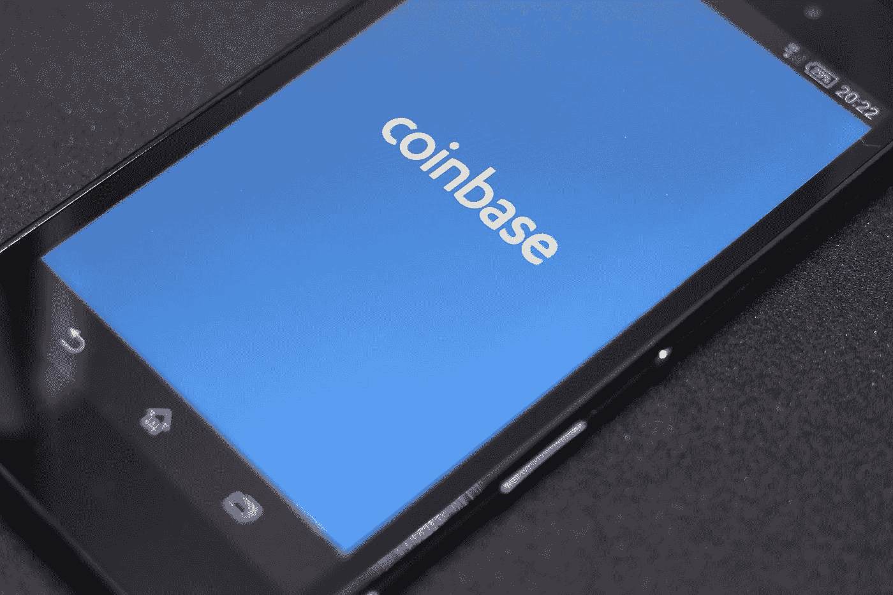

# 如何与监管者打交道:比特币基地入门

> 原文：<https://medium.com/hackernoon/how-to-deal-with-regulators-a-coinbase-primer-bbf39678f58c>

Lady Justice is bringing regulation to crypto trading platforms

你会发现这很神奇。7 月 16 日[比特币基地告诉彭博](https://www.bloomberg.com/news/articles/2018-07-16/coinbase-says-it-has-green-light-to-list-coins-deemed-securities)证交会已经批准了比特币基地对三家公司的收购:Keystone Capital Corp .、Venovate Marketplace Inc .和 Digital Wealth LLC。在这三起收购中，Keystone 和 Venovate 都是在 SEC 注册的经纪交易公司，也是 FINRA 的成员。

这可能就是为什么比特币基地认为他们需要得到美国证券交易委员会的批准，所以他们带着他们的律师大军来到华盛顿，愉快地交谈了一番，然后发表了这一声明。除了第二天比特币基地告诉彭博[证券交易委员会从未批准这些收购](https://www.bloomberg.com/news/articles/2018-07-17/coinbase-says-it-was-wrong-about-sec-approval-of-acquisitions)。怎么回事？

除了公关失败之外，它还表明比特币基地背后的团队是这个监管世界的新手。对于一家拥有一长串曾在这些机构工作过的律师的公司来说，这很奇怪，这些律师长期以来一直表示他们遵守证券法。这是怎么发生的呢？

证券交易委员会的第一条规则是他们不批准任何事情。是的，你没听错。美国证券交易委员会允许公司提交 S-1 表格上市，一旦美国证券交易委员会审查了它，这些公司被法律禁止说美国证券交易委员会批准了他们。

事实上，这写在文件的第一页和所有的大写字母上:SEC 既不认可也不批准这次发行。

对于想成为经纪自营商的公司来说也是如此。一家希望成为经纪交易商的公司将向 SEC 提交申请，然后等待 FINRA 审查他们提交的另一份申请。一旦 FINRA 同意允许该公司成为会员，那么 SEC 将推荐该公司成为 FINRA 的会员。批文在哪里？没有。

那么，比特币基地是如何陷入这种境地的呢？也许比特币基地的营销团队仍然不理解监管。也许他们知道自己在一个主要由炒作驱动的市场中运作，因此对热门消息反应迅速。还记得当比特币基地宣布比特币现金将在他们的平台上交易时，该公司暴露于[有争议的谣言](https://motherboard.vice.com/en_us/article/pam4xn/coinbase-insider-trading-lawsuit-gdax-bitcoin-cash)中，即他们的内部员工在这一宣布之前进行交易，因为比特币现金在公开声明前几天进行了交易？这是内幕交易，在美国是非法的，比特币基地可能不像他们希望我们相信的那样合规。

因此，被监管的第一条规则是不要告诉公众，该公司是由这些监管机构认可或批准的，因为他们没有这样做。坦率地说，监管者对这项业务是否会成功不感兴趣。监管者的工作只是保护公众免受无良金融公司的欺诈、欺骗和赤裸裸的敲诈。这项工作非常简单，随着代币交易越来越多地被视为证券交易并受到监管，加密货币市场有望注意到这一点。

*感谢阅读。如果你喜欢你所读的，请鼓掌并跟随我。*