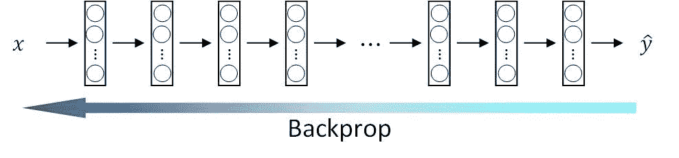
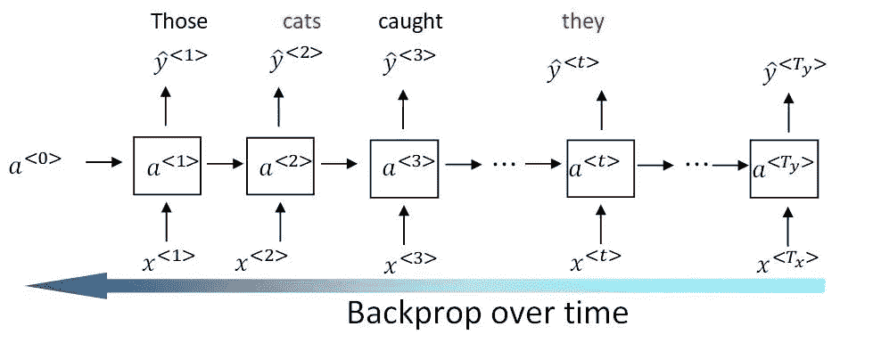
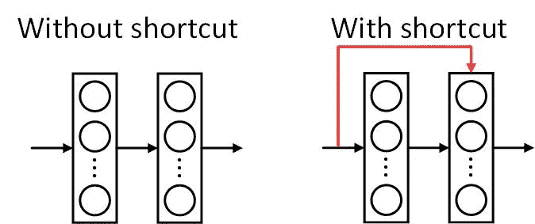
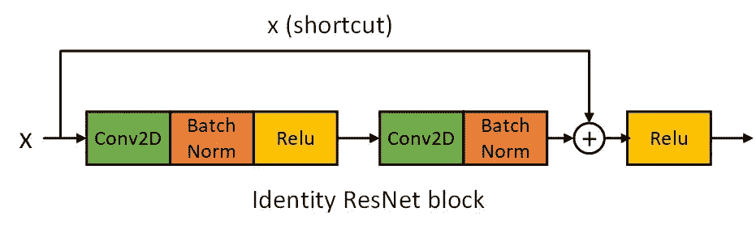
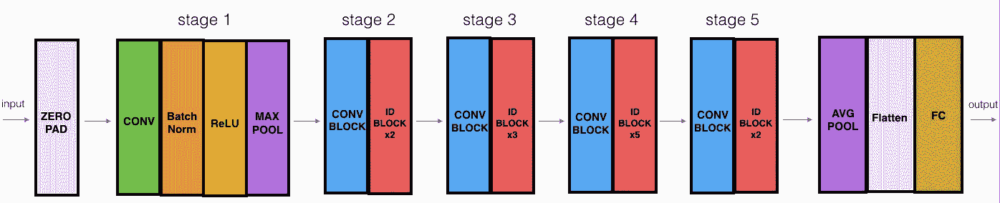
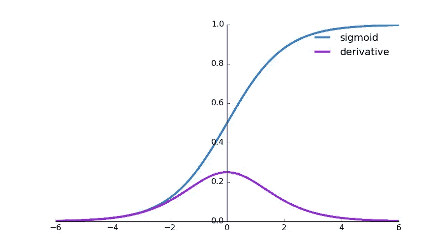
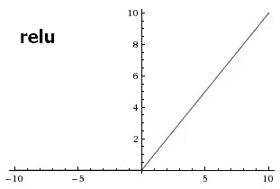
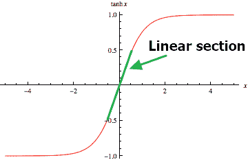

# 如何处理 Keras 中的消失/爆炸渐变

> 原文：<https://medium.com/hackernoon/how-to-deal-with-vanishing-exploding-gradients-in-keras-b4ab6e5f3a0a>

Blocks of rocks vanishing at the distance

如果你已经训练了你的深度学习模型一段时间，并且它的准确率仍然相当低。你可能想检查它是否正在遭受消失或爆炸梯度。

# 消失/爆炸渐变简介

## 消失渐变

反向传播很难改变非常深的神经网络中早期层的权重。在梯度下降期间，当它从最后一层返回到第一层时，梯度值在每一步上乘以权重矩阵，因此梯度可以指数地快速下降到零。结果，网络不能有效地学习参数。

使用非常深的网络可以表示非常复杂的功能。它可以学习许多不同抽象层次的特性，从边缘(较低层)到非常复杂的特性(较深层)。例如，早期的 ImageNet 模型，如 VGG16 和 VGG19，正在努力通过添加更多的层来实现更高的图像分类精度。但是网络变得越深，就越难更新早期层的参数。

Neural network backprop

消失梯度也出现在具有递归神经网络的序列模型中。导致它们在捕获长期依赖关系时效率低下。

以这句话为例。该模型被训练以生成句子。

> “那些**猫**抓到了一条鱼，…..，**他们**非常高兴

RNN 需要记住单词“**猫**”的复数形式，以便在后面的句子中生成单词“**它们**”。

这是一个展开的循环网络，展示了这个想法。

RNN backprop over time

## 爆炸渐变

相比于消失渐变，爆炸渐变更容易实现。顾名思义,“爆炸”。在训练过程中，它会导致模型的参数变得非常大，以至于即使输入中非常小的变化也会导致后面层的输出发生很大的更新。我们可以通过简单地观察层权重的值来发现问题。有时会溢出，值变成 NaN。

在 Keras 中，您可以将层的权重作为 Numpy 数组列表来查看。

# 解决方法

理解消失/爆炸梯度可能如何发生。这里有一些你可以在 Keras 框架中应用的简单解决方案。

## 在序列模型中使用 LSTM/GRU

普通的递归神经网络没有复杂的机制来“捕获”长期的依赖性。相反，像 LSTM/GRU 这样的现代 RNN 引入了“**盖茨**的概念，来人为地保留那些长期记忆。

简单来说，在 GRU(门控循环单元)，有两个“门”。

一个称为**更新门**的门决定是否用候选值更新当前存储单元。候选值由先前的存储单元输出和当前输入来计算。与普通 RNN 相比，该候选值将被直接用于替换存储单元值。

第二门是**相关门**告知先前存储单元输出与计算当前候选值的相关程度。

在 Keras 中，将 LSTM/GRU 层应用到您的网络非常简单。

这里是一个包含 LSTM 层的最小模型，可以应用于情感分析。

如果你很难选择 LSTM 或格鲁。LSTM 是更强大的捕捉远程关系，但计算成本比格鲁。在大多数情况下，GRU 应该足以进行顺序处理。例如，如果你只是想快速训练一个模型作为概念验证，GRU 是正确的选择。当您想要提高现有模型的准确性时，您可以用 LSTM 替换现有的 RNN，并训练更长的时间。

## 使用剩余网络

剩余网络的思想是允许通过“捷径”或“跳过连接”直接反向传播到更早的层。

shortcut

ResNet 块的详细实现超出了本文的范围，但是我将向您展示在 Keras 中实现“标识块”是多么容易。“相同”意味着块输入激活与输出激活具有相同的维度。

Identity ResNet block

这是这个身份模块的 Keras 代码。

还有另一个 ResNet 块，称为卷积块，当输入和输出维度不匹配时可以使用它。

准备好必要的 ResNet 块后，我们可以将它们堆叠在一起，形成一个像 ResNet50 一样的深度 ResNet 模型，您可以轻松地用 Keras 加载它。

ResNet50

## 使用 ReLu 激活代替 Sigmoid/Tanh

Sigmoid 函数将激活值挤压在 0~1 之间。而双曲正切函数将激活值挤压在-1~1 之间。

Sigmoid

可以看到，随着预激活的绝对值变大(x 轴)，输出激活值不会有太大变化。它将是 0 或 1。如果该层陷入这种状态，模型将拒绝更新其权重。

另一方面，这里是 ReLu 激活功能。

ReLu

对于随机初始化的网络，只有大约 50%的隐藏单元被激活(具有非零输出)。这就是所谓的稀疏激活。

你可能会担心 ReLu 的零部分，它可能会完全关闭一个神经系统。然而，实验结果往往与这一假设相矛盾，表明硬零实际上可以帮助监督训练。我们假设，只要梯度可以沿着某些路径传播，硬非线性就不会造成伤害。

ReLu 的另一个好处是易于实现，只需要比较、加法和乘法。因此它在计算上更有效。

在 Keras 中应用 ReLu 也很容易。

## 重量初始化

*   权重应该被随机初始化以打破对称性。
*   然而，可以将偏差初始化为零。只要权重被随机初始化，对称性仍然被破坏。
*   不要初始化太大的值。

Keras 默认的权重初始化器是 [glorot_uniform](https://keras.io/initializers/#glorot_uniform) aka。泽维尔统一初始化器。默认**偏差**初始值为“零”。所以我们应该可以默认了。

## 爆炸渐变的渐变剪辑

顾名思义，在反向投影过程中，渐变裁剪通过最大值或最大范数来裁剪参数的渐变。

Keras 支持这两种方式。

## 对爆炸梯度应用类似 L2 范数正则化

正则化在优化期间对层参数(权重、偏差)应用惩罚。

L2 规范在网络的成本函数中应用“权重衰减”。它的效果由参数λ控制，随着λ变大，许多神经元的权重变得非常小，实际上使它们变得不那么有效，结果使模型更加线性。

用 **Tanh** 激活函数举例，当激活值较小时，激活几乎是线性的

Tanh

在 Keras 中，正则项的使用可以像这样简单，

# 总结和进一步阅读

在本文中，我们首先了解什么是消失/爆炸渐变，然后是用 Keras API 代码片段处理这两个问题的解决方案。

# 进一步阅读

正则子的使用[https://keras.io/regularizers/](https://keras.io/regularizers/)

https://keras.io/layers/recurrent/的 LSTM/GRU

其他 Keras 权重初始化器来看看。[https://keras.io/initializers/](https://keras.io/initializers/)

*原载于我的网站*[*www.dlology.com*](https://www.dlology.com/blog/how-to-deal-with-vanishingexploding-gradients-in-keras/)*。*

*在* [GitHub](https://github.com/Tony607) 、 [LinkedIn](https://www.linkedin.com/in/chengweizhang/) 、[微信](https://mp.weixin.qq.com/s?__biz=MzIyNTI3NTI3Mg==&mid=100000016&idx=1&sn=3b7e519ffcabd65efe339a9ee8bb327d&chksm=68037df75f74f4e1aa762fc8d69d9ce725f40189ca4534786492267b448239926c943a8b2970&mpshare=1&scene=1&srcid=1212R4Cm7BhxGSfTAa9V5Ofw#rd)、 [Twitter](https://twitter.com/TonyZhang607) 和 [FaceBook](https://www.facebook.com/chengwei.zhang.96) 上找我。