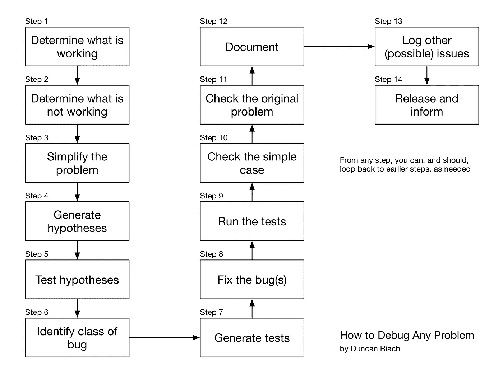

# 如何调试任何问题

> 原文：<https://medium.com/hackernoon/how-to-debug-any-problem-ac6f8a867fae>

[pexels](https://www.pexels.com/photo/nature-red-dew-color-33544/)

快速有效地发现和解决新的和已建立的系统中的错误的能力是你可以培养的最有价值的[工程](https://hackernoon.com/tagged/engineering)技能之一。由于这项技能能够快速开发和维护高质量的工程系统，因此它是许多技术公司的基础，也是他们最看重和最受欢迎的技能之一。然而，这种技能很少在[编码](https://hackernoon.com/tagged/coding)面试中被评估，并且经常很少被理解和记录。

我在许多不同类型的系统中调试并解决了许多困难的问题，包括大规模复杂的计算机处理器、多线程服务器和应用程序，以及陷入困境的个人、家庭和组织。在所有领域中，查找和修复 bug 的最佳过程本质上是相同的。令人惊讶的是，许多软件工程师对过程没有清晰的理解。我打算现在就解决这个赤字问题。这是我关于调试的论文。

# 第一步:确定什么在起作用

当某样东西没有按预期工作时，很容易认为一切都坏了。花时间去寻找在问题领域中起作用的东西。这将有助于限定问题的范围，并在你的脑海中创建一个清晰的边缘画面。

# 步骤 2:精确地确定什么不起作用

在确定什么可行的过程中，您将对一组不可行的操作或行为进行分类。花时间充实这份清单。清楚地知道系统是如何不按预期运行的。尽管这些最初的步骤看起来毫无意义，因为问题是“显而易见的”，但经常过早地解决问题会导致浪费时间和精力，并导致部分或非最佳的解决方案。

# 第三步:简化问题

在复杂情况下发现的问题行为可能很难重现或归纳，尤其是当存在不确定性或统计效应时。任何试图在保留有问题的行为的同时简化测试用例的尝试都是值得花时间的。

例如，如果有问题的行为发生在处理非常大的数据集时，您可能希望用越来越小的数据集来重现该问题。当然，如果问题与大型数据集有关，这个例子就不可能了。在这种情况下，创建一个简单但仍然很大的数据集可能更有意义。

通过逐步减少出现问题的情况，你不仅能更清楚地知道什么有效，什么无效，而且你还能自然地开始构建可能导致问题的假设。

简单的测试用例有助于与他人精确地交流 bug，快速测试变更是否影响 bug，并且也可能成为您的抗回归测试的一部分(参见步骤 7)。由于简单的测试用例通常可以快速运行，它们也支持假设测试(参见步骤 5)。

# 第四步:提出假设

你可能会在几分钟、几小时、几天甚至几周的工作后到达这一点。无论您是如何到达这里的，或者花了多长时间，您现在都将拥有数据，并且您将了解到一些关于问题显现方式的信息。这种知识使你能够对可能导致问题的原因形成假设。这些理论是关于系统内部(甚至外部)的什么过程可能导致观察到的问题行为。

# 步骤 5:使用分而治之的方法测试假设

依次考虑每个假设，深入系统，找到你认为可能出错的子单元。然后运行您的小测试用例，并查看该子单元前后的内部行为。如果你在这个子单元之前发现了一个问题，那么你的假设可能是错误的，你至少知道你需要进一步调查系统的输入。另一方面，如果系统那部分的输入看起来是正确的，但输出看起来是不正确的，那么你的假设就有了支持，你就可以更进一步放大。

在这一点上，如果您不完全清楚 bug 是什么，那么在这个被识别的子单元上循环回到步骤 1。

在这一点上，可以非常天真地应用分而治之:将系统任意分成两半，在每一半中寻找问题，然后递归地放大非功能性的那一半。我不推荐这种方法，因为它通常非常慢而且麻烦。

另一方面，如上所述，使用*假设驱动的*分治法可以节省大量时间和精力。就在假设被破坏的子单元之前，您仍然检查行为是否如预期的那样，但是，如果那里的事情是正常的，您就直接进入该子单元的输出。这使得可以非常快速地放大 bug。

只有当你清楚错误是什么的时候，才能进行下一步。

# 第六步:想想这类 bug 的其他版本

有时错误是由简单的打字错误或一次性的误解引起的，这些类型的错误可以被孤立地修复。然而，更常见的是，bug 代表了一个更大的问题类别。

在花费时间和精力完成这一步之后，你通常会对系统和问题的相关部分有一个非常清晰的认识。你将成为这个 bug 的世界级专家。因此，现在是利用所有这些知识的时候了。一个月后，你将不再对这个特定的问题有清晰的认识。

所以，现在就花时间充分利用你的投资。思考并记录 bug 的总体类别，并确定系统是否可能表现出潜在问题的其他表现形式，无论这些特定的表现形式是否已经向用户表现出来。

我们不想在恶性肿瘤上贴个创可贴，把病人送回家。

# 步骤 7:生成抗回归测试

即使你不使用测试驱动开发来设计系统，我也推荐你使用测试驱动的 bug 修复。

确保编写尽可能多地测试 bug 类的单元级和/或系统级测试。确保您预期会失败的测试确实失败了。这个 bug 存在的主要原因是没有测试来捕捉它。这意味着测试套件中有一个漏洞。我经常说，如果一个东西没有经过测试，那么它就是坏的。这是因为你必须假设它要么现在坏了，要么在未来的某个时刻会坏，然后第一个发现它坏了的人会是客户。

既然你现在有一个破碎的系统，现在是一个开发测试并确保它们失败的绝佳机会。这些机会不会经常出现，所以在它们可用的时候抓住它们。

我喜欢称回归测试为*反*-回归测试，因为它们防止产品回归到更早的、崩溃的状态。在发布产品的新版本之前，运行测试套件中的所有测试。

# 步骤 8:修复错误

如果你一直很勤奋，修正这些错误现在会变得非常容易；这只是一种形式。

这种错误修复可以非常平静和自信地进行。修复被包装在一个高质量的软件工程过程中，一个通知和测试它的过程。相比之下，我曾目睹工程师们在天平的另一端工作，他们几乎是随机地修改代码，希望这样就能解决整个问题。这种方法更有可能引入新的错误，而不是修复现有的错误。

在修复错误时，您可能会注意到其他问题。在这种情况下，还要返回到前面的步骤，如步骤 6。

# 步骤 9:检查测试现在是否工作

所有新的测试现在都应该通过了。如果它们没有通过，那么您需要返回到前面的步骤并解决问题。

# 步骤 10:检查原始的简单案例

此时，应该可以运行您在步骤 3 中开发的简单测试用例，并且它们应该可以正常工作。如果没有，则返回到前面的步骤来解决问题。

# 第 11 步:检查原始问题

您现在应该能够执行最初报告为有问题的行为，并且应该不会再看到问题。如果您确实看到了问题，请返回到之前的步骤来解决它。

# 步骤 12:记录修复

你刚刚完成了一系列高质量的工程演习。这是传奇的素材。很可能你是唯一知道你的英雄行为的人。把它们写下来，这样它们就可以成为工程知识的一部分。记录代码，记录测试计划，记录测试套件，写一个 wiki 页面或者一篇博客文章。做一些事情来捕捉你已经开发的智慧，并让它为他人所用。你的文档也将教育和指导他人。你将为其他工程师树立一个好榜样，一个如何有效利用资源的榜样，也是如何以一种令人深感满足和滋养灵魂的方式执行具有挑战性的工程工作的榜样。

# 步骤 13:注意任何其他可能的错误类别

在您将注意力集中在解决这个特定问题的过程中，您可能已经注意到了其他潜在的 bug 类别，以及其他明显的 bug 类别。对于表现为功能失调行为的问题，或者您确定潜伏未被检测到的问题，提交错误报告。对于其他可能不存在但也可能目前没有测试的错误类别，采取任何必要的措施将测试工作引向它们。例如，您可能会更新一个测试计划想法文档。

# 第十四步:释放

发布你的补丁，无论是内部的还是外部的，确保每个人都知道你做了什么。简明扼要地总结问题和解决方案，并包含指向您创建的文档的链接。

# 结论

你刚刚完成了一些了不起的高质量工程。拍拍自己的背，去做一些其他出色的事情。