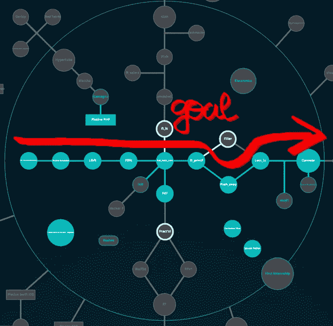
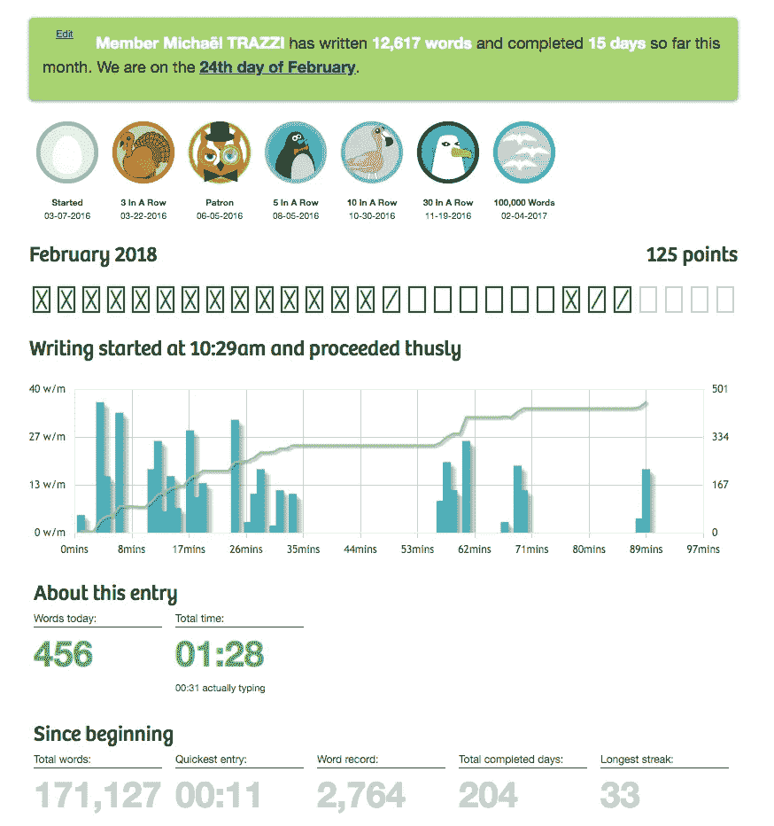
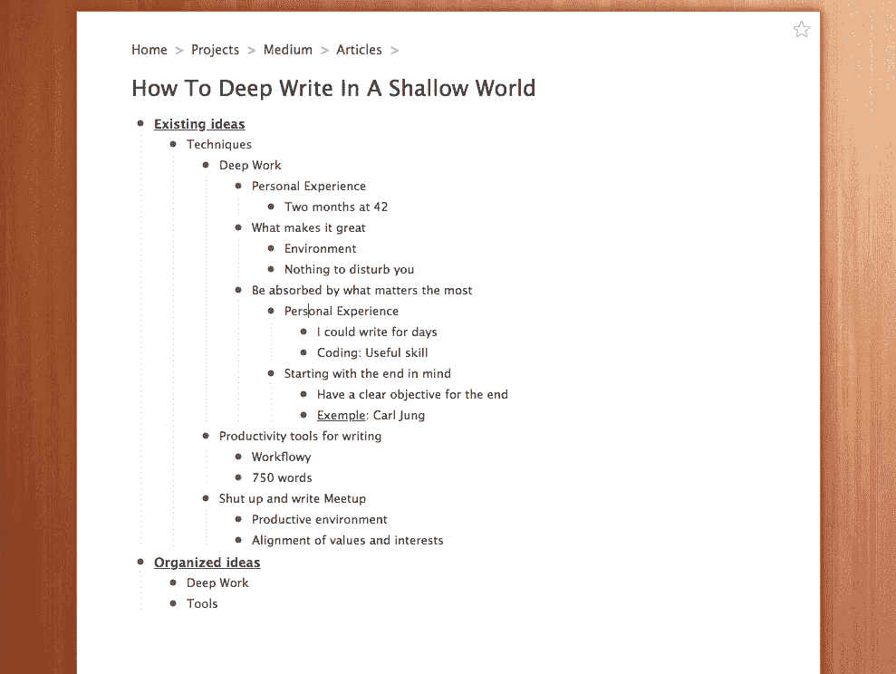

# 如何在一个浅薄的世界里深刻地写作

> 原文：<https://medium.com/hackernoon/how-to-deep-write-in-a-shallow-world-210d20ba31ed>

[Source](http://wallpaperswide.com/writer-wallpapers.html)

我出生于 1995 年。然而，我仍然不习惯互联网。尽管有这些刻板印象，我们千禧一代并非生来就有使用数字工具完成工作的天赋:我们都没有。2016 年，我开始了我所谓的深度写作，即不间断的、专注的写作。**以下是我在探索过程中发现的深层写作的秘诀。**

# 深耕

2017 年夏天，我刚刚被巴黎一所 24/7 开放的编码学校 42 录取，并努力从中获得最大收益。卡尔·纽波特的书《T4 深度工作》促使我在两个月内写了比我一生中写的代码还多的代码行。他是这样定义的:

> “深度工作:在不受干扰的集中状态下进行的专业活动，将你的认知能力推向极限。”[1]

Source : [https://www.usnews.com/news/articles/2016-09-22/new-computer-coding-program-boasts-no-courses-or-professors](https://www.usnews.com/news/articles/2016-09-22/new-computer-coding-program-boasts-no-courses-or-professors)

2017 年七八月份，我天天去这个编码学校，从早到晚写了几千行代码。

编程时，大部分时间花在调试上([有些开发者](https://stackoverflow.com/a/2326113)花在上面的时间高达 90%)。帮助我熬过两个月马拉松式调试的是一个有意义的环境:**无论何时尝试深度工作，你的环境的价值必须与你工作的目的相一致。**

瑞士精神病学家和精神分析学家[卡尔·荣格](https://en.wikipedia.org/wiki/Carl_Jung)甚至建造了自己的建筑[*柏林根塔*](https://en.wikipedia.org/wiki/Bollingen_Tower) 。只有当他不得不连续几天沉浸在工作中时，他才会参观这座塔。因此，他的环境闻起来像是艰苦的工作，是深入工作的完美场所。

> ”20 世纪 20 年代，在荣格试图摆脱导师西格蒙德·弗洛伊德的束缚的同时，他开始定期隐居到他在博林根小镇外的树林中建造的一座质朴的石头房子里。在那里，荣格每天早上都会把自己锁在一个设备最少的房间里，不受干扰地写作。来源:深度工作

用纽波特的话来说，驱使荣格偶尔进入“超极限模式”的原因是他有一项精确而有意义的工作要完成。那时，Jung 需要高效快速地工作。

> “如果你是卡尔·荣格，并且正在与西格蒙德·弗洛伊德的支持者进行一场智力混战，你可能会毫不费力地认识到花时间专注于你的想法的重要性。”来源:深度工作

# 有意义的努力

回到我的黑客插曲，我只有两个月的时间在编码学校全职工作。除此之外，我必须完成 9 个项目，以达到“第一圈”，而不是被踢出学校。换句话说，和荣格一样，我有一个明确的目标，懈怠不是一个选项。

Screenshot from my “project graph” at school 42

# 让你开始的便捷建议

当然，在 2018 年，有大量的资源可以帮助你更加专注。以下是我用来高效写作并且没有任何干扰的简单工具。

## 750words.com

Screenshot from my 750words.com Dashboard

750words.com 是一个网站，我每天都试着用它来理清自己的思路。原理很简单:每天需要写 750 字。重点是 **750 个单词代表了很多单词**。它能增强你的写作耐力，锻炼写作肌肉。这就是为什么每当写一些不太有挑战性的东西(比如只有 300 个单词)时，它看起来很容易。

此外，为了完成你的写作，**你需要从你的潜意识中回忆起你大脑在白天想到的每一个想法**。因此，它加强了你的想法之间的联系，并有助于在你的后脑勺形成长期的联系。

我也用它来写一个特定想法的草稿(比如这篇文章的草稿)。它迫使我考虑我想要解决的问题的每一个方面。

## [Workflowy.com](https://workflowy.com/)

> "工作流帮助你将大想法分解成可管理的小块，然后一次专注于一个小块."资料来源:workflowy.com

My organized ideas in workflowy.com

我用 Workflowy 来做所有的事情。这是一个极简主义的网站，有基本的格式(如斜体、粗体等)。)但是非常强大。你所有的笔记都是嵌套的，用项目符号来组织。这是整理你的想法的完美工具，尤其是整理树状思维。

所以现在你已经完成了 750 字的草稿，你的想法也用工作流组织好了。但是你如何完成你的深度写作呢？

## [闭嘴写 Meetup](https://www.meetup.com/Shut-Up-and-Write-Paris)

Writers working at the Shut Up and Write Meetup

今天早上，我很幸运地发现了 [the Shut Up and Write Meetup](https://www.meetup.com/Shut-Up-and-Write-Paris/) 。我有幸在一个富有创造性和挑战性的环境中与其他作家一起写作(有些人正在完成一本他们已经写了 10 多年的书！).当你每小时支付 4 美元，周围都是才华横溢的作家时，你就像是在他的塔**中的荣格:闲逛或查看你的社交媒体变得非常困难。**

# 结论

要完成你的深度写作，必须满足两个要求。你需要处于一个**的专注环境**，并且心中有一个**的具体目标**。实现你的目标的三个方法是:用**750 字**做一个快速草稿，用**工作流程**组织你的想法，然后在**写作会议**中总结一切。