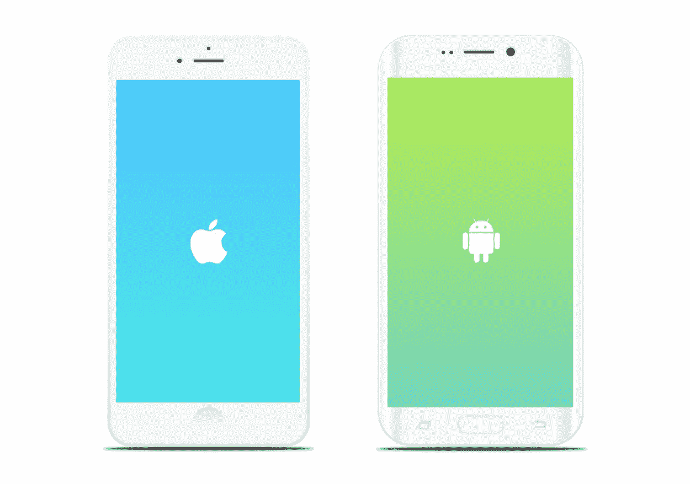

# 如何用按需应用取悦客户？

> 原文：<https://medium.com/hackernoon/how-to-delight-customers-with-on-demand-app-cb1a3ad04848>

在我与团队合作或帮助团队构建的所有[按需](https://hackernoon.com/tagged/on-demand)平台中，有一件非常重要的事情比我希望的更经常被忽视，那就是在应用中添加“愉悦”因素。在我讨论如何创建让客户满意的按需应用之前，让我们做一点背景研究。点播应用已经频繁地在左右两边涌现，我们不会不注意到。部分原因在于像优步和 Instacart 这样的按需平台的成功，以及人们希望成为各自行业的优步。然而，[的成功率](https://www.cbinsights.com/on-demand-overview)与优步相差甚远，这取决于无数的因素。但是全世界的用户都很享受这种体验。

按需经济基本上是“共享经济”的一个子集。按需空间的平台与共享经济的平台有很大不同，这一事实已经争论了很长时间。

为了帮助你理解共享经济的影响，我想让[和你分享这个视频](https://www.youtube.com/watch?v=QX3M8Ka9vUA&vl=en)。我知道这是一个漫长的手表，但我相信它值得你的时间。

现在让我们回到点播领域。现在市场上有各种各样的点播应用。从送食物到派汽车修理工上门，从在手机应用程序中提供加油站到帮助你遛狗的应用程序。

**按需开发的重要性。**

这个时代的点播 app 都是为你做的。在这篇文章中，如何确保你的点播平台的用户？因为完善商业模式，与第三方厂商和其他方结盟，营销你的 app 都没问题。但在我看来，[按需应用程序开发](https://sodio.tech/blog/recipe-of-successful-on-demand-app-development/)过程，以及你在产品开发阶段做出的决定完全决定了你的创业公司的成功。

在这篇文章中，我将试着解释你如何用你的随选平台取悦顾客。如果你还不知道，一旦你开始取悦顾客，让他们开心，成功就会随之而来！

# 完美的设计是工具性的。

无论你的目标是哪个行业，重要的是要确保整个应用程序的设计能与之产生共鸣。网上有大量的用户界面设计指南之类的东西，宣扬如何设计应用程序以及改善用户体验的技巧。

但我会告诉你那些“指南”缺了什么。它们太宽了。优步应用程序的设计不是你可以在送水应用程序中复制的，甚至不是一个送餐应用程序。像 savart 或 Investica 这样的投资管理应用程序的设计与像 T2 Spotify 或苹果音乐这样的音乐应用程序的设计相去甚远。明白我的意思了吗？

我将用两个很好的例子来解释这一点。假设你在做一个按需送餐 app。难道你不认为你设计这个应用程序的心情必须不同于一个用来订购食品杂货或预订出租车的应用程序吗？

在预订出租车时，您需要考虑的因素包括用户输入的位置，然后显示出租车的详细信息以及已分配的司机，随后显示司机在前往上车地点途中的实时位置。这与送餐应用完全不同，在送餐应用中，你必须向用户展示可用的餐馆，让他们从中选择。然后是菜单，接着是订单跟踪功能。

这两个应用程序唯一有点相似的是支付阶段和对骑手/司机的追踪。那么这个例子有什么启示呢？设计应用程序时，要让它与你的应用程序所反映的情绪和主题产生共鸣。

# 用真正优质的服务打动顾客。

Image Source: [undraw.co](https://undraw.co/)

当谈到取悦你的按需平台的客户时，这是下一个最重要的事情。毕竟，你的服务才是你的客户真正想从你这里得到的。

现在，你的移动应用或网站是你的客户与你互动的平台。这意味着，你必须使用该应用程序，让客户感觉到，与其他选项相比，你为他们提供了更好的服务。一旦你成功做到了这一点，剩下的就很简单了。

我再给你举一个按需交付应用的例子。用户真的希望他们订购的东西能尽快送到。如果你能做到，他们会喜欢你的。但是等等，怎么充分利用呢？让他们知道。发出通知，告诉他们你做得有多好。你也知道，如果是真的就不是吹牛了。尤其是在这种情况下。

另一个绝大多数应用程序滞后的重要问题是支付网关。我相信即使是你也一定注意到了很多应用程序的加载和刷新都要花很长时间。这在很大程度上阻碍了你的应用程序的用户体验。确保你已经找到了解决方案。

# Ace 消费者支持以获得更多客户。

在我使用按需应用的卑微经历中，我明白了关于按需平台的一件事，消费者不再是一群容易被说服的人。至少在这种按需经济中不是这样。他们需要你的关注，他们希望你以闪电般的速度解决他们的问题。根据电子营销者的说法，这里有一些你必须做的事情。

*   所有数字渠道的一致服务水平。
*   简洁的[内容策略](https://contentninja.in/dojo/content-strategy/writing-the-right-content-and-getting-people-to-read-it/)带来顺畅的信息流。
*   高管的实时快速响应
*   个性化体验。

# 结束了。

在这篇文章中，我讨论了如何取悦你的点播平台的客户。为了实现这些想法，你必须以一种全面的方式与你的团队合作。在当今世界，在随需应变领域创建优秀的平台并不简单，因为“优秀”的定义在不断变化，因为每个公司都在努力让客户满意。

这就是我想和你们分享的。很乐意分享更多关于[未来](https://hackernoon.com/tagged/future)的见解。我是否错过了一些如何取悦顾客的事情？欢迎在评论中告诉我。

如果你需要讨论与按需经济相关的任何事情，或者对你可能正在从事的按需创业的想法有疑问，请随时联系。

> 纳文
> 
> [我的公司](https://sodio.tech/contact)，[推特](https://twitter.com/NaveeenSaraswat)，[脸书](https://www.facebook.com/navesaraswat)。