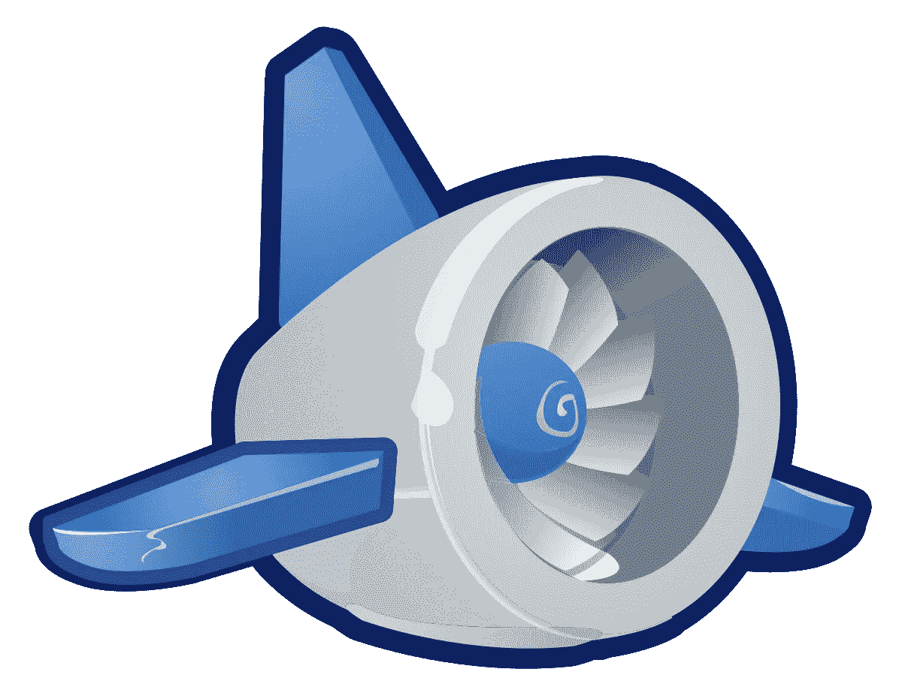
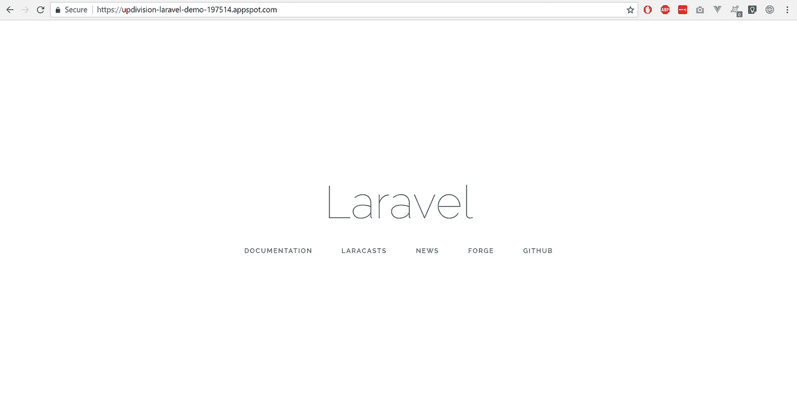
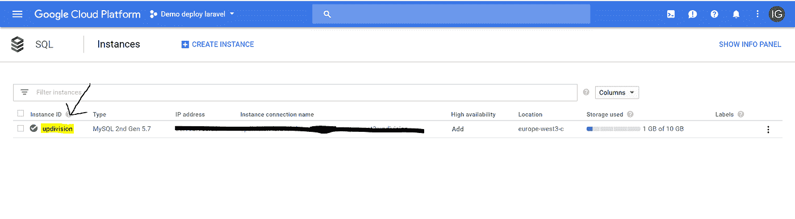
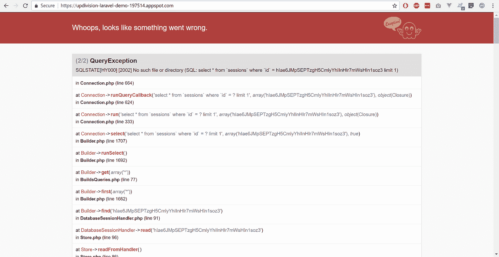
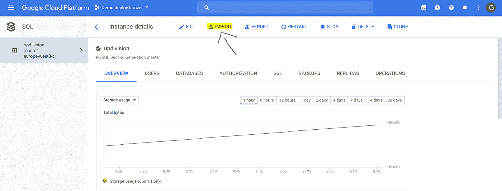
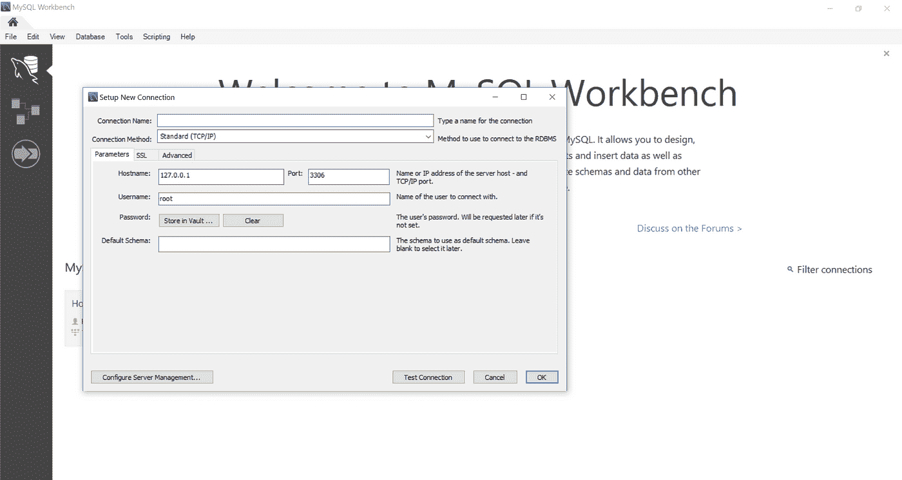
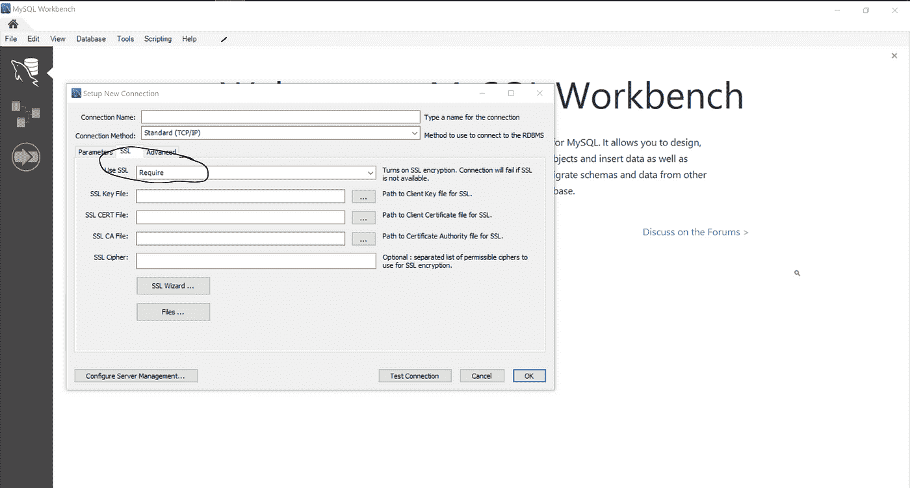

# 如何在 Google App Engine 上部署 Laravel web 应用程序

> 原文：<https://medium.com/hackernoon/how-to-deploy-a-laravel-web-app-on-google-app-engine-ecfbb0d49b00>



升级建造独角兽。我们的开发者经历了很多。这些是他们的故事。这是由我们的高级应用程序设计师之一因陀罗讲述的。

> 因陀罗:我是一名经验丰富的软件工程师和团队领导。我对我的项目了如指掌——我必须这样做。我负责确保所有部件都组装在一起，服务器正常运行，最困难的任务得以完成。当我不做那件事的时候，我在大学教书和做研究。我无时无刻不渴望提升自己的技能，把自己知道的东西传授给别人。

本周，我们有一个客户希望他的 Laravel web 应用程序部署在 Google App Engine 中。这有多种原因:

*   成本([据报道比亚马逊](https://www.rightscale.com/blog/cloud-cost-analysis/aws-vs-azure-vs-google-cloud-pricing-compute-instances)便宜)
*   多区域
*   自动缩放

此外，我们已经在这个特定的应用程序中使用了很多 Google APIs，所以这看起来是一件非常容易的工作。

你看怪不怪这并不容易。但我最终成功了。

通过这次经历，我艰难地发现几乎没有任何关于这个话题的信息。我能找到的唯一一个教程发布在谷歌社区上，它缺少很多细节。

**在开始之前:**
*我建议在开始使用 Google App Engine 部署 Laravel 应用程序之前阅读整篇文章。准备好一切。然后才进行部署。否则你可能会像我一样，失去很多时间，给自己压力。*

**免责声明:**
*虽然我没有对 nginx 的设置做任何修改，但我会在以后的教程中谈到它。我正在考虑做一个关于添加自定义域和我遇到的问题的教程。但是 YouTube 上已经有一些关于这个话题的非常好的教程了。*

*此外，我在本教程中使用了标准的 MySQL，但是也可以使用大数据。因为我不想让这篇博客难以阅读，在某些部分，我添加了链接和 YouTube 视频，而不是图片。*

*Google 上缺少一些关于 PHP 部署的文档，所以我在一些地方用 Python 的文档替换了它。如果你打算按照 Google 文档来部署一个带有 Google App Engine 的 Laravel 应用程序，我强烈推荐你看一看这两者。*

## **先决条件阅读**(可以跳到 ***准备*部署**)

1.[谷歌云壳](https://cloud.google.com/shell/docs/quickstart)

2.[谷歌云平台上的 PHP](https://cloud.google.com/php/docs)

我们将使用灵活的环境，请阅读相关内容。

3.(可选)[Python 文档](https://cloud.google.com/python/docs/?hl=zh-TW)

# **准备部署**

1.创建一个谷歌云账户:[这里](https://cloud.google.com/)或者更直接[这里](https://console.cloud.google.com)。

目前，你可以获得 365 天或 300 美元的信用免费试用(以先到者为准)。除非你是一个非常老的用户(测试版)，你也将被要求添加您的信用卡，但你不会被收费。

2.创建一个新项目(快速视频[此处](https://youtu.be/7n9DkOzjwlA?t=35s)如果需要)

3.创建一个应用引擎实例(如果需要，在此处快速视频

4.我们将使用 [Google Cloud Shell](https://cloud.google.com/shell/docs/quickstart) 进行部署

为了能够使用它，你需要[为你的操作系统下载 cloud SDK](https://cloud.google.com/sdk/) 。

对于一些设置，你可以直接从你的浏览器使用云壳，见[这里](https://youtu.be/elnKjoUgSJE)。我不使用它，但是阅读文档来了解如何使用。但是你真的应该安装它以便于使用。

如果您运行 Windows，您需要以管理员权限打开安装程序。遵循谷歌为其他操作系统提供的快速入门教程。

5.在你继续使用 Google Cloud Shell 之前，我推荐[阅读这篇关于 PHP 环境的](https://cloud.google.com/php/docs/?hl=zh-TW)。

6.使用命令 **gcloud auth login** 登录控制台。您将通过浏览器登录。如果你想看到所有可用的命令，在命令行中写下**gloud**help 并按下**回车**。

7.在命令行中编写**g cloud config set project project _ id**，其中 **project_ id** 是您刚刚赋予新创建项目的项目 id。在*项目信息*小部件下选择项目后，可以在谷歌控制台的第一页找到它。

8.要查看您所有项目的列表，请键入 **gcloud 项目列表**。

这是它的先决条件。我们将继续进行所需的数据库设置和下载。

# **准备您的项目**

对于这一部分，我使用了本教程作为灵感。您可以阅读它，也可以完全跳过它，因为我将介绍部署所需的所有步骤，除了文件存储部分。为此，我会给你一些信息，但不是一个完整的教程。

在本教程中，我将使用一个我正在构建的应用程序作为例子。一个简单的博客有作为管理面板的拉勒维尔的[背包。既然我们在这里，我必须让你知道 Vue.js 与 Google App Engine 兼容。你只需要运行 **npm install** 和 **npm run prod** 就可以了。在本教程中，我们将不会使用 Vue.js。](https://backpackforlaravel.com)

1.将目录更改为您的应用程序文件夹。

为了便于使用，您可以像这样设置:

```
TUTORIALDIR= C:/Code/updivision-laravel-demo/git clone https://github.com/Updivision/laravel-demo-google-cloud.git $TUTORIALDIRcd $TUTORIALDIRgit checkout phase0-helloworld
```

我们需要创建一个 **app.yaml** 文件。在 composer.json 的同一级别手动创建即可。

2.现在我们有了文件，我们需要设置数据库和项目细节。

3.为了设置项目详细信息，我们将不使用。请按照我的 app.yaml 示例中添加的注释来理解我是如何编写它的。

它需要看起来像这样:

```
runtime: php  # language of the app
env: flex     # let app engine know we use flexible environmentruntime_config:
 document_root: public   #folder where index.php is# Ensure we skip ".env", which is only for local development
skip_files:
 - .env #we want to skip this to make sure we don’t mess stuff up on the serverenv_variables:
 # Put production environment variables here.
 APP_ENV: local   # or production
 APP_DEBUG : true # or false 
 APP_KEY: base64:FqwXmLtL6szdWqIVydb7nKs2eyvHib4lf6d5l6A/XW4= 
#go to generate app key paragraf in this tutorial CACHE_DRIVER: database# instead of putting the cache in the database I recommend using redis
 SESSION_DRIVER: database #or file since both work APP_LOG: daily
 APP_TIMEZONE: UTC #your timezone of choice # follow the part of the tutorial on setting up your SQL database
 DB_CONNECTION: mysql
 DB_HOST: localhost
 DB_DATABASE: instance_id
 DB_USERNAME: database_user_name
 DB_PASSWORD: database_password
 DB_SOCKET: /cloudsql/instance_name QUEUE_DRIVER: database #in case you execute queued jobs MAIL_DRIVER: smtp
 MAIL_HOST: smtp.sparkpostmail.com
 MAIL_PORT: 587
 MAIL_USERNAME: sparkpost_username
 MAIL_PASSWORD: **************** LOG_DELETE:  true # this is a parameter added by us in the project .env file. You can add here any setting you would add to your .env file GOOGLE_VISION_PROJECT_ID : project_id#we need this for the flex environment
beta_settings:
   # for Cloud SQL, set this value to the Cloud SQL connection name,
   # e.g. "project:region:cloudsql-instance"
   cloud_sql_instances: project:cloudsql-instance
```

4.生成应用密钥。

要为 Laravel 安装生成应用程序密钥，我们需要运行:

```
php artisan key:generate --show
```

然后复制粘贴到 app.yaml 中。

5.更新 composer.json 以符合 Google App Engine 要求。

在脚本中，添加如下脚本。在 **post-install-cmd** 脚本中，有一个添加 **php artisan cache:clear** 的建议，但是根据我使用 Google deploy 的经验，这不起作用。这就是为什么我建议不要写它。在这个 composer.json 示例中，我只添加了最少的 Laravel 包。

```
{
   "name": "laravel/laravel",
   "description": "The Laravel Framework.",
   "keywords": ["framework", "laravel"],
   "license": "MIT",
   "type": "project",
   "require": {
       "php": "7.1.*",
       "fideloper/proxy": "~3.3",
       "laravel/framework": "5.5.*",
       "laravel/tinker": "~1.0"
   },
   "require-dev": {
       "filp/whoops": "~2.0",
       "fzaninotto/faker": "~1.4",
       "mockery/mockery": "~1.0",
       "phpunit/phpunit": "~6.0",
       "symfony/thanks": "^1.0"
   },
   "autoload": {
       "classmap": [
           "database/seeds",
           "database/factories"
       ],
       "psr-4": {
           "App\\": "app/"
       }
   },
   "autoload-dev": {
       "psr-4": {
           "Tests\\": "tests/"
       }
   },
   "extra": {
       "laravel": {
           "dont-discover": [
           ]
       }
   },
   "scripts": {"post-root-package-install": [
           "@php -r \"file_exists('.env') || copy('.env.example', '.env');\""
       ],
       "post-create-project-cmd": [
           "@php artisan key:generate"
       ],
       "post-autoload-dump": [
           "Illuminate\\Foundation\\ComposerScripts::postAutoloadDump",
           "@php artisan package:discover"
       ],
       "post-install-cmd": [
           "Illuminate\\Foundation\\ComposerScripts::postInstall",
           "@php artisan optimize",
           "chmod -R 755 bootstrap\/cache"
       ],
       "post-update-cmd": [
           "Illuminate\\Foundation\\ComposerScripts::postUpdate",
           "@php artisan optimize"
       ],
       "post-autoload-dump": [
           "Illuminate\\Foundation\\ComposerScripts::postAutoloadDump",
           "@php artisan package:discover"
       ]
   },
   "config": {
       "preferred-install": "dist",
       "sort-packages": true,
       "optimize-autoloader": true
   }
}
```

7.在 google sdk 命令行中运行 **gcloud app deploy** (你必须在应用文件夹中)并在提示时回答 **Y** 。

```
descriptor:      [\blog\app.yaml]
source:          [\blog]
target project:  [updivision-laravel-demo-197514]
target service:  [default]
target version:  [20180309t203424]
target url:      [https://updivision-laravel-demo-197514.appspot.com] Do you want to continue (Y/n)?  Y
```

8.运行 **gcloud app 浏览**查看你的应用。



# 设立 cron jobs

下面是设置 cron 作业的 [Google 教程](https://cloud.google.com/appengine/docs/standard/php/config/cron)。我还看了一下[的 Python 版本](https://cloud.google.com/appengine/docs/standard/python/config/cron)。当有一个 Laravel 应用程序时，知道如何用 Google App Engine 设置 cron 作业是最基本的。我们的应用程序有很多运行中的时间表，我很难让它们工作或在网上找到答案。幸运的是，我们在亚马逊遇到了同样的问题，并且已经知道了解决方法。我用谷歌应用引擎和哈利路亚试过了！

1.创建一个 cron.yaml 文件并添加以下代码:

```
cron:
- description: "daily laravel cron"
 url: /scheduler
 schedule: every 1 mins
 retry_parameters:
     min_backoff_seconds: 2.5
     max_doublings: 5
```

2.在您的路由中，您需要像这样添加调度程序路由(在任何中间件之外):

```
Route::get('scheduler', function (){
   \Illuminate\Support\Facades\Artisan::call('schedule:run');
});
```

3.运行 **gcloud app 部署 cron.yaml**
4。您可以在 App Engine 任务队列中查看您的 crons 或手动运行它们。

# **设置 SQL 数据库**

这似乎让一些人晕头转向，所以我会尽量让它简单直观。我这里还加了一个快速视频。

1.转到您的谷歌云控制台。
2。在菜单中查找 SQL 并单击它。
3。单击创建实例并选择 MySQL。
4。选择第二代，并选择一个 id 和密码。
5。你的情况越来越糟。



6.现在复制实例连接名，粘贴到你的 app.yaml 中**beta _ setting cloud _ SQL _ instances:instance _ connection _ name**。

```
beta_settings:
   # for Cloud SQL, set this value to the Cloud SQL connection name,
   # e.g. "project:region:cloudsql-instance"
   cloud_sql_instances: instance_connection_name
```

7.还要完成 app.yaml 中的数据库连接数据。

复制实例 id 并将其粘贴到 DB_DATABASE。
然后复制实例连接名，添加到/cloudsql/ for DB_SOCKET 之后。

```
DB_CONNECTION: mysql
DB_HOST: localhost
DB_PORT: 3306
DB_DATABASE: instance_id
DB_USERNAME: root
DB_PASSWORD: ***************
DB_SOCKET: /cloudsql/instance_connection_name
```

8.再次部署应用程序。

9.数据库现在是空的，我得到这个错误:



10.连接到数据库:

*   使用证书(请参阅本文的查看数据部分)。
*   使用命令行(请参阅本文的运行迁移部分)。

# **导入包含数据的完全迁移的数据库**

要在新创建的数据库中导入完整的数据库，您需要使用 Google Bucket。

1.转储当前数据库。

```
mysqldump -uuser -p your_database > your_database_dump.sql
```

2.转到您的仪表板，在左侧菜单中单击“Storage”。选择一个存储桶并上传您的数据库转储文件
3。转到您的谷歌控制台仪表板，点击您的实例 id


4.点击导入。



5.选择您在步骤 2 上传的文件。
6。单击高级选项，并在数据库下选择数据库的名称。7。单击导入。

# **查看数据**

查看数据的推荐方式，至少在我的经验中，是使用 Workbench 和 Google 提供的证书。对于这一部分，我使用了[这个文档](https://cloud.google.com/sql/docs/mysql/external-connection-methods)作为灵感。

1.转到您的谷歌控制台仪表板，并点击您的实例 id。
2。在屏幕顶部(图表的正上方)，选择 SSL。
3。向下滚动并点击创建一个客户端证书，并将它们存储在您的计算机上。我建议每台电脑一个，但这取决于你。
4。打开 MySQL Workbench，在 connection 选项卡中完成 Overview tab = >中的详细信息，连接到这个正方形实例(主要用于 ip)。使用与 app.yaml 相同的用户和密码。



并在 SSL 选项卡中添加您刚刚下载的证书。在使用 ssl 下拉列表中选择必需。现在您可以访问您的数据库了。

本教程的下一步也是最后一步是运行迁移和种子程序，但是如果您已经得到了您需要的所有东西，可以跳过它。



# **运行迁移和播种**

要运行迁移和播种程序，你需要做一些黑客的工作，但是如果你找到了其他方法，请在下面的评论中告诉我，因为我一直在寻找一个更优雅的方法。

1.去下载[代理文件](https://cloud.google.com/sql/docs/mysql/sql-proxy)。
2。在 Google Cloud 控制台中，将目录更改为您下载文件的目录。
3。创建一个[服务账户文件](https://cloud.google.com/sql/docs/mysql/sql-proxy#create-service-account)。
4。运行以下命令:

```
cloud_sql_proxy_x64.exe -instances=your_instance_connection_nameive=tcp:3306 -credential_file=path/to/service_account_file &
```

5.在你的。env 文件把你的数据库和密码从谷歌和使用本地主机作为主机。
6。在命令行中，像平常一样运行任何迁移或播种命令。

```
php artisan migrate --seed
```

或者您可以运行单个播种机:

```
php artisan migrate db:seed --class=SeederClass
```

# **设置存储**

要设置存储，请在 config/filesystem.php 中这样做，并为 Google 添加一个磁盘:

```
'google' => [ 
'driver' => 's3', 
'key' => 'xxx', 
'secret' => 'xxx', 
'bucket' => 'qrnotesfiles', 
'base_url'=>'https://storage.googleapis.com' ]
```

**关于在 Google App Engine 上部署 Laravel 应用的其他有用资料:**

*   [预览和部署应用引擎应用](https://cloud.google.com/shell/docs/quickstart?authuser=1#preview_and_deploy_an_app_engine_application)
*   [用于 Laravel 的 Google 云存储文件系统](https://github.com/Superbalist/laravel-google-cloud-storage)

我希望你喜欢这篇文章，并发现它很有帮助。你自己有什么提示或建议吗？或者一些问题？欢迎在评论中提问。

如果你试图用 Laravel 做其他事情并感到停滞不前，请阅读其他分步指南，以[在 Heroku 上部署 Laravel 应用](/@team_62166/how-to-quickly-deploy-your-laravel-website-or-app-on-heroku-46e7fe6e675f)、[在 LINUX 上的谷歌计算引擎上](/@team_62166/how-to-deploy-laravel-on-google-compute-engine-on-linux-87be9d7d6efc)或[建立基于 Laravel 的电子商务平台](/@team_62166/laravel-e-commerce-from-scratch-aint-nobody-got-time-for-that-d4f9525b629d)。

编码快乐！

如果你喜欢这个，你可能也会对我们的其他项目感兴趣。在我们的[博客](https://updivision.com/blog)上阅读更多内容。关注我们 [**@** 升级版](https://twitter.com/updivision)和上[脸书](https://www.facebook.com/updivision/)。