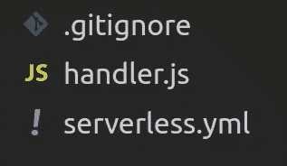
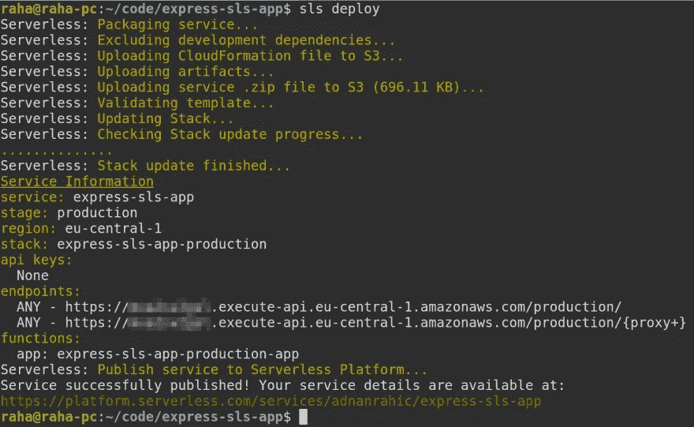
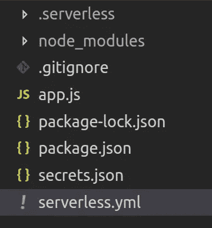
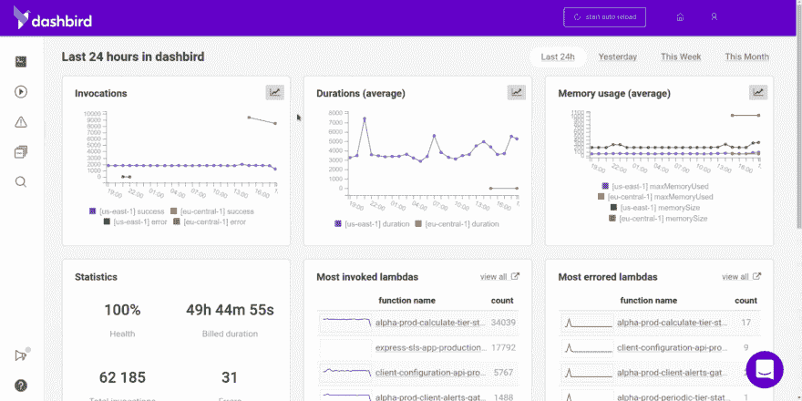

# 如何使用无服务器将 Node.js 应用程序部署到 AWS Lambda

> 原文：<https://medium.com/hackernoon/how-to-deploy-a-node-js-application-to-aws-lambda-using-serverless-ae7e7ebe0996>


作为一名开发人员是很了不起的。编写代码，解决问题，为复杂的算法想出巧妙的解决方案，是我们活着的目的。但是，篱笆这边的草并不总是那么绿。迟早你需要弄脏你的手，部署你辛辛苦苦开发的应用程序。部署并不总是容易的。坦率地说，它们可能难以置信地困难和耗时。这就是我们将在本教程中解决的问题。

## TL；速度三角形定位法(dead reckoning)

你可以从头跟着或者跳到你最感兴趣的部分，严重伤害我的感情。😅

*   [目标](#9b4b)
*   [先决条件](#12b8)
*   [什么是 AWS Lambda？](#67cb)
*   但是，它是如何工作的呢？
*   [我们将部署什么？](#7687)
*   [如何部署？](#140b)
*   [开始编码吧！](#0768)
*   [准备部署！](#27d7)
*   [部署到生产！](#b114)
*   [如何洞察你的系统？](#c4e7)

# 目标

今天你将学习如何在无服务器框架的帮助下将 Node.js 应用程序部署到 T21。

该演练还将涵盖部署应用程序生产版本的真实场景，包括[环境变量](https://serverless.com/framework/docs/providers/spotinst/guide/variables/#environment-variables)、[适当的监控](https://dashbird.io/features/aws-lambda-serverless-monitoring/)，当然还有[简单的调试](https://dashbird.io/features/lambda-error-tracking/)。哦，我多么喜欢看到漂亮的堆栈跟踪！

# 先决条件

本教程将需要你已经设置了一些简单的东西。不要担心，没什么特别的，只是一些基本的，我会把它们都链接到下面给你看，并确保你已经看到了，然后再继续。

*   [AWS 账户](https://aws.amazon.com/console/) — AWS 拥有 12 个月的免费等级，以及大量的终身免费等级，因此不必担心倾家荡产。
*   [Node.js 和 npm 已安装](https://nodejs.org/en/download/)——这里有一个快速参考来确保你已经安装了它们。
*   [安装了无服务器框架](https://hackernoon.com/a-crash-course-on-serverless-with-node-js-632b37d58b44#422a) —查看此内容作为参考，并遵循步骤 1–3。
*   [Dashbird 账户](https://dashbird.io/features) —这将为我们提供所需的概览，让我们免费了解我们的应用[发生了什么](https://dashbird.io/pricing/)。

准备好了吗？我们走吧！

# 什么是 AWS Lambda？

AWS Lambda 是一种现收现付的无服务器计算服务。什么意思？好吧，你只需要把你的源代码部署到 AWS 上，剩下的就交给他们了。太神奇了！不需要摆弄服务器、ssh 连接、Linux 或 Vim。但是，想知道更好的是什么吗？它会自动扩展，绝对不会停机。我会让它深入人心的…

AWS Lambda 的技术定义是“功能即服务”。您部署一些代码，它被调用，处理一些输入，并返回一个值。简单！

等一下。我们需要提到一个至关重要的事实。所有 lambda 函数都是无状态的，这意味着它们不能存储持久数据。而且，如果我刚才说 **Function** as a Service，我们怎么把一个完整的 Node.js 应用部署到 AWS Lambda？

# 但是，它是如何工作的呢？

仔细想想，其实也没那么复杂。单个 lambda 函数本质上只是一个微小的 Node.js 运行时环境。你可以在里面随心所欲地跑。这就是我们要做的，打包一个 Node.js 应用程序，并将其发送给 AWS Lambda。鬼鬼祟祟。😉

# 我们将部署什么？

为了使这个例子尽可能简单，我们将要部署的代码只有 7 行。但是，它可以和您在生产中使用的任何 Node.js 应用程序一样大，而且它会非常好用。耐人寻味…

# 我们如何部署它？

无服务器框架就像一匹骑着白骑士的马！等等，我可能会倒过来。🤔

无论如何，这个令人敬畏的框架使我们既可以像以前一样在本地开发我们的应用程序，也可以用一个简单的命令来部署它。嗯…多告诉我一些。

# 让我们开始编码吧！

最重要的是。打开你的终端，我们需要安装一些软件包。耶，安装东西，爱死了！😫

## 1.安装和配置无服务器框架

```
$ npm install -g serverless
```

***注意*** *:如果在 Linux 上运行该命令，则在该命令前面加上前缀* `*sudo*` *。*

```
$ sls config credentials --provider aws --key PUBLIC_KEY --secret SECRET_KEY
```

确保添加 IAM 用户的公钥和私钥，而不是我在上面指定的占位符。如果你跳过了上面的这一部分，[这里是 AWS 文档中的官方指南](https://docs.aws.amazon.com/IAM/latest/UserGuide/id_users_create.html#id_users_create_console)。

## 2.创建样板代码

让我们创建一个新的文件夹，并给它一个相当值得注意的名字。跳到您的终端，运行下面的命令。

```
$ mkdir serverless-nodejs-app && cd serverless-nodejs-app
```

太棒了，现在剩下的就是运行`create`命令来为我们生成一些启动代码。这被称为无服务器服务。

```
$ sls create -t aws-nodejs -n serverless-nodejs-app
```

在打开代码编辑器之前只需要一个步骤。

## 3.安装依赖项

就像你在上面的代码片段中看到的，我们需要先安装几个模块。幸运的是，我们只有两个，就像运行一个命令一样简单。

```
$ npm init -y 
$ npm install --save express serverless-http
```

就是这样！让我们在代码编辑器中打开它，进行一些真正的编码。

## 4.真实编码

一旦打开代码编辑器，您会看到三个文件。忽略`.gitignore`文件，让我先解释一下什么是`handler.js`，然后我将继续讨论`serverless.yml`。处理程序将保存你所有的应用程序逻辑，所有的代码。而`serverless.yml`是您将在 AWS 上创建的资源的配置文件。



继续将`handler.js`重命名为`app.js`，只是为了更简单地让我们弄清楚什么去哪里。

删除所有的起始代码，并将这段代码粘贴到`app.js`文件中。

```
// app.js const express = require('express') 
const sls = require('serverless-http') 
const app = express() 
app.get('/', async (req, res, next) => { 
  res.status(200).send('Hello World!') 
}) 
module.exports.server = sls(app)
```

七行代码😎。看起来很眼熟吧？就像你习惯的那样。就是这样。信不信由你，没别的了。让我们继续进行`serverless.yml`。

再一次，删除所有的样板代码并粘贴进来。

```
# serverless.yml service: serverless-nodejs-app provider: 
  name: aws 
  runtime: nodejs8.10 
  stage: dev 
  region: eu-central-1 
  functions: 
    app: 
      handler: app.server # reference the file and exported method
      events: # events trigger lambda functions 
        - http: # this is an API Gateway HTTP event trigger 
            path: / 
            method: ANY 
            cors: true 
        - http: # all routes get proxied to the Express router 
            path: /{proxy+} 
            method: ANY 
            cors: true
```

搞定了。剩下的就是部署它了。

# 准备部署！

切换回终端窗口。通过运行一个简单的命令，您的应用程序将被部署。

无服务器框架现在将把所有东西打包成一个漂亮的包，从`serverless.yml`创建一个 CloudFormation 文件，并把它发送到 AWS S3。一旦创建了资源并部署了代码，您将在终端中看到一个端点返回给您。



在浏览器中打开提供的 URL，您会看到`Hello World!`被发送给您。

# 部署到生产环境！

这很好，但还没有真正准备好投入生产环境。不要担心！您会惊讶地发现，让它为生产做好准备是多么简单。

## 1.添加 secrets.json 文件来保存环境变量

现在，我们只需在`secrets.json`中添加`NODE_ENV`即可。

```
{ 
  "NODE_ENV": "production" 
}
```

## 2.在 serverless.yml 中添加对 secrets.json 的引用

添加秘密文件很简单，在`serverless.yml`中引用该文件甚至更容易。

```
service: serverless-nodejs-app custom: # add these two lines 
  secrets: ${file(secrets.json)} # reference the secrets.json fileprovider: 
  name: aws 
  runtime: nodejs8.10 
  stage: production # make sure to change this to production 
  region: eu-central-1 
  environment: # add environment property 
    NODE_ENV: ${self:custom.secrets.NODE_ENV} 
    # reference the NODE_ENV from the secrets.json file   functions: 
    app: 
      handler: app.server 
      events: 
        - http: 
            path: / 
            method: ANY 
            cors: true 
        - http: 
            path: /{proxy+} 
            method: ANY 
            cors: true
```

厉害了，就是这样！从服务中删除`node_modules`和`.serverless`文件夹，并再次运行`npm install`，但是这次使用`--production`标志。

```
$ npm install --production
```

太好了！剩下的工作就是重新部署服务，一切就绪。

```
$ sls deploy
```

这就是我们的结局。



我想我们结束了？不完全是。仅仅因为你用`--production`安装了 npm 模块，就让一个应用程序在生产中运行并不能真正解决问题。为了晚上能睡个好觉，我需要多一点。这就是适当的系统洞察力和监控工具发挥作用的地方。让我展示给你看。

# 如何洞察你的系统？

所有无服务器应用程序的首要问题是它们的分布式本质。简单明了地说，要对所有正在发生的事情有一个总体的了解是不可能的。更不用说出问题的时候调试有多难了。

为了平息我的恐惧，我使用了 Dashbird。这是一个简单的监控工具，不需要我修改任何代码，绝对没有开销。所以，也不会影响性能。不错！

谢天谢地，他们有合理的文档，这使得入职过程变得轻而易举。继续按照他们的[快速入门指南](https://dashbird.io/docs/get-started/quick-start/)进行操作，[免费注册](https://dashbird.io/pricing/)。但是别忘了回到这里。😄

一旦你完成了，所有的请求将开始一个接一个的堆积，你应该会看到这样的东西。



# 包扎

这很有趣！

[Lambda](https://aws.amazon.com/lambda/) 牛逼！当与 HTTP 事件触发器如 [API 网关](https://aws.amazon.com/api-gateway/)、开发工具如[无服务器框架](https://serverless.com/)和可观察性工具如 [Dashbird](https://dashbird.io/) 相结合时，事情就变得如此简单。

我们上面编写的这个简单的 API 示例只是一个概念证明。但是你能明白这一点。它为您提供了一个起点，您可以在此基础上创建出色的生产应用程序！

如果您错过了上面的任何步骤，[这里是包含所有代码的库](https://github.com/adnanrahic/express-sls-app),或者加入我的时事通讯，保持更新！

你也可以看看我的一些关于无服务器的文章:

*   [AWS Lambda 和 Node.js 入门](https://hackernoon.com/getting-started-with-aws-lambda-and-node-js-4ce3259c6dfd)
*   [用 JSON web 令牌保护无服务器 API 的速成班](https://medium.freecodecamp.org/a-crash-course-on-securing-serverless-apis-with-json-web-tokens-ff657ab2f5a5)
*   [将 Node.js REST API 迁移到无服务器](https://hackernoon.com/migrating-your-node-js-rest-api-to-serverless-d2a170e0856c)
*   [用 Node.js 和 MongoDB 构建无服务器 REST API](https://hackernoon.com/building-a-serverless-rest-api-with-node-js-and-mongodb-2e0ed0638f47)
*   [node . js 无服务器速成班](https://hackernoon.com/a-crash-course-on-serverless-with-node-js-632b37d58b44)

希望你们喜欢读这篇文章，就像我喜欢写这篇文章一样。
*你觉得这个教程会对某个人有帮助吗？不要犹豫分享。如果你喜欢，击碎下面的***这样其他人会在媒体上看到这个。**

**原载于*[*dev . to*](https://dev.to/adnanrahic/how-to-deploy-a-nodejs-application-to-aws-lambda-using-serverless-2nc7)*。**