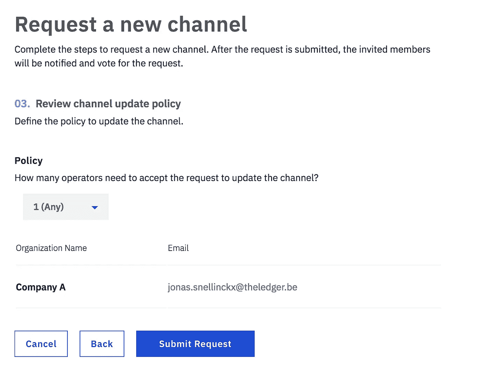
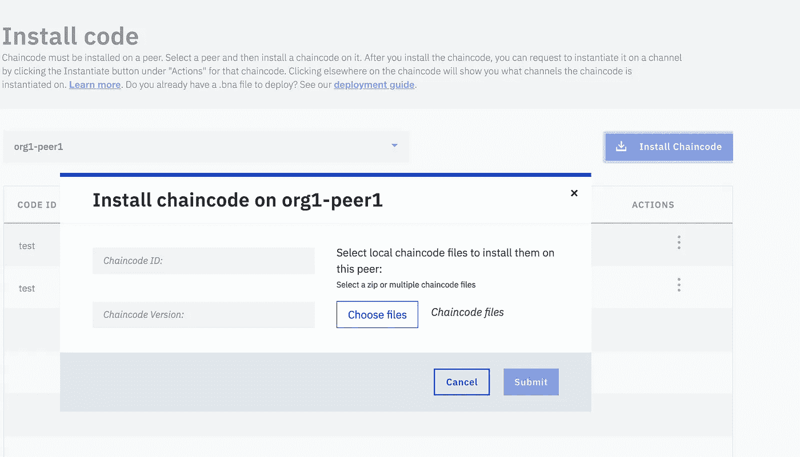

# 如何使用 IBM Cloud 部署(早期)生产就绪 Hyperledger Fabric 应用程序

> 原文：<https://medium.com/hackernoon/how-to-deploy-early-production-ready-hyperledger-fabric-applications-using-ibm-cloud-53ba838dfda8>

这篇文章将简要介绍区块链在 T2 IBM T3 云上的新计划，以及如何在其上部署 chaincode。我创建了一个账户，目前我正在运行测试版的 ***免费*** 首发计划。

# 什么是 IBM 区块链平台

对于 1.1 版本， [IBM](https://hackernoon.com/tagged/ibm) 修改了他们的[区块链](https://hackernoon.com/tagged/blockchain)IBM 云计划。这些计划目前包括****企业计划、企业加计划*** *和* ***自主管理计划*** 。完全集成的[区块链](https://hackernoon.com/tagged/blockchain)平台旨在加速多机构业务[网络](https://hackernoon.com/tagged/network)的开发、管理和运营。它允许您完全管理并轻松地将代码部署到正在运行的网络中。*

## *[首发计划](https://console.bluemix.net/docs/services/blockchain/starter_plan.html#overview)*

**

*启动计划主要用于测试和教育目的。其中包括一名使用 [SOLO consensus](http://hyperledger-fabric.readthedocs.io/en/release-1.1/ordering-service-faq.html#id1) 的订购者，该订单不用于生产。CA 也是如此。只会有一个，所以不容错。如果您不在乎，并且无论如何都想在生产中使用它，请阅读 IBM 的“[需要知道的事情](https://console.bluemix.net/docs/services/blockchain/starter_plan.html#need-to-know)”以获得为什么不这样做的详细概述。*

*特点:*

*   ****一键式网络***
    Starter Plan 为您提供了一个带有订购服务、CAs、默认渠道和两个组织(每个组织有一个对等点)的网络。IBM Blockchain Platform 处理这个网络的创建和配置(在它上线后，您将能够更新它)。*
*   ****多组织网络模拟***
    您可以使用 Starter Plan 模拟构建一个包含多个组织的网络。你不需要实际邀请其他组织加入你的网络，你可以自己充当其他组织。这种机制使您能够了解一个新组织如何加入网络，多个组织如何在网络中一起工作，等等。您可以从网络监视器在您的组织之间切换，以便从不同组织的视图查看和管理网络。*
*   ****Swagger API***
    Starter Plan 公开了几个 REST APIs，您可以从一个 Swagger 接口试用。更多信息，请参见[使用 Swagger API](https://console.bluemix.net/docs/services/blockchain/swagger_apis.html)。*
*   ****样例应用程序***
    Starter Plan 利用了 IBM Cloud 中的工具链服务，只需简单的点击就可以实现样例部署。部署并启动示例后，链码和应用程序会自动在您的区块链网络上运行。有关示例应用程序的更多信息，请参见[部署示例应用程序](https://console.bluemix.net/docs/services/blockchain/howto/prebuilt_samples.html)。*

## *[企业计划](https://console.bluemix.net/docs/services/blockchain/enterprise_plan.html#about-enterprise-plan)*

**

*企业计划提供了启动计划的所有功能。但是增加了一些额外的缺失特性，使得初始计划不值得生产。*

> *他们明确提到了早期生产负载，因为 Hyperledger Fabric 在能够处理实际生产负载之前仍需要做一些工作。*

*   ***崩溃容错** 企业计划提供一个具有 3 个节点的崩溃容错(CFT) Kafka 订购服务。它还包括每个成员两个中间 ca，授予网络成员资格。这允许其中一个 CA 或订购者在不中断网络的情况下停机。*
*   ****硬件安全模块(HSM)***
    本计划包含一个硬件安全模块(HSM)。这将按需加密、密钥管理和密钥存储作为托管服务提供。HSM 是一种物理设备，用于处理加密处理的资源密集型任务，并减少应用程序的延迟。更多信息，请参见[硬件安全模块](https://www.ibm.com/cloud/hardware-security-module)。*
*   ***安全存储** 除了核心区块链组件之外，企业会员选项还提供了具有安全数据存储和通信(TLS)以及高可用性的基础架构。虽然结构网络共享这些基础设施资源，但是为网络中的结构组件节点提供隔离，并且每个节点在保护执行环境的安全 docker 容器中执行。*

## *企业升级计划*

*该计划包括企业计划的所有功能，但该计划也运行在专用于性能和隔离的**T4 计算硬件上。***

## *自我管理计划*

*这个计划即将出台。您将能够在自己的基础设施上安装和运行软件堆栈。在 IBM 区块链计划中，您还可以轻松地连接到另一个网络。*

# *利益*

*您可以使用 [*first-network*](https://github.com/hyperledger/fabric-samples/tree/release-1.1/first-network) 脚本轻松设置您的网络，而无需使用 IBM Cloud。通过编辑 docker-compose 文件，您可以控制您的网络。您需要使用 Kubernetes 或 docker 部署这些容器，并为网络的启动和运行提供必要的配置。但这仅仅是开始，您还需要管理工具设置来保持网络健康，并在需要时升级您的代码。*

*IBM 云区块链平台正在提供 Hyperledger Fabric 即服务。去掉 devops，通过使用一个方便简单的 GUI，为您增加管理和控制 HLF 网络的能力。启动一个网络就像点击一些按钮并上传你的链接代码一样简单。*

*该平台的一个很好的补充是能够轻松地管理网络。您可以邀请其他成员参与管理网络。您可以为会员资格、渠道管理和链码制定政策。当以受控方式对网络进行更改时，策略中包含的各方必须接受。*

# *让我们部署一些代码*

*如果你还没有，你应该在 Bluemix 上创建一个账户。我们只是做一些基本的调整和上传链码。*

## *设置*

*转到 Bluemix 目录中的[区块链](https://console.bluemix.net/catalog/services/blockchain)选项卡。你很可能会受到这样的问候。在这种情况下，去[云铸造组织](https://console.bluemix.net/account/manage-orgs)创建一个新的空间。如果您想使用免费试用版，请为地区 **" *美国南部"*** 创建一个。如果您已经有了这个，只需切换到这个区域并选择一个空间。*

**

*“no space in this region” error message*

*如果您选择了正确的地区***【美国南部】*** ，您将能够选择免费的“启动会员计划”。几秒钟后，你会看到一个概览屏幕。在这里，您可以直接添加 Cloud Foundry 应用程序或添加[服务凭证](https://console.bluemix.net/docs/services/service_credentials.html#service_credentials)来使用 IAM 连接您的应用程序。我们现在跳过这一步，只需按下 **Launch。我们已经起飞了。🚀***

**

## *概观*

*您会看到网络中节点的管理面板。您可以在这里添加、停止和删除对等项。您还可以查看他们的日志。*

*创建起始计划网络后，您可以为 *org2* 再创建一个同事。您可以通过按下**添加对等点**按钮轻松旋转一个。*

*您也可以在这里找到连接配置文件。这是一个配置文件，可以加载到您的 SDK 中来设置到您的网络的连接。我在这里写了更多关于这个[的东西。](/wearetheledger/the-new-and-exciting-features-in-hyperledger-fabric-1-1-preview-4261ece3590d#ecfb)*

**

## *频道*

*已经创建了一个默认频道。因此，如果我们愿意，我们可以立即在该通道上部署我们的代码。但是我们也可以创造一个新的。*

*注意它是如何显示“*请求通道*而不是“*创建通道*”的？这是因为被邀请的成员需要为频道请求投票。*

**

## *新频道*

*给你的频道命名后，创建一个新的频道会弹出如下提示。您可以在这里为您的频道配置成员及其权限。*

**

*Set member permissions*

*根据您为您的成员设置的权限*(上)*，您可以定义您的背书策略*(下)*。背书策略是在更新频道时需要满足的条件。您可以选择*任何*或*所有*成员为某项变革投票。*

**

*Set channel policy*

*提交后，所有成员都将收到通知，并需要对此请求进行审核和投票。只有当策略得到满足时，您才能创建新的渠道。*

**

*对于每个投票请求，您将能够看到所需投票的概述。谁已经给了他们。*

**

*你创造了一个新的渠道！现在，您需要向它添加对等点，以便它做一些事情。您可以在**频道**选项卡中点击您新创建的频道。当点击一个频道时，您可以(取消)选择每个频道的不同对等点。*

**

## *渠道概述*

*每个频道，你有一个方法来监控你的网络和成员。您可以看到网络中所有块的详细信息。这也是您可以安装 chaincode 的地方。*

**

## *安装链码*

**

*安装 chaincode 就像上传文件一样简单。选择一个对等点后，您可以将 chaincode 上传到一个频道。你可以上传单独的文件，但是压缩文件也是可以的。您还可以部署。按照这些[步骤](https://console.ng.bluemix.net/docs/services/blockchain/dashboard.html#deploying-a-business-networks-on-starter-plan)从 **Hyperledger Composer** 中获取 bna 文件。*

**

## *实例化链代码*

*上传链码后，你需要实例化每个通道的链码。您还可以将参数传递给`init()`函数，就像您通常在本地启动网络一样。*

**

## *就绪，部署…集成*

**

*开始一个基本的网络就差不多了。您可以使用我在本文开头提到的 **JSON** 输出连接配置文件从您的客户端轻松地连接到它。您只需导入这个文件，大部分连接配置已经为您设置好了。*

*我强烈推荐你浏览他们的官方文档，因为这只是一个基本的介绍。这里还有更多值得探索的地方。*

**原*贴在[边缘](https://medium.com/wearetheledger)*

# *接下来读什么🤓*

*   *[**公文**](https://console.bluemix.net/docs/services/blockchain/index.html)*
*   *[**总分类帐结构资源列表**](https://github.com/wearetheledger/awesome-hyperledger-fabric)*
*   *[**什么是硬件安全模块(HSM)？**](https://www.ibm.com/cloud/hardware-security-module)*
*   *[**建立你的第一个网络样本**](https://github.com/hyperledger/fabric-samples/tree/release-1.2/first-network)*