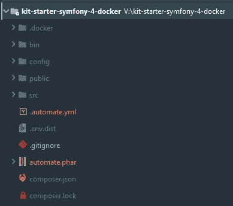
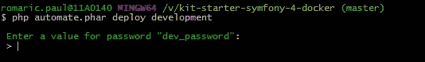
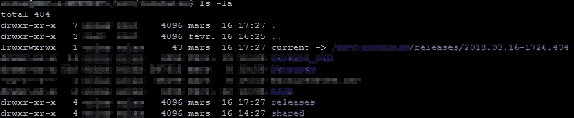
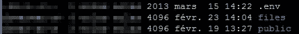
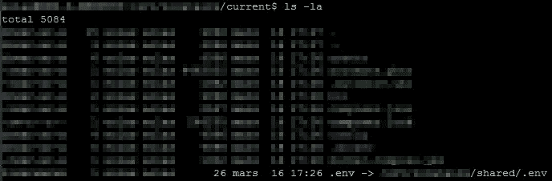

# 如何在多台服务器上部署一个项目，而不需要一行代码！

> 原文：<https://medium.com/hackernoon/how-to-deploy-on-multiple-servers-a-project-without-a-single-line-of-code-60b7cb9a65c8>

> 这个职位需要知道如何写和读。仅 yaml 语法:简单！；)

## 我们需要什么？

*   本地机器上带有 php 的终端
*   项目的 git 存储库

## 我们用什么？自动化！

这是 automate 的官方网站:[https://automate-deployer.com/](https://automate-deployer.com/)


Automate

# **该开始了！**

## 第一，`.automate.yml` 文件

首先，在项目的根目录下添加`.automate.yml`文件(不是公共目录)，写下这一行:

```
repository: [git@github.com](mailto:git@github.com):romaricp/kit-starter-symfony-4-docker.git
platforms:
    development:
        default_branch: master
        max_releases: 2
        servers:
            dddv-server:
                host: 10.128.12.12
                user: dev
                password: %dev_password%
                path: /home/wwwroot/sf4
    preprod:
        default_branch: preprod
        max_releases: 2
        servers:
            pddv-server:
                host: 10.128.12.13
                user: dev
                password: %preprod_password%
                path: /home/wwwroot/sf4
shared_files:
    - .env
shared_folders:
    - public/upload
on_deploy:
    - "composer install"
    - "setfacl -R -m u:www-data:rwX -m u:`whoami`:rwX var"
    - "setfacl -dR -m u:www-data:rwX -m u:`whoami`:rwX var"
    - "php bin/console c:c --env=prod --no-debug"
post_deploy:
    - "php bin/console doctrine:schema:update --force"
    - "php bin/console cache:war --no-debug"
```

好的，那么我们在这里写的是什么？只是设置，不是编码；)

```
repository: [git@github.com](mailto:git@github.com):romaricp/kit-starter-symfony-4-docker.git
```

在这里，我们只是写了你的项目的地址，例如这里有一个 Symfony4 的示例项目。

```
platforms:
    development:
        default_branch: master
        max_releases: 2
        servers:
            dddv-server:
                host: 10.128.12.12
                user: dev
                password: %dev_password%
                path: /home/wwwroot/sf4
    preprod:
        default_branch: preprod
        max_releases: 2
        servers:
            pddv-server:
                host: 10.128.12.13
                user: dev
                password: %preprod_password%
                path: /home/wwwroot/sf4
```

在这里，我们定义了部署项目所需的所有服务器。如你所见，定义了两个服务器:`development` 和`preproduction` 一个。

对于每个服务器，我们通过`default_branch`定义使用哪个 git 分支；因此，对于`development`服务器，我想使用`master`分支，对于`preprod`服务器，我想使用`preprod`分支。

我们必须定义我们希望在每台服务器上存储多少最大版本。2 看起来不错，因为如果你在一个新的部署后遇到一些 bug，你可以用一个命令回滚，我们稍后会看到。

```
servers:
    pddv-server:
        host: 10.128.12.13
        user: dev
        password: %preprod_password%
        path: /home/wwwroot/sf4
```

这里，我们按平台定义了所有服务器，在这种情况下，我们只有一个服务器/平台，但您可以轻松地添加 2 或 3 个服务器来部署您的项目。

对于每台服务器，您必须定义:

*   主持
*   用户(具有 ssh 访问权限)
*   远程服务器上项目的路径
*   对于密码，在这个文件中写这个不是一个好的做法，所以这就是为什么我们在每一边都使用`%`，因为当你开始部署时，终端会要求你输入正确的密码。

```
shared_files:
    - .env
```

在这里，我们定义了所有版本共享的所有文件，在这种情况下，这个`environment`文件是用于 Symfony 的，它包含了所有必要的环境变量。因此，无论哪个版本是当前版本，我的所有版本都只有一个配置文件！

```
shared_folders:
    - public/upload
```

这里，文件夹也是如此。我们定义了所有版本需要的所有文件夹。最好的例子就是上传目录。

```
on_deploy:
    - "composer install"
    - "php bin/console c:c --env=prod --no-debug"
post_deploy:
    - "php bin/console doctrine:schema:update --force"
    - "php bin/console cache:war --no-debug"
```

这里是您的项目需要完美部署的命令行列表。automate 有 3 个可用事件:`pre_deploy`、`on_deploy`和`post_deploy`在这里都有很好的解释:

【https://automate-deployer.com/】T4doc

*现在你的. automate.yml 文件已经准备好了！*

## 二、安装`automate.phar`

转到项目的根路径

```
cd /your/path/project
```

您可以使用以下命令下载 Automate 的最新版本:

```
curl -LSs https://automate-deployer.com/installer.php | php
```

现在，您应该会看到这样的内容:



Sample with Symfony4 project

# 是时候部署了！

转到项目的根路径并启动 automate！

```
cd /your/path/project
php automate.phar deploy preprod
```



start the deployment

进入`dev_password`欣赏表演吧！；)


您应该得到这样的结果:


End point of the deployment

# 我们的服务器怎么了？

如果你去我们的服务器，我们会得到这样的结果:



our development server remote

*   当前目录是指向最新版本的符号链接
*   releases 目录包含所有最新版本(取决于您在. automate.yml 文件中设置的 max_releases 号)
*   共享目录包含每个版本之间共享的所有文件夹

如果我们转到**共享目录**，您可以看到:



the shared directory

其中包含“真正的”文件夹和文件。另一方面，如果我们转到当前目录，您可以看到:



`.env`文件是到共享目录中真实文件`.env`的符号链接。

如您所见，我们部署时没有一行代码！Automate 非常容易使用和设置。Automate 默认有很多插件，你可以在官方文档中看到这些:

[https://automate-deployer.com/](https://automate-deployer.com/)[doc](https://automatephp.github.io/doc/#pre_deploy)

最后，我们现在可以想象使用 automate 和 gitlab 对每个合并请求进行自动部署！；)

感谢 solène Louvrier&[Nicolas Legendre](https://medium.com/u/11e4ce38b7c7?source=post_page-----60b7cb9a65c8--------------------------------)的重读。:)