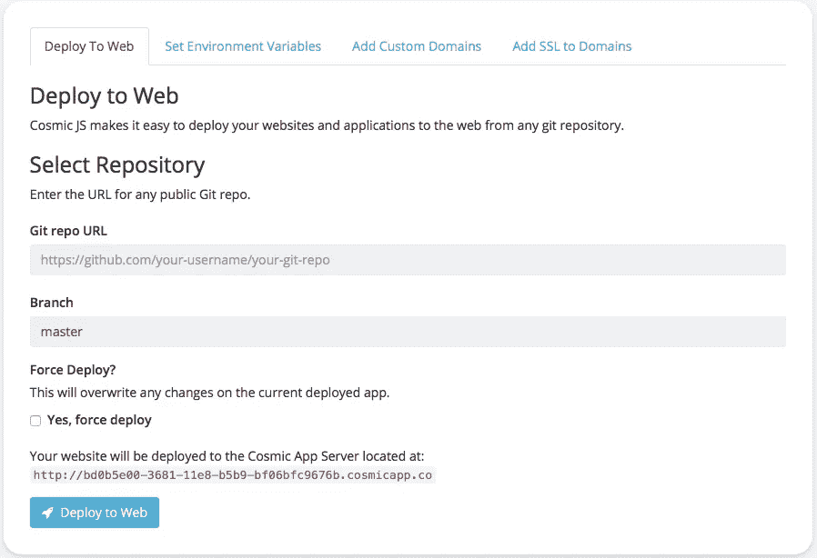

# 如何使用 Cosmic JS 部署您的代码库🚀

> 原文：<https://medium.com/hackernoon/how-to-deploy-your-codebase-using-cosmic-js-b4048d602a92>

Cosmic JS 让您轻松地将网站和应用程序部署到网络上。您可以将任何 git 存储库中的应用程序部署到任何 Bucket 中的 Cosmic 应用服务器。Cosmic JS 使用 Dokku(Docker+Heroku-like deployment)将你的应用从任何 [GitHub](https://cosmicjs.com) 、 [BitBucket](https://bitbucket.org) 或任何其他公共 repo 部署到自己的子域。

有了 [Cosmic JS](https://cosmicjs.com) 缓解您对已安装 CMS 和服务器的需求，您的应用程序堆栈可以归结为以下几项:

1. [GitHub 回购](https://github.com/cosmicjs)
2。[宇宙 JS CMS API](https://cosmicjs.com/cms-api)3。[宇宙 JS 应用服务器](https://cosmicjs.com/apps)

## 如何使用 Cosmic JS 部署您的代码库🚀

只要您的应用程序遵循 [Heroku 部署指南](https://devcenter.heroku.com/)，部署就会成功。如果您已经将 GitHub 帐户连接到 Cosmic JS，您也可以部署您的私人 GitHub repos。

1.转到您的存储桶>存储桶设置>部署 Web 应用程序
2。输入您正在部署的公共 Git repo 的 URL
3。从 Cosmic JS 仪表板部署您的代码库并管理您的应用程序内容

**以下** [**插件**](https://cosmicjs.com/pricing) **也可搭配宇宙 JS 部署:**

[自定义域](https://cosmicjs.com):将您的自定义域指向您的 Cosmic 应用服务器实例。
[一键 SSL](https://cosmicjs.com) :用 SSL 保护你的 app。SSL 证书会自动更新。

我希望本教程对你有所帮助。如果您对 [Cosmic JS](https://cosmicjs.com) 系统中的内容编辑器功能有任何问题或意见，我很乐意倾听。你可以参考我的 [Cosmic JS 个人资料](https://cosmicjs.com/carsongibbons)来获取更多关于如何直观地导航 Cosmic JS 仪表盘的内容。