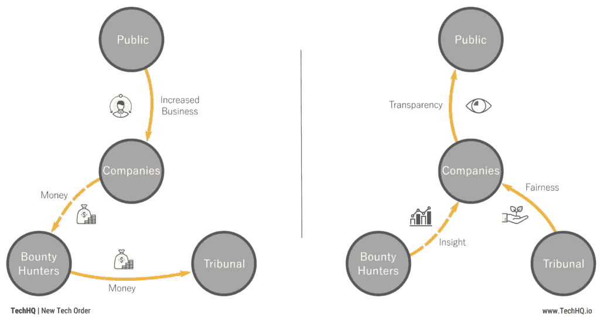
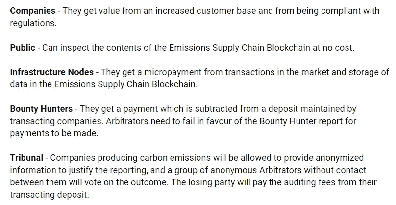
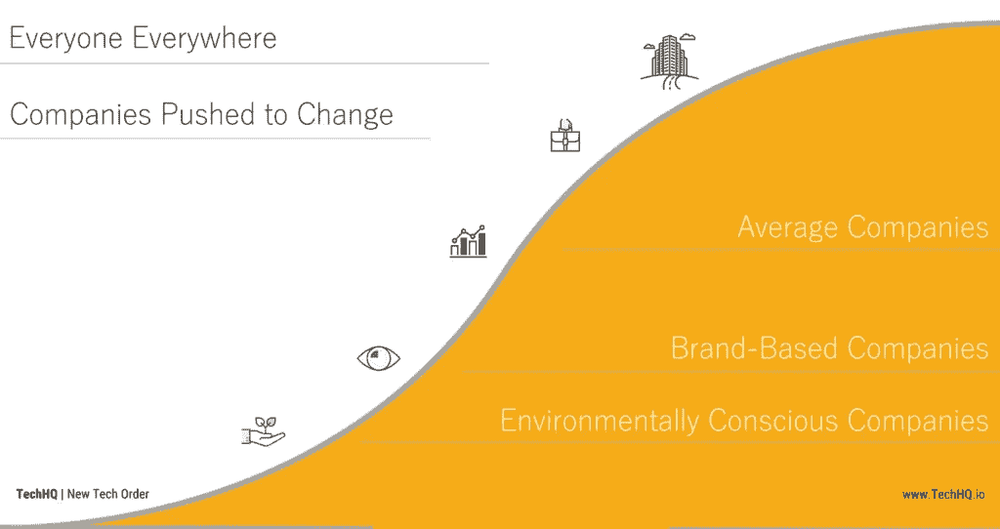
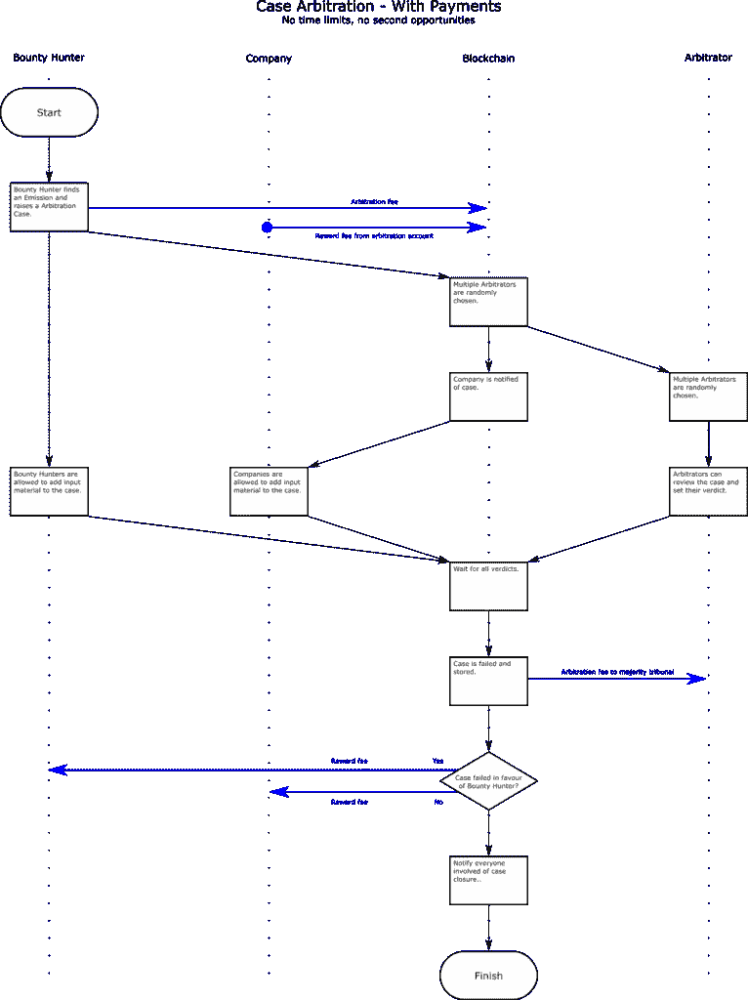
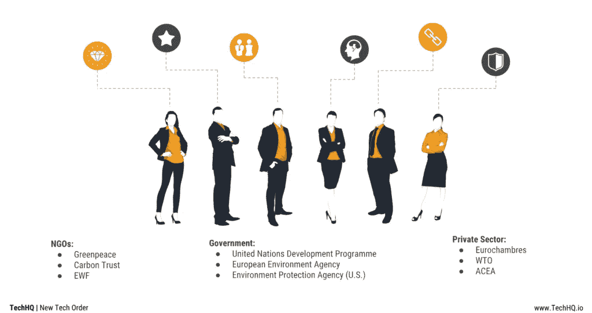

# 设计代币经济——利益相关者和市场

> 原文：<https://medium.com/hackernoon/how-to-design-a-cryptocurrency-in-six-steps-part-2-84717cad50d7>

## 如何吸引并留住代币经济的参与者？

## 要设计一个成功的代币经济，你需要知道谁会参与其中，他们的努力会得到什么，如何吸引他们，如何留住他们。在这篇文章中，我们分享我们的经验教训。

> 每个成功的人都知道，他或她的成就依赖于一群人的共同努力。
> 
> ——保罗·瑞安，美国政治家

# 介绍

在本系列的前一部分中，我们介绍了代币经济创建框架的背景和目的，以及其第一步，即定义代币经济的目标。

在第二部分中，我们将介绍框架的下两个步骤，即利益相关者映射和市场设计。

虽然经济目标指导着代币经济的设计，但接下来的两步将定义谁是我们经济的参与者，他们如何通过成为我们经济的一部分而获得价值，我们如何吸引他们进入我们的经济，以及我们如何让他们长期成为我们经济的积极成员。

# 利益相关者映射

一个经济体是一个个体之间进行交易的网络，期望从这些交易中获得价值。一个经济体与其参与者之间存在着共生关系，在这些个体从参与经济体中受益的同时，他们也增加了经济体的价值。

*Figure 1: Stakeholder Map and Value Transfers from* [*Strea*](http://www.techhq.io/strea)

在设计你的经济时，你必须考虑你的经济根据经济目标运行需要什么，哪些利益相关者可以提供资产或服务，以及这些利益相关者作为交换可以得到什么，足以吸引他们参与你的经济。在设计斯托蕾雅的过程中，很明显，经济的价值在于来自企业、由赏金猎人分析并由法庭管理的准确而相关的排放数据。

参与任何经济都至少有一个机会成本，即使你只是要求利益相关者考虑交易，你的经济已经在使用他们的时间，这是一种非常宝贵和有限的资产。当利益相关者考虑交易时，你的经济必须至少向他们回报与他们的注意力相关的机会成本，否则你的经济有被视为浪费时间的风险。

有几种方法来描述你的利益相关者，如上图所示的利益相关者地图是一种可视化工具，在传达你的经济设计时非常有用。然而，在经济设计的早期阶段，我的偏好是列出一个简单的利益相关者类型列表，以及每个人期望从经济中获得的价值。

*Figure 2: First Draft of Stakeholders and their Value Transfers from* [*Strea*](http://www.techhq.io/strea)

通常这种简单的练习就足以发现一个经济体的弱点。如果一个利益相关者在提议的经济中没有获得任何价值，你已经知道有一个缺失的部分。在斯托蕾雅，公司获取的价值乍一看很难预测和量化，而它们的风险则更容易表述。在设计的这一点上，你已经可以看到，吸引公司参与上述经济将是一个主要的挑战，你应该为他们设计强有力的激励措施。

这是一个关于分散令牌经济的框架，维护网络基础设施的个人将成为利益相关者地图中的常客。比特币成功的原因之一是，基础设施利益相关者可以从经济中获得明显的价值。比特币矿工因处理交易而获得比特币奖励，这是因为比特币价格上涨，越来越多的矿工进入其经济。基础设施激励模式众所周知，这意味着营销材料中往往会忽略这一点，而将其留在更具技术性的文档中。

如果你在设计你的经济时走到这一步，你现在就会知道谁对你的经济是重要的，为什么他们会考虑成为它的一部分。如果你和我一样，那会很满足。

# 市场设计

一旦你知道你的经济的目的是什么，谁是参与其中的个体，以及这些个体参与的原因，你就需要为他们提供一个交易的环境。

传统经济学中有一个[研究领域](http://marketdesigner.blogspot.com/)专门研究作为个人交易环境的市场，这种知识很容易转化为[代币经济设计的实用建议](https://lisajytan.com/articles/pillar-1-market-design)。

在设计市场时，有三个品质你应该特别注意，在学术文献中被称为厚度、减少拥挤和安全性。我个人认为，这些学术术语并不能很好地转化为软件开发或商业受众，我更愿意称它们为规模、效率和风险管理。

# 比例/厚度

一个经济体的内在价值与其促成的潜在交易数量直接相关。一个经济体中的参与者越多，参与者的类型越多，产品越多，产品的类型越多，交易方式越多，所有这些选项都是你的经济在实际交易资产之上的价值。

有可能估计经济中每一个额外用户或产品的价值，以及其他用户从参与中可获得的价值。在一类利益相关者中，并不是所有人都需要相同的网络价值来开始经济交易，从这一统计分布中可以得出临界质量的概念。

当你的经济具有较低的内在价值时，它只会吸引进入门槛非常低的参与者，但随着经济的增长，它将被更多的潜在参与者所知，同时这将吸引更多的潜在参与者进行交易，通常采用率会快速变化。采用率开始快速变化的这一点被称为临界质量，它往往是经济发展中的一个重要里程碑。

*Figure 3: Planning to achieve a Critical Mass of companies in the* [*Strea*](http://www.teachhq.io/strea) *economy*

这种对一定数量的用户和产品的关键需求，将为经济带来足够的价值，以达到临界质量，这就是为什么营销策略为早期采用者提供优势的原因。通过提供额外的价值，如降低费用或免费功能，经济体正试图降低进入成本，并通过新参与者实现的潜在交易增加自身价值。

然而，这些增长战略是有成本的，而且不太可能长期持续。如果你在分析或设计一个需要他们达到临界规模的经济，你需要考虑投资者会给用户多少价值，以及这是否真的会让经济走得足够远。

# 效率/减少拥堵

如果说达到一定的经济价值吸引新的参与者是令牌的一个方面，那么另一个方面就是当经济达到一定的规模时，允许他们高效地进行交易。无论他们是否准确定价，大多数用户对他们的时间价值有一种固有的感觉，在你的经济中用于交易的时间从他们从交易本身获得的价值中扣除。

为效率设计代币经济有两个方面。解决方案架构和可用性设计将对减少拥塞有很大的影响，但是超出了本文的范围。然而，在这个框架内，我们必须讨论社区动态及其对效率的影响。

经济中的参与者将为其创建内容，如交易、报价和通信。这种创造行为应该通过激励来引导，以最大限度地提高内容对其他经济参与者的相关性，并阻止那些浪费其他参与者时间而又不能提供足够价值的无意义交易或讨论。

*Figure 4: Curating content in the* [*Strea*](http://www.techhq.io/strea) *economy*

现有解决方案的一个例子是社交网络参与者的节制，如 [Reddit](http://www.reddit.com/) 。一些用户被激励成为版主以换取地位，这些版主管理张贴的内容以确保较少参与的用户快速访问与他们相关的内容并留在网络中。

另一个来自[斯托蕾雅](http://www.techhq.io/strea)的例子是一个分散的法庭的存在，它将管理赏金猎人创造的内容。在这种经济中，任何公众成员都可以报告公司碳排放报告的缺陷，但独立和分散的法庭受到激励，以确保只有公平的报告才能进入网络。

# 风险管理/安全

设计市场的最终考虑应该是用户的安全。众所周知，人类不擅长处理概率，尤其是当他们无法控制局面的时候。交易中存在许多风险，这些风险可能会给参与者带来意想不到的价值损失，因此应格外小心，不仅要防范这些风险，还要明确表示正在防范这些风险。

一个显而易见的风险是盗窃，通常是由于不交付货物或服务或不付款。代币经济很容易实现限制这种风险的托管支付，仅仅能够建立一个更安全的市场就足以让[一些](https://bitnautic.io/) [提议的](http://www.vakt.io/) [经济](http://www.techhq.io/adrienne)拥有比当前替代方案更高的内在价值。

加密货币叙事的另一个核心风险是货币波动，这导致经济参与者担心他们的资产因超出他们控制的原因而贬值。限制[和所有其他](http://www.tether.to/)[稳定条款](https://hackernoon.com/2018-the-year-of-the-stablecoin-6a6ca5d3637b)的主要原因是提供更安全的市场，没有货币波动风险。

风险清单继续列出金融界考虑的一长串风险，如市场风险、信用风险、交易对手风险、结算风险等等。所有这些因素都可能将你的经济参与者推向更安全的经济体，或者干脆停止交易。

最后，还有一些风险虽然不太容易量化，但也很重要，可以归类为声誉风险。在某些叙述中，所有经济参与者将被归为一类，这可能对其中一些人不利。如果你的经济[可能被用于非法或律师助理](http://www.getmonero.org/)的目的，一些潜在的参与者会因为参与同样的经济而失去品牌价值。

*Figure 5: Ensuring Reputational Safety in the* [*Strea*](http://www.techhq.io/strea) *economy*

将参与者吸引到你的经济中来，并为他们提供一个高效的市场，这是一项成本高昂的努力，你应该小心不要因为经常被误判的风险而失去他们。

# 结论

在我们的代币经济设计系列的第二部分中，我们展示了一些建立个体经济的指导方针，逐步打破了解你的个体的过程，为他们设计一个市场，吸引他们进入市场以便他们交易，并减少导致他们离开的一些原因。

在本系列的下一部分中，我们将介绍保持经济长期繁荣的概念，通过激励参与者为经济的更大利益而行动，通过操纵经济的宏观经济质量，最后通过提供一个政治框架来解释我们对周围世界的不完善知识。

感谢[丽莎·谭](https://www.linkedin.com/in/lisajytan)、[伊登·达利瓦](https://ca.linkedin.com/in/edendhaliwal)和[泽内普·古尔古奇医生](https://uk.linkedin.com/in/zeynep-gurguc-03634a5)。这篇文章中的大部分内容都来源于他们的工作。

*原载于 2018 年 12 月 5 日*[*www . techhq . io*](https://www.techhq.io/7095/how-to-design-a-cryptocurrency-in-six-steps-part-1-2/)*。*