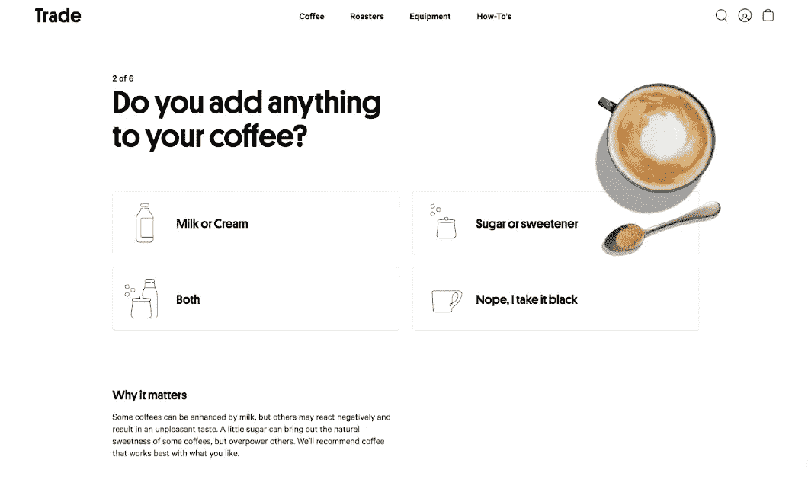

# 如何用 10 个步骤设计神奇的入职体验

> 原文：<https://medium.com/hackernoon/how-to-design-a-magical-onboarding-experience-in-10-steps-b1c9ef7303fe>

Jose Llamas via Unsplash

## 提高完成率和转换率的分步指南

入职流程是您的客户获取漏斗中的一个步骤，在这里，低水平的努力和简单的优化可以带来巨大的回报。仅仅几个百分点的提高就能推动整个企业的复合回报。但是，设计有效的入职流程既是科学，也是艺术。

在花费数年时间磨砺这一成功公司的关键流程后，如 [Betterment](http://betterment.com/) 和 [Slice](https://slicelife.com/) ， [Nick Gavronsky](https://twitter.com/nmgav) ，现在是 [Trade Coffee](https://www.tradecoffeeco.com/) 的联合创始人和产品负责人，开发了一个入职流程，导致了惊人的 90%的完成率和 12%的转换率。

贸易使得从全国 50 多家最好的烘焙商那里发现和购买最新鲜的咖啡变得很容易。交易中的每袋咖啡都是现烤的，直接送货上门。

Gavronsky 最近在纽约 FirstMark 的每月[设计驱动活动](http://designdrivennyc.com/)上发表讲话，分享了开发人员和设计师应该采取的 10 个关键步骤，以优化他们的入职流程。

# **1。抛弃假设**

创建一个好的入职流程的第一步是抛弃你对什么是好的或坏的体验的任何假设。放下你对这个行业或你的客户群的任何假设，从头开始。然后花时间研究市场两边的产品和客户。

Nick Gavronsky speaks at FirstMark’s Design Driven NYC at BuzzFeed in June 2018

与您的客户和合作伙伴会面，了解他们遇到了什么问题，并确定您如何提供解决方案。他们的痛点是什么？他们在市场上寻找什么？您能找出他们当前流程中可能还不知道的问题吗？深入了解这个世界，了解你的客户的心理，以及你将要处理的产品的细节。

“当我们开始贸易时，我们对咖啡一无所知，”Gavronsky 解释说。“但这对我们来说是一个巨大的优势。这迫使我们回到客户开发的基础，并让自己沉浸其中。”

> 对咖啡一无所知实际上对我们来说是一个巨大的优势。这迫使我们回到客户开发的基础，并让自己沉浸其中。

# 2.**找到你的支点**

一旦你收集了足够的信息，确定你的产品与市场上现有产品的区别。什么卖点会让消费者改变行为，购买你的产品或服务？对于贸易来说，这是品味。

“在与喝咖啡的人交谈时，味道一直是讨论中的一个问题，”Gavronsky 说。“在烘焙者方面，有人受雇品尝咖啡，并根据科学标准提供品尝记录。但消费者并不总是能够解读品尝笔记。在咖啡中品尝金葡萄干和接骨木花是困难的。因此，大多数消费者购买品牌是基于包装、品牌名称和烘烤程度。纠正这种脱节成为我们的重点。”

# **3。上钩**

对你的潜在客户群和你试图解决的问题有了充分的了解后，是时候开始设计入职流程了。这要从吸引用户开始这个过程开始。有必要在网站上使用语言、设计和定位，让入职流程感觉像是产品的一个组成部分。当你迭代的时候，不断琢磨什么能吸引用户的注意力，让他们点击按钮。

A well-designed landing page coupled with a clear CTA entices users to start the process. (Credit: Trade Coffee)

# **4。商品 It**

在语言、品牌和设计最终确定后，寻找将入职流程融入网站的地方。它应该是你体验的一部分，理想情况下，它应该是你体验中的另一个产品。找到合适的地方把它放到你的网站上，给用户一个迈出第一步的理由。

# **5。提供背景**

尽管你已经成功应对了让用户开始入职流程的挑战，但说服他们继续下去可能更具挑战性。为了让他们参与进来，提供他们为什么需要回答问题的背景是很重要的。向他们展示填写调查的价值。毫无疑问，你已经花了几个小时来确定哪些问题最适合你的算法。不要害怕与消费者分享这些信息。

Gavronsky 说:“在入职调查的每个问题之后，我们都会插入文字来解释为什么这些信息很重要。“我们发现，对于有兴趣了解我们为什么要问每个问题的客户来说，这非常有帮助。”

Remember to reiterate the ‘why’ to the customer throughout the onboarding process to maintain engagement. (Credit: Trade Coffee)

# **6。确定合适的长度**

最初你可能会认为问题越少越好，但事实并非总是如此。你希望用户尽快通过漏斗。但这需要与让用户觉得你的推荐值得信任相平衡。信息太少，他们会认为你没有提供准确或个性化的建议。

> 你希望用户尽快通过漏斗。但这需要与让用户觉得你的推荐值得信任相平衡。

确定问题数量的最好方法是用户测试。每个用户群和产品都需要在入职过程中建立不同程度的信任。

“从技术上讲，我们可以推荐有两到三个问题答案的咖啡，”Gavronsky 解释道。“但在用户测试中，我们发现人们不信任我们的推荐。我们写了 150 个问题，测试了不同的组合和链接，发现 6 是正确的数字。它提供了适量的信息，让用户信任我们，也让咖啡界尊重我们的所作所为。”

# 7 .**。交付具有视点的收益**

如果你要求用户回答一些问题，放弃一些信息，花时间完成入职流程，你需要有所回报。在用户经历这个过程时制造兴奋感，让他们参与进来。清楚地表明他们正在做的工作会带来一些东西——一些值得等待的东西。

当调查结束，顾客得到了一份推荐的奖励——比如他们的完美咖啡——不要忽略内容。他们已经放弃了他们的时间，所以让他们觉得值得。Trade 提供关于为什么向个人推荐咖啡的内容，回放来自用户的关于为什么获胜的咖啡是好的匹配的输入。

Rewarding the customer with a meaningful (and personalized) result makes all the difference. (Credit: Trade Coffee)

# **8。提供选择**

向用户提供推荐是很重要的，尤其是在食品和饮料行业。(金融服务和 B2B 产品平台可能更简单一些。)让你的特色产品成为主角，但提供其他相关选项供用户探索，给他们掌控一切的感觉。Gavronsky 指出，提供期权有助于交易转化。

# **9。打造模块化产品**

你的入职体验不应该作为一种孤立的体验而存在。它应该与整个网站体验无缝集成，并且应该便于用户四处移动和探索您的产品。这也是一个内部和合作伙伴广告的好地方，所以一定要与客户获取和营销分享空间。

# 10。捕捉和培育销售线索

虽然显而易见，但这最后一步值得一提:利用你的入职经验来捕捉、培养和转化潜在客户。不是每个人都会转变，但这些都是高意向客户或潜在客户，他们花时间经历了你的入职体验。如果客户已经完成了入职体验，这就给了你的品牌一个很好的理由来传达个性化的相关信息。因此，获得他们的信息并开展一场真正伟大的培育运动是非常重要的。

如果你想了解更多关于设计神奇入职体验的 10 个步骤，你可以点击这里观看 Gavronsky 与设计驱动的纽约的完整对话。

[*FirstMark*](http://firstmarkcap.com/) *每年举办 100 多场活动，为创业者和初创公司提供成长所需的工具。RSVP 为我们的* [*下一个公共事件*](http://firstmarkcap.com/driven/design-driven/) *。*