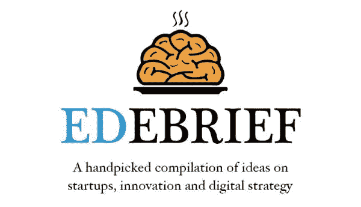
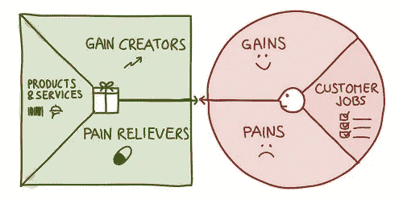

# 如何设计解决真实客户问题的产品

> 原文：<https://medium.com/hackernoon/how-to-design-products-that-solve-real-customer-problems-509ff5d8fb21>

History of the iPhone: 2007–2015

制造产品很难。但是创造伟大的产品更加困难。

创造伟大的产品需要技巧、智慧、奉献和纪律。这需要做出大胆的选择。通过创新来影响产品会让我们冒很大的风险。在交付速度和执行质量之间取得平衡总是很棘手。

理解*构建什么*和*如何构建*可以决定是推出可扩展的可爱产品还是未能解决客户的问题。

这绝不是一个详尽的列表，但它指出了更好地了解客户问题、提出建议的解决方案的方法，以及为什么这些都很重要。

如果你不想错过即将推出的版本， [**在这里订阅**](http://eepurl.com/dgCjPT) 。

# 创业和产品管理🚀

Source: Laurence McCahill

*   *5 分钟阅读* —作为产品经理，你应该[管理问题，而不仅仅是问题的解决方案](http://www.enricdurany.com/agile-startup-entrepreneur/what-is-product-management/)。这是因为对解决方案的理解程度取决于你对所解决问题的理解程度。然而，大多数团队通过内部通信快速完成问题定义部分
*   *3 分钟阅读* —客户问题陈述是对需要由问题解决团队解决的问题的简短描述，应在尝试解决问题之前创建[ [通过 Ivan Schneiders](https://productcoalition.com/how-to-write-a-good-customer-problem-statement-a815f80189ba)
*   *12 分钟阅读*——当你试图打造一个产品时，你不可能拥有一切。这就是为什么人们建造[最小可行产品](http://www.enricdurany.com/work/stop-thinking-of-minimum-viable-products/) (MVP)。MVP 最大化验证学习，但这样做的代价是降低质量。另一方面，最少的可爱产品，用最少的努力最大化早期部落成员的爱
*   *5 分钟阅读* —为影响力设计产品不可避免地需要应对风险。在押注高风险产品时，将团队的注意力集中在学习上，而不是成败上[[via Ameet Rana dive](/@ameet/five-ways-to-mitigate-product-risks-e414c6b4497f)
*   *10 分钟阅读* —学习就像什么都不做，很难知道自己什么时候完成了。要成为一台学习机器，我们必须让自己超载信息。心智模型是可以简化学习的框架，帮助我们理解[via Hiten Shah](https://hackernoon.com/5-mental-models-that-help-product-managers-acquire-and-retain-users-ef00e6f3d8a6)

# 数字战略和趋势🔀

Source: McKinsey Insights

*   *10 分钟阅读* —客户的选择从未如此之多，因此出色的设计对于卓越的产品和服务至关重要，对于建立持久的客户关系也是如此[ [通过麦肯锡洞察](https://www.mckinsey.com/industries/consumer-packaged-goods/our-insights/design-for-value-and-growth-in-a-new-world) ]
*   *15 分钟阅读* — *概念冲刺*是一系列活动，这些活动将一个想法转化为更有可能在市场上出现并取得成功的东西[通过麦肯锡洞察](https://www.mckinsey.com/business-functions/digital-mckinsey/our-insights/how-concept-sprints-can-improve-customer-experience-innovation)

# 必听的播客🎧

*   *25 分钟听*——道德和意义如何融入企业家精神？只关注技术问题有时会忽略人性，而这正是我们最初开发新产品的原因[ [via a16z Podcast](https://castbox.fm/episode/a16z-Podcast%3A-On-Morals-and-Meaning-in-Products%2C-Business%2C-and-Life-id1505-id70268039)

# 有趣的阅读🤓

*   10 分钟阅读——几乎所有伟大的想法都遵循相似的创造过程。虽然不容易，但有创造力是可以学习的。遵循一个过程有助于揭开创造过程的神秘面纱，并通向更具创新性的思维之路

# 出发前，请考虑:

*   *推荐*或者*分享*这个如果你觉得有用。它给了我🔋写作时要知道人们会从中发现价值
*   如果你不想错过即将到来的版本
    [请在此订阅](http://eepurl.com/dgCjPT)

文章 [**如何设计解决真实客户问题的产品**](http://www.enricdurany.com/productivity-better-every-day/how-to-design-products-solve-problems/) 最早出现在 [**Enric Durany**](http://www.enricdurany.com/) 。