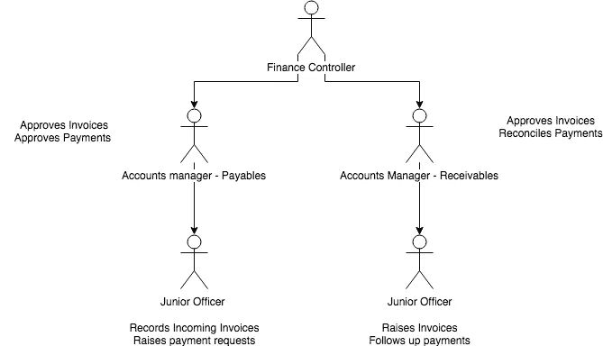
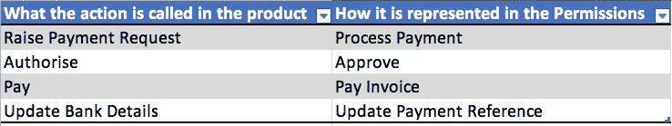

# 如何在产品中设计角色和访问控制

> 原文：<https://medium.com/hackernoon/how-to-design-roles-and-access-controls-in-your-product-7dfe65518def>

Photo by [Henry Hustava](https://unsplash.com/photos/j_Ch0mwBNds?utm_source=unsplash&utm_medium=referral&utm_content=creditCopyText) on [Unsplash](https://unsplash.com/?utm_source=unsplash&utm_medium=referral&utm_content=creditCopyText)

你能想到的任何企业产品都有角色和访问控制，从电子邮件到 CRM 到财务软件。让我们首先了解什么是角色和访问控制，以及我们为什么需要它们。

我们举个例子——一个记账软件。会计[部门](https://hackernoon.com/tagged/deparment)做以下事情:
-输入发票
-批准较低价值的费用
-更新税率
-批准较高价值的流出

不同的人可能会执行这些操作。他们每个人都有自己的头衔，如初级会计官、会计经理、财务总监等。他们每个人都有一套基于专业知识的特权，允许他们执行不同风险程度的操作。

Department Representation

应付帐款的客户经理应该只能访问应付帐款，并且可以批准付款。应收帐款的帐户经理可以批准收到的发票并调节收到的付款。

有几个方面需要了解:

**工作功能:**这定义了参与者在系统中应该做什么。这是包含他/她的工作的一系列行动。

**动作:**这些是参与者必须执行的单个活动。在上面的例子中，它是记录发票、提出付款请求、提出发票、批准发票等。

在产品的世界里，工作职能对应着角色。每个角色都有一组通过控件分配的关联操作。

角色是管理权限的好方法。向用户分配角色比向每个人分配权限更容易。当某人开始履行新的职责或调动部门时，很容易管理。如果某个工作职能有新的预期行动，可以更新角色以反映这一点。另一种方法是更新与操作相关联的每个用户。让我们谈谈在建立角色和权限时要考虑的一些原则和事情。

## 角色应该与用户无关

角色的创建和管理应该独立于用户。换句话说，角色的创建或修改应该是独立于将角色与用户相关联的活动。

## 角色可以有重叠的权限

理想情况下，我应该能够在系统中创建任意数量的角色。每个角色都可以有自己的一组关联权限。例如，角色 1 可以允许批准付款，而角色 2 可以禁止批准付款。如果角色 1 和角色 2 都与同一个用户相关联，则系统需要一个冲突解决机制。这可能是一个悲观的解决方案，不允许总是超过允许，或者相反。我确信你的选择会带来审计影响，所以请咨询专业人士，我不是 CISSO。权限应该明确而细致

在会计系统的例子中，让我们假设在系统中有一个可以进行支付的屏幕。工作流程如下:

*   选择一张发票>点击"提高付款" >确认详细信息
*   付款申请已保存>有人批准
*   一旦批准>点击处理付款>你选择一个帐户并确认
*   稍后，有人将银行的付款参考添加到跟踪的交易中。

从上面的过程中可以看出，完成一笔交易(付款)需要几个具体的操作。一个致命的设计错误是创建一个类似“支付处理”的权限。这意味着本质上 5 个动作被合并成一个动作，而没有考虑到这些动作在现实世界中可能由不同的人来完成。我经历过这个错误造成的恐惧。这源于这样一个事实，人们制造的产品与用户如何使用产品没有联系。换句话说，缺乏用户研究。如果设计得不好，重写访问控制就像在代码的心脏插一把刀。

## 权限应该容易理解

另一个基本规则是设计权限，使任何用户都可以理解它。确保这一点的一个好方法是将权限名称与屏幕和操作名称相匹配。请参见下面的示例，产品和权限列表中的操作被分配了不同的名称。

如果管理员必须将权限分配给某个角色，他/她如何知道这些操作对应的是什么？如果操作在屏幕上被称为授权，在访问控制列表中也将其称为授权。这些错误会让你的支持电话整天响个不停。第三方顾问实施你的产品，因为客户自己做不到。这增加了实施成本，降低了产品采用率。

## 数据级权限

严格地说，这不属于访问控制的范围，但是如果不注意的话，可能会导致很多问题。回到我们的例子，应付款经理应该只看到支出的付款，而应收款经理应该只看到收入的付款。这可能是一个带有标志的列表，该标志指示这是收入还是支出付款。分配给用户的权限在列表级别。为了处理下一级粒度，系统需要处理数据级权限。我会在用户级别而不是角色级别这样做。因此角色和数据权限可以独立地与用户相关联。提醒一句，这样做很容易过头，所以只在必要时才构建，并且这对应用程序中的用户来说是一个真正的问题。

## 用户创建的角色与预发布的角色

允许用户创建角色需要大量思考和处理负面场景。我建议仍在寻找客户的早期创业公司，在实现这一点之前等待更长时间。例如，当您允许用户修改某个角色中的权限时，您需要确保有审计跟踪。假设一周前我有权限以我的角色批准付款。那时，我已经批准了 3 笔付款。昨天有人决定修改角色并撤销该权限。当审计员查看交易数据时，看起来好像我执行了我没有权限执行的操作。除非你能通过线索证明我在批准时有权限，否则你的审计员会报告一个异常。这在处理公共资金的金融机构中可能会非常糟糕。

管理此问题的预装角色。用户可以编辑角色，因此无需在审计框架上花费精力。不利的一面是，你需要非常了解你的用户，否则你很可能会把事情搞砸。另一方面，如果你不了解你的用户的角色，这将是你最不担心的。

## 整合影响

你需要打开你的产品的渠道，这样它才能在一个应用生态系统中生存和发展。对于 SaaS 产品来说尤其如此。因此，需要为访问您的 API 的其他系统处理角色和访问。换句话说，不要仅仅从访问 API 的前端的角度来设置访问控制。通常，您会允许第三方应用程序使用密钥访问您的 API。这个键将作为一个标识符，并使用角色限制对应用程序不同部分的访问。

## 权限提升

许多产品在前端设置了访问控制，却忘记了在后端保护它。如果你是产品经理，一定要提到这一点，并要求你的技术团队在评估中考虑后端。一个常见的错误是基于权限启用和隐藏链接，并假设用户不能破坏他/她看不到的内容。攻击者可以很容易地拦截响应并启用屏幕。这是一个简单的权限提升。然后，攻击者可以获得管理员权限，更改密码并将合法用户锁定在系统之外。确保后端对每个请求进行验证。

## 在早期阶段不要过度

如果您处于产品的 MVP 阶段，甚至是版本 1，不要试图在中构建所有这些特性。记住要区分隐私、数据安全和访问控制。我认为前者比后者更重要。

希望这篇文章对你有用。另外，你可以在这里查看我关于在产品中建立用户注册流程的帖子。