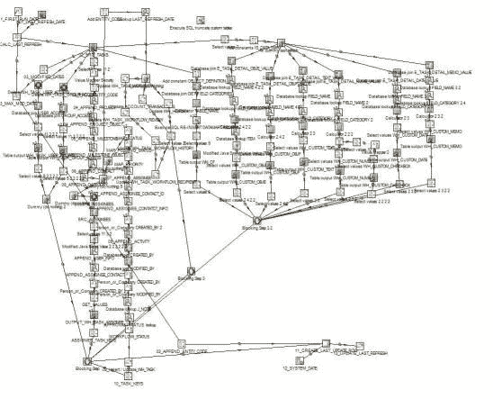
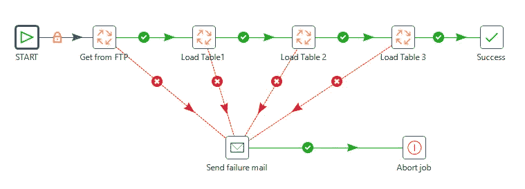
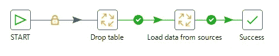
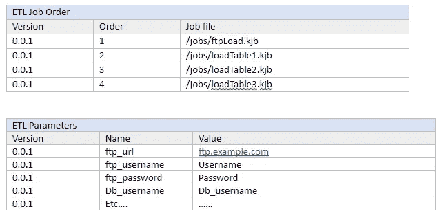
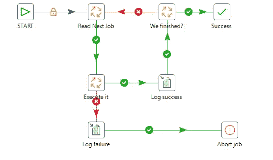
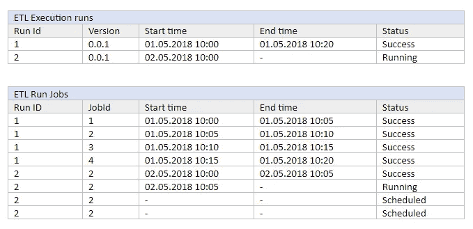
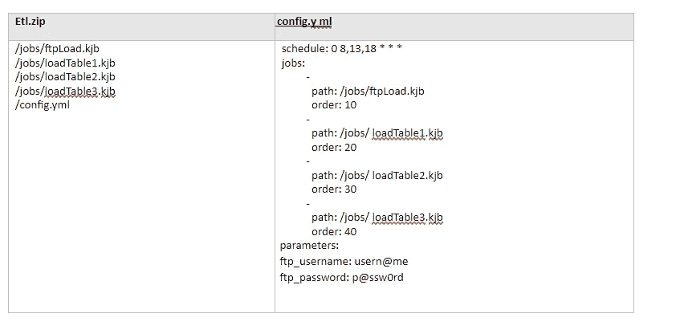

# 如何设计可伸缩和可维护的 ETL

> 原文：<https://medium.com/hackernoon/how-to-design-scalable-and-maintainable-etls-bfd1664211a7>

人们经常低估 ETL 设计，并从一个简单的想法开始，然后发展到包括额外的特性和转换，直到他们以相当混乱的东西结束。这让 IT 部门头痛不已，同时祈祷一切都不会失败。这样的 ETL 应该是这样的:

有几个需求有助于 ETL 的维护:

*   重启/恢复流程的能力
*   关于执行历史和问题的结构化信息
*   外部配置
*   用于监视和控制的 API
*   易于故障恢复

我们可以遵循几个步骤来实现上述所有目标。

**ETL 原子性**

这只是将我们的 ETL 分解成小的独立作业的一个花哨术语。那是**能够实现你的目标的最重要的**要求。简单的工作容易理解，容易改变，容易维护。我知道我们大多数人可能认为他们无论如何都会这样做，但是以我在 T4 一家定制软件开发公司的经验来看，这一点经常被忽视。让我们看下面的例子:

这看起来很简单，但是如果您需要在不加载表 2 的情况下执行它呢？您需要重新创建作业并部署新版本。或者当加载表 3 由于数据库崩溃而失败时，您重新启动所有东西，而不是只加载那个表。

想象一下，如果该作业被分割成小等幂作业，如下所示:

从 FTP 加载

和 3 个装载表作业(可以是带有参数的重复使用的同一作业)

(注意 drop 表和 load 数据是如何在同一个作业中的。我们不想把它们一分为二，因为加载数据不再是等幂的，如果我们运行它两次，我们将使行加倍)

**可配置执行**

现在，当我们的 ETL 过程包含许多小的原子任务时，我们需要一种方法来执行它们。一个简单的解决方案是将它们都链接到一个主作业中，但这不是很灵活，并且不允许我们轻松地配置它。更好的方法是创建一个主任务，从外部配置中读取所需的作业并执行它们。这样，我们可以修改执行流，而无需重新部署 ETL，也无需修改代码。

对于一个小项目来说，存储配置的简单 YAML 可能就足够了。但是为了使它灵活并能够扩展，可以使用数据库。在我们的 ETL 例子中，有两个表就很简单。版本控制将用于保存正确的执行历史:

我们的主要工作可以是这样的:

**维护执行流程历史**

搜索大型 ETL 的日志文件可能是一场噩梦。因为我们已经有了一个专门用于 ETL 的数据库，所以很容易扩展主任务来跟踪执行流。这样，我们的作业就不必担心日志记录和故障处理(记住——它们是做简单事情的小的原子代码片段)。因此，让我们在数据库中添加另外两个表:

每次运行 ETL 时，我们都会读取当前版本所需的作业，在 ETL 执行运行表中添加一条记录，并在 ETL 运行作业表中添加所有计划作业的记录。这使得我们(以及我们的主任务)可以轻松地跟踪执行情况。我们还有关于以前 ETL 运行的信息，包括它们的作业、时间、状态等。主任务负责这些表并控制流程。我们可以通过添加额外的字段(或额外的表)来扩展元信息，如加载的行、处理的文件等。

**从 ETL 中分离 ETL 执行引擎**

现在，当我们将 ETL 作为小型作业的结构化列表，并将主任务与数据库一起跟踪执行时，我们可以很容易地看到这两者不需要耦合在一起。这种主任务可以运行由不同作业组成的不同 ETL，并维护它们的轨迹。它是一个简单的“ETL 服务器”的例子，但是要使它成为一个真正的服务器还需要一些东西。

1.  首先，它需要一个简单的 API 来允许更容易地访问关于执行运行的信息并控制这些执行运行。对于管理员来说，它可以是一个简单的 CLI，甚至可以是一个允许不同用户访问和操作的 web 服务。最后，即使不访问服务器，查看 ETL 的状态和恢复/重启/停止也应该很简单。数据库有查看哪个步骤失败所需的所有信息，并且我们已经创建了我们的步骤幂等，因此它们可以重新启动。
2.  我们需要一种简单的方法来部署新的 ETL。有许多可能性，但是归结起来就是提供一个包含作业和配置的包。

一个简单的打包是一个包含所有作业的. zip 文件和一个位于根文件夹中的 config.yml 文件。当我们的服务器获得那个 etl.zip 时，它可以部署它，安排它，并开始执行它。ETL 开发人员不需要知道服务器是如何工作的，他们只需要以约定的格式描述流程。

**结论**

现在，当我们有了基础知识，就要靠我们来扩展服务器，使其为生产做好准备。在一次又一次地用不同的 ETL 处理相同的问题之后，我确信它可以做得更好。我们从上面的步骤开始，甚至为一个简单的 ETL 使用非常相似的表结构，并从那里继续。最终，我们得到了一个运行多个 ETL 的生产就绪型服务器，它具有简单的监控、故障恢复和企业级客户所需的一切。这里的例子是在 Pentaho [数据](https://hackernoon.com/tagged/data)集成中制作的，但是相同的基本原理适用于所有的[工具](https://hackernoon.com/tagged/tools)。

*请不要犹豫，如果你有任何问题，请分享建议！*