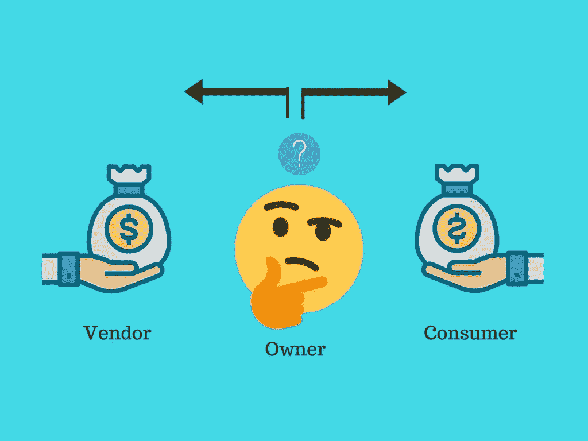

# 如何确定向市场模型的哪一方收费

> 原文：<https://medium.com/hackernoon/how-to-determine-which-side-of-marketplace-model-to-charge-21f9a470160f>

The marketplace Dilemma

众所周知，实体市场是双向的，需要至少两个群体(生产者和消费者)的参与才能取得成功。

这种商业模式类似于一个在线市场平台，对于想要创建一个连接供应商和消费者的在线场所的企业家来说，这是一个很好的想法。我们需要让两方面的客户都参与进来。市场所有者不直接创建库存，而是充当连接卖家和买家的中介。

由于在我们的[上一篇文章](https://nyocha.org/2018/04/10/7-monetisation-strategies-associated-with-online-marketplace-model/)中，我们强调了适用于这种模式的不同收入选项，我们收到了许多问题，如市场的哪一方应该收费？有标准吗？

这些将在本文中讨论；因此有了这个话题:

> ***如何确定市场中哪一方收费***

重要的是要知道，市场模式的繁荣依赖于网络效应，也就是说，当越来越多的人使用一种产品或服务时，这种效应就会变得更有价值。换句话说，市场一边的用户越多，他们从另一边获得的服务价值就越大，反之亦然。

由于市场会受到需求和供给力量的影响，我们可以将市场模型分为两类:

*   供应受限的市场
*   需求受限的市场

当供给方比需求方对市场有更大的影响时，市场被称为**供给受限的**。一个例子是 Airbnb 市场，在这个市场上，说服主人把房子租给陌生人比让客人敲门更难。在这种情况下，明智的做法是向需求方(消费者)收费，或者在 Airbnb 的情况下，向他们收取比供应方更多的费用，即尽管 Airbnb 向主人和客人收费，但它向客人征收大部分费用(5-15%)。

另一方面，当需求方比供应方对市场有更大的影响时，一个市场被认为是需求受限的。更大的影响力也可能意味着平台上的买家比卖家或生产商要少。在这种情况下，向生产商收费会更有吸引力。OpenTable 是一个受需求约束的市场，并相应地向提供商收费。

你只需要确定你的市场是需求受限还是供应受限，并减少这方面的摩擦:**需要买家吗？然后向卖家收费，反之亦然。**

现在出现了一些问题:市场中具有更大影响力的另一方会发生什么？我们要起诉他们吗？还是应该对他们免费？答案是肯定的。你可以对它们收费(就像 Airbnb 模式一样)或免费，以消除这方面的进入壁垒，尤其是在你的市场进入阶段。

另一个策略是补贴有更大影响力的一方。例如，供应受限的市场可以提供免费设备甚至营销服务来吸引供应商/生产商。这是 AirBnB 采取的方法，当时他们决定代表租户撰写房源描述，并聘请专业摄影师为这些潜在租户拍摄精彩的公寓照片。其他营销活动在社交媒体和电子邮件上得到加强，以积极地向潜在客户推销这些公寓。通过提供利益，市场可以鼓励受益群体的参与。作为网络效应的结果，这将吸引另一方进入市场。

*总之，向增值最多、影响最大或短缺的一方收费。但是作为所有者，你可以决定是否要同时收费。*

*原载于 2018 年 4 月 16 日*[*【nyocha.org*](https://nyocha.org/2018/04/16/how-to-determine-which-side-of-marketplace-model-to-charge/)*。*