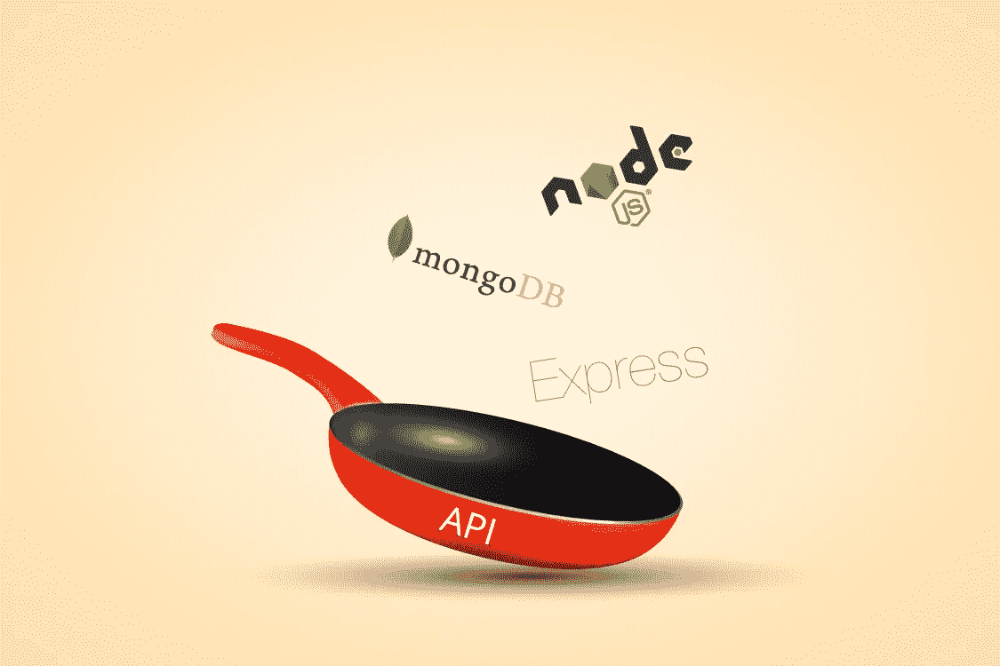
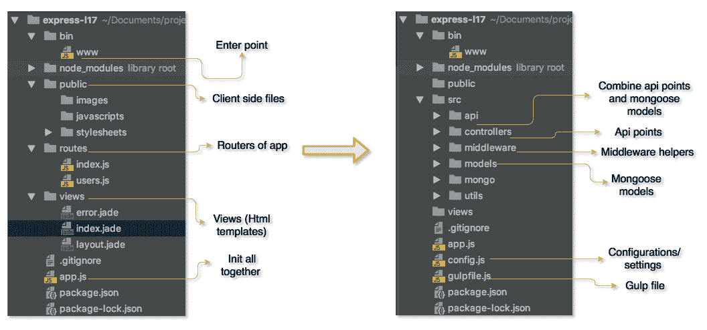
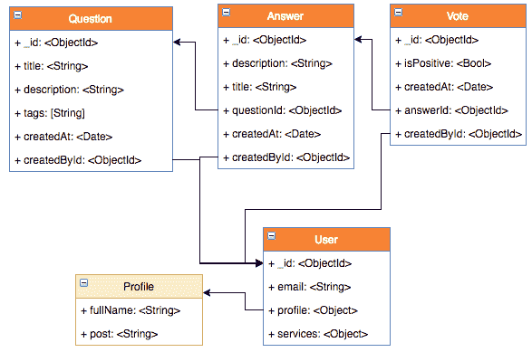
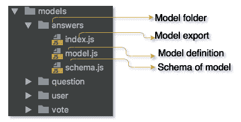
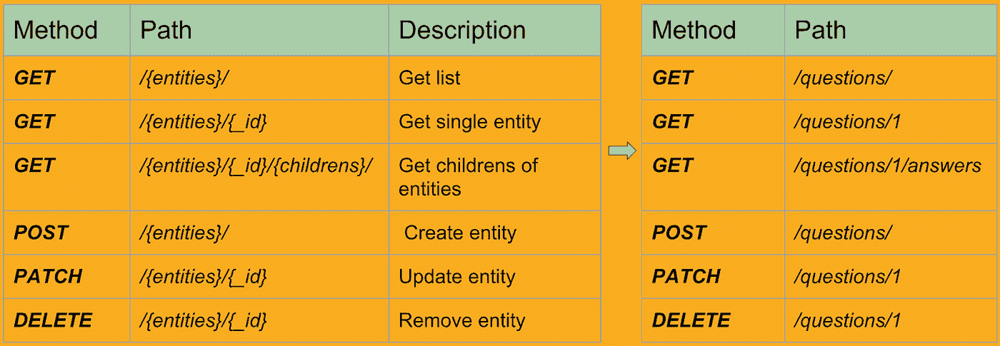
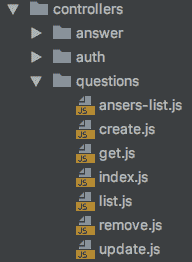
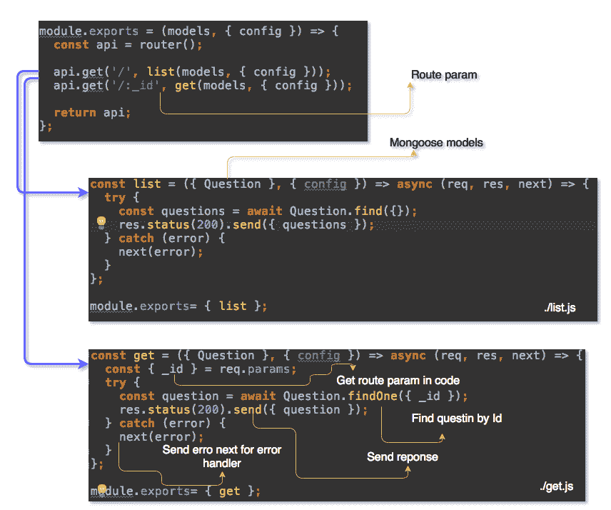
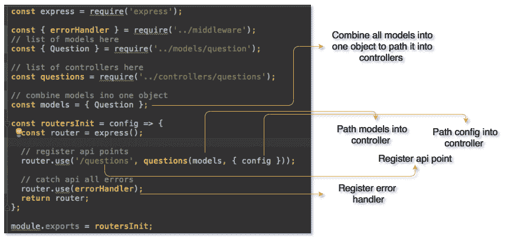
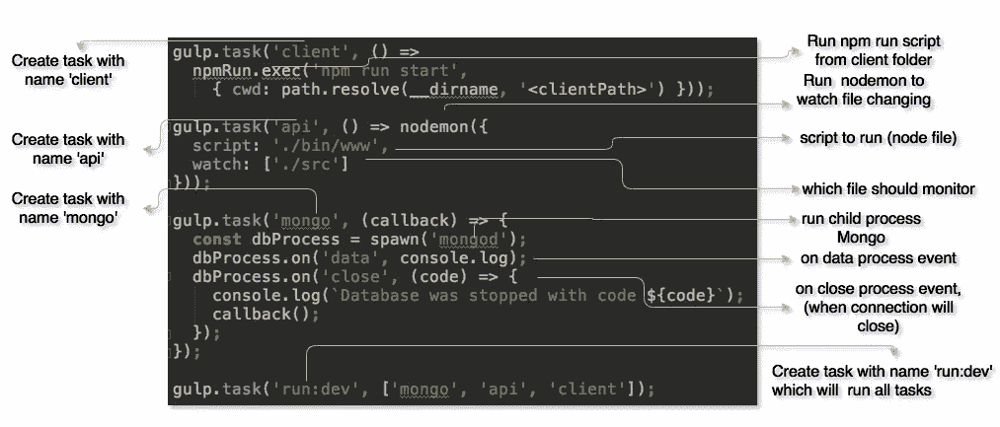

# 如何用 Node.js、Express 和 MongoDB 开发 API 的样板文件

> 原文：<https://medium.com/hackernoon/how-to-develop-a-boilerplate-for-api-with-node-js-express-and-mongodb-4c771ae1c2df>



How to Develop a Boilerplate for API with Node.js, Express, and MongoDB

在很大程度上，开发人员使用现成的项目代码，这些代码通常是由其他人创建的或者是很久以前开发的。这就是为什么，当谈到从头开始编写自己的项目时，开发人员的脑海中通常会充斥着以下问题。我应该从什么开始？我怎样才能让它很好地工作呢？我为什么要这么做？

在本文中，我们想分享一些关于如何为基于 Express 的 API 设置样板文件的技巧(以 StackOverflow 这样的论坛应用程序为例)。

# 应用程序的 API。我应该从哪里开始？

首先，分析您未来应用程序的功能需求。根据它们的不同，API 的结构可能会有所不同。例如，确定您的应用程序是否需要授权机制、与其他服务的集成，或者其他功能需求，如报告生成(pdf、xml、csv)、电子邮件发送等。

下面是您在开始 API 开发之前应该考虑的主要问题。

*   您的应用程序的功能要求
*   它将处理的数据
*   开发方法

# 样板可以完美吗？

首先，你必须设计一个样板文件的结构。您可以通过手动创建每个文件来做到这一点。为此，您可以使用一个实用程序(互联网上有很多这样的程序)并根据您的需要进行修改。相反，我们将走另一条路，使用 [express-generator 实用程序。](https://expressjs.com/en/starter/generator.html)

现在我们已经为 Express API 样板开发做好了准备。

# 第一步。生成项目的结构

设置 express-generator 并为您的项目创建目录。

```
npm install express-generator -g
express <your-project-name>
```

由于 express-generator 创建了 express 应用程序的一般结构，它不足以满足我们的需求。我们只对 API 开发本身感兴趣。所以我们稍微修改一下。下面，你可以看到你应该做哪些改变。



左边的图片显示了生成的样板文件。右边的图片——你应该做出改变的样板文件。让我们更详细地分析一下这个项目的结构

*   **控制器**——在这里您应该存储所有的 API 端点
*   **模型** —用于存储数据模型
*   **API** —这里存储了您的数据与 API 端点的交互(我将在本文中进一步详细解释)
*   **Utils** —这里存储了应用程序的全部支持代码(电子邮件发送、pdf 生成等。)
*   **中间件** —您可以在这里找到该应用的所有 Express 中间件
*   **Mongo** 或 **db** 或**或<your databasename>**——它包含了你的数据库的所有工作
*   **сonfig**或**。env** —最好将你所有应用的设置保存在一个单独的文件中(比如 *js。Json* 或者*。环境*

有了这样的结构，你的代码将会有一个易于处理的逻辑顺序。那么下一步是什么？从哪里开始？由于 API 的主要任务是操作数据，我们就从这些数据开始吧。许多人跳过正确的数据组织，直接进行开发。这不是一件好事。数据(尤其是数据库)的不正确结构会在将来导致严重的问题。这就是为什么花更多的时间来设计一个健壮的数据结构比以后再抓头要好。

# 处理数据

## 第二步。模型声明

每个 API 通常处理一些数据。我们未来的 API 也不例外。让我们从数据结构声明开始 API 开发。在我们的例子中，它是与方案和模型一起工作。为了更好地理解和处理您应该操作的数据，请以图形方式组织它们的结构。这将有助于你理清思路。

下面是类似 [StackOverflow](https://stackoverflow.com/) 的 app 的大概数据库。



根据这个结构，我们声明我们的模型。因为我们使用 [Mongo](https://www.mongodb.com/) 数据库来存储数据，所以让我们用[mongose](http://mongoosejs.com/docs/populate.html)来构建我们的模型。

目录模型将如下所示:



*   **Schema.js** —下面是该方案的一个近似实现。一切都相当简单。首先，声明模型的字段和类型。您也可以添加额外的验证和确认，您可以在[文档](https://mongoosejs.com/docs/schematypes.html)中读到

```
const mongoose = require('mongoose');
const Schema = mongoose.Schema;
const ObjectId = Schema.Types.ObjectId;

const schema = new Schema({
  title: {
    type: String,
    required: [true],
  },
  description: {
    type: String,
    required: [true],
  },
  questionId: {
    type: ObjectId,
    ref: 'Question',
  },
  createdAt: {
    type: Date,
    required: [true],
  },
  createdBy: {
    type: ObjectId,
  }
});

module.exports = { schema };
```

在声明了方案之后，我们只需将其导出以在“model.js”中使用。

*   **Model.js** —猫鼬模型与方案的结合。它是在单独的文件中完成的，因为 mongoose 允许用不同的方法和钩子来扩展您的模型。存储所有这些数据+能够扩展的方案，将产生具有 500+行的文件。不太优雅，对吧？

```
// models/answers/model.js
const mongoose = require('mongoose');
const { schema } = require('./schema');
// add hooks here
schema.pre('save', function() {
  return doStuff().
    then(() => doMoreStuff());
});
const Answer = mongoose.model('Answer', schema);
module.exports = { Answer };
```

可以看到，这里声明了钩子 *(`pre (`save`)`* 。每次保存模型时都会调用这个代码。这个[【中间件】](https://mongoosejs.com/docs/middleware.htm)用于复杂操作(如发送信件、复杂验证等)。但是，请记住，它不适合模型验证。为此，最好使用内置的[验证器](https://mongoosejs.com/docs/validation.html#built-in-validators)。

用同样的方法宣布其他模型和它们的方案。

# 路线呢？

## 第三步。控制器声明

现在让我们继续进行路线或控制器。根据您的型号划分控制器，如下所示。



这样，控制器目录中的每个子目录将代表一个特定的模型。因此，每个文件将代表一个 API 端点。



这种方法允许最大限度地分割 API 的代码，并且忘记了在单个文件中存储所有 API 端点的麻烦。下面是 GET/questionsтаGET/questions:_ id 实现的示例



正如您所注意到的，question 是。 */list.js.* **这是一个现成的猫鼬模型**。这个对象还包含我们的 API 中的所有模型。因此，您可以在任何控制器中使用任何模型，而无需导入它。

它组织你的代码，使导入变得简单。让我们在下一节看看如何实现这一点。

# 路线和数据。如何不迷路

## 第四步。模型和控制器的注册

我们已经分析了如何在我们的 API 中创建模型和控制器。此外，我们还展示了如何在控制器内部使用模型。现在是时候看看如何将模型与控制器连接在一起了。这是在文件*中完成的。src/API/index . js*



这里发生了三件主要的事情:

1.  控制器的导入和注册
2.  模型的导入和组合及其在控制器中的传输
3.  注册错误处理程序，它将从控制器中获取错误(在下一节中，我将展示如何实现它)

通过这种方式，当项目增长时，您可以在一个地方注册新的模型和控制器。

最后一步是在 API 中创建入口点。这将是*‘app . js’*——所谓的胶水，它将连接所有文件，允许描述附加功能，并在必要时注册静态文件。其实现如下所述。

```
const express = require('express');

const config = require('./config');
const api = require('./src/api');
const { mongoManager } = require('./src/mongo');

const app = express();
mongoManager.connect();

// api routes v1
app.use('/api/v1', api(config));

module.exports = app;
```

这里发生了三件主要的事情:

*   导入配置 const config = require(`。/config `)；
*   连接到我们的数据库*` mongo manager . connect()；`*
*   在 express ` *app.use (`/api/v1，api (config))中注册所有控制器；`*

现在，Express 将把 *`/api/v1 '中的所有请求重定向到文件` api.js`* (步骤 4)。这个文件反过来将它们重定向到控制器(步骤 3)，控制器将使用这些模型(步骤 2)。

现在你只需要根据这些规则来扩展你的 API。要运行该应用程序，只需安装“npm”软件包并运行“node”。/bin `或者在 npm 脚本中编写此命令。

# 第五步。附加功能

*   如何处理错误和 bug

最好在应用程序的一个地方处理错误。如果您想进行一些更改(例如添加记录器、过程开发/生产模式等),这非常方便。).在我们这里，这个地方就是`*。/midlleware/error-handler . js `.*

```
const { APIError, InternalServerError } = require('rest-api-errors');
const { STATUS_CODES } = require('http');

const errorHandler = (err, req, res, next) => {
  const error = (err.status === 401 ||
    err instanceof APIError) ? err : new InternalServerError();

  if (process.env.NODE_ENV !== 'production') { 
    // do something here
  } 
  if (['ValidationError', 'UserExistsError'].includes(err.name)) {
    // if it special error
    return res.status(405).json(err);
  }
  // log error if needed 
  // logger.info('API error', { error: err });

  return res // return 500 for user
    .status(error.status || 500)
    .json({
      code: error.code || 500,
      message: error.message || STATUS_CODES[error.status],
    });
};

module.exports = { errorHandler };
```

因为我们已经在*注册了这款处理器。src/api/index.js* ，调用 next(new Error())就够了，这个错误会到我们的处理器。

# 如何实现应用程序的附加功能

开发人员面临的另一项任务是提供无障碍的项目启动。

对应用程序进行所谓的热重装也很好。在 node.js 中，你可以在 [nodemon 的帮助下完成。](https://nodemon.io/)

你要写一个简单的 npm 脚本*node mon—watch src—exec ' NPM run start 或者 sh 脚本*。然而，有时需要同时运行几个进程，*，例如:*

1.数据库启动(Mongo)

2.API 发布

3.UI 启动。

[大口](https://gulpjs.com/)是这个目的的最佳选择。下面，您可以看到一个 Mongo API 和 react-script launch 的 gulp 文件的例子，它是用一个命令作为一个项目启动的。



现在创建 npm 脚本 *dev”就足够了。/node_modules/。bin/gulp run:dev"* 然后只运行你的项目 npm run dev

# 技巧

*   总是记录你的 API。由于您的 API 将被其他开发人员使用，因此为每个 API 点创建详细的文档是至关重要的。它也将把你从诸如“我在哪里能得到清单？”这样的问题中解放出来“我该怎么改变..?"
*   记录你所有的效用。因为它们将在整个项目中被所有开发人员使用，所以最好能有一个关于你的 util 用途的简要描述和它的用法的例子。
*   保持自述文件的结构化和更新。解释如何启动项目、其结构、开发过程等是很好的。来帮助其他开发者。

# 摘要

因此，在本文中，我们展示了如何为类似论坛的基于 Express 的应用程序创建样板文件。我们提供的示例是通用的，因此它们可以用作任何 Express 应用程序的基础。请记住，这些并不是要遵循的严格规则，而只是一些有用的提示，可以优化 API 的结构。