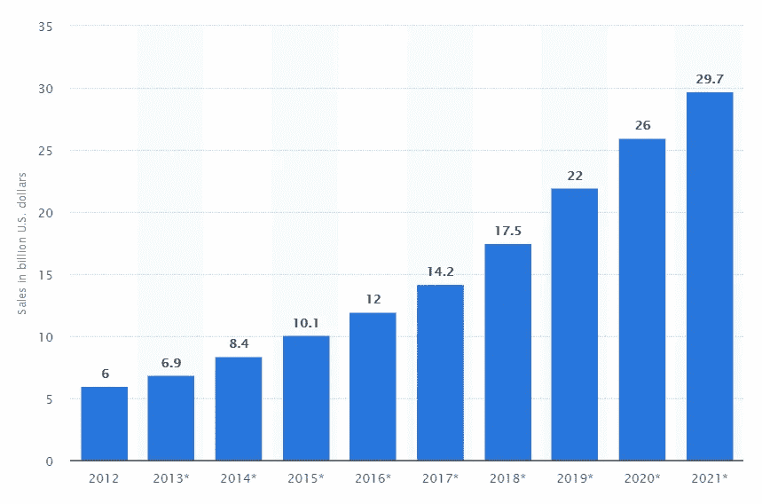
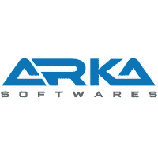

# 如何开发一个像大筐这样的杂货配送 App？

> 原文：<https://medium.com/hackernoon/how-to-develop-a-grocery-delivery-app-like-big-basket-8bbcb749791c>

杂货店送货应用程序目前正变得越来越流行。客户已经从传统系统中转变过来，他们认为“不用再用手推车提货了，我希望送货上门”。事实上，几乎 **48%的人**通过网络或应用程序媒介购买食品杂货，其中近五分之一的人年龄在 **25 至 34 岁**。毫无疑问，这是一个上升的趋势，其增长的主要和简单的原因是方便购买和获得广泛的产品，否则可能无法在你最近的商店。我们将会看到一些消费者行为趋势，这些趋势给 it 行业带来了积极的增长。

***2012 年至 2021 年美国网上杂货购物销售额***

快递公司的主要销售来自移动设备，这表明移动商务的增长。越来越多的这类购买是顾客内部驱动的冲动购买态度的结果

随着忙碌的生活方式和日程安排的到来，网上购买食品杂货的时间创下新高。人们不喜欢去商店，而是更喜欢杂货店提供给他们最好的服务，而购买杂货

## **印度的回答:大篮子**

[BigBasket.com](https://www.bigbasket.com)是**印度最大的网上杂货店**，它让顾客能够摆脱购买食物的苦差事，并欢迎一种简单易行的方法来仔细阅读和寻找基本需求。该组织目前在班加罗尔、孟买和海德拉巴开展工作，拥有超过 12，000 种商品和 1，000 多个品牌的多样化产品组合。

> 印度的基本杂货零售店以大约 10%的 CAGR 增长，规模约为 4000 亿美元，而电子基本需求记录仅为 0.1%。在这其中，在线基本供应展示台在接下来的几年里大约有**100 亿**美元的收入。这个市场的大部分很可能会聚集在这个国家的城市地区。

在 2014 年，有各种各样的新公司，例如， **ZopNow、Aaram-Shop 和 Farm2Kitchen** 在这个分类中，每个城市都有不同的邻里玩家。由于不同的业务和运营原因，他们中的绝大多数还没有做好管理的准备，其中一些原因到目前为止肯定是可以理解的。这门课的胜利者将会是一个能够克服各种困难，向客户表达难以置信的支持的人。

## **市场上的杂货应用类型**

**杂货连锁店** 一家主食连锁店，例如**沃尔玛**，倾向于拥有自己的按需多功能安排，或者换句话说，一个规模较小的活动水平的孤立商店。

聚合器聚合器实质上是向客户列出邻近的超市。客户可以选择应用程序中记录的附近超市之一。从在线菜单上，他可以把他需要的任何数量的东西加到卡车上。他看着卡车，用不同的可用选项付款，然后耐心等待商店确认请求。当请求被确认时，他可以持续跟踪他的请求，直到它到达他的位置。传达命令的义务完全由店主承担；聚合仅记录商店及其舞台上的菜单。

**Marketplace** 一个 Marketplace 超市很像一个市场采集台；除了商业中心有自己的运输团队，年轻的送货员通过零售流动安排的方法将所需的货物运送到客户家中。重要的是要知道某一特定商品是否能在规定的时间内满足需求。

**单店** 在单店应用程序中，杂货店的老板需要所有者委托他自己的品牌应用程序并处理一切事务，从维护应用程序和保持更新的在线菜单到向客户传达请求和收取现金。当然，这种方法是目前最常用的，因为佣金的多少取决于从市场上获得的业务量。

## 像大篮子一样的杂货配送业务模式

大篮子根据三个栏目将其成功构建为特定的优秀客户中心。Big basket 提供一个城市的当天运输，99.3%的准时运输，99.5%的请求满足率和无询问客户商品交换，所有这些都增加了高客户可靠性和伟大的客户投入。印度的基本**杂货业务**是一个 4000 亿美元的可寻址市场，其中电子杂货需求仅占 0.1%。当许多新企业取消工作费用和关闭在许多土地上的活动时，巨大的蒲式耳继续扩大。

> 总的来说，Big Basket 在每次无法兑现其担保时都会偿还客户，以这种方式保证有一个可靠的焦点来提高目前的预期。产品种类繁多(他们有超过 40%的业务是通过自己的品牌完成的。它在不同项目上的优势为 25%，在内部标记上的优势超过 35%。Big Basket 还通过提供产品进行了额外的改进，例如，从地面种植的切割食品，配方混合的范围，最近在班加罗尔推出了自己的糕点店，运送加热的面包，并在创新的帮助下持续发展。

## 开发最适合的模型

目前有组织采用基于**仓库的模型**。拥有，出城，机械化配送中心的股票数量巨大的项目，和车队的冷藏货车运送基本用品的买家在一个时间表开放的前提。一个昂贵的模型，24 小时运输服务对之前描述的新客户来说不够快或者不够灵活。

多渠道玩家还使用附近的**暗店**，这里是较小的配送中心，被称为“拣货员”的专职员工收集请求，然后交给运输司机。服务显示出改善的迹象，因为客户可以更快地交付，库存也根据需求更加合理。将巨大的房地产投资仅仅归于网上交易仍然是极其昂贵的，因为网上交易与店内交易相比还没有那么大。

不过目前店铺型号的**船回暖很快。在这种模式下，你需要做的就是给你的客户他们需要的东西，而不用担心仓库。我们将了解这种模型的一些特征:**

**1。** **当天发货** 最令人愉悦却又难以实现的功能之一。新客户希望购买更少的蒲式耳，而且时不时会购买更多的蒲式耳:让他们现在就购买是至关重要的。以这种方式，如果一队自行车(或者最极端的，汽车)可以更快更好地开展活动，就不需要将资源投入到声称的大型货车中。

**2。** **客户参与** 如果你想维持你已经获得的客户更长的时间，这是一项重要的活动。杂货玩家应该使用马克价值和展示支出计划，以提供非凡的质量和广泛的项目选择，以及集中的进步。此外，参与他们的日常活动是最基本的

**3。** **仓储店铺店铺** 由于店铺离客户更近，新客户会更少坐等运输，因为整个城市的包容性都很弱。同样，由于库存增加，成本降低，而收入和利润增加。

**4。** **精简后勤** 很有必要根据需求来安排和设置所有的运营活动。商店拣货员应该通过检查商品并把它们交给司机，从商店通道收集适当的在线请求。

## **按需杂货应用的典型特征**

**识别因素:**对客户进行简要了解，并按要求保存详细资料

*   社交注册/登录
*   用户配置文件管理
*   忘记密码
*   验证电子邮件和电话号码

**操作特性:**可带来顺畅购物体验的特性，可买到数量合适的商品

*   产品搜索
*   过滤搜索
*   搜索建议
*   支付方式和网关
*   优惠券和折扣代码
*   检验
*   愿望清单
*   购物车
*   数量计数器

**客户定制:**按客户设计

*   客户的位置
*   地址搜索
*   Pin 地址

**交货时间:**方便因素

*   提货时间的时间段
*   快递
*   跟踪送货人
*   送货人的联系方式
*   取消订单和其他选择

**反馈特点:**接受反馈以获得更好的绩效

*   多种等级的服务评级
*   送货员的等级
*   产品质量等级
*   撰写评论以获得更好的反馈系统
*   支持和帮助
*   涉及的技术

# **发展伙伴的选择至关重要**

开发功能丰富的杂货交付移动应用程序并不像看起来那么简单，开发一个高度可伸缩的移动应用程序是一个复杂的过程；因此，人们需要与一个熟练的和有经验的移动应用程序开发机构合作，该机构可以建立所需的 IT 基础设施以及一个用户友好的杂货交付应用程序，这是成功的保证。

## 杂货交付业务的顶级应用开发合作伙伴

[**八进制 IT 解决方案**](https://www.goodfirms.co/company/octal-it-solution)

[Arka 软件 ](https://www.arkasoftwares.com/mobile-application-development)

[**360 technosoft**](https://www.360technosoft.com/)

[**头脑盘点**](https://www.mindinventory.com/)

[**明德**](https://mindster.in/)

## **杂货配送 App 开发团队架构**

要开发一个成功高效的杂货配送移动 app，一个精通且经验丰富的专业团队是最终的要求。让我们来看看推出强大的移动应用程序所需的团队结构。

*   1 名项目经理
*   商业分析员
*   2-4 名应用程序开发人员(Android、IOS)
*   1 名后端开发人员
*   1-2 名用户界面/UX 设计师
*   1 名质量保证工程师
*   交付经理
*   数据库管理器
*   1 名系统管理员

## **开发一个杂货配送 app 需要多少钱**

开发杂货配送 app 成本主要取决于所需的特性和功能。然而，给出一个估计值，一个简单的杂货交付应用程序可能花费大约**10，000-30，000** 美元，而一个更复杂的功能可能花费超过**345，000 美元。**

**不同国家的每小时开发速度**

*   美国开发人员:每小时 50 到 250 美元
*   东欧的开发人员:每小时 30 到 150 美元
*   南亚的开发人员:每小时 10 到 80 美元

## **技术堆栈**

*   **应用平台** —安卓、iOS、网络应用
*   **后端** — python，Node.js，。Net，Java，
*   **第三方应用** —谷歌地图，
*   **推送通知**–APN Twilio，Firebase
*   **短信、语音和电话验证**–NEX mo、Twilio、Sinch
*   **支付** — Braintree & PayPal、Stripe、电子钱包
*   **Mandrill**——用于与电子邮件相关的一切
*   **数据库**–MongoDB、Cassandra
*   **云环境** — AWS
*   **实时分析** — Apache Flink、Spark 流
*   **流量分析** — Google Analytics、Flurry、App Annie、Appsee [**更多**](http://www.businessofapps.com/guide/mobile-analytics/) **>**

## **成功的强大应用营销策略**

如果方法正确，强大的营销策略可以让你的应用获得成功。如果你有效地计划和执行营销策略，你的应用程序可以获得巨大的利益。

此外，理解你的首要目标必须是你的应用程序的最终用户是必不可少的。该应用程序将与人打交道；因此，在制定营销策略之前，您需要对他们的移动行为以及相关的市场**研究和挑战**进行深入研究。

我确信，如果你遵循了上面提到的信息，你将会准备好应对竞争对手的应用业务，并开发出一款高功能的应用。