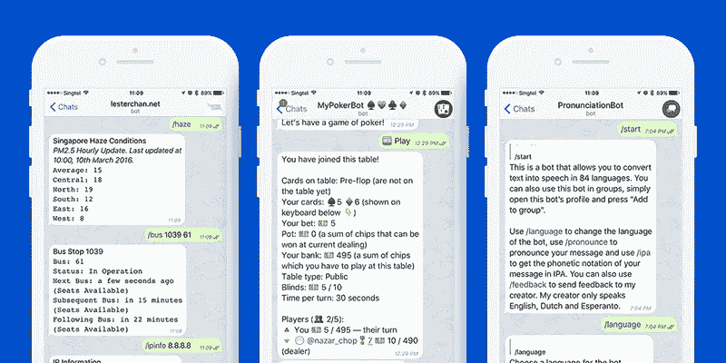

# 如何在 Python 上开发一个电报聊天机器人

> 原文：<https://medium.com/hackernoon/how-to-develop-a-telegram-chatbot-on-python-acda22be3059>

技术进步和自动化正开始影响人类经济和日常生活的许多领域。人工智能的快速发展迫使训练计算机来做人类的工作，并在商业中实现它们的用途。人工智能在商业中的主要应用之一是聊天机器人。

NLP 和聊天机器人在客户服务领域有很大的潜力，可以很容易地接受客户的订单，并就公司的服务向他们提供咨询。

在公司官方网站或 Telegram、Slack 或 Facebook Messenger 等流行的信使中的机器人的帮助下，支持中心的工作自动化是可能的。

在本文中，我们将向您简要介绍聊天机器人的开发，并分享我们用 Python 构建 Telegram 聊天机器人的经验。

# 项目简要说明

如今，NLP 已经成为一个非常重要的话题，因为它对非结构化文本数据有意义。例如，它可以用于商业，并创建智能机器人，这些机器人可以根据客户的请求、兴趣和特征对客户进行分类，并同时处理数百万个请求。

我们的项目允许创建聊天机器人，他们能够分析客户和顾问之间的实时对话。为了提高答案的质量和训练它处理更多的个案情况，教一个机器人是可能的。

在线咨询意味着与客户进行面对面的咨询，并作为潜在买家影响他。为了做到这一点，顾问应该了解客户的概况(兴趣、词汇和心理类型)。大多数在线对话都是通过电话或短信进行的。该应用程序有几个库，用于理解人的声音并将其转换为文本数据。

据此，本计画的想法是建立一个能够自我学习的互动系统，同时透过归类和处理客户的词汇形式来与客户沟通。我们的人工智能机器人的主要目的是识别实体集群——相关实体的群组。实体集群对许多活动非常有用。例如，我们可以分析客户请求，并根据兴趣组对其进行识别甚至排序。

## **工艺栈**

前端:

*   Javascript 编程语言；
*   JSON 对象可视化工具；
*   前端框架 Twitter(脸书)引导；
*   用于实时客户端-服务器连接的套接字。

# 技术选择

该项目的架构基于 Telegram 及其用 Python 编程语言编写的后端部分。由于 web 客户端是项目的主要组成部分，因此最重要的决策之一就是为 web 应用程序的实现选择合适的框架。Python 语言有几个“全栈”框架:Django、Grok、web2py、Giotto。

该应用程序是用 Python 编程语言编写的，以便统一开发和机器学习的过程。选择 Django 和 Web2py 框架进行开发。为了制作电报机器人并将其与电报服务集成，使用了电报机器人 API。

为了实现项目的人工智能部分，使用了以下 Python 库:

*   **NumPy** —一个支持大型多维数组和矩阵的库。
*   **SciPy(Scikit-learn)**—Python 编程语言的科学仪器开源库，包含优化和遗传算法模块。
*   **NLPK 库**—Python 上用于符号和统计自然语言处理的一组库和程序。
*   **Gensim Python 库**——基于机器学习的自动语言处理流行工具。在这个库中，实现了集群化和分布式语义算法(word 和 doc)。它可以解决主题建模的问题，并区分文本或文档的主要主题。
*   **Scrapy** —从网页接收数据的最高效的 Python 库之一。

选择工具的关键点是选择机器学习的库。在词法分析方面，我们决定选择 Pyromorphy2，因为它支持俄语。选择 TeleBot 库来使用 Telegram Bot API。web 套接字的客户端实现是通过 SocketIO 库处理的。Flask-SocketIO 库用于建立实时的客户端-服务器通信。它是一个结合 Flask 使用 SocketIO 库的工具，Flask 是一个使用 web 套接字的方便框架。

# 数据库

为了创建一个基于人工智能的机器人，有必要使用问答数据库。客户端的查询和机器人的回复之间的时间间隔应该尽可能的小。为了实现这个目标，我们决定选择**Redis**——一个高效的非关系数据库。关于问题和答案的信息存储为来自对话的消息块。这种方法的优点是:

*   它允许人们方便地找到记录的必要元素。
*   通过使用这种存储数据的方式，可以记录任意长度的对话，而不受哈希表中字段或关键字数量的任何限制。

因为开发的主要目标是创建实时应用程序，所以使用了 web 套接字技术。它们将意味着允许实时客户机-服务器交互的交互式连接。与 HTTP/HTTPS 相比，web 套接字能够与双向流一起工作，这将加快应用程序的工作。它们将有助于创建任何类型的实时软件:聊天机器人、物联网应用或多人在线游戏。

# 机器学习的实现

选择合适的机器学习算法是任何智能系统开发中的一个重要环节。机器学习的所有算法都可以细分为三种类型:

*   **如果有一个数据块具有其他数据块不清楚的特别明显的属性，并且有必要在工作时预测它们，则使用受控学习**。
*   **非受控学习**用于找出未标记数据集中的隐含关系。
*   **强化学习**是上述类别的共生现象，意味着当没有标记或错误消息时，每一步或每一个动作都有某种特定类型的反馈。

该项目的任务之一是根据数据库中的问题对答案进行分类。这些答案根据它们与相应类别的关系进行了分类。

机器学习是在决策树的帮助下进行的。其中一个代替了随机森林。这是一组处理投票的经过训练的树。基于其结果，随机森林根据指定的选择准备回复。为了实现选择合适的方案，使用了实施图备忘录。它是微软设计的模型，用于为特定任务选择机器学习算法(见下图)。

基于该方案，我们得出结论，当精度和学习速度是最高优先级时，随机森林算法是最适合于解决多类分类任务的算法。

# 机器人训练过程

学习 bot 的过程包括几个阶段:

*   **对话数据库预处理** —此阶段完成后，只剩下与对话当前阶段相对应的那些集合。
*   **选择问题** —完成上一阶段后，系统创建学习核心。在此阶段之前，每个问题的文本都被简化为常见形式。此外，所有单词都在词法分析器 Pymorphy2 的帮助下进行规范化。这样，每个单词都回到了最初的形式，分词也就简化成了不定式。它允许以相同的方式处理相同的单词，尽管上下文不同。
*   **为问题的规范化选择创建 TF-IDF 矢量器** —整个问题数据库的处理和随机森林的学习都基于矢量器。

# 应用程序的工作流

该应用程序包括一个网络客户端和一个基于 Python 的**电报聊天机器人**。该应用程序的主要功能是:

*   客户信息的实时处理
*   为机器人的回复提供可能的变体
*   实时处理 bot 的决策并向客户端发送回复

网络客户端由用于对话图工作的界面和用于发送消息的键盘组成。客户端与机器人的交互是使用电报机器人的经典选项。在启动应用程序时，也会启动两个流。其中一个是维护电报机器人的工作，第二个——应用的工作。客户端消息的处理是通过 TeleBot 库的工具“消息处理程序”来完成的。

用户的问题和答案的可能选项位于图表的顶部。单击其中一个答案后，其文本会自动显示在答案的空白处。

然后，系统等待客户端对发送的消息的回复。当它接收到该消息时，通过将用户的回答添加到具有所选消息的分支来重组该图。新的回复由应用程序准备。

# 该项目的主要挑战

在进行该项目时，我们面临以下挑战:

*   实现客户信息的实时处理
*   实时介绍顾问答案的可能变体
*   实时处理顾问的决定，并将回复发送给客户
*   系统运行时对话数据库的动态扩展

为了应对这些挑战，我们实施了以下功能:

*   客户回答的预处理——创建一个词表的频率矩阵，找出最常用的词。
*   在自组织映射(SOM)的帮助下，搜索将具有相似意思的单词结合在一起的意义簇。这是一种人工神经网络，被训练产生训练样本输入空间的低维(通常是二维)离散化表示，称为**图**。自组织映射不同于其他人工神经网络，因为它们应用[竞争学习](https://www.evernote.com/OutboundRedirect.action?dest=https%3A%2F%2Fen.m.wikipedia.org%2Fwiki%2FCompetitive_learning)而不是纠错学习。
*   使用 Redis 进行数据存储，可以快速处理查询。

# 结论

尽管智能系统发展迅速，但这仅仅是它们在咨询领域应用的开始。这是因为在线咨询的实时处理的必要性，并且因为机器学习的算法需要大量时间用于预处理和学习本身。

*原载于 2018 年 5 月 18 日*[*【sloboda-studio.com】*](https://sloboda-studio.com/blog/how-to-develop-a-telegram-chatbot-on-python/)*。*