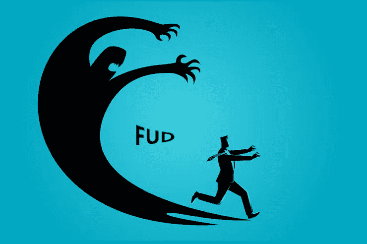

# 如何做 STO:mint health 创始人专访

> 原文：<https://medium.com/hackernoon/how-to-do-an-sto-an-exclusive-interview-with-the-founder-of-minthealth-ba24be0c6025>

Source:Medium

随着 ico 在融资方面让位于 sto，企业家的普遍情绪正在转向 sto。这些企业家正在逐个标记用例，并将整个生态系统带到区块链上。但是，这些生态系统可持续吗？人们会适应符号化的生活，使用符号 A 进行活动 A1 和 A2，使用符号 B 进行活动 B1、B2 和 B3，等等吗？

人们接受法定货币是因为它们的普遍性——可以兑换成等值的其他货币。仅仅因为这个原因，比特币和以太坊等加密货币开始受到用户的青睐。他们有潜力成为统治所有人的一枚硬币。他们通过排除银行来允许非中介化是锦上添花。

我联系了 MintHealth 团队的创始人，这是一个基于 Polymath 平台的 STO。由于 Polymath 平台在 STO 空间受到了媒体的广泛关注，它似乎很容易从已经在进行 STO 的人那里获得观点和见解。

# Q1。请告诉我们你对 STO 的规划阶段？是否有任何恐惧、不确定性和疑虑？

我们很高兴能与 Polymath 合作，共同努力创建发行证券的黄金标准平台，以保护投资者和希望为全球各行业带来有意义的改善的公司。关于实际发行，我们很高兴能与 Open Finance 合作，实现 MHST 的流动性。

Source: Satoshiuncle

MintHealth 将使用 Polymath 的安全令牌标准协议 ST-20，该协议简化了在 MHST 创建和投资的过程，同时将法律和监管合规性嵌入令牌本身。Polymath 平台将使 MintHealth 安全令牌成为可编程权益，从而对权益提供更大的控制和定制。MHST 可以全天候交易，无需中介或集中控制功能。

# 您有一个双令牌设计— Vidamints 和 MintHealth 安全令牌。你认为随着去中心化市场的成熟，我们会看到更多这样的发展吗？

你肯定会看到安全令牌的崛起。事实上，行业分析师和领导者预测，在未来 3 到 5 年内，现有 80 万亿美元全球股票市场的 25%(20 万亿美元)将成为证券，这主要是由机构资本的大量涌入推动的。安全令牌对公司来说是一个不可思议的工具，因为它们使利益相关者能够参与公司的发展，并以符合 SEC 的方式获得成功的好处。

Source: Blockchainhub

至于新颖的双令牌结构，我们认为这对我们公司来说是必要的，并且很可能在未来变得更加普遍。一些行业可以从激励消费者中获益。越来越多的行业已经有了忠诚度计划(想想亚马逊、CVS、美国运通等)。随着越来越多的公司利用区块链，双令牌结构的成果可能会变得更加明显，并得到广泛利用。

# 你在区块链上的健康证明是一个值得称赞的概念。你认为应该有更多的医疗公司来区块链吗？市场潜力怎么样？

*每年，大约有 4000 万人死于慢性疾病，如糖尿病和心脏病。尽管这些疾病在很大程度上是可以预防的，但许多人仍然因为糟糕的食物选择、久坐不动的生活方式、过度饮酒、药物治疗不遵从和吸烟而将自己置于危险之中。此外，患有慢性疾病的患者可能每三到六个月才看一次医生，在两次就诊之间很大程度上忽略了他们的病情。数据清楚地表明，参与其中的患者有更好的结果，但我们没有给他们这样做的手段。*

Source: Bulletin of the American College of Surgeons

*患者通常只能有限地访问其电子健康记录中的医疗信息(EHR)。如果他们想看不同网络中的专家，这两个孤立的 EHR 甚至不太可能互相交谈。如果他们有任何个人设备，如 FitBit，或使用 myfitnesspal 等* *应用程序，数据不太可能被纳入他们的健康记录。区块链适应性强，便于携带，最重要的是安全，因此允许所有患者的临床、成像和行为数据在患者和医生、护理人员之间无缝、安全地传输。*

# 你为什么选择 STO 路线？作为 STO 领域的先驱，你想告诉我们的读者你的经历吗？

*加密证券，也称为安全令牌，旨在通过将可在区块链上交易的证券令牌化来克服当前的挑战，其中主要用例是以股息、收入分成和/或价格升值的形式对未来利润的预期。我们认为，受监管的证券代币是更可持续的融资方式，为投资者提供了一个实际拥有区块链项目的机会。*

# 对于 sto 的法律合规性有很多疑问。你对我们的读者有什么见解吗？

*与区块链领域的许多方面一样，围绕这些问题缺乏基本知识。安全令牌基本上是由区块链上的令牌表示的传统股权证券。对治理的担忧并不是安全令牌独有的，而是与如何将智能合约应用于当今资本市场中使用的相同治理准则有关。*

# 您的 MintHealth Token 类别“MHST”是一种(无投票权普通股)。为了读者的清晰，你能告诉我们它的好处吗？

*mint health Security token(MHST)将通过 Reg D 私人销售流程以及 StartEngine 上的 Reg CF 提供安全令牌(查看此处:*[*https://www . start engine . com/mint health)。*](https://www.startengine.com/minthealth).)*【MHST 代币将赋予持有者以下权利:I)mint health 出售 VIDA 所得收入的 10%版税，以及 ii)mint health 的股权。这种结构提供了参与生态系统增长和 MintHealth 公司股权的独特平衡。*

# 你对以太坊及其不可变智能合约有什么看法？鉴于监管框架不断变化的性质，您认为这是否可行，或者我们是否应该转向更灵活的区块链，如 Stellar？

*基于以太坊的“竞争”网络正在进行戏剧性的激烈创新。我们相信智能合约是一种强大的功能，可以实现 MintHealth PaaS。这种创新不仅发生在“传统”的公共以太网上，还通过 Stellar 和许多其他项目发生。根据项目的具体需求，以太坊网络是可行的。在 MintHealth 的案例中，我们将部署一种“混合”模式，通过这种模式，我们将使用能够利用智能合同的公共和私有网络*。

# MintHealth 证券代币的持有者将获得 Vidamints 销售的红利、MintHealth 的股权以及证券代币交易所的流动性。你能给我们的读者举个例子解释一下激励模式是如何工作的吗？

*MintHealth VIDA mints(VIDA)将作为 mint health 平台上的奖励和激励系统运行，患者将获得 VIDA 作为完成健康活动的奖励。然后，患者将能够以类似于常旅客里程或其他忠诚度计划积分系统的方式将 VIDA 兑换成奖励。在这种情况下，Vidamints 的购买者将是保险公司、企业健康计划和任何其他承担照顾肥胖、糖尿病、高血压等疾病患者以及其他许多可预防的慢性疾病患者的财务风险的实体。VIDA 令牌将不会用于资本筹集。它将是一个忠诚/公用事业令牌，以固定价格出售，并将通过区块链进行跟踪和透明。*

# 许多 ico 正在评估 Polymath 进行 sto。你对他们有什么警示故事吗？

Source: Polymath

*没有警示故事，但我们很高兴能与 Polymath 携手合作，因为他们前所未有地利用 Polymath 的自动化和可扩展平台帮助公司在区块链发行证券，帮助我们实现临床成果和财务回报的愿景。正如我们的联合创始人&首席执行官 Samir Damani 所言，“我们很高兴能与 Polymath 合作，共同开创发行证券的黄金标准平台，保护投资者和公司，为全球各行业带来有意义的进步。”*