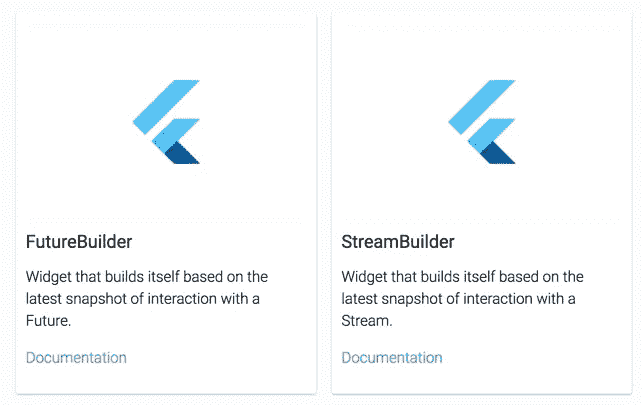

# 如何用 Dart 在 Flutter 中进行异步编程

> 原文：<https://medium.com/hackernoon/how-to-do-asynchronous-programming-in-flutter-with-dart-58da9c162807>

异步编程是并行执行的一种形式，它将编程周期中的事件链固定在一起。对于那些不熟悉异步编程的人来说，这是加速开发过程的另一种方法。然而，我们不能在所有情况下都使用异步编程。当你追求简单而不是效率的时候，它就起作用了。要处理简单和独立的数据，异步编程是一个很好的选择。

现在，我们来谈谈在 Flutter 中做异步编程。Dart 在许多方面都是 Flutter 的完美匹配，甚至对于异步编程也是如此。尽管 Dart 是单线程的，但它可以与在单独线程中运行的其他代码进行交互。在 Dart 中使用同步代码可能会导致延迟并阻塞整个程序的执行。但是异步编程解决了这个问题。这提高了应用程序的性能和响应能力。

为了这些好处，我们的 Flutter 团队开始用 Dart 在 Flutter 中进行异步编程。

# Dart 在颤振中的异步编程

你需要先理解开头，才能预测结尾。同样，让我们先了解基础知识，以便深入了解这个概念:

## 异步函数

函数是异步编程的基础。这些异步函数的主体中有异步修饰符。下面是一个通用异步函数的例子

当调用一个异步函数时，会立即返回一个 Future，稍后执行函数体。当异步函数的主体被执行时，函数调用返回的未来将与其结果一起完成。在上面的例子中，调用 demo()会产生一个未来。

## 将来的

当一个异步函数被调用时，直接的结果是一个未来。这是一种在将来某个时候获取被调用函数的值的方法。简单地说，我们可以说未来是获得结果的线索。

当一个返回未来的函数被请求时，这些动作项发生:
要做的工作被函数排队，输出是一个未完成的未来对象。

稍后，当一个值可用时，Future 对象用该值完成。

## 综合起来，我们得到:

# 等待表达式

Await 表达式让您编写异步代码，就好像它是同步的一样。通常，await 表达式的形式如下:

> 等待 e

其中 e 是一元表达式。通常，e 是一个异步计算，预计计算结果为未来值。await 表达式计算 e，然后挂起当前正在运行的函数，直到结果准备好——也就是说，直到 Future 完成。await 表达式的结果是未来的完成。

## 综上所述，我们得到:

在 Flutter 官方网站有两个异步部件。

[https://flutter.io/widgets/async/](https://flutter.io/widgets/async/)

> *`async`*/*`await`*语法提高了可读性，并允许您在异步代码中使用所有的 Dart 控制流结构。**

* [## 有效飞镖:用法

### 使用语言特性编写可维护代码的指南。

www.dartlang.org](https://www.dartlang.org/guides/language/effective-dart/usage#prefer-asyncawait-over-using-raw-futures) 

# 结论

在我们 7 年的[应用开发](https://www.sayonetech.com/services/?source=medium)马拉松中，我们一直努力为我们的客户获得最好的结果。出于这个原因，我们热衷于学习新技术和编码方法，并充分利用它们。现在，使用 Dart 进行异步编程已经成为我们加快实验和获得结果的首选解决方案。

你想进一步了解这个概念吗？查看我们的 GitHub 库！

 [## sayo tech/flutter-剧本

### 颤动-剧本-颤动的例子

github.com](https://github.com/sayonetech/flutter-playbooks)*