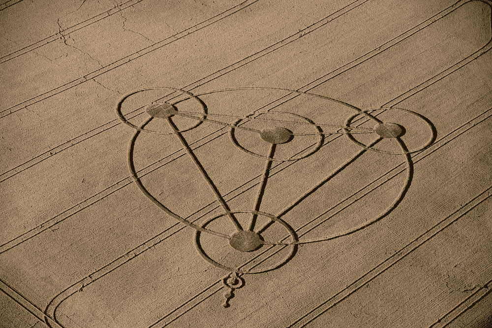
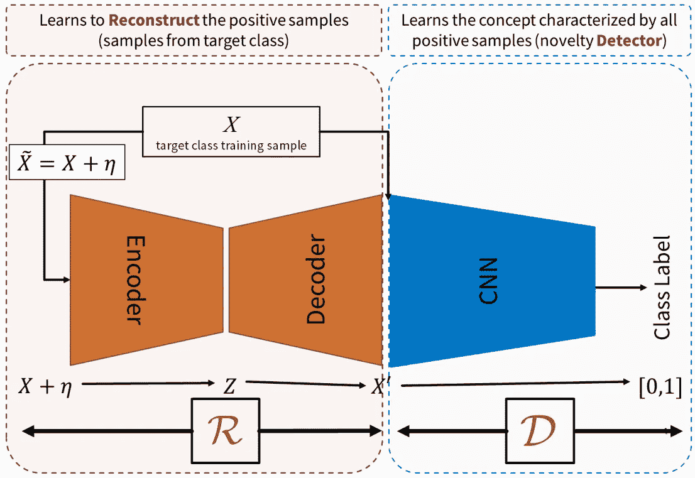
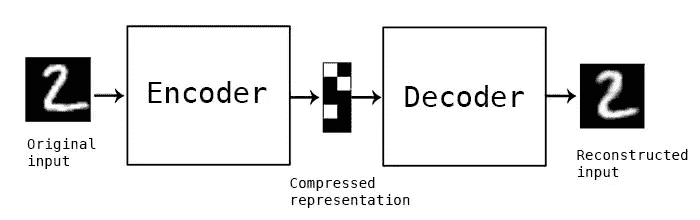

# 如何利用生成对抗网络在 Keras 中进行新颖性检测(上)

> 原文：<https://medium.com/hackernoon/how-to-do-novelty-detection-in-keras-with-generative-adversarial-network-part-1-e288ba745b9d>

新颖性检测的任务是对测试数据进行分类，这些测试数据在某些方面不同于训练期间可用的数据。这可以被视为“一类分类”，其中构建模型来描述“正常的”训练数据。当可用的“异常”数据的数量不足以构建非正常类的显式模型时，通常使用新颖性检测方法。一个应用包括来自关键系统的数据集中的推断，其中可用的正态数据的数量是巨大的，使得“正态性”可以被精确地建模。

这些包括医疗诊断问题的检测、复杂工业系统中的故障和失效检测、结构损坏、电子安全系统中的入侵，例如信用卡或移动电话欺诈检测、视频监控、移动机器人、传感器网络、天文目录和文本挖掘。

在本系列教程中，我将向您展示如何使用 Keras 框架实现一个用于新颖性检测的生成式对抗网络。第 1 部分介绍了该模型的一般工作原理，而第 2 部分介绍了 Keras 的实现。

# 模型结构

我们要建立的模型被命名为对抗学习单类分类器或简称为 ALOCC，如我的源代码所示。下图显示了该模型包含一个连接到 CNN 分类器的自动编码器，作为您可能在 GAN 中听说过的鉴别器。在继续之前，让我们快速回顾一下这两种独立的网络架构。

ALOCC model structure

# 自动编码器评论

Autoencoder 是一种数据压缩算法，其中有两个主要部分，编码器和解码器。

Auto-encoder

编码器的工作是将输入数据压缩到较低的维度特征。例如，28x28 MNIST 图像的一个样本总共有 784 个像素，我们构建的编码器可以将其压缩到一个只有 10 个浮点数的数组，也称为图像的特征。另一方面，解码器部分将压缩的特征作为输入，并重建尽可能接近原始图像的图像。Autoencoder 本质上是一种无监督学习算法，因为在训练过程中，它只需要图像本身，而不需要标签。由于它是一种无监督的学习算法，所以它可以用于未标记数据的聚类，正如我在以前的帖子中看到的那样— [如何用 Keras 进行无监督聚类](https://www.dlology.com/blog/how-to-do-unsupervised-clustering-with-keras/)。

[以前](/@curiousily/credit-card-fraud-detection-using-autoencoders-in-keras-tensorflow-for-hackers-part-vii-20e0c85301bd)，对来自目标类的样本进行训练的自动编码器的重构误差已被证明是新颖样本检测的有用度量。

# 甘评论

虽然 GANs 非常高级，对初学者来说可能令人望而生畏，但我发现新手画家(生成器)与新手鉴赏家(鉴别器)的类比非常容易理解。

Painter(Generator) vs. connoisseur(Discriminator)

两个雄心勃勃的人，一个画家和一个鉴赏家，正在向艺术行业迈出第一步。画家想哄骗鉴赏家给自己的画尽可能高的评分，而鉴赏家则想尽可能准确地辨别好画和坏画。所以他们一遍又一遍地重复这三个步骤，玩一个无限的游戏。

1.  **画师**根据自己之前的经验和鉴赏家的反馈(如果有的话)画了几幅画。
2.  **鉴赏家学会**分辨好的(例如梵高的杰作)和坏的(画家的画)。
3.  **画家学会**愚弄鉴赏家，让他把自己的画评为和梵高一样好——这里鉴别器网络(鉴赏家)的权重被冻结，只训练生成器(画家)。

经过数百甚至数千轮的相互竞争，新手画家变成了印刷大师，他的画几乎与梵高的画难以区分，而新的鉴赏家变成了专家，他能以无与伦比的精确度从成吨的复制品中识别出真正的真迹。

这个比喻告诉我们的是，在 GAN 中有两个独立的网络，生成器和鉴别器，它们被分别训练以最小化它们的损失，同时对抗性地改善彼此。

# 模型——对抗学习的一类分类器

类似于 GANs，所提出的体系结构包括两个模块，这两个模块在为检测任务而相互协作的同时竞争学习。

表示为 R 或重建模块的第一模块看起来类似于自动编码器，同时被对立地训练以联合最小化两个损失函数，

1.  正常输入的重建损失，重建的数据尽可能接近输入。
2.  欺骗鉴别器预测其生成的图像是真实图像，即欺骗鉴别器输出类别标签一。

表示为 D 或鉴别器的第二模块学习区分原始正常(类标签 1)样本和重构样本(类标签 0)。

r 学会有效地重构正的正常样本，而对于负的或新的样本，它不能精确地重构输入，因此，对于负的样本，它充当抽取器或非正式的失真器。

在测试阶段，D 充当实际的新奇检测器，而 R 通过充分重构阳性或目标样本以及抽取(或扭曲)任何给定的阴性或新奇样本来提高检测器的性能。

# 结论和进一步阅读

在这篇文章中，我们介绍了对抗性学习的一类分类器，首先快速回顾了两个紧密相关的模型结构，自动编码器和 GAN，然后介绍了我们将在下一篇文章**中使用 Keras 实现的主要模型架构。**

**我的 Keras 实现很大程度上受作者论文【https://arxiv.org/abs/1802.09088[的影响](https://arxiv.org/abs/1802.09088)**

## **准备好真正的 Keras 实现了吗？**

## **继续下一部分**

## **[如何用生成对抗网络进行 Keras 中的新颖性检测(下)](/@chengweizhang2012/how-to-do-novelty-detection-in-keras-with-generative-adversarial-network-part-2-546d97632f63)**

**[在 Twitter 上分享](https://twitter.com/intent/tweet?url=https%3A//www.dlology.com/blog/how-to-do-novelty-detection-in-keras-with-generative-adversarial-network/&text=How%20to%20do%20Novelty%20Detection%20in%20Keras%20with%20Generative%20Adversarial%20Network%20%28Part%201%29) [在脸书分享](https://www.facebook.com/sharer/sharer.php?u=https://www.dlology.com/blog/how-to-do-novelty-detection-in-keras-with-generative-adversarial-network/)**

***原载于*[*www.dlology.com*](https://www.dlology.com/blog/how-to-do-novelty-detection-in-keras-with-generative-adversarial-network/)*。***