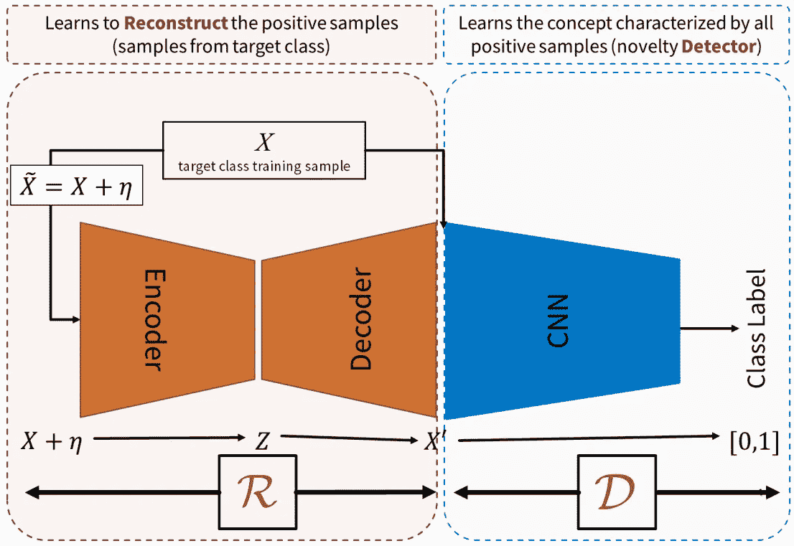
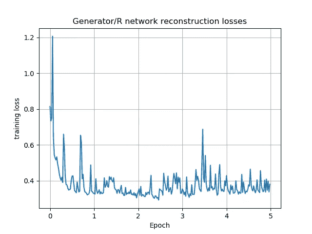
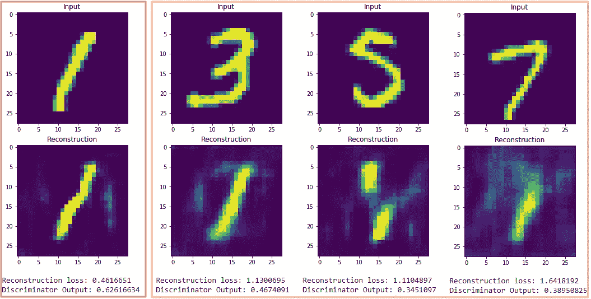

# 如何利用生成对抗网络在 Keras 中进行新颖性检测(下)

> 原文：<https://medium.com/hackernoon/how-to-do-novelty-detection-in-keras-with-generative-adversarial-network-part-2-546d97632f63>

前一部分介绍了用于新奇检测的 ALOCC 模型如何工作，以及一些关于 autoencoder 和 GANs 的背景信息，在本文中，我们将在 Keras 中实现它。

建议在继续之前对模型的工作原理有一个大致的了解。你可以在这里阅读第一部分，[如何用生成对抗网络在 Keras 中进行新颖性检测(第一部分)](/@chengweizhang2012/how-to-do-novelty-detection-in-keras-with-generative-adversarial-network-part-1-e288ba745b9d)

## 从 [my GitHub](https://github.com/Tony607/ALOCC_Keras) 下载源代码。

# 构建模型

让我们从上图所示的 R 网络开始。该模型在 Keras functional API 中实现。

R or reconstruction network

一些值得一提的要点。

*   为了提高网络的稳定性，我们在这个网络中使用步长卷积而不是池层。
*   在每个卷积层之后，利用批量归一化操作，这增加了我们的结构的稳定性。要了解更多，您可以参考我专门针对该主题的帖子，[一个用批处理规范化更快训练 Keras 模型的简单技巧](https://www.dlology.com/blog/one-simple-trick-to-train-keras-model-faster-with-batch-normalization/)。
*   `UpSampling`采用分层代替 Keras’`Conv2DTranspose`以减少产生的伪影，使输出形状更具确定性。
*   我们建议使用`LeakyReLU`层代替`ReLU`激活。它类似于 ReLU，但是它通过允许较小的负激活值来放松稀疏性约束。

D 或鉴别器的架构是一系列卷积层，这些卷积层被训练成最终在没有任何监督的情况下区分新样本或异常样本。

D or discriminator network

d 网络输出单个浮点数的范围相对于输入属于目标类的可能性在 0~1 之间。

# 训练模型

出于简单和可再现的原因，我们选择教导模型将标记为“1”的 MNIST 手写数字识别为目标或正常图像，而模型将能够在测试阶段将其他数字区分为新奇/异常。

我们在对抗过程中训练 R+D 神经网络。

当训练 D 网络时，它暴露于作为输入的重建图像和原始图像，其中它们的输出分别标记为 0 和 1。3d 网络通过最小化这两种类型数据的`binary_crossentropy`损失来学习辨别真实图像和生成图像。

当训练 R 网络时，从标准偏差采样的统计噪声被添加到输入中，以使 R 对输入图像中的噪声和失真具有鲁棒性。这就是上图中η代表的意思。R 被训练以共同减少重构损失和“愚弄 R 网络以输出目标类”损失。有一个权衡超参数控制这两个术语的相对重要性。

下面的代码构造并连接鉴别器和生成器模块。

请注意，在编译组合`adversarial_model`之前，我们将鉴别器的权重设置为不可训练，因为对于组合模型，我们只想训练生成器，您很快就会发现这一点。不会妨碍已经编译好的鉴别器模型进行训练。另外，`self.r_alpha`是一个小浮点数，用于权衡两个发电机/R 网络损耗的相对重要性。

Construct and compile model

随着模型的构建和编译，我们可以开始训练。

首先，仅提取 MNIST 训练集中的“1 ”,将统计噪声应用于发电机/ R 输入的“1”的副本。

下面是训练一批数据的代码。首先在具有不同输出标签的真实和生成的图像上训练 3d 网络。

然后 R 网络对同一批有噪数据进行两次训练，使其损失最小。

Train one batch

对于输出`g_loss`变量的最后一个提示，因为组合的`adversarial_model`是具有两个损失函数且没有附加度量的`compiled`，所以`g_loss`将是 3 个数字的列表，`[total_weighted_loss, loss_1, loss_2]`，其中`loss_1`是重建损失，`loss_2`是“愚弄 R 网络损失”。训练 GAN 网络的时间越长，通常会产生更好的结果，而在我们的情况下，过早停止训练会导致学习到的网络权重不成熟，而过度训练网络会使网络混乱，并产生不期望的输出。我们必须定义一个合适的训练停止标准。

作者提出，当 R 能够以最小误差重构其输入时，训练过程停止，这可以通过跟踪`loss_1`/重构损失来监控。

# 新颖性检测

下图显示了在 5 个时段的训练阶段期间的 R 网络重建损失，看起来重建损失在时段 3 结束时达到其最小值，因此让我们使用在时段 3 之后保存的模型权重来进行我们的新颖性检测。您可以从我的 GitHub 资源库下载并运行测试阶段 Jupyter notebook**test . ipynb**。

R network reconstruction loss

我们可以测试重建损耗和鉴频器输出。新/异常图像具有较大的重建损失和较小的鉴别器输出值，如下所示。其中手写“1”的图像为目标，其他数字为新奇/异常情况。

Reconstruction loss and discriminator output

# 结论和进一步阅读

我们介绍了如何利用生成对抗网络和编解码网络在 Keras 中建立一个新颖的检测 ALOCC 模型。

查看原文：<https://arxiv.org/abs/1802.09088>。

这里是[在 Quora](http://qr.ae/TUGryT) 上的一个有趣的问题，关于 GAN 是否可以做异常/新奇检测，由 GAN 的创造者 Ian Goodfellow 回答。

## 别忘了从 [my GitHub](https://github.com/Tony607/ALOCC_Keras) 下载源代码。

[在 Twitter 上分享](https://twitter.com/intent/tweet?url=https%3A//www.dlology.com/blog/how-to-do-novelty-detection-in-keras-with-generative-adversarial-network-part-2/&text=How%20to%20do%20Novelty%20Detection%20in%20Keras%20with%20Generative%20Adversarial%20Network%20%28Part%202%29) [在脸书分享](https://www.facebook.com/sharer/sharer.php?u=https://www.dlology.com/blog/how-to-do-novelty-detection-in-keras-with-generative-adversarial-network-part-2/)

*原载于*[*www.dlology.com*](https://www.dlology.com/blog/how-to-do-novelty-detection-in-keras-with-generative-adversarial-network-part-2/)*。*