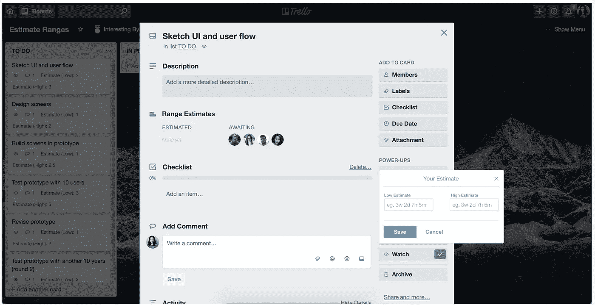
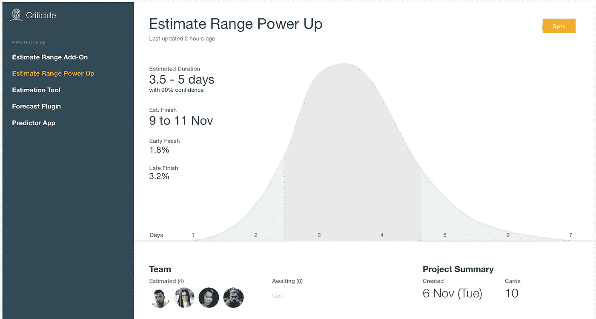
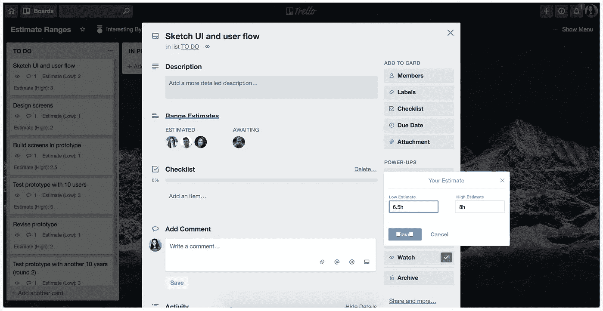
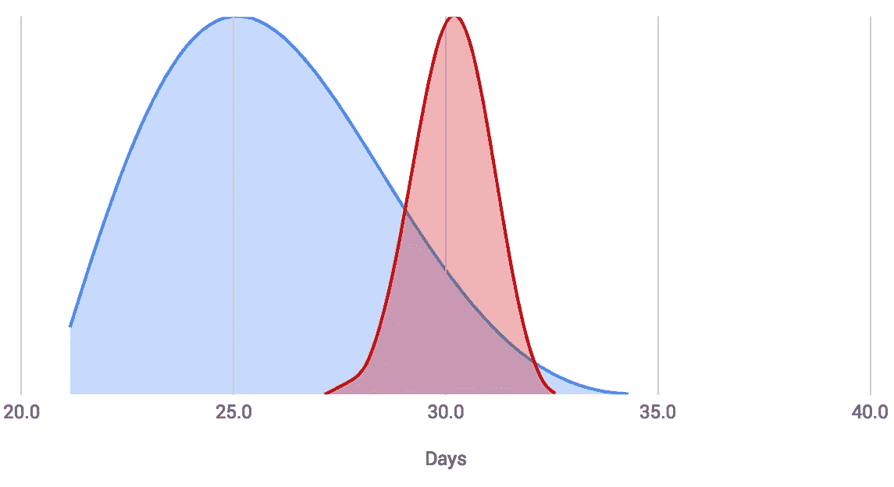

# 如何进行更可靠的评估

> 原文：<https://medium.com/hackernoon/how-to-do-smarter-estimations-7d67f27910b5>

## 您的技术业务的成功取决于此

Photo by [Giammarco Boscaro](https://unsplash.com/photos/zeH-ljawHtg?utm_source=unsplash&utm_medium=referral&utm_content=creditCopyText)

估计是我们日常生活的一部分，也是我们做出的大多数决定的一部分。在经营一家可行的企业时，评估尤其重要，尤其是当你是一家开发一种或多种软件产品的科技公司时。

> 对你的软件项目的评估有多可靠？你多久能在预算内按时交付一次？

从“要花多少钱？”到“需要多长时间交货？”科技公司经常需要评估来对任何软件项目做出决策。但科技公司很少量化和衡量他们估计的可靠性。其原因在于，除了在整个[软件开发](https://hackernoon.com/tagged/software-development)过程的不同时间点可用或缺少的信息之外，还有许多变量和未知因素，以做出一个或多个决策。因此，由于信息的稀少，不确定性是常态(例如，我们只有一个想法，我们想知道是否值得花费一定数量的美元来抓住这个机会？).所以对于那些开发软件的人来说，这回避了一个问题:

> 您当前的估算方法花费了您的组织几十万、几百万或几十亿美元？

这个问题非常重要，原因有几个。首先，如果你的评估被误解和/或沟通不畅，那就是钱打水漂了。第二，如果您的团队不能产生一致的估计，您的组织如何可靠地比较跨项目的预算和时间估计？又一次，更多的钱付诸东流。第三，如果你做的评估实际上只不过是一个“评估剧场”，那就是浪费时间和金钱，因为如果你的评估更可靠，这些时间和金钱本可以用来为你的企业获得更大的优势。

虽然做出估计似乎很容易，但研究表明做出[可靠的估计很难。](https://hackernoon.com/why-estimating-is-so-damn-hard-d0f945f30185)事实上，我们[天生擅长谎报估计](https://hackernoon.com/how-not-to-lie-about-estimates-a5b4a03fd8e0)。但是我们今天使用的评估技术没有一个能帮助我们防止谎言。相反，我们的评估技术是不准确的，不一致的，很容易被组织内所有级别的人误解。这是我们开发软件的方式中的一个重大弱点，正如我们所说的那样，它使公司花费了数万美元，如果不是更多的话。

# 问题是

在我们生活的世界里，科技已经融入到我们生活的方方面面。因此，我们开发软件的方式变得越来越有竞争力。在某些方面，随着人们将技术融入日常生活和业务，技术也变得越来越具有挑战性。然而，我们并没有足够认真地对待软件评估。

> “没有一种独特的方法是大多数人都使用的。相反，有很多不同的方法。”— [产品习惯](https://producthabits.com/engineering-estimates/)

有这么多不同的方法这一事实本身就是一个问题。会不会是因为软件专家不知道评估中有一个[风险因素](https://hackernoon.com/why-estimating-is-so-damn-hard-d0f945f30185)，他们需要接受这方面的教育？然而，估算问题的复杂性有几个不同的组成部分:

## 确定性是昂贵的

最终的估计是只做软件项目本身。然后我们会知道它的确切价格和花费时间。然而，正如 [Barry Boehm](https://en.wikipedia.org/wiki/Barry_Boehm) 的[不确定性圆锥](https://en.wikipedia.org/wiki/Cone_of_Uncertainty)所示，这既不可行也负担不起——一个项目在开始时是高度不确定的，不确定性只会随着项目的进展而减少。

## 估计，不是猜测

当在软件开发中做决策时，猜测是我们能做的最危险的事情。令人惊讶的是，我们每天都在这样做，却常常没有意识到，这是更令人担忧的部分。我有机会在我咨询和工作过的几乎每家公司观察到这一点。根据我的观察，发生这种情况是因为我们不能立即看到或感觉到不良估计的影响。类似地，我们没有办法简单地衡量产生低质量估计的成本。

## “评估剧院”

我们没有办法容易地检测、想象和阐明与我们今天产生的估计的当前质量相关联的问题和缺点，直到为时已晚(例如，软件项目失败)。从第一次提供估算到我们期望实现某种结果、价值的交付或失败，通常要经过相当长的时间。

## 否认的危险

我们是人，我们喜欢正确。我们更喜欢的，是告诉自己我们想要或需要相信的故事。这通常是因为我们相信我们对我们所知道的东西非常有信心，或者对某个特定的结果有强烈的渴望，因为一些重要的事情，比如升职或奖金，取决于它。然而，不认识到我们的认知偏差和非理性思维的[含义将对产生的软件评估的可靠性产生负面影响。](/critically-deciding/why-we-needed-critical-thinking-yesterday-6321af72bea9)

**总之，这个问题的根本原因是我们对软件评估的期望与现实不符。**我们不认为软件开发中的不确定性是风险分析的一种形式。然而，对于每个软件项目，我们最常问的两个问题是(例如，“成本是多少？”以及“需要多长时间？”)对是否投入时间和金钱起着重要的作用。那么，如果我们对软件评估采取一种更有纪律和更科学的方法会怎么样呢？如果科技公司的决策是基于更诚实、准确和可信的估计，它们可能会节省数十万甚至数百万美元。让我们来看看如何把那些无用的估计变成更有用的东西。

# 实现更可靠评估的 4 个简单步骤

有足够的证据表明，软件评估需要比蛮力、快速教程或阅读几篇文章多一点的努力。事实表明[的估计很难](https://hackernoon.com/why-estimating-is-so-damn-hard-d0f945f30185)。走进任何一家科技公司，我非常肯定，在过去的一年里，至少有一个项目延迟交付、超出预算或失败。这是因为[软件开发天生就是解决问题的](/swlh/mindset-over-madness-11ea7f29e0c3)。

要开始在科技行业做出更明智的评估，我们首先需要承认，每一次评估实际上都是一种风险分析。没有这一点，您将无法成功地确定合适的评估技术。如果您接受(或乐于接受)软件评估是一种风险分析，请继续阅读如何进行更明智的评估。

## 步骤 1:产生一个范围的估计值

如果你做到了这一步，而没有做其他事情，你已经取得了显著的进步，因为提供一个范围的估计，而不是一个单一的值或抽象的点(例如，S，M 或 L)更准确。更具体地说，单个值在数学上与比一系列值小得多的置信水平相关联，并且抽象点容易被误解，因为“中等”可能对不同的人翻译成不同的数值。无论是估计时间还是金钱，所有的软件估计都应该作为一个范围。

*   ***例如，*** 不要将某项工作标注为“中等”或说大约需要 3 天才能完成，而是提供一个估计范围，例如“2 到 4 天”。

## 第二步:以 90%的置信度进行评估

当提供一个估计范围时，你应该有 90%的把握。一种简单的思考方式是，如果你进行了多次评估，你应该有 90%的机会是正确的。如果你最终的正确率超过或低于 90%，这是因为[你要么高估了，要么低估了](/critically-deciding/why-we-needed-critical-thinking-yesterday-6321af72bea9)，需要调整你提供的估计范围，使这个范围反映出你 90%的正确率。请注意，以 90%的置信度进行评估确实需要一些练习和校准。

*   ***例如，*** 与您的下一次评估保持跟踪实际结果与您的评估进行比较。在此基础上，如果你之前的估计是在自信之下，利用学习提供一个更宽的范围，或者如果你之前的估计是过度自信，提供一个更窄的范围。

## 步骤 3:确定估计的概率

在科技行业，很难得到保证。单一价值评估也更容易变成许诺或承诺，并具有更高的相关风险。因此，由于开发软件的不确定性，产生具有相应概率范围的软件估计更诚实，因此更可靠。

*   ***例如，*** 使用蒙特卡罗模拟使您能够确定软件估计的概率，特别是项目将在特定时间范围内交付的概率。在即将到来的 sprint 中，从每个团队成员那里简单地收集每个故事/任务的时间范围估计，可以是 Google 工作表，也可以是 Excel 电子表格。然后汇总每个人的估计值，并应用蒙特卡罗技术为项目持续时间的估计值创建一个概率分布。根据这种分布，您可以将概率分配给相应的估计范围。

## 第四步:将你的评估付诸实践

评估应该不断更新并始终可见，否则它们是无用的。我们每天都在不断学习新的信息(例如，一个项目有多少进展或没有进展，我们今天在一个项目上花了多少钱，等等)，因此为了项目进展的最佳透明度，原始的时间和成本估计应该随着我们学习这些新信息而频繁更新，以获得项目走向的最准确的视图。

*   ***示例操作*** :在每日站立会议上，分享学到的知识以及它们如何影响您最初的时间/预算估计，分享更新的估计，并解释这会如何影响您的交付成果。作为一名经理，一定要汇总来自相关团队成员的更新评估，以便从迄今为止花费的资金和时间方面获得项目执行情况的更新整体视图。

有了这些步骤，您和您的团队现在已经准备好开始产生更智能和更可靠的软件项目评估了。

# 每次评估都轻而易举

从现在开始，使每一个评估都变得轻而易举的关键是产生可靠的评估。[扎特·拉纳](https://medium.com/u/1b9c67617a3?source=post_page-----7d67f27910b5--------------------------------)最近写了一篇关于[两类知识(或如何变聪明)](/personal-growth/the-two-types-of-knowledge-or-how-to-be-smart-b06403c6858b)的文章，其中写道:

> “幸运的是，进化也赋予了我们学习的能力。有了实验、预测和修正的头脑，我们就能积累经验知识，以适应其他相关环境。”

这种说法也适用于我们思考软件项目评估的方式。今天，我们对学习持开放态度，正如广泛采用的[敏捷](https://hackernoon.com/tagged/agile)方法所证明的那样，例如[计划扑克](https://www.mountaingoatsoftware.com/agile/planning-poker)和 [T 恤尺寸](/radius-engineering/project-estimation-through-t-shirt-size-ea496c631428)，以及“测试和学习”的心态。我们也试图预测、纠正和“建立经验知识”,但是，实际上，我们在这一部分没有走多远。[敏捷方法](https://en.wikipedia.org/wiki/Agile_software_development)几乎不会产生经验知识，最重要的是，我们在实践中既不使用也不发展这些知识。我们没有充分利用我们现有的知识，并使其保持最新状态，以使其有用。这通常是因为它太麻烦了，我们中的许多人缺乏如何做好上面第 3 步和第 4 步的知识。好消息是，目前我正和几个人一起工作，让上面的 4 个步骤变得快捷易用。下面是一些即将推出的概念:

## 无缝收集无偏见的估计

Trello Power Up — Seamlessly enter estimate ranges to any card

每个团队成员只能看到他们输入的评估，这样他们就不会偏向他们同事的评估。然而，每个人都可以看到谁已经提供了对任务/问题/故事的评估，以及谁仍然需要提供评估以鼓励整个团队的透明度。

## 几秒钟内提供可靠的评估报告

[Criticide](https://www.criticide.com/)’s project estimation report

[cribed](https://www.criticide.com/)生成诚实且更准确的评估报告，使沟通更容易。当任何团队成员在整个项目执行过程中根据新的学习和/或发现更新他们的估计时，这些报告也很容易保持最新。

## 我们可以毫不费力地更新评估

Trello Power Up — Easily update any existing estimate

我们在执行项目的过程中学习和发现新的信息。[cribed](https://www.criticide.com/)让个人可以毫不费力地更新他们的估计。更重要的是，只需点击一下鼠标，即可更新对项目评估的任何更改，并获得最新的整体视图。

> 为了提高生产成功技术产品的可预测性，你在做什么？

# **想要提前访问？**

[**注册我们的 JIRA 应用程序和 Trello Power Up 准备就绪后，您会收到通知。**](https://criticide.com/early-access-jiratrello-plugin) 把自己从今天的痛苦中解脱出来；)

**想了解更多信息吗？**在 amanda@criticide.com 给我们发电子邮件，或者[关注我们](https://medium.com/critically-deciding)接收即将发布文章的通知。

## 学到了什么？拿着👏说“谢谢！”并帮助他人找到这篇文章。

*你想多读书吗？* [*关注我*](/@amandakwoo) *或* [*阅读更多此处*](https://medium.com/critically-deciding) *。*

*你可能也喜欢:*

One-Off Human Estimate (blue) vs. Monte Carlo Estimations (red)

# 如何用蒙特卡罗模拟改进估计

一种全面的方式开始产生更准确的估计。*即将推出！* [*跟随批判决定*](https://medium.com/critically-deciding) *得到通知。*