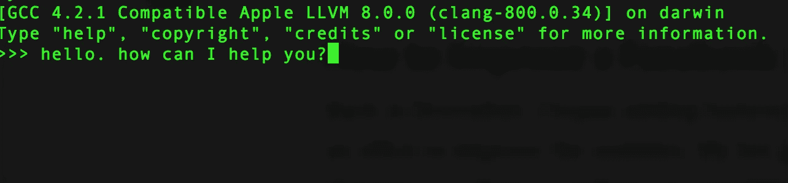
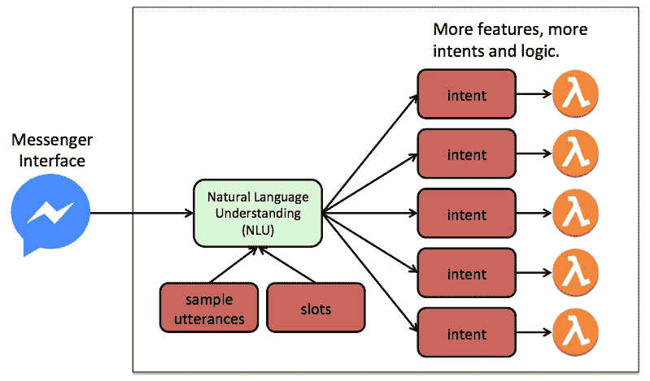
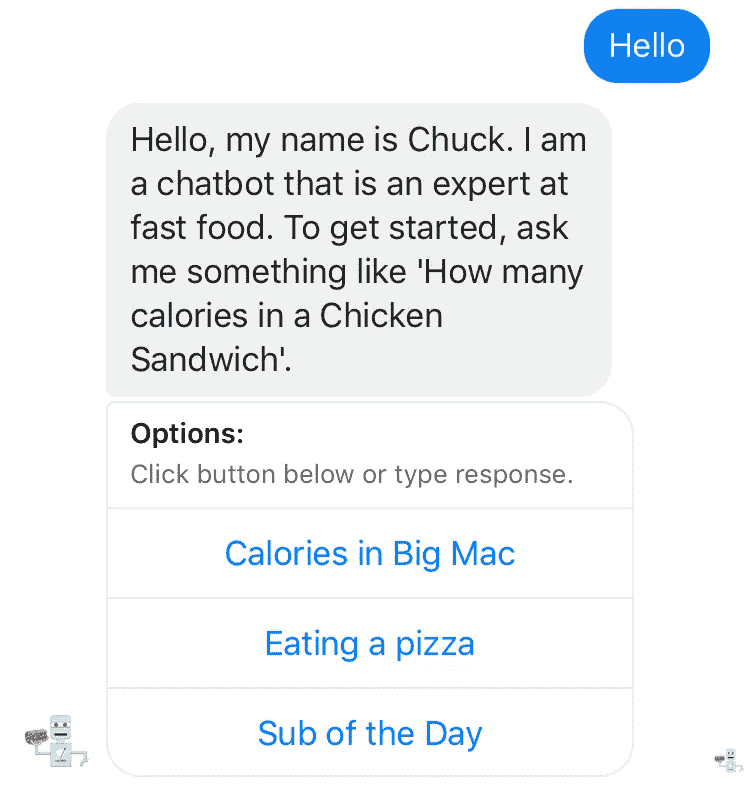
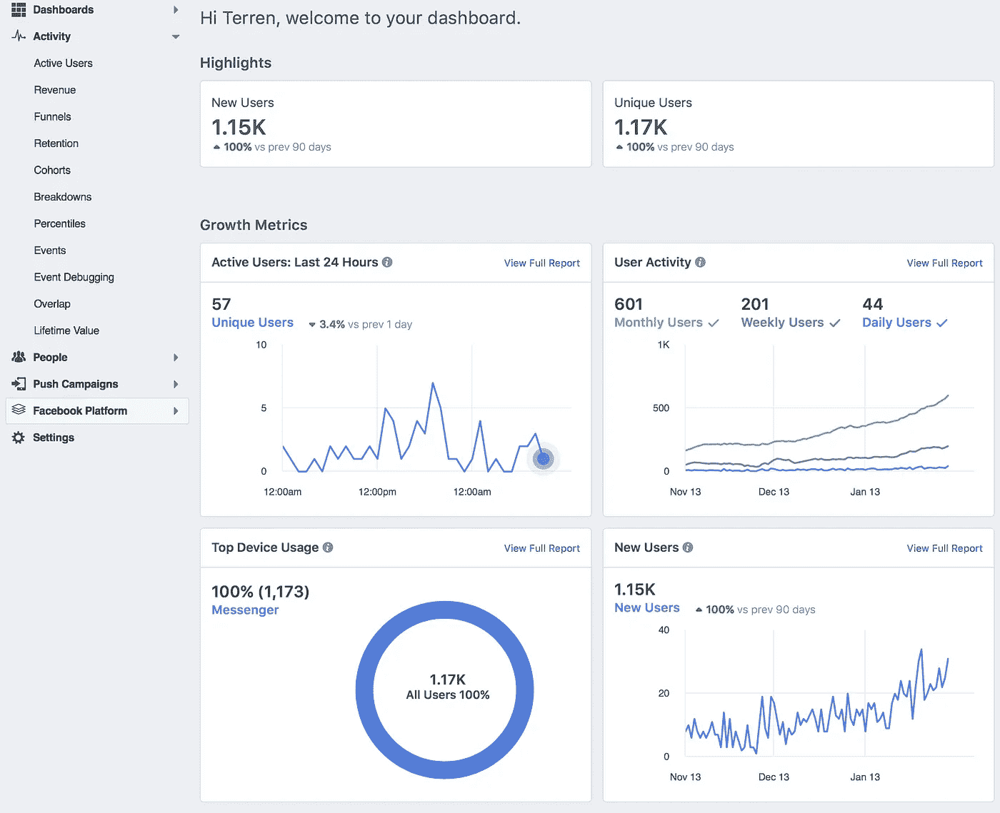
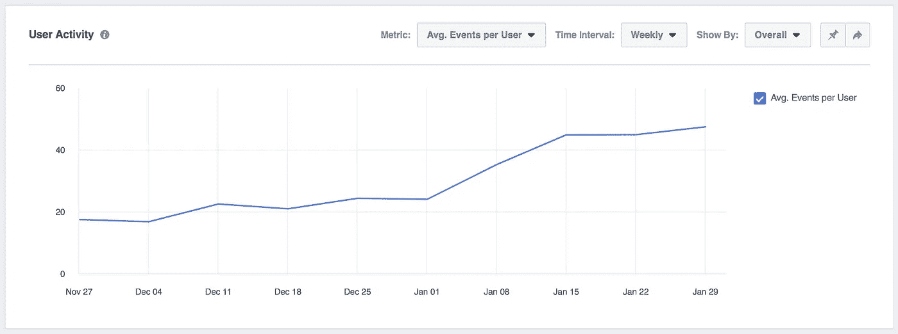
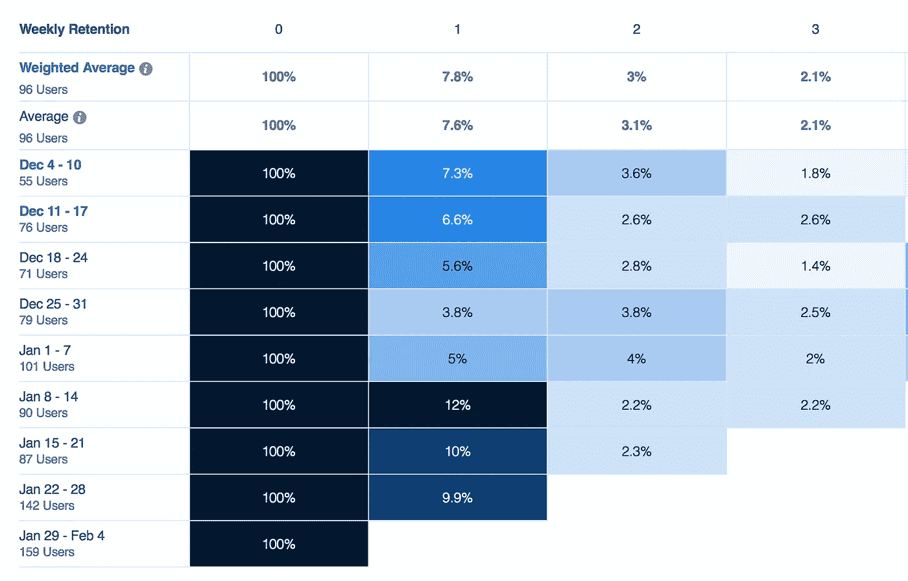
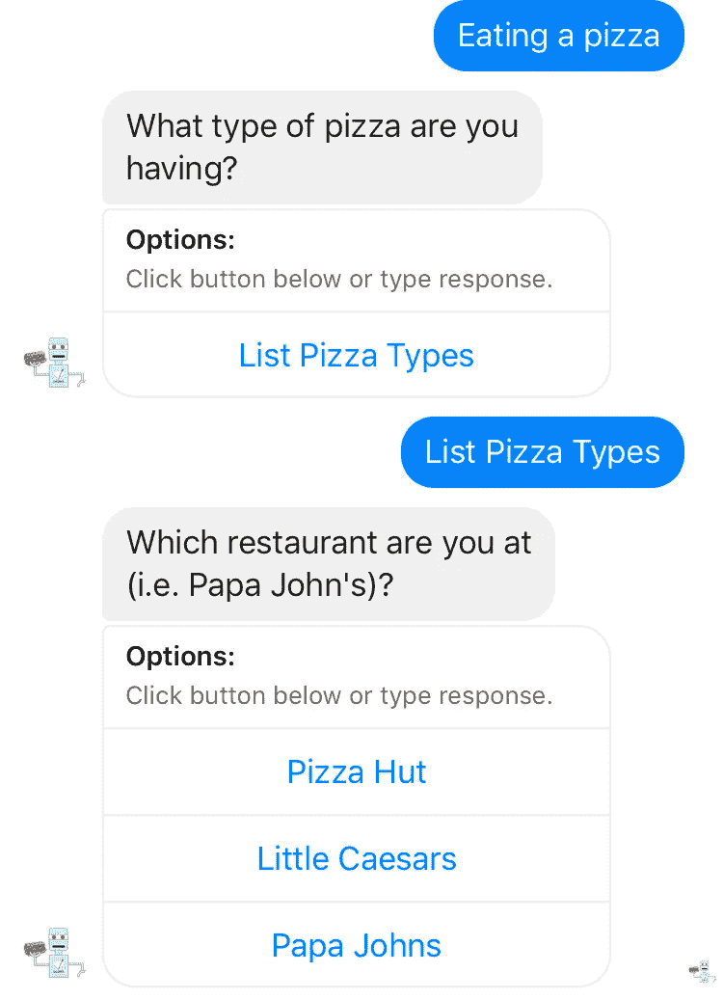

# 如何让聊天机器人的保持时间和对话长度翻倍

> 原文：<https://medium.com/hackernoon/how-to-double-retention-and-dialog-length-for-your-chatbot-4f63564c050>

Image courtesy of [Geralt](https://pixabay.com/en/users/geralt-9301/) on Pixabay

我是一名软件工程师，目前正在开发聊天机器人。我已经在亚马逊 Alexa 平台上发布了二十多个自定义技能，去年发布了我的第一个 Facebook Messenger 聊天机器人，名为 [Chuck](https://m.me/fastfoodcaloriecounter) 。

我衡量成功的标准是用户接受了多少机器人的教育或娱乐。最好的 KPI 是对话的保持力和深度。以下是我对这一点如何应用于为 Facebook Messenger 编写的应用程序的最新见解。NLU 和编排层是用 AWS Lex 编写的，还有用 NodeJS 编写的 AWS Lambda 函数。

# 什么是理想的聊天机器人？

理想的聊天机器人是我们在《太空漫游》中看到的 HAL 9000。只是一个闪烁的光标或麦克风，我们可以问任何问题。没有约束，只有答案。在将此应用于 Facebook Messenger 周围的软件工具时，该架构看起来是这样的。

自然语言理解(NLU)模型擅长破译用户请求，很少有规模问题。限制应用程序的是可以编写多少特性来支持用户提出的成千上万个不同的请求。一旦这些功能激增，挑战就变成了发现这些功能，即机器人“知道”什么。一个闪烁的光标有无限的选择，但一个冰冷的对话开始。用户会有基于机器人品牌的期望，但除此之外别无其他。

传统的视觉应用通过在提供选项的设备屏幕上提供菜单和小部件来处理特征发现。一个有效的聊天机器人也需要这样的方法。一个好的方法是为用户提供每个响应的上下文，提示什么是可能的。将发现构建到响应中鼓励对话，并主动吸引用户。

# 如何改进 Facebook Messenger 聊天机器人

回到[12 月](https://chatbotsmagazine.com/when-to-use-buttons-in-facebook-messenger-bots-504e36952036)，我开始给我的 Facebook Messenger 机器人添加按钮，努力提高可用性。这是对使用率增长乏力的回应。我的机器人功能越来越多，因为它吸收了更多的数据和算法来操纵它。在用户不知道它的新功能的情况下，它被卡住了。

我尝试了不同的方式在脸书网页上宣传这些功能，但都没有效果。例如，我通过张贴展示新功能的机器人视频演示看到了微不足道的收获。在新闻供稿中撰写文章时也获得了类似的结果。在机器人响应中添加按钮确实提供了我想要的提升。

# 将按钮设计到用户交互中

按钮通过向用户提供清晰的方向来增加用户的反应。让我们从用户用“你好”或介绍开始对话时机器人的最初反应开始。

在回答中用清晰的语言写下来是很重要的，包括提供一个短语样本(例如“一个鸡肉三明治有多少卡路里”。)添加按钮则更进了一步，而且证明更加有效。用户只需点击一个，另一个响应就会出现。它还节省了用户键入潜在请求的时间。移动设备很难控制拼写，用户倾向于缩写单词。按钮简化了用户体验。

# 添加按钮的结果

现在来看看进展。我使用脸书的分析工具来跟踪详细的使用情况。这对于衡量应用程序内所做更改的反馈至关重要。如果您以前没有使用过，这里提供了一个示例控制面板。

第一个成功标准是对话的深度。我想用我的机器人教育用户。这可以通过跟踪给定用户在退出之前与机器人来回回复的次数来量化。这是一张图表，记录了我添加按钮后惊人的增长。每位用户的活动增加了一倍以上。

Growth of session length after buttons added in early January.

下一个成功指标是关于保留。如果用户认为他们收到了有用的信息，他们会回来。关于这一点，最简单的观点是每周保持，每天的统计数据显示类似的成功。

Retention of users after buttons added in early January.

自从我添加了按钮后，第一周的保留数几乎翻了一番。不太成功的是第二周的保持率略有下降。第 2 周以上的样本量对这些人群来说并不重要，但随着样本量的增加，这将成为下个月监测的一个趋势。

# 按钮的限制

最大的限制是按钮占用的屏幕空间。聊天对话框被占用的空间压得喘不过气来，而使用 Messenger，没有字体大小来缩小它。会话的历史记录在即时查看时会丢失，但用户可以回滚。

Messenger 一次呈现多达三个按钮，因此用户可能会将他们的思维局限于他们可以单击的内容。这是一个谈论比萨饼的真实对话。

这些按钮会限制用户的思维，并使结果偏向所呈现的内容。例如，这个机器人知道多米诺骨牌，但是它被选择的频率与那些呈现为按钮的频率不同。我试图用按钮上方的标签来强调这一点——“点击 ***下方的按钮，或者输入回复*** ”

# 结论

按钮是设计一个[聊天机器人](https://hackernoon.com/tagged/chatbot)的基本部分。它引入了一些视觉约束，但值得加倍保留和交易深度。

关于底层[技术](https://hackernoon.com/tagged/technology)的更多信息，这里是机器人的源代码，包括设计文档。

 [## 特伦彼得森/卡乐里计数器

### 卡路里计算器-基于 AWS Lex 的聊天机器人，根据不同的快餐店计算卡路里。这是一个…

github.com](https://github.com/terrenjpeterson/caloriecounter)