# 如何保存博物馆网站上的高分辨率图像

> 原文：<https://medium.com/hackernoon/how-to-download-hi-res-images-from-museum-websites-b4446387e75d>

我在出版业工作的时候，曾经做过很多图片研究。我喜欢深入一个主题，并揭示惊人的，鲜为人知的，捕捉特殊时间和地点的图片。

然而，在互联网上的这些搜索中，我会经常遇到那些竭尽全力阻止你下载图片的网站。

博物馆网站对此尤其恼火，因为这些图像通常是公共领域。

一半的时间，同一个机构正在运行某种开放获取程序，但还没有抽出时间来使一切都可用。

当我遇到我知道高分辨率存在的情况时，我下定决心要得到它们。我喜欢把东西拆开来修修补补。

这是你怎么做的。

## 放弃

> **尊重版权**。出于灵感/个人用途下载公共领域图像是一回事。剽窃内容创作者是另一回事。
> 
> **这些“技巧”可能不会永远奏效**。系统管理员最终会解决问题。也许他们会读这篇文章…如果这些方法停止工作，你可能会也可能不会找到一个解决办法。
> 
> 我给你的是一张网，不是一条鱼。这些技术并不详尽，但是如果您使用它们，您应该有工具在不同的站点上进行试验。

因此，*仅出于教育目的*，这里是你如何侵入…

# 国会图书馆

可能是互联网上最大最好的历史图片收藏。极其重要的令人难以置信的收藏。

他们的大量扫描可以下载，格式是华丽的、巨大的 TIF。谢谢 LOC——这就是你的做法！你让其他机构蒙羞！有些不是。*但它们通常仍然存在，隐藏在服务器上*。

让我们看一个例子。

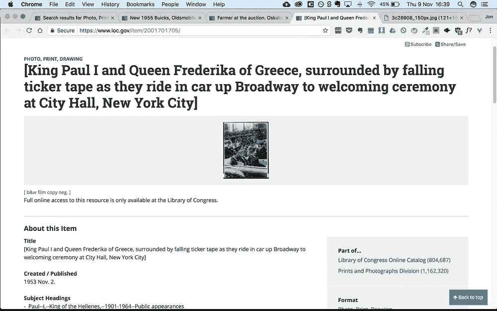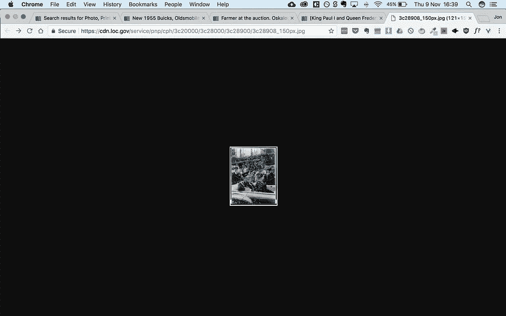

Unlike many of their records, this example has no download options. Open the thumbnail in a new tab and you get disappointment. They claim “Full online access to this resource is only available at the Library of Congress”. Hmmm, let’s just see about that shall we?

锁定文件系统很容易被破解。似乎有 3 种主要尺寸的 jpeg 和 2 种主要尺寸的 tif。

jpeg 文件名以 **_150px** 、 **r** 或 **v** 结尾。举个例子:*文件名*r.jpg。

TIF 以 **u** 或 **a** 结束。

在上面的例子中，让我们看看当我们用一个 **r** 替换缩略图 **_150px** 时会发生什么。

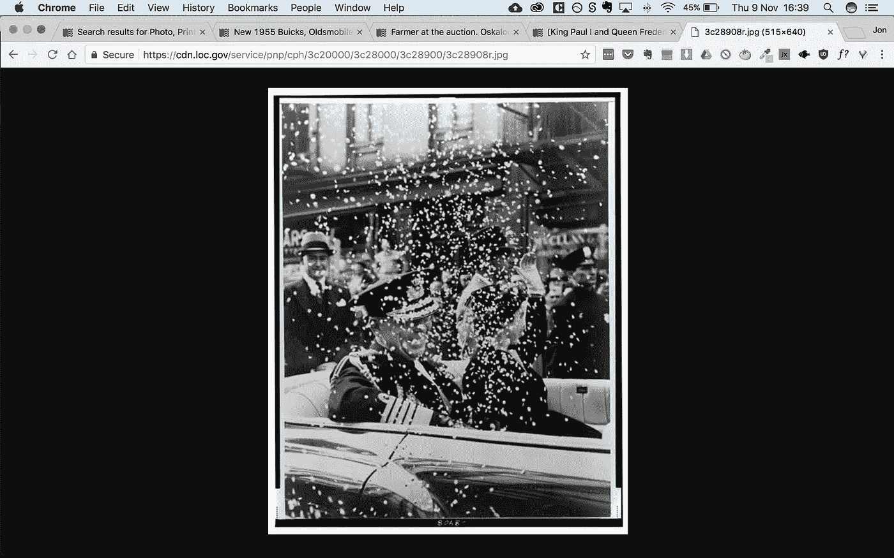

Bingo

大图。就这样。用 **v** 再试一次，你会得到更好的图像。用 **u.tif** 或 **a.tif** 试试，你会得到…

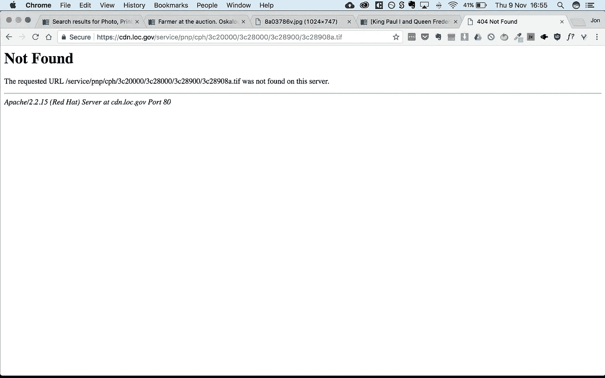

Failure

修复很容易。如果您发现您*可以*以 tif 格式下载的图像，您会从下载地址看到 TIF 位于“主”文件夹，而不是“服务”文件夹。在网址的这一部分把“服务”改成“主人”,你就可以开始了。

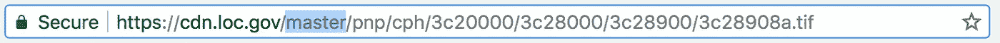

如果你运气好，一个高分辨率的 tif 将开始下载。一些图像看起来只被数字化到了 **u** 级别，但是对于大多数用途来说，它们应该足够大了。

下载愉快。

# 拉斯维加斯大学

这个有点棘手，但还是相当可行的。

实际上有几种进去的方法，但我会告诉你最简单的。

这是霍华德·休斯在游行时的照片。

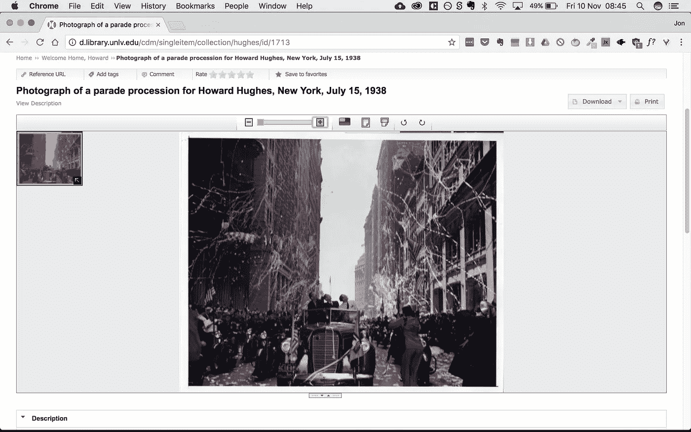

它可以通过下载按钮下载，但我们现在要忽略它，并以黑客的方式下载。这样，你就可以对那些*没有*下载按钮的文件使用这种技术。

在一个新的标签中打开图片，你会看到网站吐出了图片的一小部分，这是非常无用的。

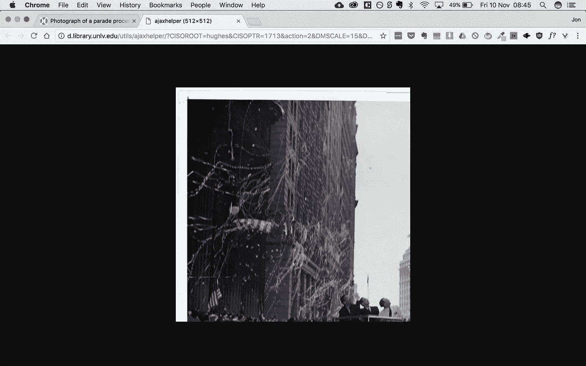

不过，看看网址，有一些有用的信息:

http://d.library.unlv.edu/utils/ajaxhelper/?ciso root = Hughes & ciso ptr = 1713 & action = 2 &**DM scale = 15**&**DM width = 512&DM height = 512**&DMX = 0&DMY = 0&DM text =&DM rotate = 0

这里重要的位用粗体表示: **dmscale** 、 **dmwidth** 、 **dmheight** 。将缩放比例更改为 100，并将宽度和高度更改为记录页面上列出的值(在本例中为 6016 x 4948)，点击 return，您将获得一个可爱的大 jpeg 文件供下载。

如果你找不到尺寸，改变比例为 100，把尺寸放大(5000+)，看看图像是否被裁剪。如果是，适当增加尺寸，直到它包含整个图像。

许多档案馆使用类似的系统。一旦你知道怎么做，克服它就变得非常容易。

# BNF

法国国家图书馆是另一个图像宝库。他们已经数字化了一些美丽的书籍，但他们让下载高清内容变得相当困难。幸运的是，我们可以使用 Chrome 的开发工具来查看引擎盖下的内容，然后使用上述相同的原则来获得全尺寸的 jpegs。

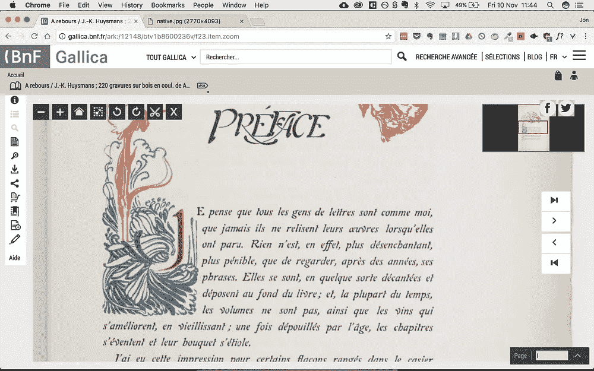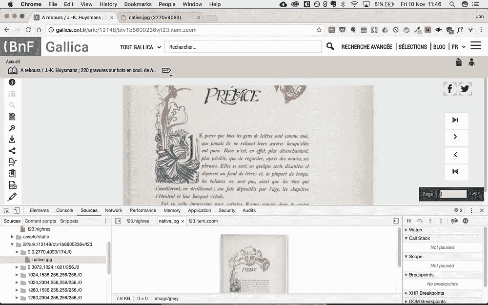

Find an image and open the console in Chrome.

找到一个项目并快速浏览页面。一旦你找到你喜欢的图像，右击**检查**。点击检查器顶部的**来源**，你会看到一个文件夹，上面写着:

http://gallica.bnf.fr/iiif/ark:/12148/**btv1b 8600236v/f24/0，0，2770，4093/174，/0**

这是指(从左至右)体积、**开本**、**剖面坐标**、**宽度**、**高度**、**分辨率**、**旋转**。

打开最上面的文件夹，里面应该有完整图像的细节。

**页码后的前两个数字将是 0，后两个数字将给出真实尺寸**。

右键单击检查器中的预览图像，并在新标签中打开。

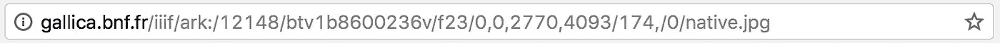

为了生成完整的图像，在 url 中单击并将 f23/后的值更改为**full/full/0/native . jpg .**

您也可以将前两个值设置或保持为 0，将后两个值更改为全尺寸(如 2770、4093)，并将斜线后的数字**更改为全宽度**(本例中为 2770)。

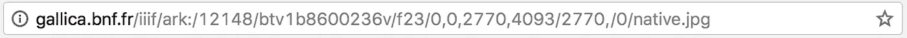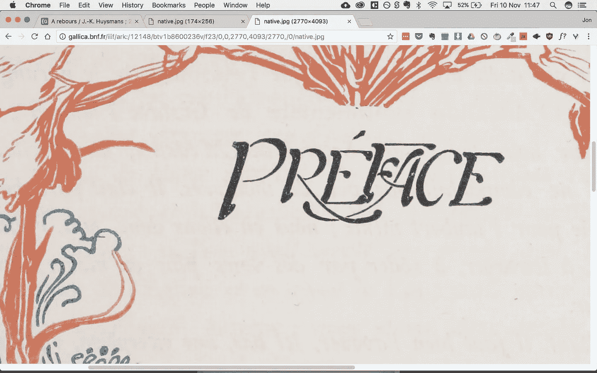

Boom. Massive image.

# 芝加哥大学

协议类似于上面的。

找到一个可缩放的图像。

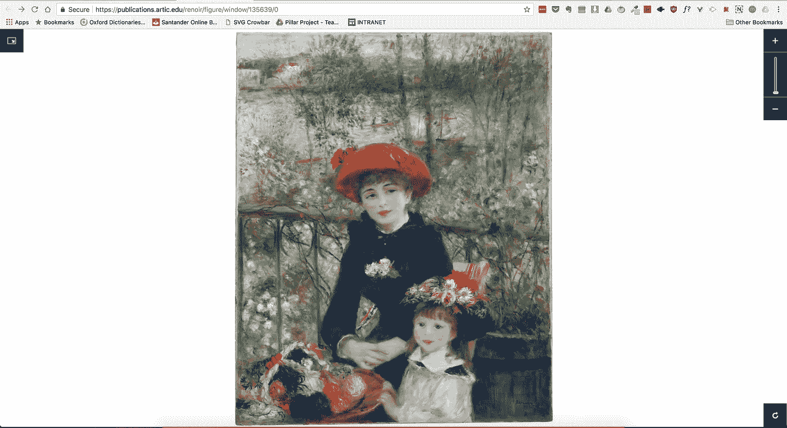

检查图像并在新标签中打开其中一个图块。

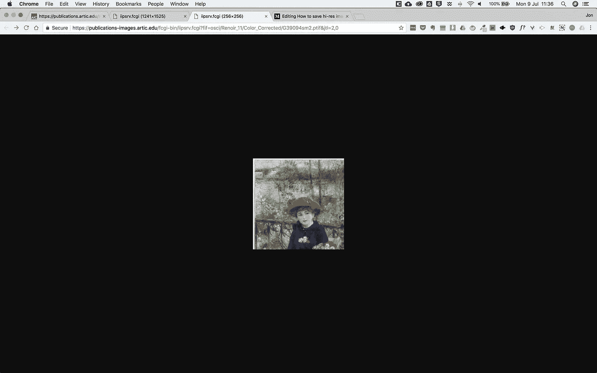

用 **& cvt=jpeg** 替换最后一个命令 **& jtl=x，x**

这应该给你一个相当大的整个图像的版本。还可以通过添加命令 **& wid=x** 来设置全图的宽度。

应该可以定义 **wid=full** ，但是，令人烦恼的是，服务器似乎有一个最大值限制，这并没有产生一个更大的文件。

通过更仔细地查看源代码，我们可以找出源文件的确切大小。这更专业一点，但请相信我的话，看看下面的截图:

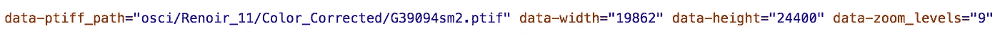

19862!这是巨大的！我试着把宽度设置成那样，虽然我没有得到那个尺寸，但服务器确实返回了一个两倍于“完整”宽度图像大小的文件。奇怪。如果你想自己做这件事，就投 5000 进去看看会发生什么。

目前最好的选择似乎是:

1.  检查图像并找到一个图块
2.  在新标签页中打开互动程序
3.  用命令**&wid = 5000&CVT = JPEG**替换 url 的 **jtl** 位

这将产生一个相当大的 jpeg，对于大多数目的来说已经足够好了。举例来说，你或许可以把它印在一本书上…但它不是一张超高清海报大小的图片。

如果有人知道如何得到原来的 tif，请告诉我！

# 斯坦福图书馆

像 BNF 一样，这是建立在 IIIF 协议上的。令人恼火的是，下载要复杂得多，因为要绕过几个路障。首先，他们完全屏蔽了创建大图像的能力。该功能就是不起作用，所以我们需要使用一个方便的工具来将所有的瓷砖拼接在一起。没什么难的，只是需要多一点时间。我会尽可能清楚地介绍:

## 第一部分

1.  打开一个图像页面。
2.  打开开发者工具。
3.  单击网络选项卡。然后点击 XHR。
4.  刷新页面—您应该会看到一些文件加载到左侧面板中。
5.  选择 **info.json** 然后右键点击“复制链接地址”。

以下是一些图片，以韦恩·格雷兹基为例:

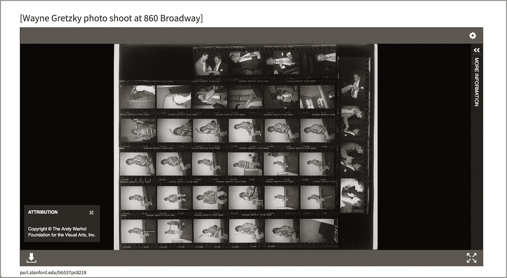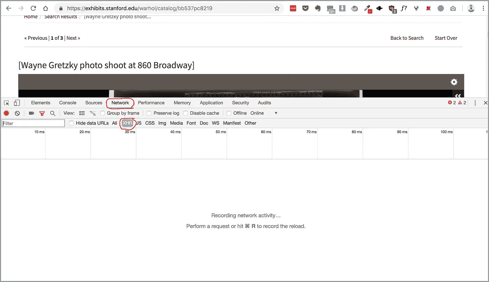

Open Developer Tools, select Network, then click XHR. I’ve circled them in red. Then refresh the page.

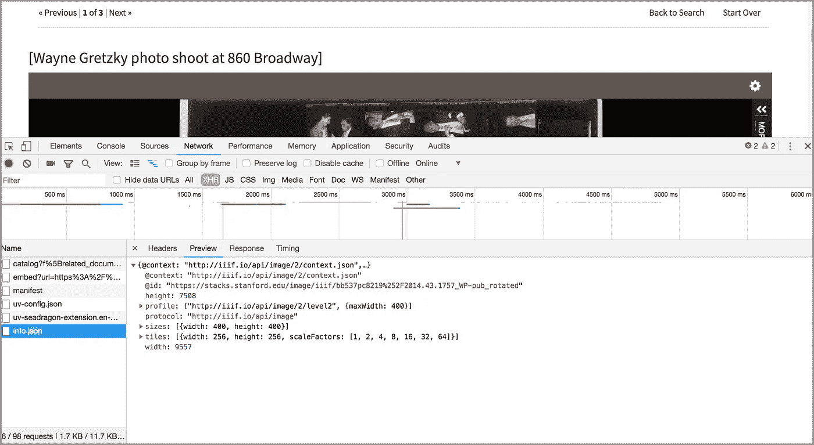

Select info.json. Right-click and copy the link url.

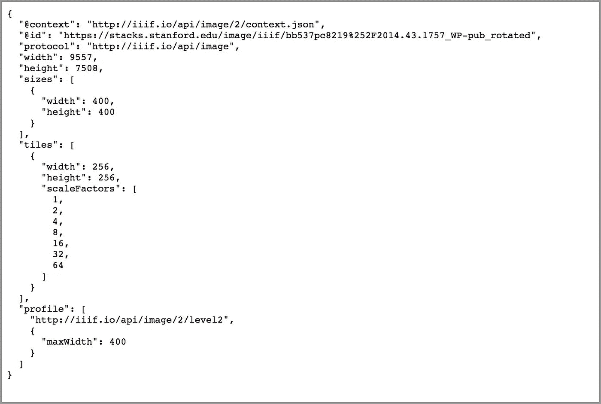

This contains all the relevant information about the image.

## 第二部分

1.  加载*火狐*。这很可能只在火狐、*上有效，在 Chrome* 上无效。
2.  转到[去激活](http://ophir.alwaysdata.net/dezoomify/dezoomify.html)。
3.  粘贴 json 链接。
4.  等待图像加载。
5.  右键单击并下载图像。
6.  您可能需要等待几秒钟。浏览器不会喜欢它(Chrome 实际上阻止了它)，但你可能会没事，只是给它一点时间来处理。
7.  下载。

# 关于去 zoomify 的一个注记

Dezoomify 是一个很棒的小工具，但我发现它经常需要一点摆弄才能工作。它似乎从来没有自动检测到我。对于被遮挡的图像来说，这是一个很好的解决方案，可能会获取您想要的任何平铺、缩放的图像，但首先了解服务器结构并知道这些归档是如何工作的是很有用的。

# 这就是你如何侵入博物馆网站并下载高分辨率图像！

我希望你觉得这个指南有用而且有趣。

实际上，我收到的关于这篇文章的电子邮件比我写过的任何其他文章都多，尽管它的平均统计数据很低。我猜是非常特定的观众看了。我过去常常试着回复每一封电子邮件，通常能帮上忙。不幸的是，这些天我的时间似乎越来越少，所以如果你发了邮件而我没有回复你，我很抱歉。我承认一些网站难倒了我。同样令人鼓舞的是，这么多人实际上正在使用这些令人惊叹的档案。我希望越来越多的机构将他们的档案数字化，并免费提供图像。

############################################

**简单介绍一下我**

我是一个藏书家和作家，在不同的博物馆和出版社工作过，然后决定未来是数字化的。我学到了很多关于人、设计和写作的知识，现在我用这些知识来创造伟大的用户体验。