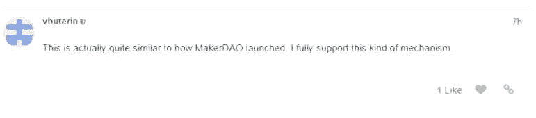

# 如何在未来最具创新性的公司中获得股权

> 原文：<https://medium.com/hackernoon/how-to-earn-equity-in-the-futures-most-innovative-companies-5c09750645ec>

在这个世界上找到意义和财富的一个方法是努力解决最困难和最大的问题。一般来说，从事这项工作的人都在试图颠覆现有行业的初创公司工作。他们已经处理一个问题很长时间了，他们梦想着解决这个问题的方法。

# 但是你如何找到最具创新性的创业公司呢？

一旦你找到了他们，你如何帮助他们完成任务？在这个体系中积累财富的机制更加清晰。任何初创企业的最早雇员通常都会获得企业的股权。这通常是对企业在实现其梦想时将面临的困难的认识，并作为激励这些人长期承诺并努力工作的一种手段——期权通常在 3-4 年内授予。

作为一种激励，这是非常强大的。作为回报，事情变得不那么确定。

## 这个模型有几个问题:

*   出资人需要很长时间才能赚到股权。所有权在很长一段时间内转移，并不是以线性和一致的方式瞬间发生。
*   即使他们已经获得了他们的股权，他们能用它做什么呢？公司的这一部分将永远是他们的，但实现流动性只是以后的事情。对于一个已经投入多年的人来说，能够立即获得流动性会更有力量。
*   高度信任。人类最终决定承诺是否会实现。有时候永远不会。这是个大问题。
*   你只能种一棵树。如果你的创业不成功，你的股票会变得一文不值，你的时间实际上被浪费了。没有哪种多样性能为你的投资提供一点保护。

在模拟世界中，这些问题模糊了参与的确定性。他们这样做令人担忧，会给关系带来巨大的压力和紧张。

## 很长时间以来，我一直在寻找解决这个问题的方法

我想开发世界上最具创新性的产品，但它们很难找到，而且它们没有任何信誉来保证你花的时间是值得的，或者你会得到承诺的回报。

我喜欢为公平而工作，特别是作为一个副业，但是我不相信我的公平会被接受。这种情况可能会改变。

# 一家卓越的公司正在改变这个等式

Dogezer 是一个平台，它集成了人们在创新项目上合作的所有必要工具，能够使用特定于项目的令牌来奖励结果和激励协作。

## 想创建自己的创业公司吗？

Dogezer 允许你用代币和你公司的股份来支付给世界各地的专家，让他们一起完成任务。

## 想用你自己的硬币付钱给别人吗？

融资是耗费创始人大量时间的事情，如果你能完全专注于建立自己的企业会怎么样？你的团队成为你的联合创始人和投资者，你在你们共同努力创建的平台上用代币奖励他们。

## 想赚平台上其他公司的股权？

你可以开始为世界各地的多家初创公司工作，并通过该平台立即获得菲亚特、crypto 或这些公司的股份和未来收入。你可以从股票投资组合的多样化中获益，这是你研究几个想法的副产品。

## 想捧自己的 ICO？

您可以在几分钟内通过平台启动 ICO。代币生成、智能合同部署、团队建设、项目管理、营销页面和奖金活动都会得到处理。该服务为运行成功的 ICO 提供了交钥匙解决方案。

## 想要实现项目所需的全套功能吗？

Dogezer 包括任何人可能需要的一切。人才市场(如 Upwork)、版本控制系统(如 GitHub)、文档编辑器(如 Google Docs)、任务追踪器(如吉拉和 Asana)、云存储(如 Dropbox)和集成消息传递(如 Slack)。寻找人才、部署代码和协作所需的所有工具都可以在一个伞下找到。

## 无论你是想开自己的公司，还是想为他人改变世界而工作，或者投资于最具革命性的行业，Dogezer 都能为你提供一切机会

# 他们可能处于过程的早期——但是他们有一个非常有影响力的支持者

[https://ethresear.ch/t/daico-and-iterative-investment/1052?lipi=urn%3Ali%3Apage%3Ad_flagship3_messaging%3BFByAJ5PrTNynSviyEVoNnQ%3D%3D](https://ethresear.ch/t/daico-and-iterative-investment/1052?lipi=urn%3Ali%3Apage%3Ad_flagship3_messaging%3BFByAJ5PrTNynSviyEVoNnQ%3D%3D)

# 以太坊的创始人 Vitalik Buterin 支持他们关于 ICO 应该如何被超越的提议

如果你相信这个平台，你可以支持它。一个功能齐全的平台已经可用，并在 [https://dogezer.io](https://dogezer.io/) 上运行。试试吧，今天就开始你的梦想公司！

# 他们即将拥有一个 ICO

这不是对一家可能什么都不会生产的公司的投机赌博。这是一个现有的产品，它得到了该领域一些最有知识和影响力的个人的支持和建议。Dogezer 的目标是为 ico 带来一种不同的组织形式——让它们更公平、更可预测、更受控制。我相信这是市场需要的，也是我信任的公司精神。

## 该平台的未来更加光明和包容

以同样的方式，你将能够参与和影响平台上的创业公司和服务的发展，你也将为 Dogezer 本身做同样的事情。每个人都将能够加入该项目，并为其开发额外的功能，并从该平台的未来收入中获得回报。实际上，这意味着你可以成为联合创始人之一，并对这个平台的未来拥有与创建者相同的影响力。这种程度的共识和民主正是去中心化所希望达到的。

# [点击此处了解更多信息并参与 ICO 活动](https://dogezer.com)

## [或者加入对话，在这里与创始人对话](https://t.me/dogezer)