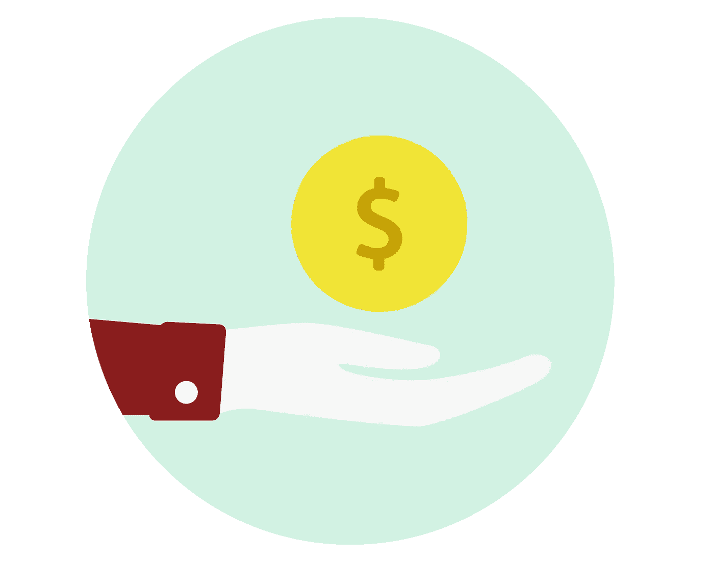
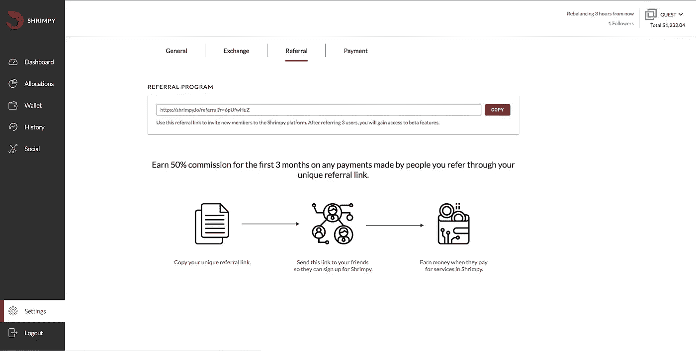
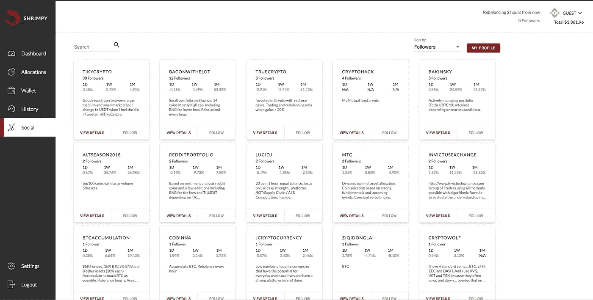
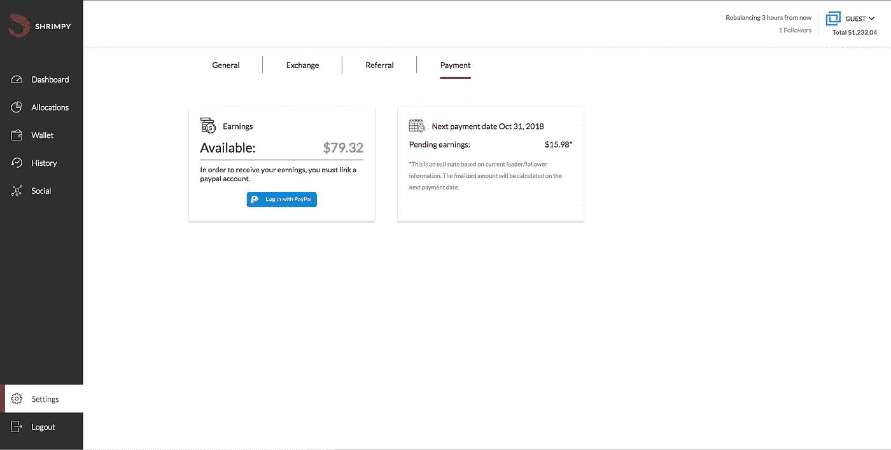

# 如何用 Shrimpy 赚钱

> 原文：<https://medium.com/hackernoon/how-to-earn-money-with-shrimpy-fb21018c664a>

这篇文章将探索任何人如何在 [Shrimpy 应用](https://www.shrimpy.io/)上赚钱。报名免费，上手容易，见效快。用 Shrimpy 赚钱主要有两种方式。

1.  推荐一个朋友。
2.  成为我们社会项目的领导者。

## 加盟/推荐计划

将用户推荐给 Shrimpy 的好处在不断增加。几个月前，我们发布了推荐朋友的功能。作为交换，用户将获得测试版的功能。

今天，参与推荐计划的人开始从每次推荐中获得更多。他们不仅可以使用我们未来发布的所有测试版功能，还可以获得报酬。

> 注册 Shrimpy Social 的每个推荐高达 12 美元。

没错。每次你推荐一个人，前 3 个月你会得到 4 美元的报酬，这是你推荐的社交功能的报酬。*你可以在 Shrimpy 应用程序的“设置”标签中找到你的推荐链接，然后选择“推荐”。*

现在，12 美元是一大笔零钱…但是，如果有一种方法可以让你在同样的 3 个月内每人赚 24 美元呢？

> 你可以！

## 社会领袖计划

除了支付推荐项目的费用，我们还向领导者支付每个追随者每月 4 美元的费用。这意味着，如果你推荐一个新用户，然后他在社交功能上关注你，你将在前 3 个月从那个用户那里每月赚 8 美元，然后如果他们继续关注你，每月 4 美元。

*成为领导者就像在 Shrimpy 应用程序中导航到“社交”标签，选择右上角的“我的个人资料”，然后选中“我是领导者”复选框一样简单。*

# 支付

一旦你开始推荐新用户，并在社交项目中聚集了一批追随者，你就会想要得到报酬。在 Shrimpy，支付过程很简单。导航至“设置”，然后点击“支付”。这会显示到目前为止你在 Shrimpy 赚了多少钱。

我们可以看到该页面上显示了两个不同的值。左边的值是你目前能拿到多少钱。*该金额可立即支付。*

右边的值是您当前当月累积的金额。*每个月的第一天，右边的值会被清除并添加到显示在左边的可用收入中。*

别忘了查看一下 [Shrimpy 网站](https://www.shrimpy.io/)，在 [Twitter](https://twitter.com/ShrimpyApp) 和[脸书](https://www.facebook.com/ShrimpyApp)上关注我们的更新，并在[Telegram](https://t.me/ShrimpyGroup)&[Discord](https://discord.gg/gXyy95y)上向我们令人惊叹的活跃社区提问。

留下你的评论，让我们知道你的平衡经验！

*捕虾队*