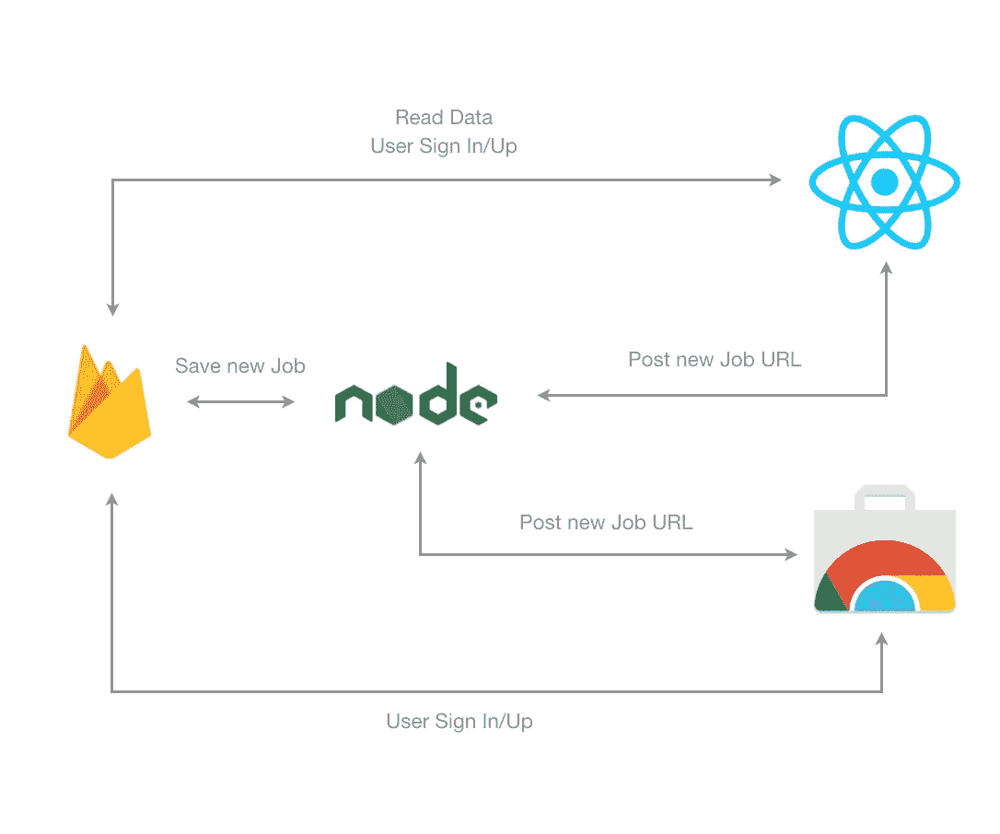
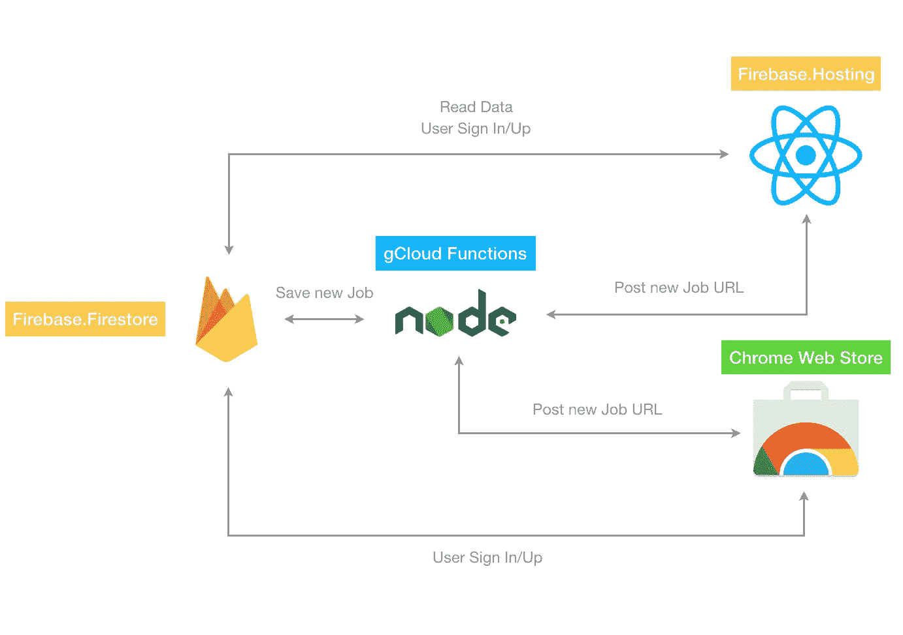
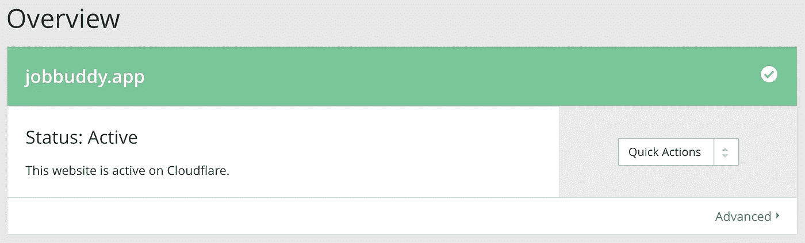
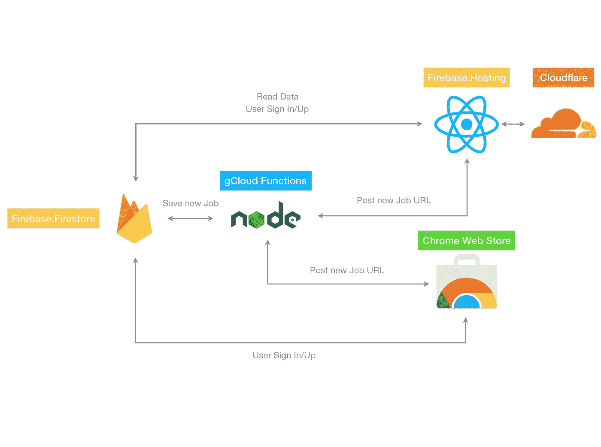

# 如何在云上轻松引导一个附带项目

> 原文：<https://medium.com/hackernoon/how-to-easily-bootstrap-a-side-project-on-the-cloud-b47293c773b4>

# **副业**

如今找工作真的很难，主要是因为工作机会分布在求职板、聚合器和公司的求职页面上。
所以我决定创建[工作伙伴](https://jobbuddy.app)，一个追踪你所有数字工作申请的网络应用。
你可以使用 [chrome 扩展](https://chrome.google.com/webstore/detail/job-buddy-track-all-your/mlepdpjihpccdmecemaphmbhdohdpnkl)或者简单地将工作描述的 url 粘贴到[工作伙伴](https://jobbuddy.app)中保存。通过这种方式，您可以从一个管理页面管理您感兴趣的所有职业机会。

在这篇文章中，我想分享[工作伙伴](https://jobbuddy.app/)背后的技术栈，以展示你可以几乎零成本地快速启动一个完整的网络应用。
我发展[工作伙伴](https://jobbuddy.app/)真的很快，花费仅仅 **18，5€** :

*   Google Domains 中 jobbuddy.app 域名的€
*   Chrome 网上商店订阅费 4.5€

# 堆

[Job Buddy](https://jobbuddy.app/) 几乎完全部署在 **Google Cloud** 平台之上，因为他们提供了一整套“慷慨的”(mmmh)免费计划的产品。我必须创造 3 种不同的产品:

*   [网络应用](https://jobbuddy.app)
*   后端
*   [镀铬扩展件](https://chrome.google.com/webstore/detail/job-buddy-track-all-your/mlepdpjihpccdmecemaphmbhdohdpnkl)

所以我决定用 ***ReactJS*** 做 Web 应用，用 Chrome 扩展，用 ***NodeJS*** 做后端，这样在开发时就可以最大限度地减少上下文切换。

## 数据库ˌ资料库

然后，我必须选择一个数据库，因为我需要保存每个注册用户的工作机会。维护数据库是一件非常痛苦的事情，尤其是如果你不是数据库专家(我不是)。您需要设置和管理您的实例(冗余、可用性、备份……想起来了吗？)，或者你也可以选择云解决方案(比如 Mongodb Atlas)，但是对于一个附带的项目来说，它们可能是昂贵的。所以我决定用 **Firebase。** [**Firestore**](https://firebase.google.com/docs/firestore/) ，Firebase suite 的一项服务，它在云上提供了一个灵活的、可扩展的数据库，具有“公平”(还是公平？)免费计划。这是一个基于文档的解决方案(NO-SQL ),开始时可能有些棘手，但代价是你不会有任何麻烦；Firestore 为您提供几乎所有的保险。因此，即使它仍处于测试阶段，有它的缺陷，它对我的用例来说已经非常完美了。

## 证明

最后一个微妙的缺失部分是认证，我希望用户登录/注册服务，但是从头构建一个认证系统不是(并且可能永远不会是)一个选项。幸运的是，Firebase 套件提供了 **Firebase。认证**，它基本上是一个健壮的认证系统的几行代码实现，支持一长串提供者。
身份验证(imho)最棒的部分是它们自动处理电子邮件确认和密码重置，这是必须具备的，但开发起来很痛苦。
说实话，任何不是*而*是“核心特性”的东西，只要你花 15 分钟以上去开发，都是令人头疼的事情。

所以，这是一堆工作伙伴:

*   *Web App* —内置 **ReactJS**
*   *后端* —内置**节点**
*   *镀铬加长件* —内置**反应堆**
*   *数据库* —用 **Firebase 构建。Firestore**



Job Buddy flow

# 托管— Web 应用程序

数据库**完成**，由 *Firebase* 处理，Chrome 扩展**也完成**，由 *Chrome 网络商店管理。我只需要弄清楚把网络应用和后台放在哪里，可能是免费的。
探索其他 Firebase 服务我发现了 [**Firebase。托管**](https://firebase.google.com/docs/hosting/) ，它基本上托管你的网络应用，有免费的 1GB 存储和每月 10GB 的数据传输，加上自定义域& SSL 支持。10GB/月并没有 T43 那么多(T45 真的是 T46)，但是这是一个好的开始，尤其是如果你所要做的就是*

```
yarn build && firebase deploy
```

从您的本地存储库中。太神奇了。
**注意(也是对我自己)**:上线第一天[工作伙伴](https://jobbuddy)烧了差不多 1GB 的传输数据，以这个速度 9 天我得打开钱包了！所以要小心所有这些“免费”计划。

我现在在互联网上有一个随机的 url web 应用程序，所以我需要一个域名。我检查了 [Namecheap](https://www.namecheap.com/) 和 [Google Domains](https://domains.google/#/) :第一个可能更便宜(不知道它是否有“隐藏成本”)，但我想坚持使用谷歌。我为 **14€** 购买了 jobbuddy.app，在 1 小时内我就可以到达 [https://jobbuddy.app](https://jobbuddy.app) (注意 http **S** 部分)，你所要做的就是按照 Firebase 中给出的说明去做。主机控制台。
Web App **搞定**，该后端了。

# 托管—后端

当我在这场谷歌服务大屠杀中时，我决定研究一下 [**谷歌云功能**](https://cloud.google.com/functions/) 。它类似于 AWS Lambda，它基本上托管了一个响应 http 事件的 NodeJS 应用程序，因此您需要为服务的“实际”(始终小心)使用付费，如果没有人使用您的应用程序，您只需支付 0。此外，当你注册时，他们提供一个 300 美元(足够公平)礼品卡的免费计划。这项服务仍处于测试阶段，有一些缺陷，比如睡眠后第一次调用时有点慢(你需要热身吗？)而且在写的时候只支持**节点 v6** ，所以我不得不转换了一部分代码来兼容。无论如何，它似乎很适合 Job Buddy，我使用控制台创建了这个功能:您只需压缩 NodeJS 代码(注意压缩您的 git 存储库的内容，而不是存储库的文件夹！)并将其上传到 web 界面中(也有一个 CLI 可用于以编程方式完成此操作)。最后，您将获得一个端点，通过一个简单的 http 请求来调用该函数。

后台**也做好了**，工作伙伴现在在 [https://jobbuddy.app](https://jobbuddy.app) 直播。它可以自动扩展，速度很快，我不用担心任何事情(除了成本)。这是我的工作伙伴



Job Buddy

# 云耀斑

在和一些[indiehacker](https://www.indiehackers.com/)聊过之后，我发现为了降低成本，可以把 [**Cloudflare**](https://www.cloudflare.com/) 放在 **Firebase 前面。主持**。它免费处理 SSL，对缓存非常有用，这样你就可以减少与 Firebase 的交互。托管，省钱。
设置快速简单，我在大约 5 到 10 分钟内完成了 [JobBuddy](https://jobbuddy.app/) 的设置和运行。我将在接下来的几周内看到什么样的云闪。分析显示，但它看起来很有希望。



Cloudflare console

# 结论

如果你开始开发一个奇妙的兼职项目，并希望在互联网上的某个地方部署它，可能是零成本，你可以复制一堆[工作伙伴](https://jobbuddy.app)。

*   Web App——**ReactJS**——托管在 Firebase 上。主办；主持
*   *后端* — **节点** —托管在谷歌云功能上
*   Chrome Extension—**ReactJS**—托管在 Chrome 网上商店
*   *数据库* — **火焰库。firestore**——托管在 Firebase 上
*   *CDN*—**cloud flare**



我承受的唯一代价是 18.5€:

*   Google Domains 中 jobbuddy.app 域名的€
*   Chrome 网上商店订阅费 4.5€

我不是说这个**是**最好的方法，这只是我用过的一个方法。还有很多比这个更好的解决方案，:D
欢迎留下评论、反馈或如何改进的建议。