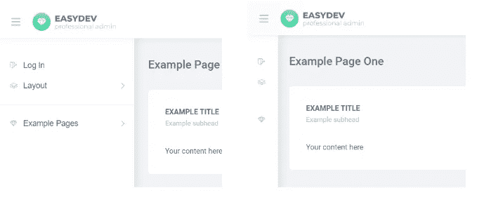

# 如何轻松启动基于 React 的项目

> 原文：<https://medium.com/hackernoon/how-to-easily-start-a-react-based-project-5dccde9669c3>

你好，朋友！如果你正在寻找一种方法来快速启动你的第一个 React 项目，你已经找到了正确的地方。在本文中，您可以找到一个现成的模板，它可以帮助您开始学习 ReactJS，并了解使用它的一些基本要点。


## 介绍

React 是一个通过将用户界面分解成组件来构建可组合用户界面的库。React 使用真正全功能的编程语言来渲染视图。点击了解更多关于 React [的信息。](https://reactjs.org/blog/2013/06/05/why-react.html)

开始熟悉 React 的最简单的方法之一是分解一个已完成的项目。有许多开发人员经常购买模板来加速项目开发。我想向您提供这个基于 react 的管理模板的迷你版本，以帮助您了解创建 React 项目需要了解的基础。源代码在 [GitHub](https://github.com/aspirity-ru/easydev-seed) 上。

在档案中，您可以找到一个现成的项目，其中包含结构、组件和路线用法的示例。你可以免费使用它，我们将在下面的视频中解释如何安装和启动它。

## 如何安装和启动？

The short how-to video about React app installation.

要了解更多关于 Node.js 的信息，请点击这里的。

## 什么是 ReactJS？

正如我前面注意到的，React 是基于使用组件的。组件允许你将用户界面分割成独立的可重用的部分，并孤立地考虑每一部分。你可以找到很多关于组件创建的资源，包括[官方反馈文件](https://reactjs.org/docs/getting-started.html)。如果你看一下例子，你会看到 JS 和 HTML 有趣的混合。它叫做 [JSX](https://jsx.github.io/doc.html) (Javascript XML)。所以如果你想学习 React，你应该了解这两者。

## 流行的 React 库

本文的模板是用 [Create-React-App](https://github.com/facebook/create-react-app) 工具和库 [React-router](https://github.com/ReactTraining/react-router) 和 [Redux](https://redux.js.org/) 构建的。

## 创建-反应-应用

Create-React-App 是脸书为几乎所有 React 项目提供的样板文件。它有一个现成的项目结构，基础设置和快速启动的依赖关系。它由 React 的开发者创建，并不断更新。

## 反应路由器

React-router 是一个库，允许您以最简单的方式在 web 应用程序中构建 SPA 路由。它的意思是——您可以使用简单的组件实时交换页面(组件),而无需重新加载页面。当每个路由的路径与 URL 匹配时，每个路由都会呈现其各自的组件。此外，您可以找到一个路由器，它允许您在不刷新页面的情况下更改页面内容。多亏了它，你得到了一个单页应用程序(SPA)。

React Router 允许您轻松地向应用程序添加新页面。在模板中，您可以在`'~/easydevseed/src/containers/App/Router.jsx'`中添加新路线:

```
import LogIn from '../LogIn/index';
...
<Route path="/login" component={LogIn}/>
```

现在您可以将`'/login'`添加到 URL 并查看您的页面。那很容易，不是吗？

那你可以去 Redux。

## Redux

Redux 是 React 应用程序中管理数据状态和 UI 状态的工具。它非常适合水疗中心，因为那里的状态会有新的特征，变得越来越复杂。它比以前的库更复杂，但对数据管理非常有用。

Redux 是这样工作的:

触发状态改变的唯一方法是呼叫`dispatch(action)`。它调度一个动作。例如，我们可以改变侧边栏的状态:

```
changeSidebarVisibility = () => {
  this.props.dispatch(changeSidebarVisibility());
};
```

动作发出请求并获取当前数据。它的返回值将被认为是下一个状态。动作必须有一个表明正在执行的动作类型的`“type”`属性。类型通常应该定义为字符串常量。上面是调度中触发的操作:

```
export const CANGE_SIDEBAR_VISIBILITY='CANGE_SIDEBAR_VISIBILITY';
 export function changeSidebasVisibility() {
  return {
   type: CANGE_SIDEBAR_VISIBILITY,
  };
}
```

动作返回一个对象，该对象包含所需的数据和代表要使用的减速器部分的`“type”`字段(通过名称匹配)。Dispatch 将返回的对象发送给 reducer。reducer 根据 action 对象中的数据决定如何改变 redux 状态。在示例中，您可以看到我们的操作返回类型，但没有值。Reducer 接受我们的操作，在 switch 中找到一个案例并更新状态。它以旧状态为基础，并反转折叠值。

```
const initialState = {
  show: false,
  collapse: false,
};export default function (state = initialState, action) {
  switch (action.type) {
    case CHANGE_SIDEBAR_VISIBILITY:
      return { ...state, collapse: !state.collapse };
    case CHANGE_MOBILE_SIDEBAR_VISIBILITY:
      return { ...state, show: !state.show };
    default:
      return state;
  }
}
```

组件中的连接函数捕获新数据，提取所需数据并返回给 props。React 处理数据更改，并使用新数据重新呈现应用程序。

```
export default connect(state=> ({
  sidebar: state.sidebar,
}))(Layout);
```

上面的代码允许从应用程序的任何部分改变侧边栏的状态。根据状态中的值，侧栏类将发生变化:

```
const Sidebar = ({
 changeToDark, changeToLight, changeMobileSidebarVisibility, sidebar,
}) => {
 const sidebarClass = classNames({
 sidebar: true,
 ‘sidebar — show’: sidebar.show,
 ‘sidebar — collapse’: sidebar.collapse,
 });return (
 <div className={sidebarClass}>
 <button className=”sidebar__back” onClick={changeMobileSidebarVisibility} />
 <Scrollbar />
 </div>
 );
};
```

这将改变组件样式:



Here you can see the new style of the sidebar.

## 代码林挺

代码质量是任何项目的重要内容之一。ESLint 有利于改进项目代码风格。它是用于 JavaScript 和 JSX 的可插拔林挺工具。

由于突出显示了格式错误，它允许您以相同的风格编写代码。当你和一个团队一起工作时，这特别有帮助。你可以在里面写一些规则。你的代码变得更有吸引力和可读性。

## 项目构建

当您完成项目后，您需要部署它。只需运行命令`“npm run build”` 或`“yarn build”`将项目构建到`‘build’`文件夹中。它正确地捆绑了生产模式中的 React，并优化了构建以获得最佳性能。您的应用程序已准备好进行部署！

## 结论

本文中的模板可以帮助您开始使用 ReactJS。它并不完美，但它可以帮助您避免 react 应用程序安装中的常见错误，并加快第一步。

此外，如果你想了解更多，并获得一个完整版本的模板和一堆组件，你可以在这里找到。

作者: [DragonCharlie](https://medium.com/u/123a08802306?source=post_page-----5dccde9669c3--------------------------------)
编辑:[叶卡捷琳娜·茹瓦洛娃](https://medium.com/u/6324264413b5?source=post_page-----5dccde9669c3--------------------------------)
牛逼视频:[奥列格·阿努钦](https://medium.com/u/4e5d6f183fa8?source=post_page-----5dccde9669c3--------------------------------)

我们很高兴听到你的评论💬并获得掌声👏。

1.  主题森林[简介](https://themeforest.net/user/aspirity)。
2.  [带有主题和模板的网站](http://themes.aspirity.com)。
3.  脸书。