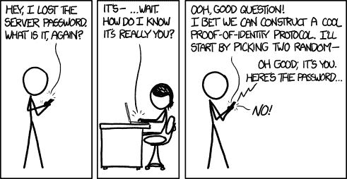
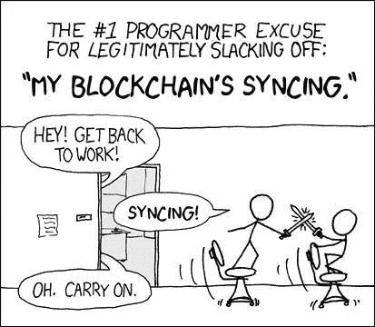
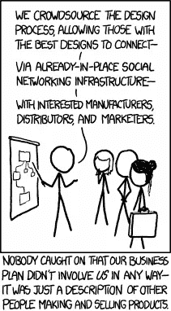
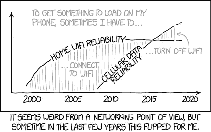

# 我们计划如何赋能区块链创新者

> 原文：<https://medium.com/hackernoon/how-to-empower-blockchain-innovators-4e4e648ed9e8>

This paid story is brought to you by [Safebit](http://safebit.io/)

“十年过去了，没有人想出区块链的用途。”

***“区块链是在寻找一个问题的解决方案。”***

不要让这样的陈述把你引向绝望！看看我们迄今取得的进展。比特币是一个自主银行。以太坊是一个任何人都可以建立自己的自治组织的平台。这些不是虚构的概念，而是功能性的应用。

但是，区块链仍然缺乏起飞的逃逸速度。直到苹果推出了应用商店，移动应用才开始腾飞。应用商店改变了一切，它创造了一个新的市场。他们让个人/组织开发、部署和销售应用变得简单易行。让青少年程序员成为百万富翁的力量是巨大的。

区块链必须获得这种逃逸速度，我们正在等待一个市场领导者。目前，区块链在以下领域存在问题。

## 用户采用

Credits : xkcd

公/私钥匙、钱包等概念对于外行人来说很难理解和使用。人类容易犯错误，如果一个人丢失了他们的私钥，就没有办法恢复。在不同的钱包里管理自己的资产是一件痛苦的事情。

## 开发者采用

Credits : xkcd

编写区块链应用程序需要不同的方法。如果你考虑以太坊，读取数据是免费的，但是写入是有成本的。因此，我们需要编写代码来最小化编写成本。同样，不同的平台有不同的基础设施和运营成本。这些平台发展迅速。对于开发人员来说，学习多种区块链语言并跟上基础设施的快速变化是很困难的。为了优化成本而在不同的链上进行本机部署是一件麻烦的事情。

## 业务采用

Credits : xkcd

在区块链打造盈利的商业模式需要一种新的思维方式。如果考虑去中心化的交易所，大多收取较低的服务费。一个组织无法靠收取如此低的费用维持下去。发行代币可以帮助组织筹集巨额投资。然而，令牌在可用性方面带来了额外的摩擦。

如果客户今天想使用贵公司的服务，但他们没有您的令牌，他们必须等到交易订单完成。目前，等待时间需要几天/几周。

雇佣人才是另一个问题，在这个领域有经验的开发人员是如此稀缺和昂贵。

## 可靠性

Credits : xkcd

网络拥挤是区块链的一个普遍问题。这个问题会影响到那些试图与您的组织进行交易的客户。

如果您在区块链上有重要数据，但在最需要的时候却无法检索，那么问题就严重了。因此，必须考虑这些问题，并建立一些备份基础架构，这可能会产生额外的成本。

这些是区块链面临的一些技术、金融和经济问题。这些问题很难解决，但并非不可能。解决这些难题的人可能会留下印记。

# 我们的想法

*我们是一群来自以色列的理想主义和坚定的个人，他们敢于解决挑战，并通过我们的平台* [*Safebit*](https://safebit.io/) *赋予区块链创新者力量。*

在软件的早期，在不同的平台上部署应用程序是一件痛苦的事情。Java 通过提供跨平台部署应用程序的能力解决了这个问题。

## 安全比特

Safebit 是一款跨链跨平台的加密货币钱包。我们有一个用户友好的界面，允许您像管理您的 Gmail/脸书帐户一样管理您的加密资产。

它还能够支持 Trezor、Ledger 等硬件钱包。我们的 API 使我们高度可扩展，任何想要构建新钱包/应用程序的人都可以轻松地插入我们的平台。

Credits : [xkcd](https://www.google.com/url?sa=i&rct=j&q=&esrc=s&source=images&cd=&cad=rja&uact=8&ved=2ahUKEwjri8Xy24XcAhXKYo8KHXckB9AQjxx6BAgBEAI&url=https%3A%2F%2Fairbrake.io%2Fblog%2Fcomics%2Fbest-programming-xkcd-comics&psig=AOvVaw3UI2vNz_8_QOsgd4D14qin&ust=1530803050244858)

## 管理用户区块链账户的强大 API

我们的 API 使我们具有高度可扩展性，任何想要构建新钱包/应用程序的人都可以轻松地插入我们的平台。它提供了类似于 o-auth 的体验来管理用户的区块链帐户。

由于我们提供跨链支持，开发者不必经历学习本地语言和基础设施的麻烦。我们还为开发人员提供了库，简化了编写智能合同的过程。

我们的平台最大限度地减少了对昂贵专家的需求。任何具有良好 API 经验的开发人员都能够使用我们的平台开发可伸缩的区块链应用程序。因此节省了时间、成本和精力。

## 协作网络

协作是开放式创新的核心。我们的平台使个人和组织之间的协作变得简单易行。

## 身份

您可以将用户的电子邮件 Id 或用户名发送给公钥，而不是将加密资产发送给公钥。因为公钥地址太长，在处理巨额交易时很麻烦。如果用户将资产发送给了错误的人，您将无法恢复交易。向用户名或电子邮件 id 汇款要简单得多。

## 握手

握手类似于接受脸书朋友的邀请。它允许用户彼此建立社交和金融联系。

## **协同身份**

使用协作身份，只有在两个人同意的情况下，您才能批准交易。该系统还可以用于根据用户的角色来限制用户的功能。在脸书的商业页面上，管理员拥有某些编辑和广告商不喜欢的功能。协作身份使得根据需要配置安全级别变得容易。

## 您有几种选择:

1.忽视区块链，直到为时已晚。
2。做一个批判者，获得短期关注。
**3。做一个敢于解决难题的创新者，并在区块链革命中留下永久的印记。**

> **如果您选择第三个选项，您可以加入我们，共同打造未来！请连线我们关于** [**电报**](https://t.me/safebitio)**[**Reddit**](https://www.reddit.com/r/safebit/)**&**[**脸书**](https://www.facebook.com/safebitio/) **。请鼓掌**👏。**谢谢，关注**[**Safebit**](http://medium.com/safebit/)**和**[**hacker noon**](http://hackernoon.com)**这样你就不会错过我们即将到来的故事。****

****

**[Join us, let’s build the future together!](https://t.me/safebitio)**