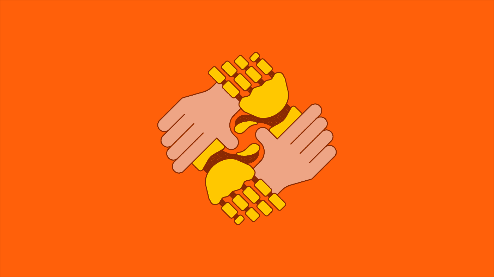
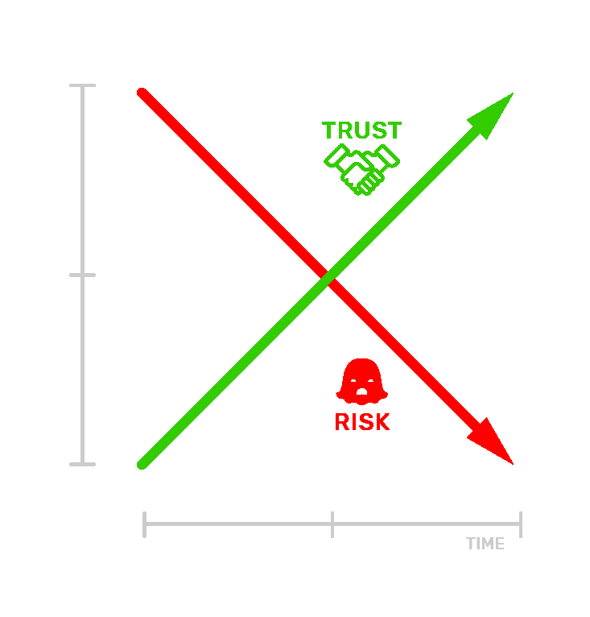
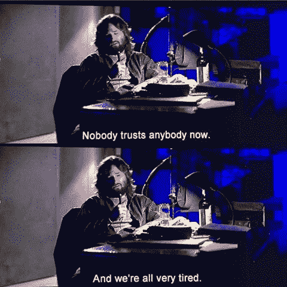

# 如何在自治时代建立信任

> 原文：<https://medium.com/hackernoon/how-to-engineer-trust-in-the-age-of-autonomy-dbba1f2c0c71>

An exploration of human-machine trust (image by Daryl Campbell, CCO, [Sensum](https://sensum.co/))

在大数据和人工智能不断加速的发展中，我们正在与我们的技术分享越来越详细的个人数据。我们中的许多人已经自由地发布我们的想法、我们当前的位置、我们的应用程序使用统计……大量的个人信息，交给公司，希望他们会给我们一些有用或有趣的东西作为回报。

我们也越来越多地分享我们的生理数据，不管我们是否直接意识到这一点，比如通过健身追踪器分享心率，或者通过“小狗”过滤自拍的海啸分享面部表情。作为回报的承诺是，我们的应用程序、软件、车辆、机器人等将知道我们的感受，他们将利用这种同理心为我们提供更好的服务。但随着技术开始变得真正个人化，自主性赋予了它自己的“生命”，我们必须重新审视信任和道德的含义。

> 好吧，我承认，这个话题对于一个简单的概述来说太大了。为这个故事采访专家让我头脑发热。他们的想法既惊人又可怕。我在这里的目的只是强调一些你可能希望考虑的事情，以赢得你的客户的信任，同时也尽量不搞砸社会和结束人类。
> 
> 此外，我是一个绝望的，鲁莽的乐观主义者。如果不是这样，我早就离开创业世界了。所以我会把末日预言留给其他人。有很多这样的消息，而且还会有更多，因为坏消息很畅销。可怕的是沙莉。机器人可能很可怕。

每当一个组织说服其用户分享隐私信息，如他们的生理状态，他们的位置，或他们周围环境的图像，双方之间有一个内在的信任契约。这种契约是一种脆弱而有价值的东西，很容易丢失或被滥用，一旦破裂就很难重建。在大多数情况下，当我们注册新的服务时，我们可能甚至没有想到这一点，因为我们更关心他们能为我们做什么，而不是他们会对我们做什么。但随着人工智能和互联设备变得越来越普遍，我们与技术的关系值得认真思考。

只要一个白痴就能毁了这个派对。

# 信任-风险关系

当计算你需要与你的用户建立多少信任时，首先要考虑的事情之一是风险。你可以说风险的大小和你开始时的信任程度成反比。

*The greater the risk, the more trust you need to earn.*

举个例子，你会有多信任一辆自动驾驶汽车。在这种情况下，这是生死攸关的。如果机器崩溃了，你就不能只按 ctrl-alt-delete 继续你的一天了。所以我们可以说，最初的信任差距是巨大的。

也就是说，如果它是一架飞机而不是一辆汽车呢？目前，人们更倾向于相信驾驶而不是飞行，尽管这样做存在统计学上的谬误。汽车长期以来一直处于高度渴望和信任的最佳状态。我们对汽车更熟悉了。这可能有助于自动驾驶汽车开发商赢得客户，但我们不能保证公众的心态不会随着我们走向自动驾驶而改变。如果百万分之一的自动驾驶汽车导致致命事故，这将成为全球新闻，而每年数百万人已经被人类司机杀死，但媒体很少提及。

所以…

*   **教育你的用户**。对于你的技术从他们那里得到了什么，以及用这些信息做了什么，要保持透明。对他们的内在风险开诚布公。
*   **从第一天起就将用户体验设计放在首位**，以了解并减轻在与你的产品或服务互动的过程中出现的信任问题。

# 信任偏差的起源

在不熟悉或者高风险的场景下，我们很可能一开始就偏向于不信任。但是在熟悉的社会关系中，我们倾向于信任。在我们第一次互动时，我们假定对方是无辜的。这可能具有进化意义:虽然我们需要谨慎以避免致命的错误，但我们也受益于顺其自然发展关系的效率。但是如果你得寸进尺，你会有很多工作要做来克服这种背叛。

所以…

*   **设计**从最初的用户交互开始，你的服务就应该是可修改的。牵着他们的手走过这个过程的第一步。
*   你的服务越新颖，你就需要做更多的工作来让你的用户适应它。
*   **错朝开**。不要在用户的信任上得寸进尺，你可能会把我们其他人都搞砸了。

# 信任是移情的一种自然属性

我们人类是完美的读心术者。我们总是在努力想象对方的世界观，并考虑如何应对。像我们这样的公司( [Sensum](http://sensum.co) )正在软件和设备中模拟这种移情过程，以增强人类与它们的互动。

在试图猜测另一个人的观点时，我们会对可以信任他们的程度做出草率的判断。我们在任何特定情况或关系下的信任假设都基于以下因素:

*   **历史表现**:对方演员过去表现如何？
*   部落主义:他们是我团体的一部分吗？他们是熟悉的角色类型吗？
*   当前活动:他们现在在做什么？

如果我们很了解对方，或者知道他们很了解我们，并且了解我们所处的环境，我们更有可能在互动中获得更大的信任。从这个角度来看，可以说在你拥有信任之前，你需要感同身受。

判断另一个实体并根据当时的情况调整判断的能力是一种情商，它有很多优点。现阶段的机器在这一领域只有初步的能力。他们可能表现得太冷漠，或者表现得太有同情心、太投入而没有对信任关系有必要的理解，这让我们很恼火(想想:[微软的 Clippy](https://www.theatlantic.com/technology/archive/2015/06/clippy-the-microsoft-office-assistant-is-the-patriarchys-fault/396653/) )。

这提出了一个矛盾的设计挑战。一方面，信任可以通过为用户提供一个行为一致的界面来培养，这样他们就知道对它有什么期望。然而，一个高度移情的系统应该能够调整自己的行为，以适应用户的情况、情绪、性格等。选择什么时候多一点或少一点打扰。机器可以提供一个选项来设置我们的偏好，即我们希望它们在一次互动到下一次互动时如何移情或人性化。但这是低效的。他们应该已经知道如何行动——评估我们的精神状态和周围的环境，并采取适当的行动。好朋友会不假思索地这么做。

正如“[薄切片](https://en.wikipedia.org/wiki/Thin-slicing)”等理论所建议的，我们在第一次遇到另一个实体时做出的快速判断可以为我们与它的一生关系定下基调。在此之后，努力调整这一形象可能只会产生较小的影响。我试图通过在这个故事的开头加入一个骂人的词来做我自己的读心术，判断中等读者对此类事情是否感到舒服。这些都是我们用来赢得对方的诡计。

无论我们能够多么感同身受地进行人机交互，我们都必须考虑我们希望我们的机器看起来有多“人性化”。过于模仿人类行为可能会为人机交互揭开一个全新的[恐怖谷](https://en.wikipedia.org/wiki/Uncanny_valley)。

所以…

*   **从一开始就管理期望**。如果你不能提供令人难以置信的服务，就不要以暗示你可以的方式进行宣传(想想:Twitter 早期笨拙的[失败鲸](https://www.theatlantic.com/technology/archive/2015/01/the-story-behind-twitters-fail-whale/384313/)，或者谷歌的[永久测试](https://en.wikipedia.org/wiki/Perpetual_beta)策略)。
*   **通过设计行为一致的系统，增加用户和系统之间的熟悉和信任**。
*   然后，**逐渐引入**更多样、更动态的移情反应层次。
*   **在训练系统移情时，将背景信息**添加到组合中，而不仅仅是人类的感觉或行为。例如位置、天气状况、一天中的时间等。在我们关于传感器融合的[最新报道](/adventures-in-consumer-technology/sensor-fusion-the-only-way-to-measure-true-emotion-28af9b6fb0a4)中有更多信息。

*How human-like should our tech be for us to trust it? (Image courtesy: Flickr user,* smoothgroover22)

# 教机器更人性化

考虑不同的关系，我们可以将移情、信任、道德和其他人类社会启发应用于:

*   H2H:人对人
*   **H2M** :人机
*   **H2X** :人对人-(万物)
*   M2M :机器对机器
*   **M2I** :机器对基础设施(如路牌、建筑等。)
*   **M2X** :机器对-(一切)

在特定情况下，网络中的每个成员不仅要考虑自己的心理指标，还要考虑团队中其他成员的心理指标。这同样适用于人类与机器的互动，也适用于机器之间的关系。因此，传统的“人类”试探法的应用，如同理心、信任和道德，将扩展到 M2M 互动，我们可能很少参与。

当交互仅仅是机器对机器时，像信任和同理心这样的属性可能与我们习惯的非常不同。电子社交可能是冷酷的、算法的、不人道的过程。但话说回来，我们必须问自己，当你从进化的角度来看待它们时，这与我们自己的行为有多大的不同。我们对周围的刺激会有“情绪”反应。那些情绪进化成驱使我们以适当的方式行动(逃避它，攻击它，和它做爱，等等)。).我们说我们因为害怕而避开了黑暗的小巷，或者因为相爱而追求一段关系。我们的身体告诉我们，‘如果这个*发生了，那就做那个*’。

如果 x 那么 y。

我们的情绪是大自然的算法。

所以…

*   **探索**你可以从一开始就设计出什么样的规则和交互来让你的系统具有社会性。
*   **将你的规则不仅应用于人机交互，也应用于网络中所有可能的关系。**

# 在我们共情的未来相处

为社会行为建立启发法并不新鲜。从通信网络到区块链，已经在系统中实现了。这些算法试探法随着时间的推移不断进化，以适应新的机会或增加的复杂性。自主系统从它们的环境和经验中自我学习，就像我们几百万年来学习的一样，但是速度惊人。很快我们甚至可能无法理解我们最初创造的机器的语言和动作。

随着机器花更多时间了解我们，它们会更好地理解我们并为我们服务。因此，随着我们逐渐将更多控制权移交给自主系统，如车辆和虚拟助手，我们可以期待一个过渡期。

在我们的技术创造将我们抛在失控的进化模糊之前，我们必须考虑如何教会他们同理心和道德。但是机器对于道德等概念有着根本不同的基线。像杀死另一台机器这样的行为的成本和收益与自然界动物之间的成本和收益是不同的。社会互动是模糊的，不仅在逻辑上如此，在应用上也是如此，所以它们可能很难被[设计](https://hackernoon.com/tagged/engineer)。也许我们可以从应用“你希望机器对你做什么，就对它们做什么”的规则开始。

移情自治的时代正在开始，我猜想我们都将受益于我和我的同事在 [Sensum](http://sensum.co) 写下的第一条规则**不要做个混蛋**。

> 特别感谢安德鲁·波塞博士(Sensum 的首席数据科学家)和加里·麦克欧文博士(贝尔法斯特女王大学心理学院)，他们不仅为这个故事提供了很多思考，还在这个过程中启发了我小小的心灵。