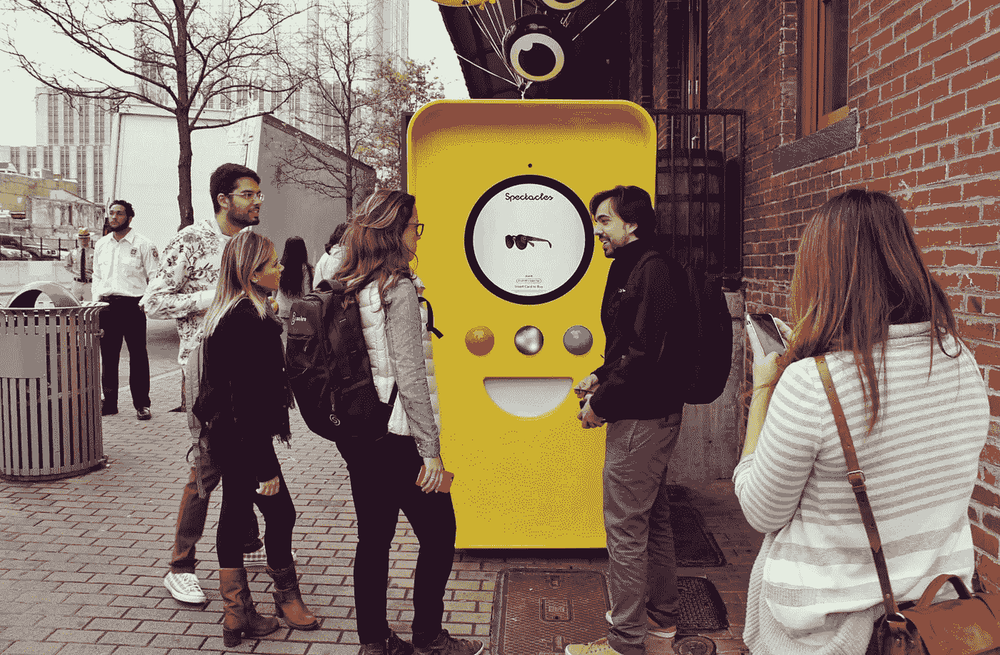
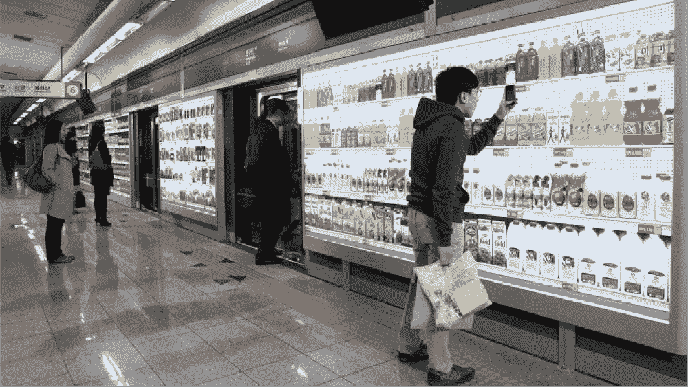
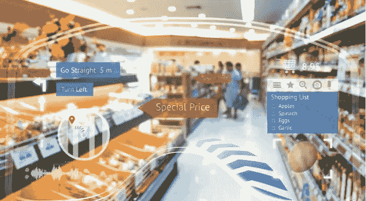
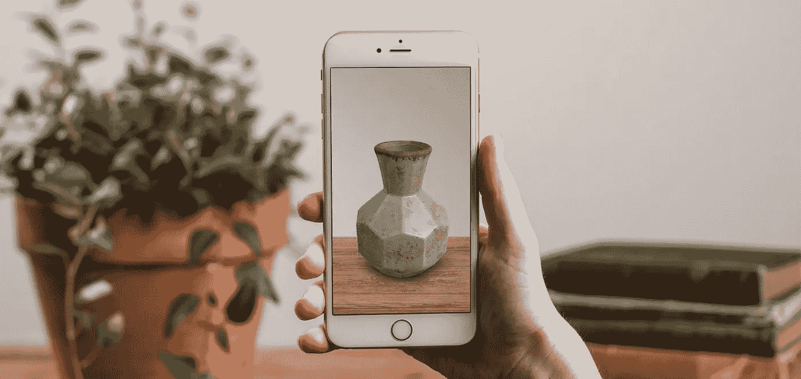
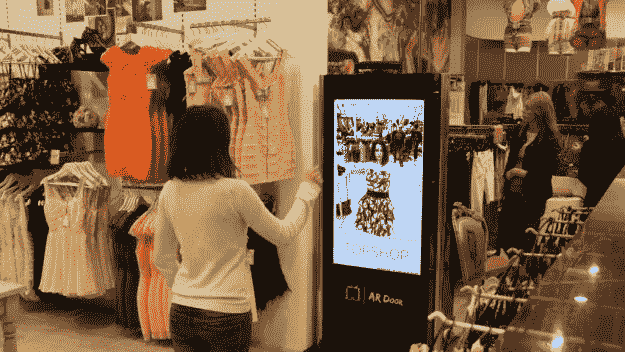
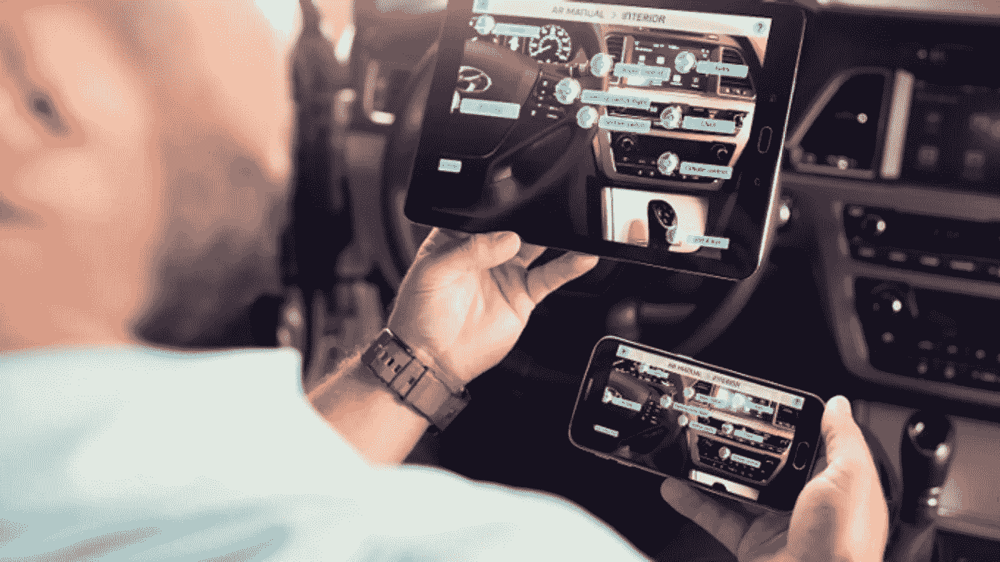

# AR 电子商务:在 2019 年加快转化率和参与度

> 原文：<https://medium.com/hackernoon/how-to-enhance-sale-with-the-use-of-augmented-reality-in-ecommerce-282ebe6a8353>

在新兴技术中，增强现实(AR)正在推动电子商务行业走向广阔的前景。电子商务中的 AR 通过增强客户体验迅速占领了客户。在电子商务中引入 AR 后，消费者的兴趣和整体参与水平都有所提高。

通过克服所有挑战和探索在线空间，AR 完全是一种新的购物方式。在很短的时间内，电子商务转变为一个先进的零售平台。并且随着时间的推移，在 AR 技术的帮助下不断向新的方向拓展。

> **据** [**Statista**](https://www.statista.com/) **统计，2017 年电子商务销售额达 2.3 万亿美元，预计到 2021 年将增长至 4.88 万亿美元。**

## 证明增强现实促进销售的一些因素

**订婚**

人们注意到，当消费者接触到一个带有 2D 印刷图像的虚拟产品时，他们会感觉联系更加紧密。它为用户提供了产品的详细视图，使他/她一次又一次地访问在线平台。

**讲故事**

AR 最好的部分是它通过引入一些故事或新闻的虚拟平台来帮助改变传统的方面。用户变得热衷于成为虚拟产品的事件和促销的一部分。

**好奇心**

当谈到 AR 体验时，用户无法控制自己。这种体验如此有效，以至于吸引用户一次又一次地体验 AR。AR 的吸引人和激励人的功能试图让用户保持快乐和对产品的好奇。

**精度**

具有 3D 可视化的 AR 帮助用户做出准确的决定。从而谈到 AR 服务，所有要购买的产品都有更多的机会降低退货率。毫无疑问，用户会购买这些物品，因为 AR 提供了一种互动体验。

**个性化**

谈论在线商店——特别是在穿着的情况下，产品只能被浏览——并不能提供更好的用户体验。然而，AR 为顾客提供了一定程度的个性化，他们可以在所有的服装中看到自己，从而知道哪一套最适合他们。

## 为什么你应该在电子商务中尝试增强现实？

> 在电子商务的世界里，拥有自己品牌产品的企业找到了与客户互动的创新方式，而增强现实为其带来了创新优势。

**购物支持**

AR 在为报纸提供支持方面起着向导的作用。因此，AR 可以让企业为其客户提供明智的购买决策。通过这种方式，用户可以虚拟地同时试用他们的产品，因为 AR 可以帮助他们选择最佳产品。

有许多电子商务企业的 AR 解决方案，其中虚拟销售人员可以在购物时帮助用户。用户尝试各种产品，以找到他们将使用 AR 购买的产品，这在网上购物中缺乏支持。

**量体裁衣式购物**

AR 正在帮助许多企业在购物时为客户提供个性化的体验。当涉及到兴趣和选择时，用户可以毫不妥协地购物。

此外，AR 正在通过产品的虚拟尺寸和颜色来改善购物体验。AR 可以支持正在寻求帮助的用户找到最适合自己的物品。

**整合图像**

顾客在网上购物时非常关心尺寸和设计。因此，AR 有能力将真实对象集成到投影图像中。专注于电子商务，AR 创建了一个虚拟购物窗口，以帮助用户集成人工智能。这为购物者浏览各种产品提供了一种更吸引人的方式。

这有助于提供更具吸引力的体验，购物者可以亲自试用基本产品，例如，AR 故事书、AR 房地产、AR 家具、AR 手表、AR 鞋子等。

## 电子商务中增强现实的用例

AR 正在增加客户体验的价值，以保持在零售商平台上的参与。它是业内推动店内客流量的主要参与者之一。增强电子商务的未来将随着消费者的期望而发展。

**虚拟试衣方案**

试穿解决方案是新兴解决方案中的主要参与者之一，因为它有助于推动跨渠道流量和吸引购物者。从用户角度来看，它为在线购物者提供了更丰富的体验。[虚拟现实试穿解决方案](http://www.quytech.com/augmented-reality-solutions/virtual-try-on-solutions.php)正在成为零售商的革命性解决方案和营销纽带，例如，手表和珠宝、鞋子、家具、衣服等等。

**人体测量 App**

身体测量应用程序的目标是为用户提供最准确的虚拟试衣。这种 AR 解决方案是一种更好的方法来衡量用户的拟合度，这在电子商务中是革命性的。

我们知道，在网上购买衣服或任何可穿戴产品时，合身是一个基本问题。因此，身体测量应用程序让在线用户在做出最终决定之前尝试一种准确适合他们身体的产品。

**AR 手册**

[AR 用户手册](https://www.youtube.com/watch?v=aQyH7CQPVcA&t=3s)通过一步一步的虚拟指南，以互动的方式演示阅读电器手册的过程。使用智能设备的用户可以轻松浏览产品的细节。它还减少了阅读任何设备手册的时间和对未知风险的恐惧。

通过与 AR 技术集成的沉浸式 3D 体验，AR manual 增加了可理解性的百分比。对设备进行简单扫描后，AR 手册会以虚拟方式显示所有有用的说明和功能。

**底线**

在当今时代，AR 技术正在电子商务领域创造一个至关重要的位置。[增强现实应用开发公司](http://www.quytech.com/augmented-reality.php)通过提高销售率，提供专注于更好的客户满意度和体验的好处。在很短的时间内，增强现实(AR)作为一种不断发展的技术被业界广泛接受。

最后但同样重要的是，从商业前景来看，这将带来更好的转化率和收入。因此，可以说在线购物的未来将取决于 AR。