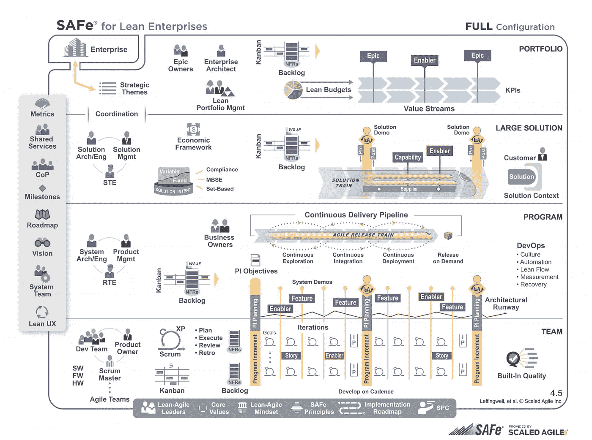
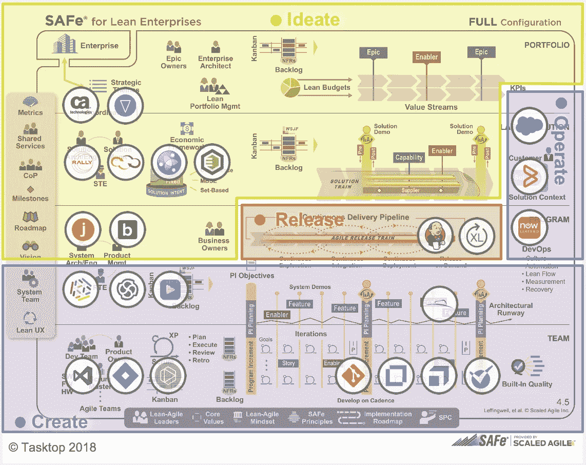
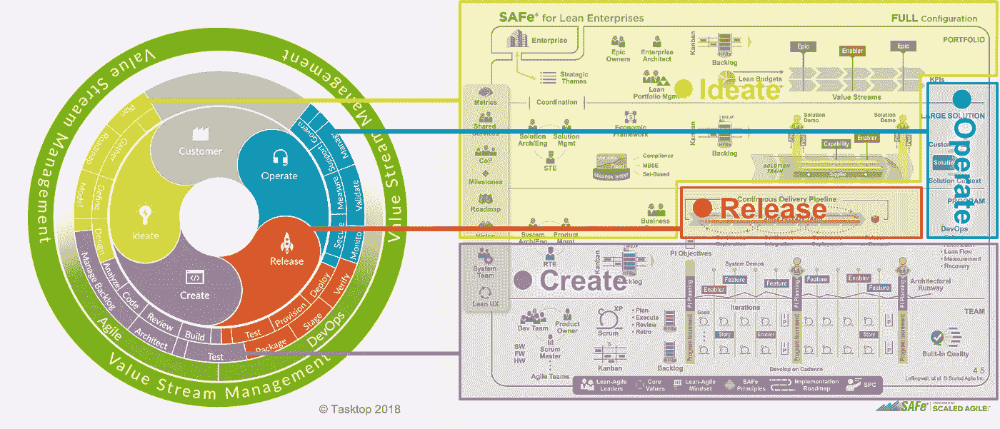

# 如何确保您的安全转型与众不同

> 原文：<https://medium.com/hackernoon/how-to-ensure-your-safe-transformation-makes-a-difference-a66cd038fbcf>

首席信息官们感到沮丧是可以理解的。他们肩负着保持 IT 卓越运营的责任，同时也承受着巨大的压力，需要通过[软件](https://hackernoon.com/tagged/software)交付，通过数字产品和服务为企业创造更多价值。这不就是他们投资[敏捷](https://hackernoon.com/tagged/agile)，DevOps，然后规模化敏捷框架(SAFe)的原因吗？加速价值传递？这些计划旨在加速开发、部署和解决扩展问题。那么为什么价值实现时间(TtV)仍然太长，不可预测，不可测量呢？

如果你是一名首席信息官(或任何大型组织、机构或机关的 IT 主管)，你可能不知道为什么安全(和其他方法)不起作用，因为你看不到正在发生什么；您对您的软件交付价值流的基本机制没有整体的看法。

如果你看不到你是如何计划、构建和交付软件产品的——你就看不到工作(价值)是如何从客户的请求流向操作，并通过反馈回路返回的。那么，如何发现并解决问题以加快价值实现呢？

## **安全——成功指南，而非神奇方法论**

其核心是，SAFe 是关于通过敏捷发布系列(ART)统一个人敏捷开发团队，这些团队同时为一个产品/大型项目的不同/多个特性工作。紧急/优先/核心功能由单个团队进行分类和进展，目的是尽快交付集成产品以缩短 TtV。

*Full SAFe represents the most comprehensive configuration, supporting building large, integrated solutions that typically require hundreds of people or more to develop and maintain*

## **没有对安全的端到端可见性**

同类最佳的工具包含重要的工件(与业务相关的、附加到产品开发的增值资产)，例如需求、特性、测试、缺陷和故障单，但是不会自动地在它们之间流动这些工件。这意味着没有简单的方法来获得工作如何在价值流中流动的清晰的端到端视图——没有快速或简单的方法来识别浪费和瓶颈。

*Many tools are involved in the four main phases that make up
the activities and processes of software delivery*

因此，专家被迫通过电子邮件、聊天、电子表格、工具切换、重复数据输入等方式进行非正式且容易出错的手动交接。这种手动操作不仅会产生额外浪费的所有非增值工作，而且会提供价值流的碎片化视图。

关键信息被锁定在单独的工具中，这些工具不会自动实时共享更新和更改。因此，端到端的价值流活动在相关阶段之间没有联系。在产品发展的关键阶段，没有一个真实或清晰的叙述来源。即使你从每个工具中提取信息并把它们拼凑在一起，谁能说它是完整的、一致的和详细的，足以实时地呈现整个准确的画面呢？

试图实时洞察端到端的工作流程几乎是不可能的。首席信息官们根本不知道他们在安全、敏捷、开发运维等方面的投资。正在得到回报。他们如何知道功能是否被更快地交付以增加收入？

## **行动安全**

通过观察 SAFe 在没有整合价值流的情况下如何工作，您可以开始理解当您没有端到端可见性时它是如何崩溃的。假设你是投资外管局的首席信息官。理论上，您现在已经有了一个适当的框架和过程来管理您的软件交付价值流，并将其与业务联系起来。

你的团队识别并优先考虑一个商业计划，然后创建一个需求，分析它并把它分解成故事。你的敏捷开发团队现在通过 ART 联合起来了——每个团队致力于一个重要的特性——目的是使用敏捷实践(比如 Scrum)尽快交付它。一旦代码被提交，他们测试作为集成产品一部分的特性，然后将它们发布到客户反馈循环中。

理论上，这个过程听起来很完美——然而一个产品花费的时间比预期的要长，并且客户想要更新。它未来的业务是股份。你如何检查发生了什么？没有安全的界面或仪表板。所以，你需要回复到老学校的沟通方式。

你咨询了产品负责人，他不太清楚最新的状态是什么，或者为什么会延迟。他咨询每个团队的 Scrum 所有者。大量的电子邮件和会议发生了。客户没有从他们的产品中获得价值，浪费了大量宝贵的时间。

在四处奔波，追逐参与构建产品的每个人——PMO/项目经理、业务分析师、开发团队、测试人员——之后，在大量推诿责任、大量猜测、大量“呃……我不知道”之后，一个模糊的画面就建立起来了

事实是，尽管 SAFe 为价值流提供了框架，但你实际上看不到人、“材料”(即信息)和构建产品的过程。你不容易发现瓶颈在哪里，或者获得工作流程的准确描述。其他产品也受到阻碍，业务需求得不到满足，大量收入被浪费。

你如何获得过程的可见性、可追溯性和控制来修正和改进它？你需要打开灯才能看到瓶颈。你需要深入挖掘支撑价值流的所有流程和活动。你需要价值流管理。

## **价值流管理——安全扫描**

价值流管理(VSM)使你能够“扫描”你的价值流，并把所有这些小细节浮出水面。VSM 通过强迫你把你规划好的所有阶段连接起来来做到这一点。没有一个工具或系统来管理一个产品套件，VSM 是看到“安全运行”的唯一方法

*Value Stream Management makes it possible to visualize, measure and optimize software delivery*

从业务请求到规划、构建和交付阶段，再到客户和业务，它要求您思考工作(价值)如何从一个阶段流向下一个阶段，并找出浪费。这是软件交付中最重要的知识共享元素被提升的地方。

如前所述，一个断开的工具链提供了一个静态的模糊画面。对于正在发生的事情、发生了什么以及产品为什么会延迟或不完整，没有端到端的单一视图。价值流集成连接所有这些团队和工具，并通过可视化价值流提供必要的端到端可见性和可追溯性。

在许多方面，SAFe 是软件交付价值流及其与商业策略和计划的一致性的粗略的、通用的蓝图。同时，通过连接工作流程的工具，VSM 揭示了支撑价值流动的活动和过程。这使您能够在外管局提供的基础上进行衡量、优化和建设。它会从 SAFe 停止的地方开始，向您展示那里有什么*没有*。

VSM 迫使你面对和适应你的价值流是如何构建的现实，并帮助你实现你用 SAFe 勾画的蓝图。现在，您可以将时间重新投入到增值工作中，并不断改善价值流，以增加利润更高的工作的产出。

不仅如此，它还消除了大部分人工开销，提高了工作的速度和准确性。对于拥有超过 1500 人的典型开发团队的组织，VSM 每年可以节省高达 1000 万美元的生产力开销。这是向你的 CEO 证明在最新的方法、工具和专家上的百万美元投资的一个很好的方式。