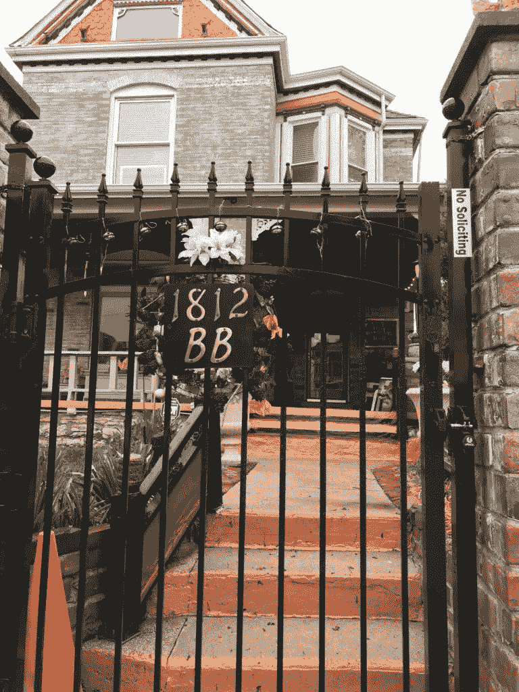
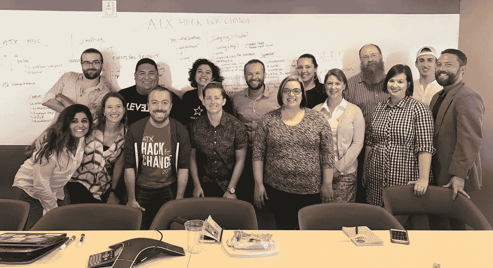
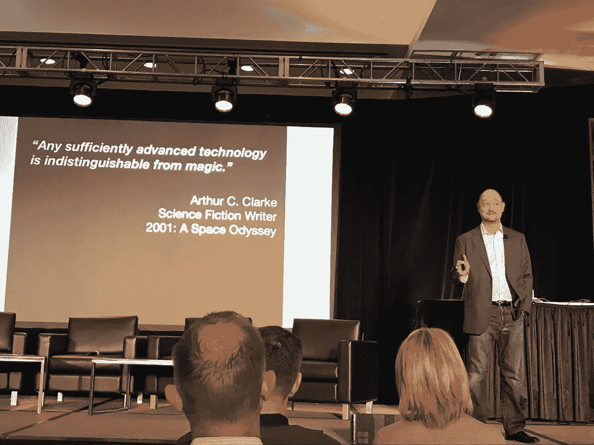

# 如何发展成为一个智能城市，而不让任何人掉队

> 原文：<https://medium.com/hackernoon/how-to-evolve-into-a-smart-city-without-leaving-anyone-behind-b87b214f7ebc>

我很高兴最近参加了在堪萨斯城举行的智能城市连接会议。首先，谈论一个隐藏的宝石。我不知道当我着陆的时候会发生什么……只是脑子里闪过这样的画面。(是的，我们都受制于刻板印象和偏见。)

其次，我被这座城市的文化和历史并置所吸引。我选择住在一个小床和早餐。我喜欢旅行的一个重要原因是有机会听到别人的故事，并更多地了解我已经设法到达的地方。你好世界。

很快，我就被铁路的历史震撼了…堪萨斯城是美国的中心，令我惊讶的是，爵士乐和艺术正从这座城市的不同部分流出来。

我和另一位客人进行了一次感人的对话，讨论了未来对这座城市意味着什么，以及我们如何在建设一座可以重新生活的城市的同时，更好地保留个性。多样化的文化可以随着科技的发展而提升。

这就是你想要的。嚼着吐司，我能感觉到我们谈话中的失落。那么，我们的城市应该如何发展？

1.  **我们应该一起悲伤**
2.  **我们应该一起庆祝**
3.  **我们应该一起建设**

# 我们如何应对失去？

我们谈得不够多。

我们喜欢展示未来的光明和潜力。但是要处理社区感受到的真正的悲伤要困难得多。他们有这种感觉是完全合理的。

作为一个最近失去了亲爱的家人的人，我们不应该更加小心地对待这方面吗？尽管你可能想否认这一点，但事实是我们仍然必须经历这个过程，这可能会有点痛苦。

我发现，通过坐在不舒服的对话中，并通过问这些问题来释放一系列情绪，可以成功应对损失:

> 在你的城市有新的装置是什么感觉？
> 
> 你感觉到进步了吗？
> 
> 你对你的社区有什么历史？
> 
> 告诉我你和你的家人是如何来到这里的？
> 
> 你喜欢你住的地方的什么？
> 
> 你会改变什么？

听到组成这个社区的所有人的故事是非常令人着迷的，检查生命体征也很重要。大家感觉如何？

从那里，下一个后续是谈论庆祝活动。

# 我们如何庆祝？

从听到阵亡将士纪念日游行和极端天气的故事(2013 年的暴风雪)，在一个社区里有这么多共同制造的记忆。

在奥斯丁，我们有从“ [Blues on the Green](https://www.austintexas.org/listings/blues-on-the-green/2673/) ”(一个低调的音乐系列)到“[辣酱节](https://www.austinchronicle.com/food/2017-08-18/2017-contest-and-festival-facts/)”(你猜对了。一个吃辣酱并试图生存的节日。)**这些社区记忆是关键，应该庆祝。**

当思考我们未来的城市将会是什么样子时，重要的是要了解我们从哪里来，并关注我们共同取得的成就。

我喜欢科技在庆祝活动中发挥作用并增强我们彼此联系的想法。不仅如此，它还可以起到保持记忆的作用，成为社区的粘合剂，而不是分裂者。

# 我们如何建造？

作为一名公民黑客，我总是重复公民黑客马拉松的力量，它将社区聚集在一起，让我们能够一起游戏、辩论和**建设我们的未来。**

我们需要越来越多的公共空间来和那些和我们想法一样的人在一起，当然也包括那些和我们想法不同的人。我们需要打破通过各种媒介植入的障碍和成见。

我们不必成为某个群体想要的样子。我们也不必都同意。但是我发现每个人都能找到妥协。我们一直都在这样做……而我们发现自己弯曲的情况往往是因为爱。爱他人，爱我们的家人，爱一项事业，爱一个需要帮助的朋友，或者爱我们的抱负。

ATX Hack for Change Planning Committee

我们可以分享想法，利用我们的共同潜力，实际上，推动事情向前发展。我们可以让每个人都参与到关于社区未来以及技术如何改善他们生活的对话中。

技术是一种工具，它当然不是完美的，但我们必须赞扬那些为我们所能取得的成就提高了标准的人。我总是对这些黑客马拉松活动中所建立的东西感到惊讶，我们应该努力建立更多像这样的空间。

这里有一个有趣的引用，我将留给你:

**“智能城市不就是像你的智能手机一样只是手机吗……智能城市关乎潜力。”** — [草药 Sih](https://medium.com/u/85097c4a8c68?source=post_page-----b87b214f7ebc--------------------------------)

# **感谢** [**Mozilla**](https://www.mozilla.org/en-US/foundation/) **和**[**u . s . Ignite**](https://www.us-ignite.org/)**让我有机会参加今年的活动，也让我有机会聆听美国其他社区领袖在这场运动中的观点——让我们一起来吧！**