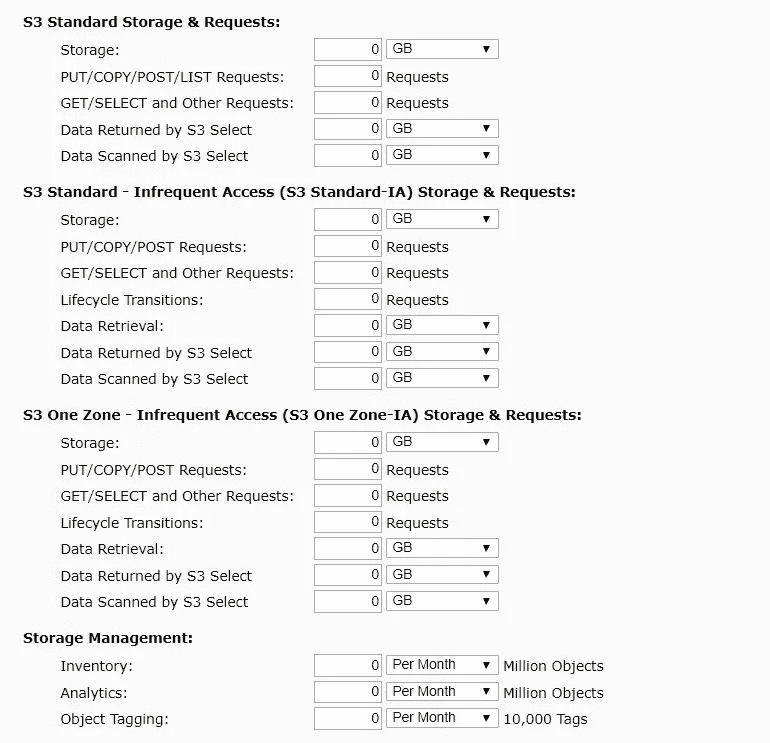
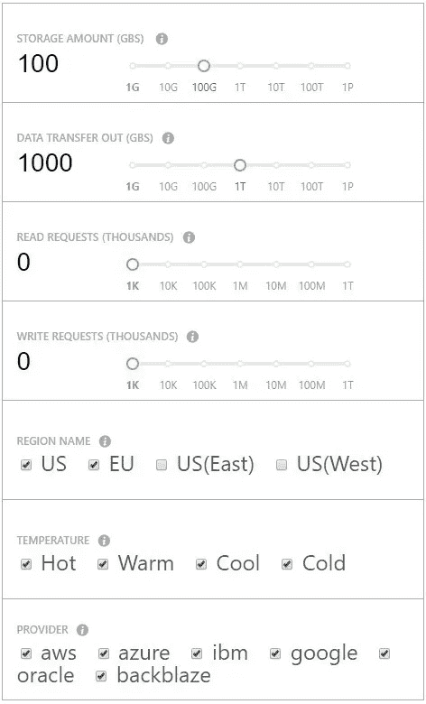

# 如何确定移动应用的 AWS 定价

> 原文：<https://medium.com/hackernoon/how-to-figure-out-aws-pricing-for-a-mobile-application-7fcfc91170ad>

企业选择亚马逊网络服务云应用的原因有很多。公司使用一个全球平台获得存储、分析、计算和许多其他服务。AWS 很好地照顾了客户，降低了技术成本，加快了开发过程。公司老板还能要求什么？你此刻一定在考虑透明定价选项。

在本文中，我们将回顾专门针对[移动应用](https://applikeysolutions.com/services#mobile-development)的 AWS 特性、它们的定价以及免费试用选项。最后，我们将了解什么是 AWS 计算器，以及它如何帮助您的工作。

# 为您的移动应用程序使用 AWS 的好处

尽管 AWS 定价系统很复杂，但我们不得不提到它的三个最重要的好处，可以帮助您的业务增长。

*   **无电荷启动。**每个 AWS 手机应用服务都有免费试用。当一个企业刚刚开始成长时，这对预算有限的创业公司很有帮助。
*   **见效快。**亚马逊为开发者提供了无服务器技术，可以更快地启用服务。
*   **与客户沟通。**获得反馈并与最终用户对话是移动应用改进的最重要来源。通过 AWS，公司可以通过发送电子邮件和推送通知来开始与用户“交谈”。

# 主要的 AWS 移动服务

AWS Mobile 为开发人员在云中提供了一个平稳的开端。亚马逊为 web、iOS、Android 和 React 原生平台编写了说明。您所要做的就是选择要实现的特性。

*   **云:**提供安全认证、NoSQL 扩展数据库、用户数据存储、无服务器技术和聊天机器人。
*   **高质量:**使用内容分发网络(CDN)并在云端进行单元测试。
*   **参与:**接收详细的分析数据，运行 A/B 测试，并向用户发送通知。

在这三点中隐藏着大量的移动市场机会。每个方面，如数据存储或发送电子邮件，都是由某个 AWS 产品控制的。为了弄清楚 AWS 的定价，我们应该首先详细回顾一下这些产品。

# AWS 移动产品的定价

## 1.亚马逊认知

该工具致力于为移动用户提供安全的身份认证。 [Amazon Cognito](https://aws.amazon.com/cognito/pricing/) 基于用户池——这些是允许注册过程的用户目录。在这种情况下，付费是基于每月活跃用户(mau)的。

**要点:**

*   免费试用针对前 50，000 mau。
*   一个月活跃用户的价格从接下来的 50，000 个用户的 0.00550 美元逐渐下降到超过 1，000 万个用户的 0.00250 美元。
*   Cognito 还提供用于多因素身份验证的短信服务，对此有单独的定价系统。

## 2.亚马逊 DynamoDB

这是一个无服务器数据库，在任何规模下都具有很高的响应能力，并允许定期备份。使用 [DynamoDB](https://aws.amazon.com/dynamodb/pricing/) ，您需要为数据存储、写容量单位(WCU)和读容量单位(RCU)付费。

**要点:**

*   每月 25 GB 是你免费得到的存储空间。然后，每 GB 支付 0.25 美元。
*   读取容量单位(RCU)意味着对 4KB 大小的项目使用最终一致或非常一致的读取。如果物品尺寸较大，则需要更多的 rcu。
*   对于写容量单位，它们意味着使用 1KB 大小的写请求。
*   你每个月可以免费获得 25 个 rcu 和 WCUs 大约有 2 亿个请求。100 个 wcu 和 100 个 rcu 的成本分别为 0.0128 美元和 0.0025 美元。

## 3.亚马逊 API 网关

通过 [API 网关](https://aws.amazon.com/api-gateway/pricing/)，开发者可以管理所有操作:创建、维护、监控等。在定价方面，你只需为 API 的实际使用付费，即收到的呼叫。

**要点:**

*   免费试用，每月可接听 100 万个电话，免费期长达 12 个月。
*   如果收到的呼叫超过 100 万个，则下一个 100 万个的价格为 3.50 美元(适用于美国、加拿大和一些欧盟国家)。你还需要为传输出去的数据付费。
*   请注意，价格因国家而异。

## 4.亚马逊拉姆达

[Amazon Lambda](https://aws.amazon.com/lambda/pricing/) 是一个允许在没有服务器的情况下管理任何应用类型的工具。开发人员只需运行代码，然后将代码上传到工具，Lambda 会自动进行缩放。付款仅基于请求的数量和代码执行的持续时间。

**要点:**

*   每月 100 万次请求和 400，000 GB 秒是免费的。
*   免费试用在使用一年后不会过期。
*   接下来的 100 万次请求需要支付 0.20 美元，免费试用后每使用 GB 秒需要支付 0.00001667 美元。

## 5.亚马逊 S3

如今，任何软件产品都需要安全的数据存储，而[亚马逊 S3](https://aws.amazon.com/s3/pricing/?nc=sn&loc=4) 是这种情况下的一个很好的解决方案。对于开发人员来说，不仅存储数据，而且分析和检索数据都将是一项简单的任务。这款工具非常适合任何类型的应用，无论是移动应用还是 web 解决方案。为了不与你必须支付的费用混淆，你可以使用简单的每月计算器作为亚马逊 S3 价格计算器(在下一节阅读关于这个工具)。

**要点:**

*   某些服务(存储、请求、数据传输)的价格因地理位置而异。
*   5 GB 的标准存储是免费的。
*   您可以使用亚马逊 S3 的多个选项:标准存储、标准非频繁访问、单区域非频繁访问和冰川存储。

## 6.亚马逊 Lex

如果你要建立一个对话界面，这个解决方案就是你所需要的。 [Amazon Lex](https://aws.amazon.com/lex/pricing/) 也可以用于任何类型的应用程序，它为开发者提供了最新的技术创新。例如，您可以使用自动语音识别和自然语言处理来使您的应用程序对移动用户真正“活跃”。付款取决于请求的数量。

**要点:**

*   在使用的第一年，你每月会收到 10，000 次免费文本请求和 5，000 次免费语音请求。
*   每个文本请求的价格是 0.00075 美元，每个语音请求的价格是 0.004 美元。

## 7.亚马逊针尖

[Amazon Pinpoint](https://aws.amazon.com/pinpoint/pricing/) 为你提供了与客户有效沟通的所有必要工具:你可以发送电子邮件、短信和推送通知。严格来说，这个工具不仅开发者可以使用，营销人员和企业主也可以使用。从长远来看，良好的沟通有助于改善你的产品。

**要点:**

*   您的目标受众中的前 5000 个终端每月都是免费的。
*   电子邮件:10，000 封信花费 1.00 美元，接下来的 1，000 个端点(前 5，000 个之后)花费 1.20 美元。
*   推送通知:你可以免费获得前 100 万条消息，下 100 万条需要 1 美元。
*   短信:你每发送一条信息支付 [$0.00645](https://aws.amazon.com/pinpoint/pricing/#SMS_Text_Messages) ，接下来的 1000 个端点(前 5000 个之后)的费用是$1.20。

现在我们看看 AWS 定价在特定的亚马逊产品中是如何工作的。当你看到如此多的数字和价格上的细微差别时，价格计算可能会显得势不可挡。但是不要慌！亚马逊和其他平台已经用特殊的计算工具解决了这个问题。

# 如何计算 AWS 成本:可使用的 3 种工具

那么，AWS 一个手机 app 要多少钱？如果你决定使用定价容易理解的产品，计算不会花太多时间。但是复杂的移动解决方案需要更多的努力，所以在这种情况下你应该使用 AWS 每月计算器。我们准备了三个选项供你选择。

## 1.AWS 简单月度计算器

当我们回顾移动应用的 AWS 产品时，定价特别复杂的是亚马逊 S3。为了确保你不会迷失在这些数字中，亚马逊为[提供了一个简单的表格来填写](https://calculator.s3.amazonaws.com/index.html)(你应该首先从左边的菜单中选择亚马逊 S3)。这是 AWS 定价计算器的一个片段:

另外，亚马逊还考虑了地理定位:你可以从页面顶部的下拉列表中选择。想象一下，使用这个工具，你可以节省多少时间，避免多少错误！

## 2.成本存储

[这个工具](http://coststorage.com/)本身不是亚马逊云价格计算器，但它是一个有用的解决方案，因为我们都关心我们的支出。假设您想要比较几种云服务(例如，亚马逊和谷歌云)的整体定价，您只需填写一个计算器表单，然后查看结果。

表格的最后一行是关于云提供商的。你可以一次选几个，比较价格。但是，除了比较功能，CostStorage 也可以是一个易于使用的 AWS 价格计算器。

## 3.Unigma

[这个计算器](https://calculator.unigma.com/#/instances)包含三个主要提供商的价格:AWS、Azure 和谷歌云。在 Instances 页面上，您填写参数，系统将自动显示所有三个平台的结果。

此工具不用于常规用途，但如果您想要计算和监控整体市场价格，它会很有帮助。

**另请参阅** : [移动应用开发的隐性成本](https://applikeysolutions.com/blog/hidden-costs-of-mobile-app-development)

# 结论

亚马逊为你的移动应用准备了全方位的云服务。使用的服务越多，计算最终定价就变得越困难。

移动开发者(有时还有营销人员)使用的 AWS 产品有七种，但只有亚马逊 S3 因其复杂的定价系统而闻名。最快的解决方案是使用专为亚马逊 S3 定制的 AWS 计算器。至于更简单的工具，市场上有 Unigma 和 CostStorage 可以提供:它们允许计算和比较几个云平台的价格。

但是没有人会比专业开发者更能告诉你 AWS 的好处。[让我们当面继续这个对话](https://applikeysolutions.com/contact)，你可以向 Applikey 的专家询问你的其他问题。

*最初发表于*[T5【applikeysolutions.com】](https://applikeysolutions.com/blog/how-to-figure-out-aws-pricing-for-a-mobile-application)*。*