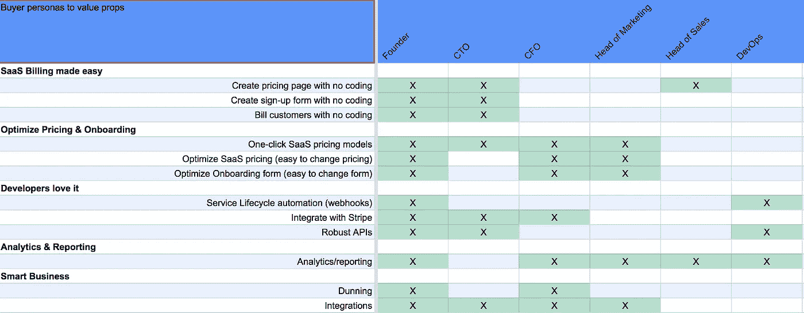

# 如何为您的 SaaS 找到最佳定价

> 原文：<https://medium.com/hackernoon/how-to-figure-out-the-best-pricing-for-your-saas-ac9bfbf2f6b3>

你刚刚完成了你的 MVP。现在，你希望推出并开始获得付费客户。问题是，你不知道应该如何给你的产品定价。你可能会问自己:

“我需要创建多个层吗？”

"我应该比我的竞争对手要价低还是高？"

“我应该关闭特定功能，还是按用户数量等指标收费，或者两者兼而有之？”

问题的清单还在继续…

本文旨在通过提问帮助您找到所有定价问题的答案:**谁是您的理想客户？**深入了解你的理想客户将有助于你制定直接针对他们的定价，向他们展示他们需要从你的产品中获得的价值，以及他们觉得合适的价格。

# 你必须了解你的客户，才能知道你的定价

[Mailchimp’s buyer personas](https://blog.mailchimp.com/new-mailchimp-user-persona-research/)

买家角色尽可能详细地描述了你的理想客户。在设计买家角色时，你应该考虑的一些事情是:

*   **您的采购员在他们的组织中担任什么角色**
*   **他们最关心你的哪些特点**
*   你可以通过哪些营销渠道找到你的买家？
*   **你的买家希望从使用你的产品中获得什么价值？**
*   **他们愿意付出什么代价？**

理想情况下，你可以通过采访你的客户并进行问卷调查来研究这些信息，最糟糕的情况是，你只需要自己做出估计，并在获得客户后填补空白。向不付费的客户询问任何信息时要小心——这些人通常不会成为理想的客户，并且会通过为不付费的人优化来影响你的策略。

你能得到的细节越多越好；这些人物角色不仅对你的定价模型有用，而且可以作为你为产品所做的每一个决定的框架。

# 您的客户关心什么？

谈到定价策略，要考虑的最重要的事情之一是，当不同的客户使用你的产品时，他们真正关心的是什么。

在为 [Servicebot](https://servicebot.io) 构建买家角色时，我们制作了一个电子表格，将价值主张映射到角色，让我们了解潜在客户最关心产品的哪些部分。

A basic mapping of value proposition to buyer persona for [Servicebot](https://servicebot.io)

通过了解谁想要什么，您可以了解所有客户都应该拥有哪些功能，以及哪些功能可以通过分层来实现。如果你能[发现](https://hackernoon.com/tagged/figure)一个大型组织的首席财务官是少数几个关心特定价值主张的人之一，你可能会考虑将该价值置于更高层次的背后，因为你可以预期他们会比，比如说，白手起家的初创公司创始人有更大的预算。

# 在人物角色的基础上构建您的定价策略

在这个充实买家角色的练习中，你现在已经有了建立合理定价策略所需的信息。很难弄清楚你的不同定价层应该是什么样的。

## 按价值定位定价

让更贵的层提供更多的功能是许多公司使用的一种策略，为他们的 [SaaS](https://hackernoon.com/tagged/saas) 产品定价。在执行这一战略时，你需要密切关注哪些客户关注哪些功能，并根据你的产品提供的特定价值主张的需求，创建公司规模的逻辑级数。

## 按价值标准定价

根据价值指标为您的层定价是另一种常见策略。一个好的价值衡量标准是，随着它的增加(导致产品成本增加)，客户从你的产品中获得的价值也会增加。例如基于处理的收入数量的条收费。

找到捆绑功能与价值指标的组合是制定有效定价策略的关键。我们的目标是创建一个合理、易于理解的定价模型，让您能够随着客户的增长而增长。

# 你应该设定什么样的价格？

既然你已经制定了一个策略，我们需要最后输入价格。定价模型通常采用三种不同的方法:

## 基于成本的定价

基于成本的方法会计算出产品的内部成本，并在此基础上增加利润。例如，如果每个客户每月花费你 100 美元，你可以将你的产品定价为每月 120 美元，每个客户给你 20 美元的利润。这种方法的问题是，它只看你公司的成本，没有考虑到客户对价格的感受。

## 基于竞争对手的定价

许多初创公司最终会将自己的价格与竞争对手进行比较，这可能有效，也可能无效。试图赶上或低于竞争对手的价格可能会遭遇诸如竞相杀价之类的问题(想想优步是如何通过补贴价格来排挤竞争对手的)。一般来说，最好是根据您提供给客户的价值来优化您的价格，尤其是当您提供的价值超过竞争对手时。

## 基于价值的定价

基于价值的定价是最有效(但最难实施)的定价模式，因为它是为您的公司量身定制的。你需要了解你的客户从你的产品中获得了多少价值，并据此定价。谈到价值定价，许多公司使用[“10 倍法则”](https://sixteenventures.com/saas-pricing-strategy):给你的客户价值 10 倍于你要价的东西。

## 你怎么知道人们愿意支付什么？

要搞清楚人们愿意付出什么，不能直接问他们“你想付出什么。”荷兰经济学家彼得·范·韦斯滕多尔普(Peter van Westendorp)建议问四个问题，从特定客户群中收集有价值的价格数据:

> 在什么价位，您会认为该产品太贵而不会考虑购买？(太贵了)
> 
> 在什么价位上你会认为产品定价太低以至于你会觉得质量不会很好？(太便宜了)
> 
> 在什么价位你会认为产品开始变贵，所以它不是不可能的，但你必须考虑购买它？(昂贵/偏高)
> 
> 在什么价位上，你会认为这个产品很划算——物超所值？(便宜/物有所值)

## 警惕免费增值

许多公司提供“免费层”,其功能有限。这个想法是，人们将开始使用产品，从免费层获得价值，但如果他们开始付费并最终升级，会看到更多的价值。理论上这听起来很棒，对一些公司来说确实如此。免费层的问题是，您可能会开始遇到一些问题，例如为免费客户提供支持的高成本，免费层带来了错误类型的客户，并要求您花费资源来尝试将最便宜的客户转变为真正向您付费的客户。早期创业公司感受到的痛苦最大，因为他们只能在关键业务上花费资源。看看你的买家角色和产品——有时免费增值模式很好，有时不好。

# 为你的产品定价是一个持续的过程

你永远不会完成你的定价策略。随着你从客户那里获得更多的数据和反馈，你将会改变你的人物角色，使之更加准确，并改变你的定价策略，以更好地针对这些人。

## 想卖掉你的 SaaS？ [Servicebot](https://servicebot.io) 为定价页面、账单管理等提供了极其简单的插件。