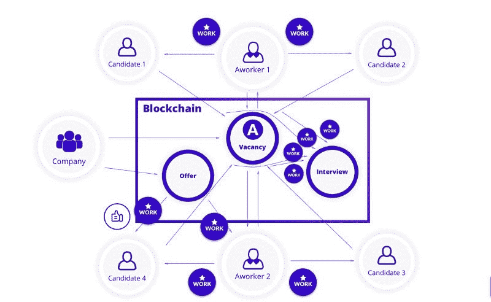

# 如何找工作:区块链 Vs 社交网络

> 原文：<https://medium.com/hackernoon/how-to-find-a-job-blockchain-vs-social-networks-bdfa49b6001d>

如今，大多数雇主和招聘机构都在使用社交媒体寻找合适的候选人，这意味着人们通常选择社交媒体作为求职策略的一部分。根据[的秘密招聘人员](https://theundercoverrecruiter.com/infographic-how-search-jobs-facebook/)，1/4 的“超级社交寻求者”成功地通过脸书、推特或 LinkedIn 建立关系网。根据 [2017 年 CareerBuilder 调查](http://press.careerbuilder.com/2017-06-15-Number-of-Employers-Using-Social-Media-to-Screen-Candidates-at-All-Time-High-Finds-Latest-CareerBuilder-Study)，70%的雇主在做出招聘决定前使用社交媒体筛选候选人，57%的招聘经理不太可能面试他们在网上找不到的人。值得注意的是，根据[薪级表](https://www.payscale.com/career-news/2017/04/many-jobs-found-networking)，一些人估计超过[85%的](https://www.linkedin.com/pulse/new-survey-reveals-85-all-jobs-filled-via-networking-lou-adler)空缺职位是通过人际关系网填补的。因此，如果你在找工作，花时间建立你的职业网络可能比在网上求职更好。

> *[*flex jobs*](https://www.flexjobs.com/)*的高级职业专家布里·雷诺兹说:“当招聘人员搜索求职者的名字以了解他们的更多信息时，如果没有发现有人在网上活跃，这实际上是一个危险信号。“LinkedIn 是求职者应该用来帮助雇主显示他们精通技术并了解数字通信基础知识的最基本工具。”**

*其他社交网络利用这一点作为优势，例如，脸书现在有一个新的[求职功能](https://www.facebook.com/jobs_coming_soon/)，可以帮助你准确地找到你想要的东西。鉴于目前有 6500 万企业在使用脸书页面，这或许值得一试。*

*研究公司 CB Insights 的情报副总裁 Marcelo Ballvé在接受 CNN 采访时谈到了这种扩张如何帮助脸书侵占由 LinkedIn 牢牢控制的领域，LinkedIn 是一个专业人士的社交媒体网站。他说:*“如果一代人通过脸书获得第一份工作，并开始将这个平台视为首选劳动力市场，这可能会对 LinkedIn 构成威胁。”**

**

*然而，将脸书完全变成一个求职平台可能会进一步模糊人们私人生活和公共生活之间的界限。对于那些无法抗拒发布雇主不应该看到的东西的诱惑的人来说，隐私设置仍然是最可靠的保护。此外，考虑到[目前与脸书](https://www.vox.com/2018/4/10/17207394/cambridge-analytica-facebook-zuckerberg-trump-privacy-scandal)的丑闻，换一种方式找工作可能会有帮助。在社交网络中，如果你想为一个朋友推荐一个工作职位，你必须给他/她发送一个空缺职位的链接，而对你和收件人没有任何回报。*

*这里是区块链的力量可以充分展示的地方。*

**

*例如，工作平台可以根据你的心理类型、专业技能和成就，帮助你找到最合适的公司和工作岗位。权力下放为创建新的职业生态系统提供了最佳机会。在一个工作平台上，为人们的行为付费变得更加容易:借助智能合同的力量，为熟人推荐或自己来参加工作面试付费是自动的。此外，所有信息都被安全存储，所有操作都是透明的，这排除了陷入昂贵但不必要的义务的可能性。*

*作为一个由区块链驱动的招聘平台，Aworker 旨在解决以下问题:*

1.  *降低雇佣成本。中介为他们的工作收取高额佣金。填补一个中层经理职位空缺的平均成本是 8000 美元。智能合同使这一过程更加透明，并可以将费用减少多达 4 倍。*
2.  *个人数据的控制。现在，人们将能够控制个人信息，同时获得回报。*
3.  *人们会找到心理上更适合自己的工作。工人将帮助公司找到更好的员工。*

*Aworker 通过将区块链驱动的技术置于 Work 2.0 的核心，开发了一个颠覆性的解决方案。现在每个人都会因为他的工作相关的推荐而获得奖励。*

*在智能合同的帮助下，奖励会自动支付给招聘过程中的所有参与者。你可以在 [HackerNoon](https://hackernoon.com/the-future-came-early-decentralized-job-search-bce71fa0f627) 上阅读关于 Aworker 算法的案例研究。*

*根据[福布斯](https://www.forbes.com/sites/susanadams/2014/02/06/4-ways-to-use-facebook-to-find-a-job/#51b9da121fab)调查，83%的求职者说他们在社交媒体搜索中使用脸书，相比之下只有 36%的人使用 LinkedIn，令我惊讶的是，LinkedIn 是求职者最不常用的网站。“如果不是 80%，至少有 70%的工作没有公布，”职业地平线的总裁马特·扬奎斯特告诉 [NPR](http://www.npr.org/2011/02/08/133474431/a-successful-job-search-its-all-about-networking) 。这意味着人际关系网成为找新工作最有影响力的方式之一。同时，推荐候选人到一个开放的职位，人们不会得到任何奖励，即使这个人非常适合这个职位。*

*区块链有能力改变它，并为优秀的推荐人提供奖励，而不必去招聘机构或从第一次面试到最终决定等待 2-3 个月。这将降低公司每次招聘的成本，并为人们创造一个机会，不仅因为他们的工作，而且因为他们找到合适人选的技能而获得报酬。*

**难道不是未来，* ***人获得技能奖励的地方*** *？**