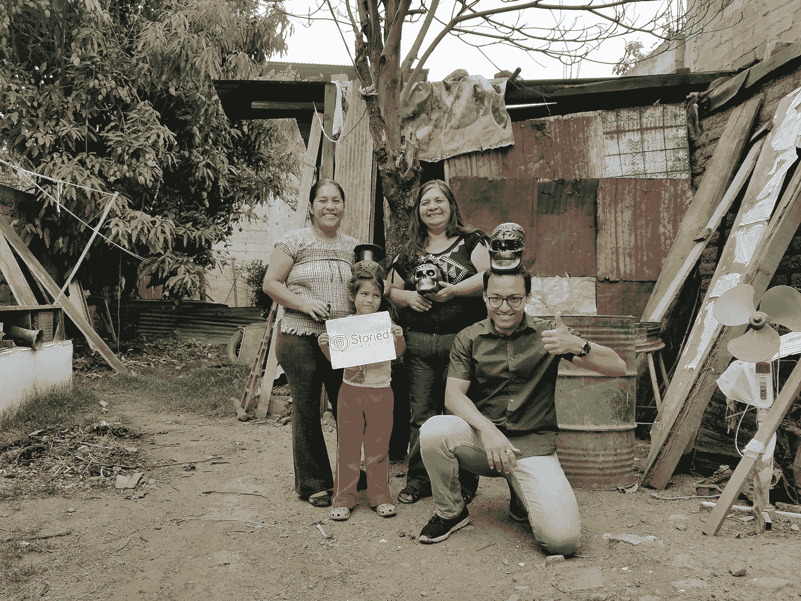

# 如何找到并做你喜欢的工作

> 原文：<https://medium.com/hackernoon/how-to-find-do-work-that-you-love-f66cae181681>

## 关键在于“C”字，而不在于“P”字。

做你热衷的事情不是好建议。

大多数给我这个建议的人要么 a)对自己的工作不满意，要么 b)在网上卖数码产品赚钱。

即使在商界，激情也被高估了。

但是从科学的世界里，我了解到——好奇心是热情的前身。

我来美国攻读化学工程博士学位。我对废水生物降解有热情吗？

绝对不会。

但我对它充满了好奇，并在研究生院的接下来 5 年里致力于进行有意义的研究，[最终将我的硕士论文](https://i.imgur.com/VgphrVd.jpg)带去了新的知识，这些知识可能有助于生物降解界创造更先进的创新。

事实上，以孩子为例。当他们来到这个世界，他们对任何事情都没有热情。

**孩子们坚持做事情，因为他们对世界充满好奇。**

但它们是这个星球上最好奇的生物。

他们中的大多数人继续尝试绘画、芭蕾、唱歌、小提琴、大号、足球、摔跤等，尽管他们做得很烂，但并不是因为他们对这些充满热情。

但是当我们长大成人，不再好奇时，奇怪的事情就发生了。

“激情”这个词我们听得太多了，以至于模糊了我们的思维。我们不再好奇。

我再给你举个例子。

当我第一次来到美国时，我对旅行从来没有热情。

但我对这个伟大国家的文化、食物和风景充满了好奇。

我将这种好奇心与我对重金属音乐的热情结合在一起，这给了我在预算有限的情况下探索未知领域的勇气。

在经历了美国 47 个州、加拿大、墨西哥、波多黎各数百次难忘的经历后，现在我可以说我对旅行充满了激情。因为它帮助我成为一个更好的人。

At the Metallica Orion Fest 2013 in Detroit, MI

这里有一个专业背景的例子。

所以我在 Vaadin 做销售发展代表。我出售基于开源 Java 的 UI [框架](https://hackernoon.com/tagged/framework)。

如果我在面试中一开始就说我对此充满热情，那我就是在撒谎。

我热衷的是 a)技术销售和 b)成为成功团队的一员。

但当谈到产品和商业模式时，我非常好奇这家公司到底是如何通过免费提供东西来赚钱的？

我很想知道顾客对产品的看法。

这帮助我在桌面上的两个报价中做出更明智的决定。现在我很高兴我做到了。

因为现在我从技术角度对产品略知一二，而且我对开源生态系统充满热情。

另一方面，有一次我开了一家[健身教练业务](https://poweredbyhabits.com)。问我的任何一个朋友，他们都会告诉你我对健康有多着迷。

但是教练行业糟透了。即使我在做自己热爱的事情，我也不再享受乐趣。

这是我在谈到企业家精神时学到的，**好奇心是持续行动的关键。**

我一点也没有忽视激情。好奇心和激情之间必须有一个健康的平衡。

但是不要忽视好奇心——不管你是在找工作还是在寻找商业点子。

事实上，如果你是一个有抱负的企业家，不要问自己— *我对什么想法或领域充满热情？*

相反，一个更好的问题应该是— *我好奇的是什么也能解决问题或满足人们的需求？”*

从我在酒店、建筑工地、清洁和油漆工作、汽车修理工作的经历来看；我卖过 tapestry，做过家常菜，做过 Wordpress 网页设计工作，现在我已经卖了一段时间开源框架，以下是我的发现

## 一旦你的手艺/工作变得更好，人们因你的工作而重视你，钱开始进来——激情就会从背后拥抱你。

要找到并做你永远热爱的工作，让好奇心成为你的指南针，让成就感成为你的首要 KPI，让激情成为你的衍生物。

今天，我对渐进式 Web 应用程序、加密资产的平均成本、扩展开源商业模式、掌握企业 B2B 销售流程以及 17 个其他主题感到好奇。

我说这些不是为了打动你。我说这些是为了激励你，一旦你开始用好奇的眼光看待你的工作和生活，那将是一个完全不同的世界。基金有点。

那么你目前对什么感兴趣呢？请在下面的评论中分享。

卡尔·纽波特的《好得让他们无法忽视你》和埃里克·沃尔的《不思考:重新发现你的创造性天才》是两本很棒的书，主题是好奇心如何比激情更强大。

**PPS:** 还在看这个？我想你会喜欢[我的周日每周简讯](https://www.ankurmanshrestha.com/newsletter/)，在那里我分享了实现最佳表现和创造丰富生活的战术策略。在这里阅读全部内容[→](https://www.ankurmanshrestha.com/)

*原载于 2018 年 2 月 5 日*[*https://www.linkedin.com*](https://www.linkedin.com/pulse/how-find-do-work-you-love-ankurman-shrestha/)*。*