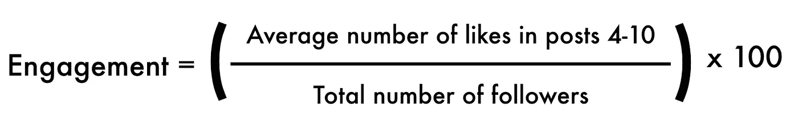
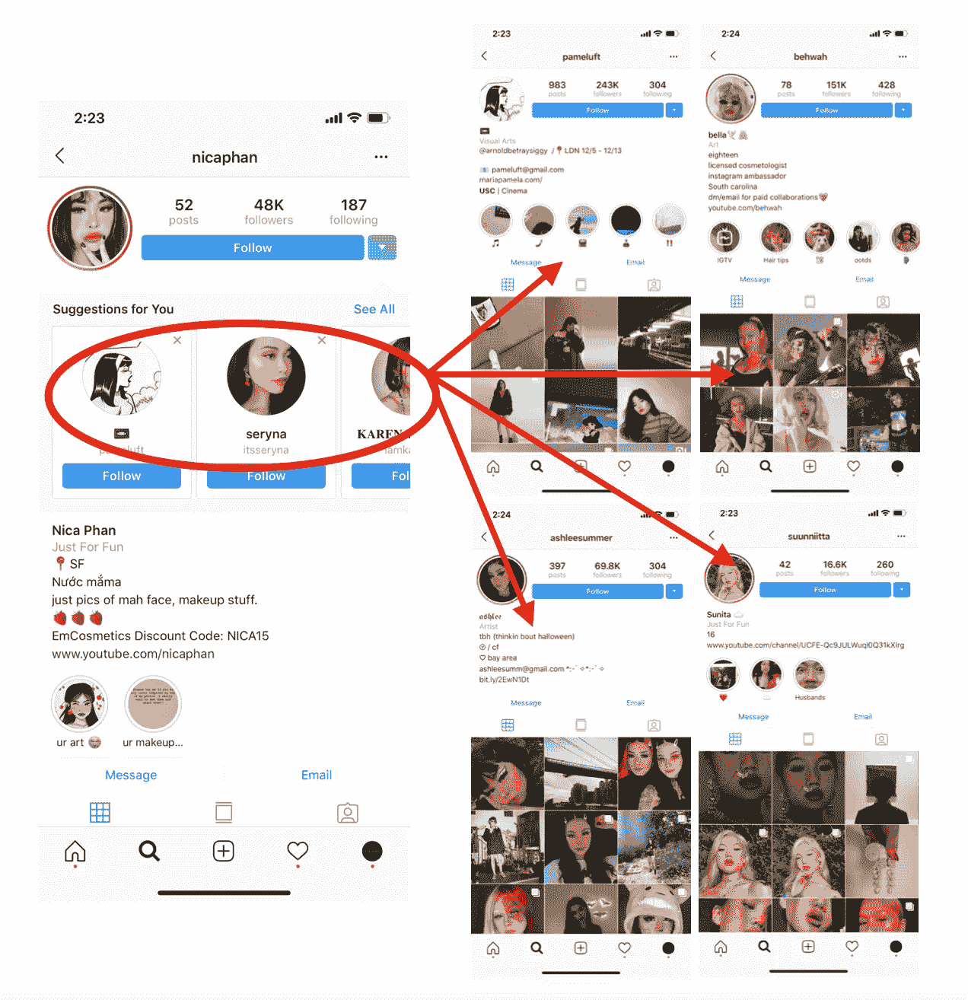
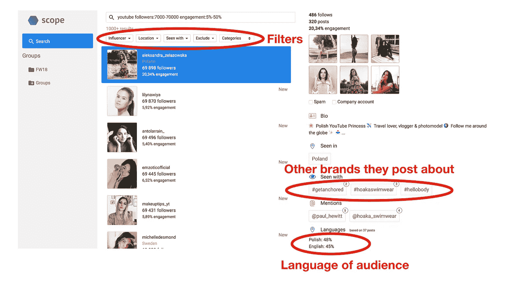

# 如何找到最有价值的 Instagram 影响者？

> 原文：<https://medium.com/hackernoon/how-to-find-the-most-valuable-instagram-influencers-df8ddd5b2243>

我已经为像 [Depop](https://www.vogue.com/article/depop-millennial-friendly-shopping-app) 这样的品牌和我自己的小企业( [@pinlord](https://www.instagram.com/pinlord/) ， [@potteryforall](https://www.instagram.com/potteryforall/) ， [@macramemakers](https://www.instagram.com/macramemakers/) )组织和执行了数以千计的影响者营销活动，从经验来看，我知道每一个活动的成功几乎完全取决于与你一起工作的影响者的质量。

如果你想让你的钱得到最好的回报，首先，你必须知道如何[衡量一个有影响力的人是否有价值](https://hackernoon.com/how-to-measure-what-an-instagram-influencer-is-worth-cb488f605ffe)，其次，有效地寻找最有价值的人。你的时间和金钱是有限的，你不想把它们花在社交媒体影响者身上，因为他们不可能给你带来好的结果。

# 如何知道影响者是否有价值:

谈到影响者营销，价值取决于当[在他们的 Instagram 个人资料上推广某个东西](https://www.instagram.com/p/BnQ3zQPhtr3/)时，一个影响者可以带动另一个用户(或网站)的关注者数量/流量/销售额。他们带动的关注人数/流量/销量越高，他们的价值就越高。

任何人都可以通过测量他们的有机参与度来衡量特定影响者的潜在价值，这是最有效、最简单的方法。

There are more effective ways to measure an influencer’s value but they require A LOT of data (and know-how), which isn’t accessible to most people. Although it’s not perfect, engagement rates will give you a relatively accurate measure of potential value and it will be more than enough for most of us. Btw, have you every asked yourself [if your Instagram is actually even worth growing?](/better-marketing/how-to-know-if-your-instagram-is-actually-worth-growing-c0874be37fc5) If not, you should. It might help save you a whole bunch of time and energy. It’s not worth it for everyone…

要衡量有机参与率，将影响者在帖子 4 到 10 中获得的平均“喜欢”数除以粉丝总数，然后乘以 100。由此，你会得到一个百分比。这就是影响者的参与度。

You measure posts 4–10 because posts 1–3 are still getting likes, so they will not be the most accurate way to calculate their engagement. You don’t measure after post number 10 because that is likely to be historic engagement, and you want to measure the engagement an influencer is getting NOW, not in the past.

参与度越高，某人推动最大数量的关注者/流量/销售额(相对于该帐户的关注者总数)的潜力就越大，他们的价值就越高。

这些数字往往会随着时间的推移而变化，但就目前而言，任何拥有超过 10% 10K 粉丝和 10%以上参与度的影响者，都是 Instagram 上最有价值的影响者中的前 1%。

*旁注:当然，人们可以通过购买赞和评论(或通过*[*insta gram bot*](https://bettermarketing.pub/the-best-instagram-bots-for-2022-the-most-effective-options-everything-else-you-need-to-know-73fa36f4e433)*)来自动化其中的元素)来伪造订婚，但在大多数情况下，你可以通过查看某人的内容和他们获得的评论类型来识别假订婚。如果他们看起来粗略，他们可能是。有那么多伟大的、真正有影响力的人，没有必要把钱花在你担心可能会欺骗你的人身上。如果你有兴趣了解更多关于* [*Instagram 机器人*](/the-mission/how-to-automate-an-effective-instagram-bot-that-isnt-spammy-b2146a2c0b19) *(或订婚自动化)如何工作的信息，* [*这里有一个很棒的指南*](/the-mission/how-to-automate-an-effective-instagram-bot-that-isnt-spammy-b2146a2c0b19) *。*

# 如何在 Instagram 上搜索并找到最有价值的影响者:

由于没有办法直接通过应用程序搜索参与度，所以你必须专注于 Instagram 上高参与度影响者密度最高的地方。

## **1。在你的浏览器页面开始搜索:**

你可以从 Instagram 上的浏览器页面开始搜索。为什么？Instagram 通过把你的眼睛卖给广告商来赚钱。你盯着 Instagram 屏幕的时间越长，他们赚的钱就越多。正因为如此，他们希望增加你在使用该应用时看到让你在屏幕上停留更长时间的内容的可能性(这就是 [Instagram 算法](/the-mission/how-the-instagram-algorithm-works-and-what-you-can-do-about-it-cca28d0b2b0b)所做的)。倾向于让人们的注意力保持更长时间的内容是那些比一般帖子参与频率更高的帖子。

A post that gets a larger amount of likes, comments, shares, views, etc, relative to the total number of followers that account has, is more likely to be getting people’s attention in comparison to a post that’s getting a smaller number of likes, comments, shares, views, etc, relative to that account’s the total number of followers. Btw, here’s an article about the best [Instagram content scheduling and post automation tools](/better-marketing/the-best-instagram-content-scheduling-and-post-automation-tools-2e52e48373d3). Using them will help your posting process a lot more efficient 👍🏽

Instagram 通过浏览器页面向你展示与你相关(而你不知道)的高参与度帖子。这是因为它是应用程序中少数几个用户(你)不能直接管理的屏幕之一。因此，如果你想发现与你相关的高度参与的影响者，浏览器页面是你最好的第一选择。

要在这里找到有影响力的人，滚动浏览你在浏览器页面上看到的帖子，点击那些看起来来自人(而不是品牌)的帖子，快速检查简历和内容，以确保他们说你的语言，并且在你的国家。如果是，点击帖子 4-10，写下他们的平均点赞数，然后用这个数字除以他们的粉丝总数。这里有一个电子表格向你展示我是如何跟踪他们的。

举个例子，我给我的[珐琅别针](https://www.pinlordshop.com/)页面@pinlord 送礼。我在寻找 16-25 岁之间的时尚的美国内容创作者，他们有一个 youtube 频道。通过在我的探索者页面上搜索，我很快找到了 [@nicaphan](https://www.instagram.com/nicaphan/) ，他符合我的所有要求，并且他的参与率超过了 18%(太棒了！).

Instagram wants you to discover great content that keeps you on the platform for longer. They measure great content by the engagement posts get, so the higher the engagement on a post, the more likely it is to show on other people’s explorer page.

你在上面的浏览器页面截图上看到的大多数其他面孔和人物的帖子也是有影响的人，参与度超过 15%。

## **2。浏览你找到的高参与度客户的“给你的建议”下拉菜单**:

一旦你在浏览器页面上找到一个高参与度的客户，点击客户简介中“关注”旁边的向下箭头，你会看到一个类似客户的大列表。

浏览这些，挑选那些参与度高且与你相关的。很有可能，你会在这里找到高密度的大客户。就我而言，我搜索了来自 [@nicaphan](https://www.instagram.com/nicaphan/) (我找到的第一个账户)的“给你的建议”账户，发现了超过 4 个其他有影响力的人( [@pameluft](https://www.instagram.com/pameluft/) 、 [@behwah](https://www.instagram.com/behwah/) 、 [@ashleesummer](https://www.instagram.com/ashleesummer/) 、[@ ssunnittaa](https://www.instagram.com/suunniitta/))，他们有很大的参与度，符合我的所有要求。

Through the “Suggestions for You” drop-down menu,Instagram usually shows you accounts that have similar characteristics. If you’ve found a highly-engaged account, it’s likely to show you other highly-engaged accounts. Since searching on Instagram can be a BIG time drain, this feature is likely to save you a ton of time and energy.

## **3。搜索类别相关标签:**

另一种寻找影响者的方法是通过类别相关的标签。在我们开始之前，我想澄清一下: [**Instagram** **标签**](/the-mission/a-simple-system-to-find-the-30-most-effective-hashtags-for-your-instagram-4c2a4ffba34a) **在寻找高度参与的影响者方面并不那么有效**，因为[大多数有机参与度很高的人](https://www.instagram.com/_emmachamberlain/)倾向于不使用标签(因为它们被认为是“垃圾的”)。话虽如此，它仍然是搜索浏览器页面和推荐账户之后的第三个最佳选择，因为 Instagram 上很少有发现功能可以帮助人们找到高度参与的影响者(因为大多数人都不使用 Instagram)。

为此，请转到浏览器页面的搜索栏，点击“标签”选项卡。在这里，键入你想要搜索的标签词，滚动浏览出现在该词下的帖子，点击那些似乎来自可能与你相关的人的帖子，快速检查简历和内容以确保它们与你相关，如果相关，则测量他们的参与度。

[在我的案例](https://www.instagram.com/pinlord/)中，由于我正在搜索年龄在 16-25 岁之间的美国时尚内容创作者，我搜索了“#youtuber”标签，很快找到了 [@isampatterson](https://www.instagram.com/isampatterson/) ，他符合我的所有要求，参与率超过 11%。

.

每当你通过标签搜索找到一个很有影响力的人，一定要看看他们的“给你的建议”下拉菜单。

## 4.使用第三方影响者搜索工具:

除了直接在 Instagram 上搜索，还有一堆有影响力的搜索工具声称能够让你的搜索过程变得更容易，但大多数都没有。

老实说，除了 [Scope](https://scopeapp.io/?utm_source=em) 之外，我还没有在市场上找到任何让我感到放心推荐的。虽然你找不到不使用标签的影响者(他们的结果只由使用标签的账户*填充*)，但他们是最好的第三方搜索工具，因为他们专注于搜索(像谷歌一样)，而不是像大多数其他类似服务一样成为影响者市场平台。因此，与其他选项相比，它们是最简单易用的。当然，筛选他们的数据仍然需要一些时间和精力，你不会在这里找到*最有价值的影响者，因为他们只向你展示使用标签的影响者，但如果你自己在 Instagram 上找不到影响者， [Scope](https://scopeapp.io/?utm_source=em) 是你的最佳选择。*

Unlike most other influencer search tools, Scope is super simple and easy to use. It also allows you to filter by nationality, follower range, engagement and see fancy stuff like language. Don’t forget, always filter by engagement first!

现在，他们正在筛选他们平台上允许的每个人，但他们通常都很棒，你可以在这里申请一个。

## 5.使用第三方影响者搜索平台:

像搜索标签一样，我也建议你在第三方影响者平台上搜索高度参与的影响者时要谨慎行事(平台是将影响者与品牌联系起来并收取佣金的平台)。这是因为，在大多数情况下，这些平台用通过标签找到的影响者填充他们的搜索结果(因为这更容易在 Instagram 上为抓取[)。你应该谨慎的另一个原因是，申请成为他们特色的影响者往往参与度低，价值低。想想看，如果你是一个高价值的影响者，你会有很多向内的工作请求，而不需要花费时间和精力在影响者平台上搜索合作机会。](https://en.wikipedia.org/wiki/Web_crawler)

不是找不到影响者，而是找不到*最*有价值的。如果你可以在 Instagram 上免费使用这些工具进行搜索，你也需要花钱。

如果你在读完这篇文章后仍然决定使用第三方工具， [Traackr](http://www.traackr.com/) ， [Tap Influence](https://www.tapinfluence.com/) ， [Pixlee](https://www.pixlee.com/) ， [Revfluence](https://www.aspireiq.com/) ， [Fohr](https://www.fohr.co/platform) 和其他一堆都是成熟的平台，可以让你轻松地进行大规模的营销活动，但除非你是一个有大量预算的品牌营销人员(并且你不太在乎获得高投资回报率)，否则它们可能不是最有效的方式

除此之外，老实说，我还没有找到任何影响者搜索工具，可以为您提供大量的参与数据，并且对小企业主来说是可访问的(经济高效且易于使用)。如果你知道任何，请发电子邮件给我(eduardomorales.ny@gmail.com)，因为我想知道他们！

无论如何，如果没有任何优秀的工具来解决这个问题，那也没关系……如果你专注于衡量参与度(只与拥有 10K+粉丝和 10%或以上有机参与度的人合作)，并使用我解释的策略在 Instagram 上找到合适的影响者，你可以自己做任何事情！

PS——如果你有兴趣了解有助于你更快发展 Instagram 的其他策略，请阅读这些关于[Instagram 到底是什么以及如何工作的文章](https://theeduardomorales.medium.com/what-instagram-really-is-how-it-works-ad5d7ff5b6a0)、[Instagram 算法如何工作](https://theeduardomorales.medium.com/what-the-instagram-algorithm-does-how-it-works-how-to-use-it-to-your-advantage-752356122c67)、 [Instagram 利基市场以及它们为什么是发展的关键](/better-marketing/instagram-niches-why-they-are-the-new-key-to-growth-on-instagram-beca2878d55d)、[如何在 insta gram 上赚钱](/the-mission/how-to-make-money-on-instagram-7b13ce4b300d)、[如何发展你的 Instagram](/the-mission/how-to-grow-your-instagram-without-buying-followers-76e1d984d00e) 、[如何建立一个赚钱的 insta gram 转发账户](/swlh/how-to-create-an-instagram-repost-account-that-makes-money-928a404560)， [Instagram 算法如何工作](https://hackernoon.com/the-principles-behind-how-the-instagram-algorithm-works-bec902eca17e)，如何[检查你是否被屏蔽](https://hackernoon.com/3-simple-steps-to-check-if-youre-shadowbanned-what-shadowbanning-is-what-causes-it-and-how-to-175723df938b)，如何[将你的媒体文章货币化](https://hackernoon.com/how-to-monetize-a-medium-article-b4c1aeb7fdae)，[如何选择正确的 Instagram 用户名](/better-marketing/how-to-pick-the-best-instagram-username-9af1b49b7ad)， [Instagram bots 2021](/better-marketing/instagram-bots-in-2021-everything-you-need-to-know-b57fb0a3b8e9) ，[如何创建有效的 Instagram 故事广告](https://hackernoon.com/how-to-create-an-effective-instagram-story-ad-bf9aef9eb9)，[如何自动化你的 Instagram 帖子](/the-mission/how-to-schedule-instagram-posts-from-your-computer-7138ba26658f)，[为什么你的 insta gram 帐户不是](/the-mission/why-your-instagram-account-isnt-growing-and-why-it-s-not-because-of-the-latest-instagram-523f6137014b) [如何在 Instagram 上找到最佳时间时间帖子](/the-mission/how-to-optimize-posting-times-to-fix-your-falling-engagement-rates-on-instagram-f9ecf87e82aa)，[如何创建有效的 Instagram 赞助帖子](/@edmo_nyc/how-to-create-effective-instagram-sponsored-posts-ea948b18f582)，以及[如何衡量一个影响者的价值](https://hackernoon.com/how-to-measure-what-an-instagram-influencer-is-worth-cb488f605ffe)，[如何接触影响者](https://hackernoon.com/how-to-reach-out-to-instagram-influencers-to-maximize-response-rates-16f429008f62)，[如何衡量你的影响者营销 ROI](/swlh/how-to-measure-influencer-marketing-roi-on-instagram-321b9b397ef4) ，以及你需要了解的关于[抖音机器人](/better-marketing/tiktok-bots-the-best-bot-providers-ca6ebe9a0134)的一切。 希望他们帮忙:

## 非常感谢您花时间阅读我的文章！如果你喜欢它，你可以通过注册我的 [Instagram 小企业班](https://theinstaclass.co/)来支持我，分享这篇文章并给它一堆掌声。你也可以[在 Instagram](https://www.instagram.com/theeduardomorales/) 上关注我，每当我发布❤的新作品，你就可以获得更新