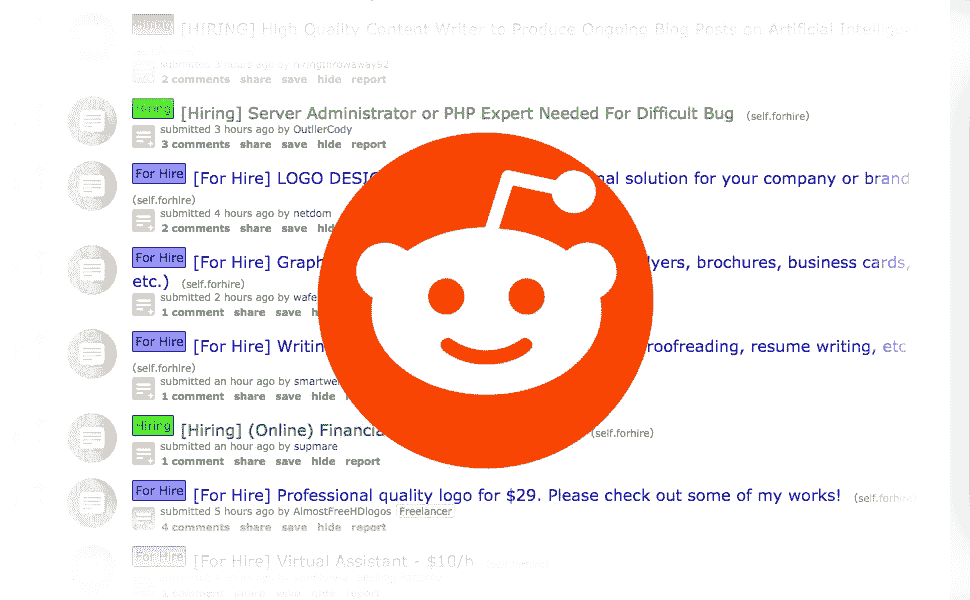
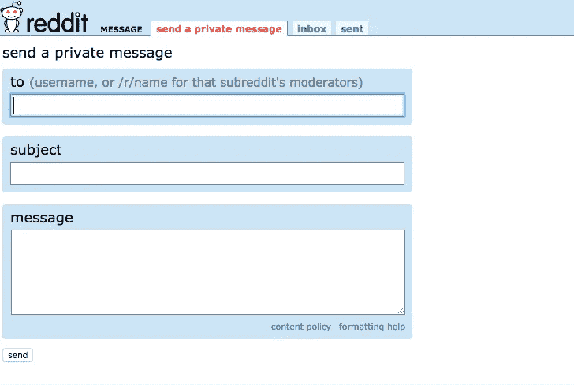

# 如何在 Reddit 上找到你的下一个远程 web 开发自由职业者项目(分步指南)

> 原文：<https://medium.com/hackernoon/how-to-find-your-next-remote-freelance-client-on-reddit-bcdd3cbd533c>

像 UpWork、Freelancer 和 Fiverr 这样的中间人市场并不是你唯一可以找到远程工作的地方。还有其他方法可以找到好的远程[自由职业者](https://hackernoon.com/tagged/freelance)项目。他们一直被发布在 Reddit、Slack Groups、社交媒体网站、多个求职公告板和论坛上。

**在这篇文章中，我将与你分享如何找到发布在 Reddit 上的最佳远程项目，以及如何申请以获得项目。**

# 1)搜索右边的子编辑。

当人们想为某项工作或项目雇用某人时，他们会发布许多子帖子。我最喜欢搜索的是`/r/forhire`。你想关注的帖子一般都标有`[HIRING]`。

以下是您也可以检查的几个其他子编辑:

*   `/r/railsjobs`
*   `/r/gameDevClassifieds`
*   `/r/DesignJobs`
*   `/r/Jobopenings`

许多编程语言也有自己的子编辑。根据公告板的规则，针对这些语言的工作和项目经常会被张贴在公告板上。

# 2)跳过对该线程的评论。发私信。

很多时候，招聘线程被机器人监控，如果你没有达到 karma 点数或帐户年龄的配额，它们会自动删除你的评论。

最好的办法是完全跳过评论，直接给发帖人发私信。这可以让你写一封好的求职信，分享更多关于你工作经历的个人细节(带链接)，这将有助于你获得这个项目。

# 3)在发送信息前做好调查。

客户从根本没有做过任何研究的人那里收到很多申请。申请人将只链接到一个没有任何求职信的 PDF 简历。不要成为那些申请者中的一员。客户会忽视你。

这就是为什么你可以用额外的 10-15 分钟对客户和他们的项目进行重点研究，再加上一封好的求职信，轻松脱颖而出。

但是很多时候，Reddit 上的帖子没有太多的上下文。点击发帖人的账户，查看他们以前的帖子和评论，看看你是否能了解到更多关于他们项目的信息。在你发送的信息中提到它。

# 4)留下一条有价值的信息，链接到你最好的项目。

目标是用一封写得很好的求职信向发帖人发送一条私人信息，向客户展示你如何具体帮助他们的项目。

点击这里了解更多关于如何写求职信来赢得远程自由客户的信息。

# 6)你的因缘不重要。

我需要提到这一点。你的 reddit 业力对你是否找到工作没有任何影响。如果你留下评论，机器人可能会把你移除，但雇佣你的人担心一件事:你是否能帮助他们完成工作。

# 这是一个数字游戏

你不会得到你联系的每一个客户。很多人甚至不会回应你。这是过程的一部分。**归根结底，这是你持续接触多少人的问题。**

Reddit 是一个开放的平台，所以你也会有很多人回复你回复的相同线索，但如果你遵循上面列出的提示，你可以从 95%的回复你的专业人士中脱颖而出。

# 避免所有的搜索，让项目直接发送到您的电子邮件与远程线索

通过订阅远程销售线索，您可以避免花费大量时间搜索销售线索。**我们找到最好的线索，审查它们，并通过电子邮件**发送给你。这是确保你有稳定的潜在商机的好方法。这里可以订阅[。](https://remoteleads.io/remote-freelance-front-end)

# Reddit 是寻找远程自由职业项目的一个很好的替代来源。

所需要做的就是寻找他们，然后以正确的方式接触客户。

所有专业展示自己的建议都不会因为是 Reddit 就被抛弃。你向客户发送的私人信息的专业性，以及与你的投资组合的联系，对帮助你获得更多项目大有帮助。

感谢你的阅读，祝你下一个项目好运！